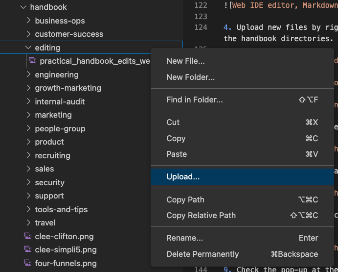

This page focuses on how to edit the handbook.
Please see the [handbook usage page]() for how and why we use the handbook, and other [docs pages]() for further reference.

This page is intended to be complementary to [Using GitLab at GitLab](/handbook/using-gitlab-at-gitlab/#using-gitlab-competency).
We suggest you complete the [GitLab 101 Tool Certification](/handbook/people-group/learning-and-development/gitlab-101/) if you haven't already.

**Have your own practical Handbook editing tips? Drop a video below!**

## Add yourself to the team page

For how to add yourself to the team page, see the [add yourself to team guide](/handbook/edit-team-page).

## Markdown formatting

For how to format markdown in the handbook, see the [markdown style guide](),
which includes how to embed videos.

## Use the Web IDE to edit the handbook

A typical workflow to edit the handbook:

1. [Use the Web IDE to make changes](https://docs.gitlab.com/ee/user/project/web_ide/#use-the-web-ide).
1. [Commit changes](https://docs.gitlab.com/ee/user/project/web_ide/#commit-changes).
1. [Create a merge request](https://docs.gitlab.com/ee/user/project/merge_requests/creating_merge_requests.html), [assign reviewers](/handbook/handbook-usage/#when-to-get-approval).
1. [Apply suggestions](https://docs.gitlab.com/ee/user/project/merge_requests/reviews/suggestions.html#apply-suggestions) if any.
1. Merge once all suggestions are resolved and you have the necessary approvals.

### Web IDE editing steps

1. Navigate to the handbook page you want to edit. At the bottom, or on the right, click on the URL `Edit this page` to open the new Web IDE.
    - Alternatively, open the [public handbook](https://gitlab.com/gitlab-com/content-sites/handbook) project and select `Web IDE` from the edit actions. This requires you to navigate into the source tree where the handbook files are located.

   

1. Familiarize yourself with the [Web IDE](https://docs.gitlab.com/ee/user/project/web_ide/):
    - The menu sections are located on the left
    - The explorer section provides the file tree for the project, which is opened automatically when editing a handbook file. (keyboard shortcut: `Shift+Cmd+E`)
    - The editing view is on the right side. On top, there are tabs to organize open files.
    - Additional meta information is provided at the bottom. Git branch, problems, current line number, spaces for indentation, encoding, end-of-line sequence, language mode, layout, notifications.
    - **Tip:** Hover over the menu sections and items to learn more about their purpose and keyboard shortcuts.

    

1. Edit the selected file, and try the Markdown preview. `Cmd+Shift+P` on macOS opens the Web IDE command palette to search for commands. For example, type `Markdown`, select `Markdown: Open Preview to the Side` and try the preview.
    - Note that the [handbook markdown engine](/docs/markdown-guide/) supports more rendering features than the [Web IDE preview based on VS Code](https://code.visualstudio.com/docs/languages/markdown), and some items won't be rendered properly. Commit and create a [draft merge request](https://docs.gitlab.com/ee/user/project/merge_requests/drafts.html) to view the handbook [review apps](https://docs.gitlab.com/ee/ci/review_apps/) to preview the page, such as to verify embedded images.

    

1. Upload new files by right-clicking and selecting `Upload...` for example images into `static/images/handbook/` and the corresponding file tree, following the handbook directories.

    

1. Open the `Source Control` icon on the left menu which has a blue marker for counting the file changes. Tip: Keyboard shortcut `Ctrl+Shift+G`.

    

1. Review the changed files, and once ready, specify a Git commit message and click `Commit & Push`. Keyboard shortcut:  `Cmd+Enter`.

    

1. Commit the changes to a new Git branch (leave selection, press `Enter`).

    

1. Specify a new Git branch name (optional). Press `Enter` to continue. This action pushes the changes into the Git repository. The changes are persisted on the GitLab server and are immediately visible in the project view.

    

1. Check the pop-up at the bottom right, and click `Create Merge Request` to open the GitLab MR tab. Tip: The notification bell icon at the bottom brings back the notification, if accidentally dismissed.

    

1. Fill in the MR template, provide why the merge request is created, add labels (e.g. using quick actions `/label ~handbook`), assign yourself (`/assign me`), and set the branch to delete when merged. Optionally, use the [draft option](https://docs.gitlab.com/ee/user/project/merge_requests/drafts.html) to prevent merging until ready.

    

1. Make additional changes to the MR: Select `Code > Open in Web IDE` on the upper right menu. This opens the Web IDE again to make changes. All changed files are opened automatically.

    

1. Make changes, commit and push them, and select the MR associated branch again (follow [this issue](https://gitlab.com/gitlab-org/gitlab/-/issues/383801#note_1214559713) for UX commit flows).

    

1. Optional: Follow the pop-up notification to navigate back to the MR.

    

**Tip**: Practice the keyboard shortcuts for your workflows: After making changes, `Control+Shift+G` to commit, `Cmd+Enter`, Cursor to select the branch, `Enter`, etc.

**Note:** The `Cmd+w` keyboard shortcut to close a file tab in the Web IDE gets overridden by the Chrome browser to close the browser tab. This is a [known problem](https://gitlab.com/gitlab-org/gitlab/-/issues/386209), use this shortcut carefully.

### Video: Editing using the Web IDE and single file editor

Note: The video shows the old `www-gitlab-com` project. The editing process, however, is the same.

This video covers:

- Editing the marketing handbook as example
- `Edit this page` action using the Web IDE, overview walkthrough, editing the handbook, again creating a merge request with the same actions.
- Practical handbook edit tips shown in this handbook.



### Historical videos

In these videos, we run through the GitLab Handbook with experts, uncovering how to best use the handbook in our day-to-day work, and learning best-practices for handbook editing along the way. They are meant to be helpful to understand generally how GitLab works, but **the instructions cannot be followed exactly since the editor in GitLab has changed**.

1. [Creating new handbook pages and multimedia embedding best-practices](https://www.youtube.com/watch?v=hQgS97M8abc)
1. [How to move the location of a handbook page](https://www.youtube.com/watch?v=aQl001ka3Y4)
1. [Changing a page name and subsequent updates](https://www.youtube.com/watch?v=HeQax_U74NM)
1. [Creating mermaid diagrams](https://www.youtube.com/watch?v=SQ9QmuTHuSI)
1. [Creating issue templates](https://www.youtube.com/watch?v=ObNWS3trqIY)
1. [Adding images to the handbook and handbook analytics](https://www.youtube.com/watch?v=P7Nv7bzksiY)
1. [How to add a new directory and page to the handbook](https://www.youtube.com/watch?v=9NcJG9Bv6sQ)

## Editing the handbook locally

If you want to install a local version of the website to test and preview things locally,
see the [handbook project readme](https://gitlab.com/gitlab-com/content-sites/handbook/-/tree/main) for instructions on how to set it up.

1. Set up an [SSH key](https://docs.gitlab.com/ee/user/ssh.html) to use with GitLab, if you have not previously done so.
1. [Set up Git](https://docs.gitlab.com/ee/gitlab-basics/start-using-git.html) and clone the appropriate repository, such as the [public handbook](https://gitlab.com/gitlab-com/content-sites/handbook).
1. Use your editor of choice to make changes. If you use [Visual Studio Code](https://code.visualstudio.com/download) optionally along with the [GitLab Workflow extension for VS Code](https://docs.gitlab.com/ee/user/project/repository/vscode.html), you can follow the [Web IDE editing instructions](#use-the-web-ide-to-edit-the-handbook).
1. [Push the changes to GitLab](https://docs.gitlab.com/ee/gitlab-basics/start-using-git.html#send-changes-to-gitlab).
1. Create a merge request.

Additional notes:

1. We don't need [.gitkeep files](https://stackoverflow.com/questions/7229885/what-are-the-differences-between-gitignore-and-gitkeep) in our handbook, they make it harder to quickly open a file in editors. Don't add them, and delete them when you see them.

## Team member merge requests being labeled as Community contributions

If you recently created a merge request that was labeled as a Community contribution, you can fix this mislabeling issue going forward by updating the GitLab username in your personal entry in the team member directory to match the GitLab account you use for work.

Use the [team page editing instructions]() to find your team page entry file, and update the `gitlab` attribute (typically found on line 10) to be an **exact match** for the GitLab.com username you use for work.

## Preview changes on GitLab

To preview your changes:

1. Wait for the pipeline on the merge request to complete.
1. In the pipeline widget on the "Overview" tab of the MR, click on the "View app" button.
1. You may need to navigate to your page by going to any page, then using the left navigation tree. Do not use the search for this.
   - If you prefer to edit the URL, note that the review app uses a `.html` ending, so if your page is `content/handbook/path/to/page.md`, the URL will be `review/app/public/handbook/path/to/path.html`.

## Naming pages and folder structure

The site uses the concept of page bundles, sections, and leaf pages.  A section can have multiple leaf pages, which requires a `_index.md` for the section.  A page bundle is a single page with a group of images, requires an `index.md`.

Section:

```plain
section-dir/
|- _index.md
|- leaf-page1.md
|- leaf-page2.md
```

Page bundle:

```plain
page-name/
|- index.md
|- image1.png
|- image2.png
```

Section with a page bundle:

```plain
section-dir/
|- _index.md
|- leaf-page1.md
|- leaf-page2/
|  |- index.md
|  |- image.pmg
|- leaf-page3.md
```

### Moving, deleting, or renaming a page

If you delete, rename, or move a page, you can [add an alias to redirect]().

## Failing pipelines

To see why your pipeline is failing, there are two main places to look:

1. The latest comment by the bot on your merge request. Mainly covers markdown errors.
1. Individual failed jobs. On the MR > "Pipelines" tab > select any red circle > select a failed job. Error messages are near the bottom of the job log and start with `Error`.

In the job log, error messages typically provide you:

1. the error
1. the file where the error occured
1. the line number
1. the character number (where on the line it is)

For example: `Error: error building site: assemble: "/builds/gitlab-com/content-sites/handbook/content/handbook/security/security-assurance/field-security/trust_center_guide.md:1:2": closing tag for shortcode 'details' does not match start tag`

- File: `content/handbook/security/security-assurance/field-security/trust_center_guide.md`
- Line: 1
- Character: 2

To fix markdown errors, review the message. Alternatively, review the relevant section in the [markdown style guide]().

For all other errors, the error message should provide the information necessary to fix it. If you're unsure, you can [reach out for help](#need-help).

## Additional tips

For additional tips, such as how to replace strings in files, refer to the [practical handbook edits examples]().

## Need help?

If you run into trouble editing the GitLab Handbook, help is available.

Team members, referred to as [MR Buddies](/handbook/people-group/general-onboarding/mr-buddies/), are available to help you create a merge request or debug any problems you might run into while updating the GitLab Handbook. Some common questions are covered in the videos in the [MR Buddies playlist](https://www.youtube.com/playlist?list=PL05JrBw4t0KrCVFOwSGW6M3k16yLtPO1M). Post your request with a link in the [mr-buddies](https://gitlab.slack.com/archives/CLM8K5LF4/p1678812429884979) Slack channel.

For general questions about the handbook, post in the [handbook Slack channel](https://gitlab.enterprise.slack.com/archives/C81PT2ALD).

For [more serious problems](/handbook/about/on-call/#when-to-escalate-an-issue), especially ones that are time sensitive or prohibiting access to important information, there is an [escalation process](/handbook/about/on-call/) to reach out to team members who are on-call to help resolve the problem.
