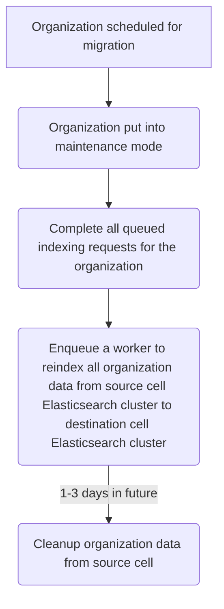

{}
This document is a work-in-progress and represents a very early state of the
Cells design. Significant aspects are not documented, though we expect to add
them in the future. This is one possible architecture for Cells, and we intend to
contrast this with alternatives before deciding which approach to implement.
This documentation will be kept even if we decide not to implement this so that
we can document the reasons for not choosing this approach.
{}

## Summary

The [Advanced search functionality](https://docs.gitlab.com/ee/user/search/advanced_search.html)
allows users to search across the entire GitLab instance. Advanced search
supports Elasticsearch and OpenSearch as the search backend.

**NOTE:** Global search is also an impacted feature that will be covered in a
[separate design document](global-search.md).

GitLab.com has one Elasticsearch cluster that houses all indexed data to support
Advanced search. Advanced search includes an [automated indexing pipeline](https://docs.gitlab.com/ee/development/advanced_search.html#deep-dive)
and [migration framework](https://about.gitlab.com/blog/2021/06/01/advanced-search-data-migrations/)
for data migrations. Most infrastructure and index maintenance tasks are
performed manually by the Global Search team through the [change request workflow](../../../../change-management.md/#change-request-workflows).

When we introduce multiple [Cells](../goals.md#cell), Advanced Search will need to support:

1. Infrastructure maintenance
   - Elasticsearch cluster version upgrades
   - Scaling the Elasticsearch cluster
   - Support for incident root cause analysis and resolution
2. Index maintenance
   - Index shard resizing using Zero-downtime reindexing feature ([example issue](https://gitlab.com/gitlab-com/gl-infra/production/-/issues/18158))
   - Index shard resizing using Split shards Elasticsearch API ([example issue](https://gitlab.com/gitlab-com/gl-infra/production/-/issues/18646))
   - Enabling the Elasticsearch slow log ([example issue](https://gitlab.com/gitlab-com/gl-infra/production/-/issues/18159))
   - Cleaning up reverted migrations from the Advanced search migrations index
([example issue](https://gitlab.com/gitlab-com/gl-infra/production/-/issues/16231))
3. Organization migration
   - Advanced search will need to support organizations being moved from one cell
     to another.
   - When an organization is moved, we need to re-index database records,
     embeddings, and git data.

This design document explains the high-level plan for how we will support these
areas.

## Proposal

Each cell will have its own Elasticsearch cluster.

### Infrastructure maintenance

All infrastructure maintenance must be automated. We may consider using the
migration framework, but other methods should be evaluated.

To support this, the following is required:

- The indexing paused framework must be modified to allow
  [pausing indexing for a specific index](https://gitlab.com/gitlab-org/gitlab/-/issues/381705).
  Pausing for a specific index allows maintenance tasks to be performed on an
  index without impacting other data types. This is important to reduce impact of
  search results being out of date because indexing is behind.
- Search and indexing validations must be automated. The
  `Search::ClusterHealthCheck` class can be expanded to include search and
  indexing validation. [gitlab#499586](https://gitlab.com/gitlab-org/gitlab/-/issues/499586)

### Index maintenance

All index maintenance tasks will be initially be completed using the
[Advanced search migration framework](https://docs.gitlab.com/ee/development/search/advanced_search_migration_styleguide.html).
Once the migration process is verified, all index maintenance migrations will be
migrated by Cron workers. There should be a Cron worker per maintenance task:

1. Shard resize Cron worker will review each index and adjust shard size if over
   the threshold
1. Migration cleanup Cron worker will remove migrations from the migrations
   index that do not exist in codebase
1. Slow log Cron worker will enable the slow log if an ops feature flag (or
   application setting) is enabled

### Organization migration

There are multiple ways to approach organization migration and each comes with a
set of trade-offs. Since Cells is being rolled out in phases, this proposal
contains recommendations by phase.

#### [Cells 1.0] Use existing indexing framework

Organization migration will be automated by using the existing indexing
framework. Once an organization is put into maintenance mode and all PostgreSQL
and Gitaly data has been moved, the organization can be queued for indexing in
the destination cell.

Conduct benchmarks to determine how long organizations at pre-determined sizes
take to migrate. This data will be used to determine if the indexing pipeline
will continue to be used for organization migration in later cells phases.

To support this, the following is required:

- The framework needs to be adjusted to handle indexing an organization. This
  may be as simple as iterating through all namespaces for an organization and
  kicking off the appropriate workers.

Benefits of this approach:

1. Cells can use any search cluster type and version.
1. Existing framework is well tested and understood by team members.

Downsides of this approach:

1. Indexing may take too long for organizations. We need to benchmark different
   organization sizes. Related issues:
   1. [gitlab#480372](https://gitlab.com/gitlab-org/gitlab/-/issues/480372)
   1. [gitlab#391489](https://gitlab.com/gitlab-org/gitlab/-/issues/391489)
1. There are no indicators when indexing is complete for database records.
   Organizations will have missing search results until indexing is complete.
1. Additional load on GitLab instance including Sidekiq, Gitaly, and PostgreSQL.
   Other Sidekiq jobs in the cell will impact indexing completion.

#### [Cells 2.0] Use Elasticsearch APIs to move data

The plan below is a proposal only. The search platform for Cells has not been decided
at this time. If the search platform will be different between Cells, the proposal will
need to be updated.

If benchmarking results show the existing indexing framework is not fast enough,
organization migration could be automated with the [Elasticsearch Reindex API](https://www.elastic.co/guide/en/elasticsearch/reference/current/docs-reindex.html)
to move all indexed data for an organization to the new cell's Elasticsearch
cluster. The API supports moving data between two different clusters (or hosts).

To support this, the following is required:

- The indexing paused framework must be modified to ensure that all queued
  indexing requests are completed once an organization is put into "maintenance
  mode". This is needed to ensure all indexed data is up to date before the
  migration.
- New queues should be setup to work on migrated data only. This will prevent
  other active indexing jobs from taking priority in the existing queues.
- Database ID values must remain consistent between cells. Cluster wide unique
   database sequences are [planned for Cells](../decisions/008_database_sequences.md).

Proposed workflow:

Benefits of this approach:

1. No additional load on GitLab instance including Sidekiq, Gitaly, and PostgreSQL.
1. Know exactly when indexing is complete.

Downsides of this approach:

1. Requires all search clusters to be on the same platform.
1. Requires allowed communication between cell search clusters.
