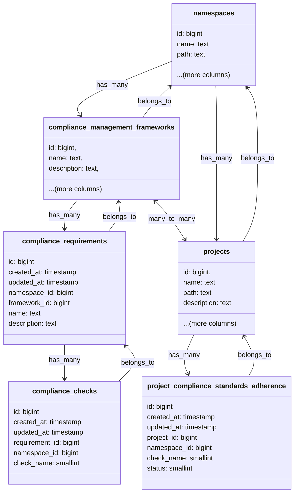

<!-- Blueprints often contain forward-looking statements -->
<!-- vale gitlab.FutureTense = NO -->


## Summary

This blueprint serves as living documentation of the technical considerations in the implementation of [Compliance Frameworks](https://docs.gitlab.com/ee/user/group/compliance_frameworks.html). This includes functionality in [Compliance Center](https://docs.gitlab.com/ee/user/compliance/compliance_center/) and the relationship with [Security Policies](https://docs.gitlab.com/ee/user/application_security/policies/).

### Proposal

Outline how compliance enforcement and visibility will be handled through Compliance Frameworks as an evolution from [Compliance Standards Adherence](https://docs.gitlab.com/ee/user/compliance/compliance_center/compliance_standards_adherence_dashboard.html).

### Motivation

There are three main parts to compliance posture of a customer [Enforcement](#enforcement), [Visibility](#visibility),
and [Audit History](#audit-history).

#### Enforcement

Enforcement within GitLab is currently done through [Security Policies](https://docs.gitlab.com/ee/user/application_security/policies/) and [Compliance Pipelines](https://docs.gitlab.com/ee/user/group/compliance_pipelines.html). This gives users two very different ways of implementing the same functionality, which has been described as confusing for users. Compliance pipelines also have some inherent technical limitation, see [epic](https://gitlab.com/groups/gitlab-org/-/epics/6241).

#### Visibility

Currently the Standards are hard coded in the Adherence report (renamed to Status report) and separate from Compliance Frameworks. This makes the system inflexible as we look to:

1. Use Compliance Frameworks to include certain projects in the Adherence Report and distinguish which requirements those projects are complaint with.
1. Add a Requirements level to the Adherence report
1. Add more Standards and Checks
1. Allow users to customise Standards
1. Allow users to create their own Standards
1. Allow users to create customisable Checks

#### Audit History

This is currently achieved through compliance events ([Audit events](https://docs.gitlab.com/ee/user/compliance/audit_events.html) and [Violations within MRs](https://docs.gitlab.com/ee/user/compliance/compliance_center/compliance_violations_report.html)). Both of these are outside the scope of this blueprint.

### Background

#### Deprecate compliance pipelines

We deprecated [compliance pipelines](https://docs.gitlab.com/ee/user/group/compliance_pipelines.html) in favour of
[pipeline execution policy](https://docs.gitlab.com/ee/user/application_security/policies/pipeline_execution_policies.html)
in GitLab 17.3. This decision was taken to align with the future state of enforcing compliance through security policies.

#### Scope policies through compliance frameworks

We introduced the capability of scoping security policies allowing us to enforce policies against a specific set of
projects or against projects applied a given set of compliance frameworks. This helped us move towards the
goal of enforcing compliance through frameworks.

#### Multiple compliance frameworks

Before GitLab 17.3 it was not possible to apply more than one compliance framework to a project. To work towards the
future state of allowing users to customise the adherence dashboard, we created the ability to apply multiple
compliance frameworks in GitLab 17.3.

### Goals

1. Provide support need for multiple frameworks
1. Incongruence with compliance pipelines and security policies
1. Use Compliance Frameworks to include certain projects in the Adherence Report and distinguish which requirements those projects are complaint with.
1. Add a Requirements level to the Adherence report
1. Add more Standards and Checks
1. Allow users to customise Standards
1. Allow users to create their own Standards

### Non-Goals

1. Allow users to create customisable Checks
1. Compliance events
   1. [Violations within MRs](https://docs.gitlab.com/ee/user/compliance/compliance_center/compliance_violations_report.html)
   1. [Audit events](https://docs.gitlab.com/ee/user/compliance/audit_events.html)

### Terminology/Glossary

1. Framework
   1. A [Compliance Framework](https://docs.gitlab.com/ee/user/group/compliance_frameworks.html) is a user-modifiable capability within GitLab to identify projects that have certain compliance requirements or need additional oversight. Compliance Frameworks generally align with established industry compliance frameworks such as SOC2 or ISO 27001.
1. Standard - deprecated in favor of framework
   1. A standard groups together compliance checks in the Adherence report. Compliance standards align with established compliance frameworks/standards such as SOC2 or ISO 27001
1. Adherence
   1. Reports the percentage of a projects compliance posture against a compliance framework. For example if Project A is 50% complaint towards Framework A.
1. [Policy](https://docs.gitlab.com/ee/user/application_security/policies/)
1. Requirement
   1. A particular requirement from an industry standard compliance frameworks/standards such as SOC2 or ISO 27001. Usually a statement of intent for a particular part of the compliance framework.
1. Check
   1. A Check is a review of a project's settings, to confirm that it is in a particular position. Checks compose a percentage of a project's compliance posture against a Requirement.
1. Control
   1. A control is a compliance enforcement mechanism which enforces certain requirements. This is achieved in GitLab through settings, Security Policies or Compliance Pipelines.

### Decisions

- [001: Triggering Checks](decisions/001_triggering_checks.md)
- [002: Custom Adherence Report](decisions/002_custom_adherence_report.md)

### Design Details

We decided to use [Sidekiq workers for creating checks](decisions/001_triggering_checks.md#use-sidekiq-workers-for-creating-and-updating-checks)
and [storing the adherence configuration in database as relational data](decisions/002_custom_adherence_report.md#storing-the-compliance-adherence-configuration-in-database-as-relational-data).

The compliance requirements and checks would be stored in individual tables with the following schema:

We have dropped the `standard` column from the `project_compliance_standards_adherence` since we don't want to
associate checks with a standard anymore, therefore, allowing the users to customise and group checks as per their
requirements.

We would be storing results for all the compliance adherence checks for ultimate projects, irrespective of the
frameworks applied to that project, however, at the compliance standards adherence dashboard, we would only display
the results of checks for the projects that have compliance frameworks applied with requirements configured. This means
there is no need for a relationship between `compliance_checks` and `project_compliance_standards_adherence` database
tables.

In the next iteration we would also allow importing and exporting the compliance adherence report configurations.

### Implementation Details

| Issue | Milestone | MR | Status |
| ----- | --------- | -- | ------ |
|  |  |  |  |

### FAQ

-
