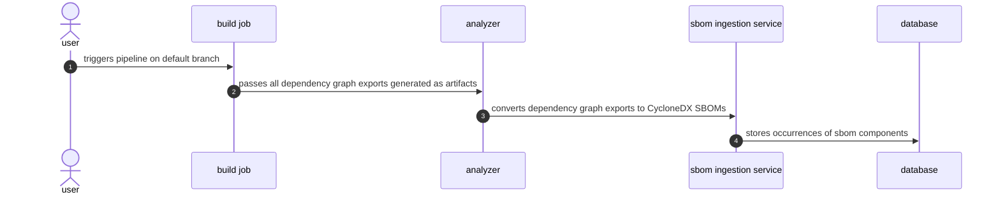

<!-- Design Doucments often contain forward-looking statements -->
<!-- vale gitlab.FutureTense = NO -->

<!-- This renders the design document header on the detail page, so don't remove it-->


<!--
Don't add a h1 headline. It'll be added automatically from the title front matter attribute.

For long pages, consider creating a table of contents.
-->

## Summary

<!--
This section is very important, because very often it is the only section that
will be read by team members. We sometimes call it an "Executive summary",
because executives usually don't have time to read entire document like this.
Focus on writing this section in a way that anyone can understand what it says,
the audience here is everyone: executives, product managers, engineers, wider
community members.

A good summary is probably at least a paragraph in length.
-->

The dependency scanning feature is powered by a set of analyzers - `gemnasium`,
`gemnasium-maven`, and `gemnasium-python`. Associated with CI templates, these analyzers have the
responsibility of detecting supported projects, building the dependency graph or
list when needed, parsing the detected dependencies, and finally, producing a
security report with detected vulnerabilities alongside a CycloneDX SBOM that
contains the dependencies. This approach has worked well, but over time it's
become evident that the actions required to build a project's dependency graph
exports come with a lot of complexity. This complexity negatively impacts the
maintenance and creation of features, and the user experience of setting up and
maintaining the dependency scanning analyzer.

## Motivation

The high cost associated with building the dependency graphs/list exports
motivates us to rethink how we can structure the dependency scanning feature.
Instead of building the project dependency graphs or lists for customers, we
can delegate this responsibility to a job that runs before the analyzer does.
A build stage is a very common part of the development cycle, and generating the
dependency artifacts during this stage is a lot simpler than mapping existing
build system configuration values to the ones used by the gemnasium set of
analyzers.

### Goals

- Customers remove the need to set up a secondary build process. Historically,
  Python and Java have required a build process.
- Reduced bug maintenance costs. A large amount of our issues surface from edge
  cases that are already handled by a customer in a previous build step, but were
  not accounted for by the analyzer's build implementation. These issues
  increase the code complexity, and cut into scheduled additions and improvements.
- Offline support by default
- Reduced security maintenance costs. Building projects means that the analyzer
  images need to ship with pre-installed versions of supported build systems, for
  example Gradle and Maven, and runtimes like Java or Python.
- Removal of historical limitations like single project analysis for Java and
  Python monorepos.

### Non-Goals

- Supporting 3rd party SBOM generators. We can still support this in a future
  iteration.

## Proposal

Create a new analyzer that focus on supporting only
[dependency graph exports](https://docs.gitlab.com/ee/user/application_security/terminology/#dependency-graph-export).
Document how to generate the exports with example projects, and provide
a dependency scanning CI/CD component that scans the generated artifacts.

Because of the change to SBOM-based scanning in [epic 8026](https://gitlab.com/groups/gitlab-org/-/epics/8026),
do not port over the vulnerability matching done by the Gemnasium analyzers,
as this functionality is already [planned for deprecation](https://gitlab.com/groups/gitlab-org/-/epics/14146). 
The new analyzer should be based on a scratch image to reduce the attack surface introduced by container dependencies.

### Pros

- Simplified integration tests. No need to test against various permutations of
  package managers, runtime, and compiler  versions.
- We should always have zero container-scanning vulnerabilities. This translates
  to a reduced workload on the engineers going through reaction rotation.

### Cons

- Additional documentation required with examples and guides on getting started
  with a dependency scanning for certain package managers.
- Requires the establishment of new graph export naming standards.
- Users need to configure their build jobs as instructions. It doesn't work out of the box.

## Design and implementation details

<!--
This section should contain enough information that the specifics of your
change are understandable. This may include API specs (though not always
required) or even code snippets. If there's any ambiguity about HOW your
proposal will be implemented, this is the place to discuss them.

If you are not sure how many implementation details you should include in the
document, the rule of thumb here is to provide enough context for people to
understand the proposal. As you move forward with the implementation, you may
need to add more implementation details to the document, as those may become
an important context for important technical decisions made along the way. A
document is also a register of such technical decisions. If a technical
decision requires additional context before it can be made, you probably should
document this context in a document. If it is a small technical decision that
can be made in a merge request by an author and a maintainer, you probably do
not need to document it here. The impact a technical decision will have is
another helpful information - if a technical decision is very impactful,
documenting it, along with associated implementation details, is advisable.

If it's helpful to include workflow diagrams or any other related images.
Diagrams authored in GitLab flavored markdown are preferred. In cases where
that is not feasible, images should be placed under `images/` in the same
directory as the `index.md` for the proposal.
-->

At a high level, the new dependency scanning feature will operate as follows.

### Build job(s)

It's important to note that we cannot expect for a dependency graph export to be
checked into a project's repository. This is likely to happen in cases where
the dependency graph export does not also function as a lock file like in the
cases of `pipdeptree` and `pipenv graph` dependency graph exports. In such
cases, we will expect the build job to generate the dependency graph exports,
and for the job to store these as [job artifacts](https://docs.gitlab.com/ee/ci/jobs/job_artifacts.html).

We'll use the following naming conventions to establish a contract with users on
what file's we'll detect in cases where the dependency graph export does not
function as a lock file, and thus does not have a canonical name.

| Pattern | Description
| ------- | -----------
| `**/go.graph` | Generated via `go mod graph > go.graph`
| `**/pipenv.graph.json` | Generated via `pipenv graph --tree-json > pipenv`

It's required for the build job to run in a stage that precedes the one in which
the dependency scanning analyzer runs. This is true by default, since the
analyzer runs in the `test` stage which runs after the `build` stage.

### Analyzer

Once the build jobs complete, and the artifacts are stored, they will be passed
on to [proceeding jobs](https://docs.gitlab.com/ee/ci/jobs/job_artifacts.html#prevent-a-job-from-fetching-artifacts)
unless specifically asked not to do so. The analyzer takes advantage of this and
expects that users have configured the build jobs to pass on the artifacts using
the documented naming patterns. It will then search the entire target directory,
by default this is the project's repository, detect all supported files, parse
them, and convert them into a CycloneDX SBOM that can be utilized by the
services running in the GitLab monolith.

## Alternative Solutions

### Require lock file, add graph information to it

One alternative solution to dependency graph exports is to make every supported
lock file a dependency graph export by default. In this scenario, we would work
directly with package manager maintainers to enhance lock files with transitive
dependency relationships, and dependency group metadata. For example, we could
work with the Gradle maintainers to add a new version of their `gradle.lockfile`
that includes parent dependencies. Our contributions would have the added
benefit of improving the experience for our users by including the necesssary
tooling out of the box, overall improving the workflow for getting started with
GitLab's dependency scanning feature.

That said, there are tradeoffs made for the benefits that are gained. In
following this approach, we will be taking on additional risk with our
development velocity. Package managers tend to have large code bases, and a
large amount of edge cases that they have handled over time. Coupled with
maintainence and backward compatibility concerns, this introduces the risk of
lengthy implementation discussions, lengthy reviews, and even the possibility of
an outright feature rejection. Because of these risks, this proposed solution
will not be pursued.

### Directly use SBOMs

This approach moves the direction of composition analysis so that we interface
only with the provided SBOMs. It has the benefit of using an established unified
format, and a further simplified analyzer. However, it's not without its own
drawbacks. Some of the challenges that SBOM interfacing brings up are listed
below:

- Ingestion of various custom CycloneDX properties at the top level and
  component level introduces many edge cases.
- Users are at times still running dependency export jobs like in the case of
  `cyclondex_py` and `pip freeze` analysis.

While we may not be pursuing the SBOM first approach in the first iteration, it
is something that will be explored further in the future.

### Write dependency graph plugins

In the cases where package managers expose a public API, we are able to write a
plugin that generates the dependency graph in a format of our choosing. This
isn't a new concept as it's been used in the past for `gemansium-maven`
dependency analysis.

From past experience with `gemnasium-maven`, we have learned that maintaining a
plugin in languages other than Go and Ruby cuts into our engineering resources.
Plugins require their own separate testing, deployment, and when not
autoexecuted, their success depends heavily on their adoption rate. In addition,
using a separate language introduces context switching, and reduces the pool of
experts who are able to review and approve merge requests. Because of this, the
plugin proposal was not chosen.

## Appendix

- [dependency graph export](https://docs.gitlab.com/ee/user/application_security/terminology/#dependency-graph-export)
- [package manager](https://docs.gitlab.com/ee/user/application_security/terminology/#package-managers)
- [lock file](https://docs.gitlab.com/ee/user/application_security/terminology/#lock-file)
