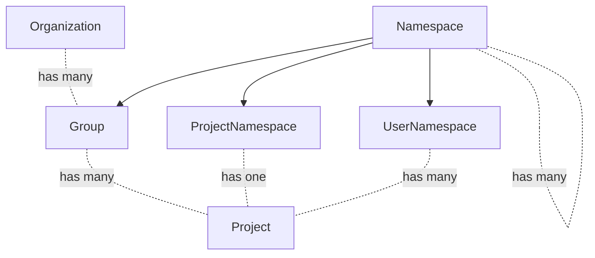
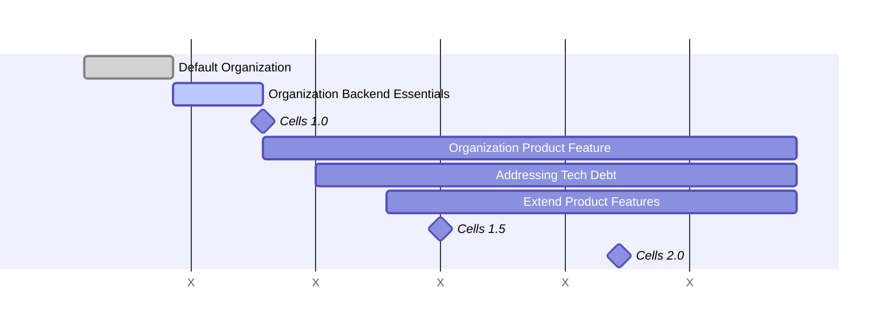

<!-- vale gitlab.FutureTense = NO -->


This document is a work in progress and represents the current state of the Organization design.

## Glossary

- Organization: An Organization is the umbrella for one or multiple top-level Groups. Organizations are isolated from each other by default meaning that cross-Namespace features will only work for Namespaces that exist in a single Organization.
- Top-level Group: Top-level Group is the name given to the topmost Group of all other Groups. Groups and Projects are nested underneath the top-level Group.
- Cell: A Cell is a set of infrastructure components that contains multiple Organizations. The infrastructure components provided in a Cell are shared among Organizations, but not shared with other Cells. This isolation of infrastructure components means that Cells are independent from each other.
- User: An Organization has many Users. Joining an Organization makes someone a Member of that Organization.
- Member: Adding a User to a Group or Project within an Organization makes them a Member. Members are always Users, but Users are not necessarily Members of a Group or Project within an Organization. For instance, a User could just have accepted the invitation to join an Organization, but not be a Member of any Group or Project it contains.
- Non-User: A Non-User of an Organization means a User is not part of that specific Organization. Non-Users are able to interact with public Groups and Projects of an Organization, and can raise issues and comment on them.

## Summary

Organizations solve the following problems:

1. Enables grouping of top-level Groups. For example, the following top-level Groups would belong to the Organization `GitLab`:
   1. `https://gitlab.com/gitlab-org/`
   1. `https://gitlab.com/gitlab-com/`
1. Allows different Organizations to be isolated. Top-level Groups of the same Organization can interact with each other but not with Groups in other Organizations, providing clear boundaries for an Organization, similar to a self-managed instance. Isolation should have a positive impact on performance and availability as things like User dashboards can be scoped to Organizations.
1. Allows integration with Cells. Isolating Organizations makes it possible to allocate and distribute them across different Cells.
1. Removes the constraint of having a single hierarchy. An Organization is a container that could be filled with any collection of hierarchies that make sense.
1. Enables centralized control of user profiles. With an Organization-specific user profile, administrators can control the user's role in a company, enforce user emails, or show a graphical indicator that a user is part of the Organization. An example could be adding a "GitLab employee" stamp on comments.
1. Organizations allows us to better unify the experience on SaaS and self-managed deployments. The Organization admin will have access to instance-equivalent Admin Area settings with most of the configuration controlled at the Organization level. Instance-level workflows like Dashboards can also be shifted to the Organization.

## Decision Log

- 2024-07-21: [Self-managed instances will initially be restricted to one Organization](https://gitlab.com/gitlab-org/gitlab/-/issues/419543#note_2013887114)
- 2023-05-10: [Billing is not part of the Organization MVC](https://gitlab.com/gitlab-org/gitlab/-/issues/406614#note_1384055365)
- 2023-05-15: [Organization route setup](https://gitlab.com/gitlab-org/gitlab/-/issues/409913#note_1388679761)

## Motivation

### Goals

The Organization focuses on creating a better experience for Organizations to manage their GitLab experience. By introducing Organizations and [Cells](https://docs.gitlab.com/ee/architecture/blueprints/cells/index.html) we can improve the reliability, performance and availability of GitLab.com.

- Wider audience: Many instance-level features are admin only. We do not want to lock out users of GitLab.com in that way. We want to make administrative capabilities that previously only existed for self-managed users available to our GitLab.com users as well. This also means we would give users of GitLab.com more independence from GitLab.com admins in the long run. Today, there are actions that self-managed admins can perform that GitLab.com users have to request from GitLab.com admins, for instance banning malicious actors.
- Improved UX: Inconsistencies between the features available at the Project and Group levels create navigation and usability issues. Moreover, there isn't a dedicated place for Organization-level features.
- Aggregation: Data from all Groups and Projects in an Organization can be aggregated.
- An Organization includes settings, data, and features from all Groups and Projects under the same owner (including personal Namespaces).
- Cascading behavior: Organization cascades behavior to all the Projects and Groups that are owned by the same Organization. It can be decided at the Organization level whether a setting can be overridden or not on the levels beneath.
- Minimal burden on customers: The addition of Organizations should not change existing Group and Project paths to minimize the impact of URL changes.

### Non-Goals

Due to urgency of delivering Organizations as a prerequisite for Cells, it is currently not a goal to build Organization functionality on the Namespace framework.

## Proposal

We create Organizations as a new lightweight entity, with just the features and workflows which it requires. We already have much of the functionality present in Groups and Projects, and Groups themselves are essentially already the top-level entity. It is unlikely that we need to add significant features to Organizations outside of some key settings, as top-level Groups can continue to serve this purpose at least on GitLab.com. From an infrastructure perspective, cluster-wide shared data must be both minimal (small in volume) and infrequently written.

All instances would set a default Organization.

### Benefits

- No changes to URL's for Groups moving under an Organization, which makes moving around top-level Groups very easy.
- Low risk rollout strategy, as there is no conversion process for existing top-level Groups.
- The Organization becomes the key for identifying what is part of an Organization, which is on its own table for performance and clarity.

### Drawbacks

- By not basing Organizations on the existing namespace construct, it is not clear how we would avoid duplicating the effort of achieving parity for features like reporting between GitLab.com and self-managed, without doing the work twice. (At instance/organization level for top-level reporting, and at group-level for sub-group level reporting)
- Long term, it may make sense to shift billing from top-level Groups to the Organization level.

## Data Exploration

From an initial [data exploration](https://gitlab.com/gitlab-data/analytics/-/issues/16166#note_1353332877), we retrieved the following information about Users and Organizations:

- For the users that are connected to an organization the vast majority of them (98%) are only associated with a single organization. This means we expect about 2% of Users to navigate across multiple Organizations.
- The majority of Users (78%) are only Members of a single top-level Group.
- 25% of current top-level Groups can be matched to an organization.
  - Most of these top-level Groups (83%) are associated with an organization that has more than one top-level Group.
  - Of the organizations with more than one top-level Group the (median) average number of top-level Groups is 3.
  - Most top-level Groups that are matched to organizations with more than one top-level Group are assumed to be intended to be combined into a single organization (82%).
  - Most top-level Groups that are matched to organizations with more than one top-level Group are using only a single pricing tier (59%).
- Most of the current top-level Groups are set to public visibility (85%).
- Less than 0.5% of top-level Groups share Groups with another top-level Group. However, this means we could potentially break 76,000 existing links between top-level Groups by introducing the Organization.

Based on this analysis we expect to see similar behavior when rolling out Organizations.

## Design and Implementation Details

Cells will be rolled out in three phases: Cells 1.0, Cells 1.5 and Cells 2.0.
The Organization functionality available in each phase is described below.

### Organization MVC

#### Organizations on Cells 1.0 (FY24Q2-FY25Q4)

The Organization MVC for Cells 1.0 will contain the following functionality:

- Instance setting to allow the creation of multiple Organizations. This will be enabled by default on GitLab.com, and disabled for self-managed GitLab.
- Organizations for 1.0 will contain the minimal set of features required to implement isolation. Features that are present in top-level groups for SaaS, such as billing or enterprise users, will remain here.
- The only users who will need to have a role defined and be invited specifically to an Organization are it's Owners. Typical end users will be invited at the group level, re-using the existing invitation workflows. The organization can be inferred by either the group or user.
- Admin overview of Organizations. All created Organizations are listed in the Admin Area section `Organizations`.
- All existing top-level Groups on GitLab.com are part of the `default Organization`.
- Organization Owner. The creation of an Organization appoints that User as the Organization Owner. Once established, the Organization Owner can appoint other Organization Owners.
- Organization Users. A User can only be part of one Organization for Cells 1.0. A new account needs to be created for each Organization a User wants to be part of. Users can only be deleted from an Organization, but not removed.
- Organization creation form. Containing the Organization name, ID, description, and avatar. Organization settings are editable by the Organization Owner.
- Setup flow. New Users are able to create new Organizations. They can also create new top-level Groups in an Organization.
- Private visibility. Initially, Organizations can only be `private`. Private Organizations can only be seen by the Users that are part of the private Organization. They can only contain private Groups and Projects. The only exception to this is the default Organization on the Primary Cell, which is `public`, and contains all currently existing Groups and Projects on GitLab.com.
- Organization settings page with the added ability to remove an Organization. Deletion of the default Organization is prevented.
- Groups. This includes the ability to create, edit, and delete Groups, as well as a Groups overview that can be accessed by the Organization Owner and Users.
- Projects. This includes the ability to create, edit, and delete Projects, as well as a Projects overview that can be accessed by the Organization Owner and Users.
- Personal Namespaces. Users get [a personal Namespace in each Organization](https://docs.gitlab.com/ee/architecture/blueprints/cells/impacted_features/personal-namespaces.html) they are associated with.
- User Profile. Each [User Profile will be scoped to the Organization](https://docs.gitlab.com/ee/architecture/blueprints/cells/impacted_features/user-profile.html).
- Isolation. Organizations themselves are not fully isolated, isolation is a result of being on a Secondary Cell. We aim to complete [phase 1 of Organization isolation](https://gitlab.com/groups/gitlab-org/-/epics/11837), with the goal to `define sharding_key` and `desired_sharding_key` rules.

##### Dependencies on other services

- Organizations rely on the Topology Service
  - to guarantee the uniqueness of global claims (like usernames, emails, namespaces, SSH public keys, and more) across the cluster.
  - provides IDs that are unique across the cluster.
- Organizations rely on the router to route requests to the correct Cell based on eg. path, token prefix, users, or SSH public keys.
- All Cells have their own application secrets
- Application settings are synchronized across Cells

##### Some affected features

- All forms of authentication. As the Topology Service cannot classify the request with an unauthenticated user, the process is as follows:
  1. Cell #1 displays the login form.
  1. Cell #1 identifies the user based on the request data.
  1. Cell #1 looks up the user's associated Cell from the Topology Service.
  1. Cell #1 sets a cookie indicating the associated Cell and redirects the user.
  1. The router routes the request to the correct Cell based on the cookie.
  1. Cell X authenticates the user
- Audit events are not available as there is an ongoing discussion related to a ClickHouse migration.
- Billing stays at top-level Group.
- Enterprise Users or verified domains are not required to be used with Organizations.
- Public visibility of Groups and Projects, or unauthenticated requests are not allowed apart from Cell #1.

##### Open Questions

- To minimize the number of cluster-wide resources, consider refactoring [Standalone resources](https://docs.gitlab.com/ee/api/api_resources.html#standalone-resources) to scope them to an Organization, Group, or Project.
- Consider refactoring global endpoints (e.g. `/jwt/auth`) to be scoped to an Organization, Group, or Project, unless they are supporting cluster-wide resources.

#### Organizations on Cells 1.5 (FY26Q1-FY26Q2)

Organizations in the context of Cells 1.5 will contain the following functionality:

- Organization Users can be part of multiple Organizations using one account. Users are able to navigate between their Organizations using an Organization switcher. Non-Enterprise Users can be removed from or leave an Organization.
- Organizations are fully isolated. We aim to complete [phase 2 of Organization isolation](https://gitlab.com/groups/gitlab-org/-/epics/11838), with the goal to implement isolation constraints.
- Users can transfer existing top-level Groups into Organizations.

#### Organizations on Cells 2.0 (FY26Q3-FY26Q4)

Organizations in the context of Cells 2.0 will contain the following functionality:

- Public visibility. Organizations can now also be `public`, containing both private and public Groups and Projects.

### Organization Access

See [Organization Users](organization-users.md).

### Roles and Permissions

Organizations will have an Owner role. Compared to Users, they can perform the following actions:

| Action | Owner | User |
| ------ | ------ | ----- |
| View Organization settings | ✓ |  |
| Edit Organization settings | ✓ |  |
| Delete Organization | ✓ |  |
| Remove Users | ✓ |  |
| View Organization front page | ✓ | ✓ |
| View Groups overview | ✓ | ✓ (1) |
| View Projects overview | ✓ | ✓ (1) |
| View Users overview | ✓ |  |
| View Organization activity page | ✓ | ✓ (1) |
| Transfer top-level Group into Organization if Owner of both | ✓ |  |

(1) Members can only see what they have access to.
(2) Users can only see Users from Groups and Projects they have access to.

[Roles](https://docs.gitlab.com/ee/user/permissions.html) at the Group and Project level remain as they currently are.

#### Relationship between Organization Owner and Instance Admin

Users with the (Instance) Admin role can currently [administer a self-managed GitLab instance](https://docs.gitlab.com/ee/administration/index.html).
As functionality is moved to the Organization level, Organization Owners will be able to access more features that are currently only accessible to Admins.
On our SaaS platform, this helps us in empowering enterprises to manage their own Organization more efficiently without depending on the Instance Admin, which is currently a GitLab team member.
On SaaS, we expect the Instance Admin and the Organization Owner to be different users.
Self-managed instances are generally scoped to a single organization, so in this case it is possible that both roles are fulfilled by the same person.
There are situations that might require intervention by an Instance Admin, for instance when Users are abusing the system.
When that is the case, actions taken by the Instance Admin overrule actions of the Organization Owner.
For instance, the Instance Admin can ban or delete a User on behalf of the Organization Owner.

### Routing

Today only Users, Projects, Namespaces and container images are considered routable entities which require global uniqueness on `https://gitlab.com/<path>/-/`.
Initially, Organization routes will be [unscoped](https://docs.gitlab.com/ee/development/routing.html).
Organizations will follow the path `https://gitlab.com/-/organizations/org-name/` as one of the design goals is that the addition of Organizations should not change existing Group and Project paths.

## Impact of the Organization on Other Domains

We want a minimal amount of infrequently written tables in the shared database.
If we have high write volume or large amounts of data in the shared database then this can become a single bottleneck for scaling and we lose the horizontal scalability objective of Cells.
With isolation being one of the main requirements to make Cells work, this means that existing features will mostly be scoped to an Organization rather than work across Organizations.
One exception to this are Users, which are stored in the cluster-wide shared database.
For a deeper exploration of the impact on select features, see the [list of features impacted by Cells](https://docs.gitlab.com/ee/architecture/blueprints/cells/index.html).

### Alignment between Organization and Fulfillment

Fulfillment enhancements for Organizations will happen in a different timeline to the [Cells](https://docs.gitlab.com/ee/architecture/blueprints/cells/index.html) project and should not be seen as blockers to any Cells timelines.

For Cells 1.0, Billing remains at the top-level Group. Said otherwise, Billing will not occur at the Organization level. The guidance for Cells 1.0 is for GitLab.com SaaS customers to use a single top-level Group to keep Billing consolidated.

We are currently [evaluating future architecture designs](https://gitlab.com/gitlab-org/gitlab/-/issues/443708) (e.g. Zuora Billing Accounts being aligned to Organizations) but have yet to determine the North star direction and how/if it aligns to the Cells iterations.

### Open-source Contributions in Organizations

Several aspects of the current open-source workflow will be impacted by the introduction of Organizations.
We are conducting deeper research around this specific problem in [issue 420804](https://gitlab.com/gitlab-org/gitlab/-/issues/420804).

## Post-MVC Iterations

After the initial rollout of Organizations, the following functionality will be added to address customer needs relating to their implementation of GitLab:

1. [Organizations can invite Users](https://gitlab.com/gitlab-org/gitlab/-/issues/420166).
1. Complete [phase 3 of Organization isolation](https://gitlab.com/groups/gitlab-org/-/epics/11839), with the goal to allow customers to move existing namespaces out of the default Organization into a new Organization.
1. Internal visibility will be made available on Organizations that are part of GitLab.com.
1. Restrict inviting Users outside of the Organization.
1. Enterprise Users will be made available at the Organization level.
1. Organizations are able to ban Users.
1. Projects can be created from the Organization-level Projects overview.
1. Groups can be created from the Organization-level Groups overview.
1. Move billing from top-level Group to Organization.
1. Audit events at the Organization level.
1. Set merge request approval rules at the Organization level and cascade to all Groups and Projects.
1. Security policies at the Organization level.
1. Vulnerability Report and Dependency List at the Organization level.
1. Cascading Organization setting to enforce security scans.
1. Merge request approval policies at the Organization level.
1. Compliance frameworks.
1. [Support the agent for Kubernetes sharing at the Organization level](https://gitlab.com/gitlab-org/gitlab/-/issues/382731).

## Organization Development

Below is a high level development roadmap for Organizations.
The project is complicated and requires coordination across many engineering teams.
In response to this, the roadmap has been broken into the following broad phases.
Phases after the backend essentials phase can overlap depending on capacity and release dependencies.

### Default Organization

We have seeded the database with a "default organization" that has an `ID` of `1`.
This is a catch all Organization that contains all existing entities.
[Work is in progress](https://gitlab.com/groups/gitlab-org/-/epics/13678) to link as many tables as possible directly or indirectly to an Organization.
These associations will group all entities underneath an Organization, which is a pre-requisite to scaling Organizations across Cells.
Note that not all tables fit within an Organization.

### [Organization backend essentials](https://gitlab.com/groups/gitlab-org/-/epics/14111)

This is foundational work to integrate the Organization at low levels of the code base.

- All tables with an `organization_id` foreign key are defined with not null foreign key constraints.
- All code paths are writing the correct `organization_id` value and are not relying on a default value.

This stage will be completed by Cells 1.0 and must be completed before the next phases listed below.

### Organization Product Feature

This phase formally introduces the Organization UI so that basic Organization features are available:

- Organization [front page](https://gitlab.com/groups/gitlab-org/-/epics/11187)
- Organization user overview
- Organization [group](https://gitlab.com/groups/gitlab-org/-/epics/11188) and [project](https://gitlab.com/groups/gitlab-org/-/epics/11189) overview
- [Display of the current organization](https://gitlab.com/groups/gitlab-org/-/epics/11190).

This work will be required by Cells 1.5.
We expect that these pages will allow other teams to add features more easily to Organizations.
After this stage, there will be additional enhancements to the Organization UI.

### Addressing Tech Debt

This phase will complete the migration of critical product features to the Organization level.

In order to release Cells 1.0, some product features will exist in a transient "workaround" state.
For example, some tables (such as application settings) may simply be "mirrored" to release Cells 1.0.
This stage will address the development of workarounds to permanent solutions.

### Extend Product Features

Product teams that were not already asked to move their features in a previous phase can begin to add functionality to Organizations.

Some Organization level requests we are aware of are listed in #post-mvc-iterations.

## Organization Rollout

We propose the following steps to successfully roll out Organizations:

### Cells 1.0

- User is confined to one Organization within one Cell.
- Gitlab.com will have two Cells.
  - One with the default Organization (public) that holds every existing top-level group except for the internal customer group.
  - Another with an internal customer Organization (private) holding the internal customer group.
- Self managed will have one hidden `default Organization`.
- An Organization UI will not be visible to external users, except by enabling a set of feature flags. The internal customer group will have the feature flag enabled and use the Organization UI.

### Cells 1.5

- New private Organizations can be created on GitLab.com
- Users can switch between Organizations.
- Gitlab.com users can migrate top-level groups to a new Organization.
- An Organization UI will be visible, including:
  - Drop down Organization switcher.
  - Organization management pages.
  - Some Organization level features.
- Organizations are promoted, e.g. via a banner message, targeted conversations with large customers via the CSMs.

### Cells 2.0

- Organizations can be public on GitLab.com
- Organizations can move between Cells.
- Gitlab entities have migrated off the primary Cell and onto the secondary Cell.

### Post Cells 2.0

A force-option to move top-level groups into Organizations may be considered if we do not achieve the load distribution we are aiming for with Cells.

## Alternative Solutions

An alternative approach to building Organizations is to convert top-level Groups into Organizations. The main advantage of this approach is that features could be built on top of the Namespace framework and therewith leverage functionality that is already available at the Group level. We would avoid building the same feature multiple times. However, Organizations have been identified as a critical driver of Cells. Due to the urgency of delivering Cells, we decided to opt for the quickest and most straightforward solution to deliver an Organization, which is the lightweight design described above. More details on comparing the two Organization proposals can be found [here](https://gitlab.com/gitlab-org/tenant-scale-group/group-tasks/-/issues/56).

## Links

- [Organization epic](https://gitlab.com/groups/gitlab-org/-/epics/9265)
- [Organization MVC design](https://gitlab.com/groups/gitlab-org/-/epics/10068)
- [Enterprise Users](https://docs.gitlab.com/ee/user/enterprise_user/index.html)
- [Cells blueprint](https://docs.gitlab.com/ee/architecture/blueprints/cells/index.html)
- [Cells epic](https://gitlab.com/groups/gitlab-org/-/epics/7582)
- [Namespaces](https://docs.gitlab.com/ee/user/namespace/index.html)
- [Organization Isolation](isolation.md)
- [Organization: Frequently Asked Questions](organization-faq.md)
