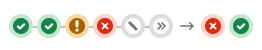



This blueprint serves as living documentation for the Pipeline Mini Graph. The Pipeline Mini Graph is used in various places throughout the platform to communicate to users the status of the relevant pipeline. Users are able to re-run jobs directly from the component or drilldown into said jobs and linked pipelines for further investigation.



## Motivation

While the Pipeline Mini Graph primarily functions via REST, we are updating the component to support GraphQL and subsequently migrating all instances of this component to GraphQL. This documentation will serve as the SSOT for this refactor. Developers have expressed difficulty contributing to this component as the two APIs co-exist, so we need to make this code easier to update while also supporting both REST and GraphQL. This refactor lives behind a feature flag called `ci_graphql_pipeline_mini_graph`.

### Goals

- Improved maintainability
- Backwards compatibility
- Improved query performance
- Deprecation of REST support

### Non-Goals

- Redesign of the Pipeline Mini Graph UI

## Proposal

To break down implementation, we are taking the following steps:

1. [COMPLETE] Separate the REST version and the GraphQL version of the component into 2 directories called `pipeline_mini_graph` and `legacy_pipeline_mini_graph`. This way, developers can contribute with more ease and we can easily remove the REST version once all apps are using GraphQL.
1. [COMPLETE] Optimize GraphQL query structure to be more performant.
1. Finish updating the newer component to fully support GraphQL
1. Roll out `ci_graphql_pipeline_mini_graph` to globally enable GraphQL instances of the component.

## Implementation Details

| Issue | Milestone | MR | Status |
| ----- | --------- | -- | ------ |
| [Move legacy files to new directory](https://gitlab.com/gitlab-org/gitlab/-/work_items/464375) | [17.1](https://gitlab.com/groups/gitlab-org/-/milestones/99#tab-issues) | [154625](https://gitlab.com/gitlab-org/gitlab/-/merge_requests/154625) | ✅ |
| [Move remaining legacy code](https://gitlab.com/gitlab-org/gitlab/-/work_items/464379) | [17.1](https://gitlab.com/groups/gitlab-org/-/milestones/99#tab-issues) |[154818](https://gitlab.com/gitlab-org/gitlab/-/merge_requests/154818) | ✅ |
| [Create README for PMG](https://gitlab.com/gitlab-org/gitlab/-/work_items/464632) | [17.1](https://gitlab.com/groups/gitlab-org/-/milestones/99#tab-issues) | [154964](https://gitlab.com/gitlab-org/gitlab/-/merge_requests/154964) | ✅ |
| [GraphQL Query Optimization](https://gitlab.com/gitlab-org/gitlab/-/issues/465309) | [17.1](https://gitlab.com/groups/gitlab-org/-/milestones/99#tab-issues) | [465309](https://gitlab.com/gitlab-org/gitlab/-/merge_requests/155129) | ✅ |
| [Dedicated component for downstream pipelines](https://gitlab.com/gitlab-org/gitlab/-/issues/466238) | [17.1](https://gitlab.com/groups/gitlab-org/-/milestones/99#tab-issues) | [155382](https://gitlab.com/gitlab-org/gitlab/-/merge_requests/155382) | ✅ |
| [Fetch Stage by ID](https://gitlab.com/gitlab-org/gitlab/-/issues/464100) | [17.2](https://gitlab.com/groups/gitlab-org/-/milestones/100#tab-issues) | [157506](https://gitlab.com/gitlab-org/gitlab/-/merge_requests/157506) | ✅ |
| [Job Item](https://gitlab.com/gitlab-org/gitlab/-/issues/467278) | [17.2](https://gitlab.com/groups/gitlab-org/-/milestones/100#tab-issues) | [157798](https://gitlab.com/gitlab-org/gitlab/-/merge_requests/157798) | ✅ |
| [Job Actions](https://gitlab.com/gitlab-org/gitlab/-/issues/467279) | [17.3](https://gitlab.com/groups/gitlab-org/-/milestones/101#tab-issues) | [159004](https://gitlab.com/gitlab-org/gitlab/-/merge_requests/159004) | ✅ |
| [Rollout `ci_graphql_pipeline_mini_graph`](https://gitlab.com/gitlab-org/gitlab/-/issues/407818) | [17.3](https://gitlab.com/groups/gitlab-org/-/milestones/101#tab-issues) | TBD | Up next |
| [Migrate MR PMG to GraphQL instance](https://gitlab.com/gitlab-org/gitlab/-/issues/419725) | [17.4](https://gitlab.com/groups/gitlab-org/-/milestones/103#tab-issues) | TBD | Blocked |
| [Migrate pipeline editor PMG to GraphQL instance](https://gitlab.com/gitlab-org/gitlab/-/issues/466275) | [17.4](https://gitlab.com/groups/gitlab-org/-/milestones/103#tab-issues)  | TBD | Blocked |
| [Migrate commit page PMG to GraphQL instance](https://gitlab.com/gitlab-org/gitlab/-/issues/466274) | [17.4](https://gitlab.com/groups/gitlab-org/-/milestones/103#tab-issues)  | TBD | Blocked |
| [Remove dead logic from PMG codebase](https://gitlab.com/gitlab-org/gitlab/-/issues/466277) | TBD | TBD | Blocked |

## Design Details

### REST Structure

All data for the legacy pipeline mini graph is passed into the REST instance of the component. This data comes from various API calls throughout different apps which use the component.

#### File Structure

```plaintext
├── pipeline_mini_graph/
├── └── legacy_pipeline_mini_graph/
│       ├── legacy_job_item.vue
│       ├── legacy_linked_pipelines_mini_list.vue
│       ├── legacy_pipeline_mini_graph.vue
│       ├── legacy_pipeline_stage.vue
│       └── legacy_pipeline_stages.yml
```

#### Properties

| Name | Type | Required | Description |
| ---- | ---- | -------- | ----------- |
|`downstreamPipelines` | Array | false | pipelines triggered by current pipeline |
|`isMergeTrain` | Boolean | false | whether the pipeline is part of a merge train |
|`pipelinePath` | String | false | pipeline URL |
|`stages` | Array | true | stages of current pipeline |
|`updateDropdown` | Boolean | false | whether to fetch jobs when the dropdown is open |
|`upstreamPipeline` | Object | false | upstream pipeline which triggered current pipeline |

### GraphQL Structure

The GraphQL instance of the pipeline mini graph has self-managed data.

#### File Structure

```plaintext
├── pipeline_mini_graph/
│   ├── downstream_pipelines.vue
│   ├── job_action_button.vue
│   ├── job_item.vue.vue
│   ├── pipeline_mini_graph.vue
│   ├── pipeline_stage.vue
│   └── pipeline_stages.vue
├────── graphql/
│       └── fragments/
│           └── job.fragment.graphql
│       └── mutations/
│           ├── job_cancel.mutation.graphql
│           ├── job_play.mutation.graphql
│           ├── job_retry.mutation.graphql
│           └── job_unschedule.mutation.graphql
│       └──queries/
│           ├── get_pipeline_mini_graph_query.query.graphql
│           └── get_pipeline_stage_jobs.query.graphql
```

#### Properties

| Name | Type | Required | Description |
| --- | --- | --- | --- |
|`fullPath` | String | true | full path for the queries |
|`iid` | String | true | pipeline iid for the queries |
|`isMergeTrain` | Boolean | false | whether the pipeline is part of a merge train (under consideration) |
|`pipelineEtag` | String | true | etag for caching (under consideration) |
|`pollInterval` | Number | false | interval for polling updates |

#### Considerations

##### Properties

- `isMergeTrain`: This property is specific to the MR page and is used to display a message in the job dropdown to warn users that merge train jobs cannot be retried. This is an odd flow. Perhaps we should consider either having this data come from somewhere else within the pipeline mini graph, or living in the merge train widget itself. It is worth noting here that this boolean is not used for any other logic outside of displaying this message.

- `pipelineEtag`: Consider whether this data must be passed into the pipeline mini graph, or whether we can generate this within the component through a query.

## Future Improvements

- [GraphQL Subscriptions](https://gitlab.com/gitlab-org/gitlab/-/issues/406652)
- [Show downstream pipeline jobs](https://gitlab.com/gitlab-org/gitlab/-/issues/345571)
- Possible redesign
