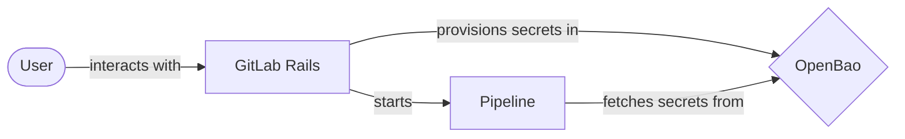
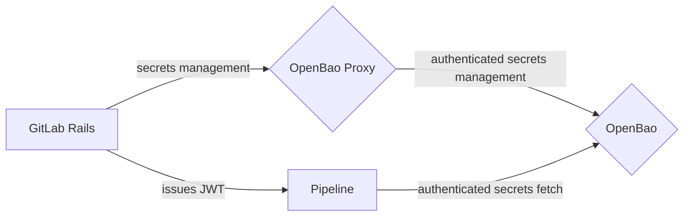
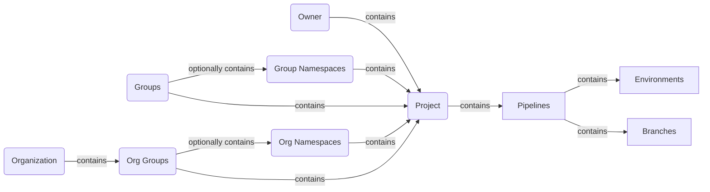
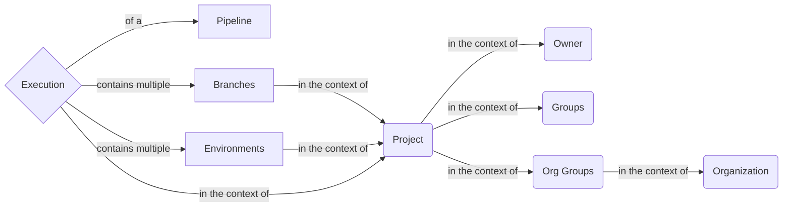
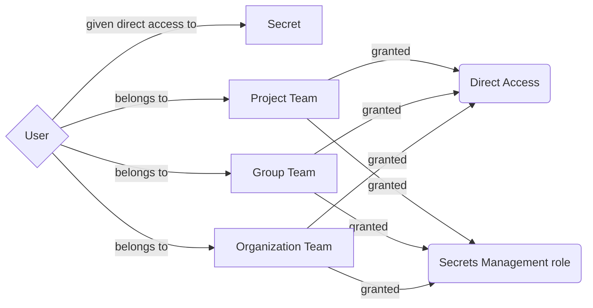
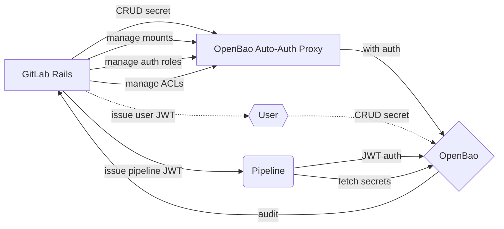



## Summary

GitLab users need a secure and easy-to-use solution to
store their sensitive credentials that should be kept confidential ("secret").
GitLab Secrets Manager is the desired system that provides GitLab users
to meet that need without having to access third party tools.

## Motivation

The current de-facto approach used by many to store a sensitive credential in GitLab is
using a [Masked Variable](https://docs.gitlab.com/ee/ci/variables/index.html#mask-a-cicd-variable) or a
[File Variable](https://docs.gitlab.com/ee/ci/variables/index.html#use-file-type-cicd-variables).
However, data stored in variables (masked or file variables) can be inadvertently exposed even with masking.
A more secure solution would be to use native integration
with external secret managers such as HashiCorp Vault or Azure Key Vault.

Integration with external secret managers requires GitLab to maintain the integration
with the third-party products and to assist customers in troubleshooting configuration issues.
In addition, customer's engineering teams using these external secret managers
may need to maintain these systems themselves, adding to the operational burden.

Having a GitLab native secret manager would provide customers a secure method to store and access secrets
without the overhead of third party tools and to leverage the tight integration with other GitLab features.

### Goals

Provide GitLab users with a way to:

- Securely store secrets in GitLab
- Use the stored secrets in GitLab components (for example, CI Runner)
- Use the stored secrets in external environments (for example, production infrastructure).
- Manage access to secrets across a root namespace, subgroups and projects.

#### Use cases

To help design the architecture, we need to understand how users, in their roles, would
operate and use the system. Here are significant use case scenarios that can help drive our
design decisions:

1. As a Compliance Manager or Security Ops engineer, I want to use dynamic secrets to provide an additional layer of security for my system.
1. As a Compliance Manager or Security Ops engineer, I want to use automatic secret rotation to provide an additional layer of security for my system.
1. As a Compliance Manager or Security Ops engineer, I want to set secrets expiration policies to provide an additional layer of security for my system.
1. As a Developer, I want sensitive credentials to be fully encrypted so I am not accidentally leaking this information in my deliverables.
1. As a Developer, I want to use secrets to store sensitive credentials to avoid storing this information inside of my code.
1. As a GitLab Admin and as a GitLab Group Owner, I want to have the ability to disable secrets management feature altogether if my organization requires the use of a 3rd party tool.
1. As a Compliance Manager or Security Ops engineer, I need to have audit tools which will show me the status of the secrets and their usage so I can identify any suspicious behavior and ensure our security and compliance of our sensitive credentials.
1. As a Compliance Manager, I need to audit log of secrets usage and management to ensure my organization is following compliance policy.
1. As a DevOps Engineer, I want the deployment process to fetch secrets necessary for deployment directly from a secrets manager.
1. As a Customer of a regulated industry, I need a secrets manager with HSM support so I can meet FIPS requirements.
1. As a US Public Sector customer, I need a secrets manager that is FedRAMP certified to meet security requirements.
1. As a Customer with an air-gapped system, I need a secrets managers that can be installed on-prem and managed on-site to meet network requirements.
1. As a Secret Owner, I need to quickly update or rotate the secret in case there has been a vulnerability to ensure the security of my software supply chain.
1. As a Secret Owner, I need the ability to rollback change to a secret in the event of an accidental change.
1. As a Security Engineer, I want to ensure all secrets are properly deleted/destroyed if they are no longer needed.

#### Non-functional requirements

- Security
- Compliance
- Auditability

### Non-goals

This blueprint does not cover the following:

- Secrets created within GitLab to allow external resources to access GitLab personal access tokens, such as personal access tokens.

## Decisions

- [ADR-004: Use OpenBao as the secrets management service](decisions/004_openbao/)
- [ADR-005: Non-hierarchical key structure for secrets in OpenBao](decisions/005_secrets_key_structure/)
- [ADR-006: Use AppRole authentication method between Rails and OpenBao](decisions/006_approle_authentication_rails/)

### Superseded

These documents are part of the initial iteration of this blueprint.

- [ADR-001: Use envelope encryption](decisions/001_envelop_encryption/)
- [ADR-002: Use GCP Key Management Service](decisions/002_gcp_kms/)
- [ADR-003: Build Secrets Manager in Go](decisions/003_go_service/)

## Proposal

The secrets manager feature will be available on both SaaS and Self-Managed installations
and will consist of two core components:

1. GitLab Rails
1. OpenBao Server



Because pipelines can be external to GitLab infrastructure, OpenBao thus
needs to be open to externally accessible and ACL protected. However, we'll
initially restrict the provisioning of secrets and authentication roles
through the GitLab Rails UI and limit JWT token creation to pipeline
execution, until we can build multi-tenancy extensions into OpenBao.

<details>

<summary> Digression on OpenBao visibility </summary>

Technically there are two approaches to make OpenBao visible:

 1. Directly, making the API address listen globally to the public internet.
 2. Via GitLab Rails proxying requests on behalf of callers.

In particular, with the latter, while we have the option of replacing the
backend secret store with a different provider in the future, we incur
additional effort for every dynamic secret provider we support: we can either
implement a thin proxy over the OpenBao API (making switching harder as we're
still tightly coupling to OpenBao), or we can implement a bespoke translation
layer per call.

Outside of a few proprietary vendors offering dynamic secrets, we'd thus
likely have to rewrite the functionality from scratch anyways if we were to
switch. Thus, we could stick to a vaguely OpenBao/Vault-compatible API design
(for clients) but modify it as necessary.

With this trade-off, and given there's interest in expanding past static K/V
secrets (into dynamic secrets -- whether for databases, cloud providers, or
even GitLab tokens), we suggest using the former approach, exposing OpenBao
publicly. This enables non-Pipeline workloads in the future (that simply read
secrets, leaving policy creation to GitLab Rails) and lets us use more
advanced features such as Transit for other solutions inside GitLab Rails.

</details>

Within OpenBao, we'll use two authentication engines:

 1. [AppRole](https://openbao.org/docs/auth/approle/), to authenticate GitLab
    Rails to OpenBao Server for privileged access. This will be done through
    the [Auto-Authing Proxy](https://openbao.org/docs/agent-and-proxy/proxy/),
    allowing GitLab Rails to connect with transparent authentication.
 1. [JWT](https://openbao.org/docs/auth/jwt/), to authenticate created
    pipeline jobs to OpenBao. These will be issued by GitLab Rails,
    using GitLab [OIDC ID Tokens](https://docs.gitlab.com/ee/ci/secrets/id_token_authentication.html)
    supported by the existing [HashiCorp Vault Runner integration](https://docs.gitlab.com/ee/ci/secrets/hashicorp_vault.html).



Importantly, while GitLab Rails authorizes the pipeline's execution of a
particular job, the pipeline's token must be adequately scoped to a
particular execution context. A pipeline's execution context is defined
as follows:



Both groups and organization groups can contain many nested subgroups
("namespaces"). The existing OIDC ID token contains sufficient context
information for these purposes.

From the context of an execution of a pipeline, a secret may come from
many sources:



Here, an execution of a pipeline can, in the restriction of a set of branch
or environment match patterns (e.g., `main`, `*`, or `release/*`), can get
secrets from:

 1. A project,
 1. The (user) owner of a project or equivalently,
 1. The hierarchical groups up to and including the organization owner of a
    project, or a parent group (prior to the introduction of organizations).

That is, if a secret is to be used by multiple projects, it should be
provisioned up a level and the branch and/or environment restricted
appropriately, ensuring that the relevant environment does not conflict
across projects it should not be visible in.

<details>

<summary> Digression on restricting access to exclusively shared secrets </summary>

While there is presently no expected way of sharing specific
secrets across projects (and not having them be visible to all projects
within that scope), we can update the hierarchy [defined below](#secret-and-authentication-hierarchy)
to include a `/shared_{scopeid}` moniker and provision a unique scope identifier
to allow access to secrets in mounts under that path and grant additional
path grants to identify scopes which a pipeline execution has access to
(broadening ACL policies as appropriate).

To avoid too much complexity, it is suggested to add these at the top-most
level and use explicit visibility permissions on users (e.g., not allow
groups to have their own shared secrets but instead allow them only at the
organization-wide level and have specific teams be added to specific shared
secrets for that group at the organization level).

As discussed below (on the secret hierarchy) on the need for hierarchy-free
secrets in the future, this could exist at various levels in the organization,
or even globally (in the event of a self-managed customer) and allow
Rails-defined permissions and delegation.

</details>

Similarly, in the context of user access and management of secrets, the
following hierarchy applies:



A team at any level (project, group, or organization) can be given permission
to manage all secrets at or below its level ("Secrets Management capability"
above). However, on an individual secret, a user or team can also be given
direct access to a particular secret, even if they don't otherwise have
secrets management capabilities.

Initially, users will manage secrets through GitLab Rails and its broader
AppRole token, but the intent longer-term is to using per-user JWTs. The
current design necessitates that GitLab Rails sees the value of the secret,
proxying it on behalf of the Browser UI to OpenBao. By using a per-user JWT
issued to the browser session in LocalStorage, the UI can directly contact
the public OpenBao instance and GitLab Rails will not have access to the
secret during provisioning and thus, risk inadvertently logging it.

### Secret and authentication hierarchy

Design of OpenBao's mount path will greatly affect available security
parameters. When encoding user values (`{value}`), we'll use URL-safe
Base64: this lets us have a unique, canonical transformation of
potentially non-path-safe components into individual path segments. For
components with dynamic names (like user, organization, and group names),
which aren't glob-aware and which are subject to renaming, we'll use their
internal integer database identifiers to prevent having to rename the
underlying mounts.

#### Secrets

We propose the following structure for mounts for user-owned projects:

- `/user_{userid}/secrets`
- `/user_{userid}/proj_{projectid}/secrets`

And for organization-owned projects:

- `/org_{orgid}/secrets`
- `/org_{orgid}/namespace_{nsid}/secrets`
- `/org_{orgid}/proj_{projectid}/secrets`

For groups which use the existing group-based system, the top-level entity
would be the parent group:

- `/group_{groupid}/secrets`
- `/group_{groupid}/namespace_{nsid}/secrets`
- `/group_{groupid}/proj_{projectid}/secrets`

Here, the first `group_{groupid}` would be the top-most group-id, but would
not be repeated for the nested sub-group secrets.

`namespace_{nsid}` indicates a nested entity (whether a group, subgroup, or
user namespace within a top-level organization or group). With the eventual
introduction of top-level organizations, if groups belong to orgid=1 meta-org,
we'll use group-based tenant separation for these.

Within each `secrets` folder, we'll initially mount a K/V secrets engine at
`/kv`; eventually other types of secrets engines can also be mounted to
provide dynamic secrets, with some consideration as to naming engines.

Within each K/V secrets engine, we'll use the following nesting structure to
restrict access to secrets (with a given `<name>` in pipelines:

- `.../secrets/kv/data/explicit/<name>`

Similarly, when using dynamic secrets engines with roles, we'll suggest using
the following structure of mounts and allow configuring secret names inside of
these mounts as appropriate to the specified dynamic secret engine:

- `.../secrets/<mount-name>/.../explicit-<role-name>`

Succinctly, the requirement that any given path a secret could live at is
prefix-free: we use `explicit` to indicate that provisioning auth engines must
_explicitly_ grant secret-level access to specific fields. If later types of
secret protection schemes are used (such as placing environment or branch
protections in the URL to allow broad access to any secret for that branch
or environment), we suggest using `env-` and `branch-` as prefixes.

#### Authentication

Authentication uses five sets of mounts:

- `/auth/user_{userid}/pipeline_jwt`
- `/auth/group_{groupid}/pipeline_jwt`
- `/auth/org_{orgid}/pipeline_jwt`
- `/auth/user_jwt`
- `/auth/gitlab_approle`

In particular, because pipelines may need access to nested secrets, but
won't need access to anything outside the tenant's scope, we will provision
ACL policies and authentication at the top-most tenant namespace (`user_`,
`group_` or `org_`). With namespaces, this will help with restricting the
pipeline from escaping its sandbox and accessing other tenant's secrets.

Later, user authentication can be added to each tenant
(`/auth/org_{orgid}/jwt_user` or `/auth/group_{groupid}/jwt_user`) and the
user can request scoped JWTs (and subsequent OpenBao tokens) so that they
aren't requesting tokens with broad access beyond the scope they are modifying
the secrets of.

Aside: presently the order is auth and then tenant segment, but when adding
proper namespace support, auth mounts could be inside of a tenant and thus
the order will be swapped to e.g., `/user_{userid}/auth/pipeline_jwt`.

#### Pipeline ACL

To restrict a pipeline's JWT token to only allowed paths, we'll use GitLab
Rail to provision a just-in-time ACL policy for the pipeline and a JWT
role tightly scoping to the [expected claims](https://docs.gitlab.com/ee/ci/secrets/id_token_authentication.html#token-payload)
from the existing CI/CD OIDC ID token integration.

OpenBao's ACLs are directly [stored on disk](https://github.com/openbao/openbao/blob/7fca5c0baebd3f55254da06d26bc160f465a7e1a/vault/policy_store.go#L287-L345),
with a [moderate cache](https://github.com/openbao/openbao/blob/7fca5c0baebd3f55254da06d26bc160f465a7e1a/vault/policy_store.go#L28-L29)
for recently-used policies. Policies are loaded and evaluated at
[request validation time](https://github.com/openbao/openbao/blob/7fca5c0baebd3f55254da06d26bc160f465a7e1a/vault/policy_store.go#L605-L629),
meaning that if a pipeline ACL name is modified and reused, the latest
version (at the time of the request) will win.

Likewise, the [JWT auth method's login](https://openbao.org/api-docs/auth/jwt/#jwt-login)
will require a role parameter to select the correct role for authentication.

For naming ACLs and roles, we suggest the format:

- `project_{projid}_job_{jobid}`

The ACL will contain a list of explicit grants of secret paths for the
pipeline as determined by GitLab Rails. For example:

```hcl
path "user_12345/project_54321/secrets/kv/data/explicit/DB_PASS" {
    capabilities = [ "read " ]
}

path "users_12345/project_54321/secrets/kv/data/explicit/GITLAB_TOKEN" {
    capabilities = [ "read " ]
}
```

Similarly, the JWT role will be configured as follows:

```json
{
    "name": "project_{projid}_job_{jobid}",
    "role_type": "jwt",
    "bound_claims": {
        "job_id": {jobid},
        "project_id" {projid}
    },
    "user_claim": "job_id",
    "token_policies": "project_{projid}_job_{jobid}"
}
```

Note that we do not use the OIDC role type as that does not support using
existing access or ID tokens to authenticate, only starting fresh OIDC auth
flows.

In this way, only explicit permissions granted by GitLab Rails to the pipeline
are ever used by the token, and other tokens issued by the CI/CD OIDC issuer
will not be granted login against this mount.

#### User ACL

While the user wouldn't initially contact OpenBao directly (and instead have
secrets management operations proxied through GitLab Rails), we want to first
switch GitLab Rails to using scoped user-level JWTs and then ultimately to
the client having direct access to OpenBao (without necessarily contacting
GitLab Rails), so that no user-confusion attacks are viable and so that GitLab
Rails does not see the secrets during provisioning, preventing them from
accidentally being logged in the future.

In that scope, we'd also like to have GitLab Rails manage the ACL policies for
users. Because OpenBao uses a [default deny policy](https://openbao.org/docs/concepts/policies/#policy-syntax),
we know it is safe to provision policies incrementally and for them to be
out-of-sync from the server, except in cases where revocation of access
happens. In particular if policies need to be recreated, GitLab Rails
refresh all of the policies.

We suggest creating per-user policies with a prefixed name similar to the
approach suggested above (`user_{userid}`). These policies will contain
wildcard access (read/write) for mounts within a particular scope a user has
full permissions in. For instance, if a user has organization-level secrets
management scope, they might get the following rule:

```hcl
path "org_{id for openbao}/*" {
    capabilities = [ "sudo", "create", "update", "patch", "delete", "list" ]
}
```

and on their own projects, they'll have:

```hcl
path "user_{id for cipherboy-gitlab}/*" {
    capabilities = [ "sudo", "create", "update", "patch", "delete", "list" ]
}
```

Similarly, if a user is granted permissions on a particular secret in a
project, they might get a more scoped rule added as well:

```hcl
path "org_{id for gitlab-org}/proj_{id for gitlab}/secrets/kv/data/explicit/THE_ONE_KEY" {
    capabilities = [ "sudo", "create", "update", "patch", "delete", "list" ]
}
```

Notably, a user token would be rather privileged: it would have complete
access to all secrets within the users' purview and thus should be suitably
short-lived to avoid potential side-channel attacks. Further hardening (like
[auto-binding to CIDRs](https://github.com/openbao/openbao/issues/32)) would
help avoid these issues. To solve this, we'd need to scope access along team
lines (e.g., any teams with access to manage a certain category of secrets
would have a separate ACL policy) along with any location-specific secrets
granted in a given view and expand OpenBao to allow templating of profiles
(so that the JWT could contain a concrete list of profiles to grant this
user). This would be rather involved but would help scope user JWTs more
specifically.

The upgrade path (from global AppRole token using the auto-authing proxy to
incrementally using these policies) would simply be changing the Rails code
to generate a user JWT and updating the Ruby client's request to authenticate
and use the subsequent token for a particular request. The auto-authing proxy
will not replace existing auth tokens on requests, so this change could be
rolled out incrementally.

Note that users lack read permissions on the actual secret; they can only set
the value. When rolling out dynamic secrets, users would be granted full
permissions on the role, but no permissions on the dynamic secret endpoint
(e.g., for PKI, they could have full permissions on `pki/roles/:name`, but
none on `pki/issue/:name`).

### Static vs Dynamic Secrets

GitLab Secrets Manager will initially only support static secrets, stored in
a KVv2 engine. Some improvements to OpenBao can be added to static secrets,
such as:

 1. Using leases, to support one-time use secrets. These could be written by
    another workflow and removed on use.
 1. Supporting automatic deletion of secrets: a given expiration date could be
    strictly enforced, preventing use of the secret and requiring rotation of
    even long-lived manual secrets.

However, ultimately automatic rotation is an important consideration. By using
fully dynamic secrets, the problem of rotation is avoided: secrets are scoped
to a particular access and are automatically revoked (trough lease expiration
or revocation) once the pipeline or access finishes. This prevents reliance on
static values and ensures compromise of values require time-limited use and
prevent persistence. We can build several improvement to OpenBao to help the
adoption of dynamic secrets:

 1. Add a plugin registry to allow custom, external plugins or allow
    containerized execution of plugins.
 1. Create additional backend-pluggable plugin types beyond database: this
    could allow various access-token providers to be more easily created by
    exposing common APIs in a standardized format.

We ultimately wish to push more users towards dynamic secrets. These are
more secure and don't have long-term data retention and security concerns.

### Sources of Truth

GitLab Rails is the source of truth for:

- Definitions of secrets
  - Locations in OpenBao
  - Ownership information (direct access and team membership)
  - Scope of pipeline access
  - Any textual description of the secret available to operators
- JWT issuance via OIDC
  - Pipeline issuance
  - User-level issuance (eventually)

OpenBao is the source of truth for:

- Values of secrets
- ACL policies; these will be pushed from GitLab Rails based on ownership
  information (just before usage in the case of pipelines).
- Configuration of dynamic secrets, including K/V extensions for one-time use
  secrets, and automatic deletion.

### GitLab Rails

GitLab Rails would be the main interface that users would interact with when
managing secrets using the Secrets Manager feature. We would not provision
direct user access to the underlying OpenBao instance and thus OpenBao's
[lack of a UI](https://openbao.org/docs/release-notes/2-0-0/#200) would not
impact us: we wish to provide a more native, integrated UI than indirection
through OpenBao's UI would provide.

This component is a facade to OpenBao server, initiating several requests and
workflows to OpenBao:



Initially all operations will through GitLab Rails including CRUD operations
on secrets, but not requests for secrets from pipelines (though this action is
of course initiated by a pipeline job starting from GitLab Rails). Eventually
the privileged token for CRUD operations will be replaced with a user JWT
and subsequently directly by the user (through a JavaScript OpenBao client
running in the context of the GitLab UI).

Within the [GitLab Rails monolith](https://docs.gitlab.com/ee/development/architecture.html#component-diagram),
two components will need access to the secrets manager: [Puma](https://docs.gitlab.com/ee/development/architecture.html#puma),
where the majority of the GitLab backend code executes; and
[Sidekiq](https://docs.gitlab.com/ee/development/architecture.html#sidekiq),
a background job processor to allow long-lived background operations (such
as initial provisioning of OpenBao and secret engine mounts).

#### Management of secrets

GitLab will maintain records for secrets created and managed by OpenBao,
including access scope. This will allow the UI to query secrets associated
with various stages: project, group, organization, and user.

In `SQL`, this could look like:

```sql
CREATE TABLE secrets (
    id bigint NOT NULL,

    // Tenant information; only one is set.
    tenant_user_id bigint,
    tenant_organization_id bigint,
    tenant_group_id bigint,

    // Scope information; only one is set.
    user_id bigint,
    organization_id bigint,
    group_id bigint,
    project_id bigint,

    // Global pipeline access restrictions
    environments_scope text,
    branches_scope text,

    // User-specified metadata
    name text,
    description text,

    // GitLab-maintained metadata
    type text DEFAULT "kv-v2",
    created_at timestamp with time zone NOT NULL,
    updated_at timestamp with time zone NOT NULL,
    revoked_at timestamp with time zone,
);

CREATE TABLE secret_permission_assignments (
    secret_id bigint NOT NULL,

    // Target of grant; only one is set.
    user_id bigint,
    organization_id bigint,
    group_id bigint,
    project_id bigint,

    // Capabilities
    create boolean,
    read boolean DEFAULT false,
    update boolean,
    patch boolean,
    delete boolean,
    list boolean,
);
```

Here, `group_id` references the closet-most subgroup that owns the secret or
project. Nested subgroups can then be queried. `secret_permission_assignments`
handles granting particular groups or users direct access to secrets (in
structures which their role wouldn't otherwise; e.g., a user with Guest
access to a project could be directly added to a secret to help manage it).

#### Management of authentication

GitLab Rails needs to issue two types of JWTs:

1. JWTs within the scope of a project for a particular pipeline execution.
1. JWTs for user authentication.

GitLab already supports issuance of both JWT types through its OIDC
for [CI/CD](https://docs.gitlab.com/ee/ci/secrets/id_token_authentication.html)
and as an [Identity Provider (IDP)](https://docs.gitlab.com/ee/integration/openid_connect_provider.html).
Within each [auth method](#authentication), we'll need to ensure that we
create the necessary roles to ensure OIDC tokens get exchanged for OpenBao
tokens with appropriate policies attached.

#### Necessary cleanup hooks

The following places need to be hooked to update secrets (both internally to
the database and in OpenBao):

- Deletion of project
- Deletion of group
- Deletion of organization
- Deletion of user
- Cancellation of a pipeline
- Disabling of secrets on a project
- Non-renewal of secrets management subscription

Because IDs are used in place of names, few mount move operations will be
incurred except when enabling multi-tenant namespaces for the first time.

### OpenBao server

[OpenBao](https://openbao.org/) server will be a new component in the GitLab
overall architecture. This component provides all the secrets management
capabilities including storing the secrets themselves. An overview of
[its internals](https://openbao.org/docs/internals/) and
[threat model](https://openbao.org/docs/internals/security/) are available
on its project website.

In summary, storage is encrypted with a root key, which in turn encrypts a
barrier keyring, which in turn encrypts storage. Access to the root key is
protected through either a [Shamir's derived AES key](https://openbao.org/docs/concepts/seal/#shamir-seals)
(which requires a quorum present to unseal) or an automatic unseal mechanism
(such as [GCP KMS](https://openbao.org/docs/configuration/seal/gcpckms)).

#### Storage backend

OpenBao on Runway will initially be deployed with the Postgres engine. This
is a sane default for self-hosted as well, as GitLab Rails already requires
a database and can create tables in it. However, support for the more widely
deployed Raft backend can also be added in the future fairly easily.

#### Seal mechanisms

For GitLab.Com deployments, OpenBao will use the GCP KMS auto-unseal
mechanism. For self-hosted environments, if an existing supported KMS
mechanism is not provided, we can use the Shamir seal for MVC. Later
improvements might include tying into the existing
[secrets file](https://docs.gitlab.com/ee/administration/backup_restore/troubleshooting_backup_gitlab.html#when-the-secrets-file-is-lost)
as an auto-unseal mechanism for OpenBao, supporting PKCS#11 seals,
and multi-unseal capabilities (discussed below).

#### Audit logging

OpenBao supports audit logging through file, syslog, or socket mechanisms.
Because OpenBao will not necessarily be co-located with GitLab Rails or
our audit logging (into Postgres), it is suggested to either use the syslog
backend or use a custom audit logging backend.

Note that, in the event audit logging goes down, OpenBao will not be able to
handle any requests until this is fixed.

#### High availability

OpenBao's HA mode will already support running in a clustered environment,
however, each node will need to be manually unsealed (if using Shamir's).
With Raft, snapshots driven by GitLab can be used for D/R, else with
Postgres, the core database backup is sufficient.

#### Required enhancements

OpenBao will require enhancements to improve security prior to GA of this
feature. These are discussed more below.

##### Multi-unseal capabilities

In the event an unseal method has faulted and is unrecoverable, OpenBao today
will be unable to decrypt its secrets and thus fail to start. In the event
of infrastructure outages, this makes recovery hard. Upstream Vault Enterprise
has introduced [Seal HA capabilities](https://developer.hashicorp.com/vault/docs/configuration/seal/seal-ha),
whose design was influenced by the additional requirements of
[Seal Wrapping](https://developer.hashicorp.com/vault/docs/enterprise/sealwrap).
OpenBao does not have Seal Wrapping and thus can rely on a design similar
to an [earlier, retracted PR](https://github.com/hashicorp/vault/pull/18683).

We can allow several parallel unseal mechanisms, each of which encrypts the
same root key. This would allow a mix of auto-unseal and Shamir's, allowing
a hybrid recovery procedure in the event the auto-unseal mechanism were
unavailable or the key was lost. Notably, reuse of the root key isn't bad:
any loss of unseal key material (that compromises root key integrity) with
separate root keys would still allow recovery of the barrier encryption key.
Rotation of the root key would require all unseal mechanisms to either be
online or removed prior to use. However, we wouldn't have to contend with
secrets encrypted using a combination of mechanisms, as they only encrypted
entry is the root key.

##### Multi-tenancy through namespaces

In the current design document, separate tenants' secrets would be encrypted
using the same barrier encryption keys. This means compromise of a single
tenant would result in compromise of all tenants.

OpenBao lacks [namespaces from Vault Enterprise](https://developer.hashicorp.com/vault/docs/enterprise/namespaces).
These allow for logical [separation of tenants](https://github.com/orgs/openbao/discussions/293),
as discussed upstream. In particular, we can grant limited, scoped `sys/`
capabilities to admins within a namespaces:

- [`sys/auth`](https://openbao.org/api-docs/system/auth/) to mount new auth plugins.
- [`sys/mounts`](https://openbao.org/api-docs/system/mounts/) to mount new secret engine plugins.
- [`sys/namespaces`](https://openbao.org/api-docs/system/namespaces/) to allow nested namespaces.
- [`sys/policies`](https://openbao.org/api-docs/system/policies/) to control namespace-restricted policies.
- Optionally [`sys/quotas/config`](https://openbao.org/api-docs/system/quotas-config/) and [`sys/quotas/rate-limit`](https://openbao.org/api-docs/system/rate-limit-quotas/) to control namespace-restricted quotas (if tenants want to set their own, subject to global quoata limits).

The intention of this change would be to safely allow customers to directly
interact with their OpenBao instances, bringing non-Pipeline workloads to
use the same secrets store.

Further, we can add layered seal encryption to namespaces, creating a separate
root key and barrier keyring encrypted by both the parent namespace's barrier
key but also a separate unseal mechanism. This would likely expose the
following scoped `sys/` routes within a namespace:

- [`sys/rotate`](https://openbao.org/api-docs/system/rotate/) to rotate the per-namespace barrier encryption key.
- [`sys/rekey`](https://openbao.org/api-docs/system/rekey/) and [`sys/rekey-recovery-key`](https://openbao.org/api-docs/system/rekey-recovery-key/) to rotate the per-namespace root and recovery keys (if any).
- [`sys/seal`](https://openbao.org/api-docs/system/seal/) and [`sys/unseal`](https://openbao.org/api-docs/system/unseal/) to seal and unseal the namespace. Note that sealing an auto-unseal mount would require the recovery keys.

In the event a customer wanted to revoke access to secrets from GitLab,
they could seal their namespace and prevent GitLab from accessing the
unseal mechanism of choice.

Lastly, we can strengthen the memory isolation of customers by only allowing
plugin multiplexing within a namespace. When coupled with external runners
for plugins, such as a container or cgroups, we could further isolate tenants
data in memory.

### Packaging and deployment

OpenBao maintains an upstream [Helm chart](https://github.com/openbao/openbao-helm)
that can be used for deploying OpenBao in a Kubernetes environment. This can
be referenced and configured from the [GitLab Helm chart](https://docs.gitlab.com/charts/)
as required. In Kubernetes deployments, Proxy can be used in a sidecar
container in the Rails monolith.

For self-hosted, OpenBao server will also be executed by GitLab Rails in
addition to the proxy.

### Use case studies

- [Using secrets in a CI job](studies/ci_job_secrets/)

### Further investigations required

1. Authentication of clients other than GitLab Runner.
   GitLab Runner authenticates using JWT, for other types of clients, we need a secure and reliable method to authenticate requests to decrypt a secret.
1. How to namespace data, roles, and policies to specific tenant.
1. How to allow organizations to seal/unseal secrets vault on demand.
1. Infrastructure setup, including how OpenBao will be installed for self-managed instances.
1. How to best implement sharing of secrets between multiple groups in GitLab.
1. Establish our protocol and processes for incidents that may require sealing the secrets vault.
1. How to support protected and environment specific rules for secrets.
1. How to audit secret changes. Do we want to use [audit socket](https://openbao.org/docs/audit/socket/)?
1. Do we want to structure project secret paths to be under namespaces to increase isolation between tenants?
1. Should the secrets be revoked if a project or subgroup is moved under a different top-level group/organization?

## Alternative solutions

Other solutions we have explored:

- Separating secrets from CI/CD variables as a separate model with limited access, to avoid unintended exposure of the secret.
- [Secure Files](https://docs.gitlab.com/ee/ci/secure_files/index.html)
- Implementing secrets management from scratch (see [Superseded](#superseded)).

## References

The following links provide additional information that may be relevant to secret management concepts.

- [OWASP Secrets Management Cheat Sheet](https://cheatsheetseries.owasp.org/cheatsheets/Secrets_Management_Cheat_Sheet.html)
- [OWASP Key Management Cheat Sheet](https://cheatsheetseries.owasp.org/cheatsheets/Key_Management_Cheat_Sheet.html)

## Who

DRIs:

<!-- vale gitlab.Spelling = NO -->

| Role                | Who                                            |
|---------------------|------------------------------------------------|
| Author              | Erick Bajao, Senior Engineer                   |
| Co-Author           | Alex Scheel, Staff Engineer                    |
| Recommender         | Fabio Pitino, Principal Engineer               |
| Product Leadership  | Jocelyn Eillis , Product Manager               |
| Engineering Leadership | Scott Hampton, Engineering Manager          |
| Lead Engineer       | Erick Bajao, Senior Backend Engineer           |
| Senior Engineer     | Maxime Orefice, Senior Backend Engineer        |
| Engineer            | Shabini Rajadas, Backend Engineer              |

<!-- vale gitlab.Spelling = YES -->
