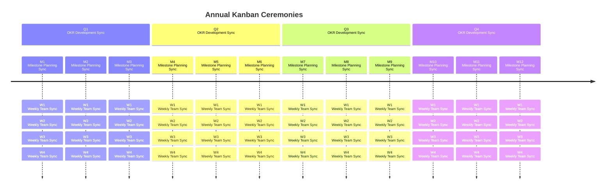
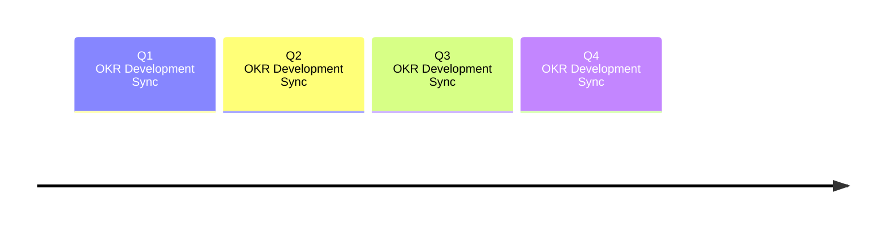
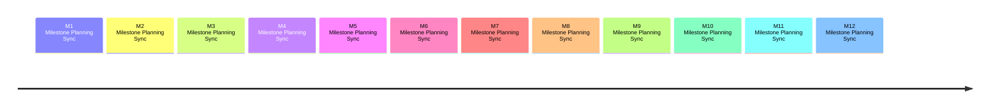

## Dynamic Analysis

The Dynamic Analysis group at GitLab is charged with developing solutions which perform [Dynamic Analysis Software Testing (DAST)](https://about.gitlab.com/direction/secure/dynamic-analysis/dast/) and Fuzzing. Our work is a mix of open and closed source code.

### Mission

To support the success of GitLab by developing highly usable, hiqh quality tools for customers to build more secure software. The Dynamic Analysis group at GitLab is charged with developing solutions which perform API Security Testing, Dynamic Analysis Software Testing (DAST) and Fuzzing.

### Top Priorities (FY25)
**Theme: Increase adoption**

- **Unify DAST offerings** - Reduce confusion by removing proxy-based DAST and maturing browser-based DAST by adding active checks and improving performance 

- **API Discovery** - API discovery will analyze applications to produce an OpenAPI document describing the web APIs expected behavior. This schema document is then used by API Security testing (formerly called DAST API) to perform security scans.  Automating this will close the gap for customers whose applications include web APIs that haven’t been documented and aren’t being tested today.

- **API Security Checks refresh** - Comprehensively review and update API Security Testing checks (rules).  By ensuring we address both the OWASP API Security Top 10:2023 and the OWASP Top 10:2021 (web applications), our customers will be confident in our ability to detect critical risks.

- **DAST Performance** - Deduplicate scanning similar pages to reduce DAST scan times without reducing security coverage. Long scan times are a major barrier that discourages customers from incorporating DAST scans into DevSecOps processes.

### Customer outcomes We are Driving

The Dynamic Analysis team builds features for our API Security, DAST, and Fuzzing categories.  These features enable our Ultimate customers to incorporate security testing earlier in the development lifecycle for their web applications and APIs. By identifying vulnerabilities earlier in the SDLC, we enable customers to more efficiently reduce the security risks in their web apps and APIs.

Our features identify vulnerabilities in different ways than GitLab’s other security analyzers do, and each tool should be used in tandem with other security analyzers such as SAST, SCA (dependency scanning), and secret detection to provide full coverage.

API Security, DAST, and Fuzzing are Ultimate features. Increasing adoption of these features helps improve customer retention, and helps drive revenue for GitLab Ultimate.

### Important DAST Repositories

| Repo | Purpose |
| ---- | ------- |
| [DAST](https://gitlab.com/gitlab-org/security-products/dast) | The DAST Analyzer which is deployed as a docker image. |
| [Browserker](https://gitlab.com/gitlab-org/security-products/analyzers/browserker) | Private - GitLab's DAST browser-based analyzer. |
| [DAST CWE Checks](https://gitlab.com/gitlab-org/security-products/dast-cwe-checks) | Private - DAST browser-based analyzer vulnerability definitions. |
| [DAST Chromium](https://gitlab.com/gitlab-org/security-products/dast-chromium) | Private - DAST browser-based analyzer dependencies, such as the Chromium browser. |

### Important Fuzzing repositories

| Repo | Purpose |
| ---- | ------- |
| [API Security](https://gitlab.com/gitlab-org/security-products/analyzers/api-fuzzing-src) | Private - The API Security tool performs API Fuzzing and API DAST scans. |
| [GitLab Protocol Fuzzer (CE)](https://gitlab.com/gitlab-org/security-products/protocol-fuzzer-ce) | GitLab's Protocol Fuzzer (Community Edition), previously Peach Protocol Fuzzer. |
| [GitLab Protocol Fuzzer (EE)](https://gitlab.com/gitlab-org/security-products/protocol-fuzzer-ee) | Private - GitLab's Protocol Fuzzer (Enterprise Edition), previously Peach Protocol Fuzzer, includes licensed components. |
| [API Fuzzing E2E Tests](https://gitlab.com/gitlab-org/security-products/tests/api-fuzzing-e2e) | Private - API End to End Tests. |
| [GitLab Cov Fuzz](https://gitlab.com/gitlab-org/security-products/analyzers/gitlab-cov-fuzz-src) | Private - GitLab's coverage fuzzing orchestration that integrates fuzzing engines/results with GitLab CI and GitLab Security Dashboard. |
| [HAR Recorder](https://gitlab.com/gitlab-org/security-products/har-recorder) | A utility to record HAR files based on web traffic. |

##### Open Source Fuzzers

| Repo | Purpose |
| ---- | ------- |
| [JSfuzz](https://gitlab.com/gitlab-org/security-products/demos/coverage-fuzzing) | Javascript Fuzzer. |
| [Pythonfuzz](https://gitlab.com/gitlab-org/security-products/demos/coverage-fuzzing) | Python Fuzzer. |
| [Javafuzz](https://gitlab.com/gitlab-org/security-products/demos/coverage-fuzzing) | Java Fuzzer. |
| [Coverage Fuzzing Examples](https://gitlab.com/gitlab-org/security-products/demos/coverage-fuzzing) | Coverage fuzzing examples in 7+ languages/Fuzzers. |

## How to Contact Us

- Slack channel: #g_secure-dynamic-analysis, #f_secure-api-security, #f_secure-fuzz-testing
- Slack alias: @secure_dynamic_analysis_be
- Google groups: dynamic-analysis-be@gitlab.com
- GitLab mention: @gitlab-org/secure/dynamic-analysis-be

### Support Requests

The Dynamic Analysis engineering team provides support to GitLab Support Engineers [following the process outlined in the Sec Section support project](https://gitlab.com/gitlab-com/sec-sub-department/section-sec-request-for-help/).

### Other Contact

The DAST team also monitors #s_secure and #sec-section. Both these channels are for wider Secure topics, however are a good place to start if you are not sure which group in Secure to contact.

## How We Work



The Dynamic Analysis group works according to Kanban principles, with the addition of ceremonies quarterly for OKR development, monthly for release planning, and weekly for syncing on epic and issue reacting, triaging, refinement, impediment resolution. By having the team operate and think at each of these cadences, it can effectively set high-level hierarchical goals, ensure product priorities are planned, and prevent epics and issue work from stalling or falling through the cracks.

### Quarterly OKR Development



Four weeks before the end of a fiscal quarter, our bot will automatically create an OKR planning issue for the group and schedule a calendar event.

The group will get together two weeks before the next quarter begins to create and review [all OKRs for which the team will ultimately be responsible]((https://gitlab.com/gitlab-com/gitlab-OKRs/-/issues/?sort=created_date&state=opened&label_name%5B%5D=group%3A%3Adynamic%20analysis&first_page_size=20)). This includes reviewing all ancestor OKRs for the stage and up, creating or updating any new or existing OKRs with additional details, and assigning DRIs to each OKR to assist with health updates.

#### Important Links

- [List of Team Objectives & Key Results](https://gitlab.com/gitlab-com/gitlab-OKRs/-/issues/?sort=created_date&state=opened&label_name%5B%5D=group%3A%3Adynamic%20analysis&first_page_size=20)
- List of Stage Objectives & Key Results (Coming Soon)
- List of CEO Objectives & Key Results (Coming Soon)

#### Quarterly Outputs

- Polished OKRs for the group with assigned DRIs
  - Links to any associated epics or issues

### Monthly Release Planning



Two weeks before a release milestone is kicked off, our bot will automatically create a monthly release planning issue for the group and schedule a calendar event.

On the date of a release milestone kick-off, we will review the list of [Dynamic Analysis Group direction priorities](https://about.gitlab.com/direction/secure/dynamic-analysis/#priorities) with product.

Product sets all of our high-level priorities and the output from this meeting will be an MR update to this page with a direct mapping of each priority to a group epic and any updates to the targeted milestone to ensure accuracy. These product priority-based epics will exist alongside our comprehensive [list of all Dynamic Analysis Group epics](https://gitlab.com/groups/gitlab-org/-/epics?state=opened&page=1&sort=start_date_desc&label_name%5B%5D=group::dynamic+analysis&label_name%5B%5D=Category:DAST).

To complete this mapping, product priority-based epics should be created in [gitlab-org/-/epics](https://gitlab.com/groups/gitlab-org/-/epics?label_name[]=Category:DAST&label_name[]=group::dynamic+analysis&page=1&sort=start_date_desc&state=opened) with the same title of the priority and the following labels. The `type::feature` label is what distinguishes a product priority from other group epic work.

```
/label ~"section::sec"
/label ~"devops::secure"
/label ~"group::dynamic analysis"
/label ~"type::feature"
```

Timeboxed by the duration of this meeting, the team will attempt to create as many child epics and issues for each of these current release milestone product epics as placeholders for eventual refinement. This is a great time for the team to discuss high-level architectural directions, implementation plans, and needs for accomplishing these priorities throughout the next month. All issues created should receive the following milestone and labels:

```
/milestone {from mapping}
/label ~"section::sec"
/label ~"devops::secure"
/label ~"group::dynamic analysis"
/label `~workflow::planning breakdown`
```

#### Important Links

- [Dynamic Analysis Group Direction Priorities](https://about.gitlab.com/direction/secure/dynamic-analysis/#priorities)
- [List of all Dynamic Analysis Group Epics](https://gitlab.com/groups/gitlab-org/-/epics?state=opened&page=1&sort=start_date_desc&label_name%5B%5D=group::dynamic+analysis&label_name%5B%5D=Category:DAST)

#### Monthly Outputs

- MR to update the group direction with all priorities and targeted releases
  - Links to polished epics for each product priority
    - Flush out as many child epics and issues tagged to milestones as possible

### Weekly Sync

Every Tuesday, a calendar event with an attached agenda exists for a synchronous group meeting.

Each Tuesday, the group will assign a new Reaction Coordinator, discuss any unresolved and significant impediments blocking the team, and host general discussions valuable to a synchronous team meetup.

#### Reaction Coordinator

DAST uses a reaction coordinator rotation to give each team member in the group the opportunity to ensure all internally and externally generated epics and issues are triaged or resolved as efficienctly as possible.

Engineers rotate through the position to give everyone equal opportunity both in the role and away from the role. The weekly sync agenda document will contain the currently assigned reaction coordinator. The reaction rotation aims to produce better group workflow, support and quality, and community outcomes by encouraging knowledge sharing, reducing dependencies on individuals in knowledge silos, and clarifying who is responsible for responding to any external requests.

Due to the unpredictable nature of all of the following triage items, it is hard to determine the impact of reaction coordinator rotation on an engineer's typical throughput, but a significant decrease is to be expected for the betterment of all of these stakeholders.

The reaction coordinator of the week is responsible for triaging:

##### [Dynamic Analysis delivery board](https://gitlab.com/groups/gitlab-org/-/boards/5719921?label_name%5B%5D=group%3A%3Adynamic%20analysis) columns near their WIP limits

- Issues that need to be refined with the `~workflow::planning breakdown` label
- Issues that need to be broken down in any status
- All other columns with too many issues

##### Blocked epics or issues anywhere in the workflow

##### External support issues

- Triage and respond to customer support requests via support [request for help issues](https://gitlab.com/gitlab-com/sec-sub-department/section-sec-request-for-help/-/issues/?sort=created_date&state=opened&label_name%5B%5D=Help%20group%3A%3Adynamic%20analysis&first_page_size=20). As an outcome of triage, create new issues and communicate with the product team to help assign priority.
- Triage and respond to customer support requests via Slack. Encourage customers/support teams to create support tickets because of Slack's short retention history.
- Ensure high-quality support request responses. Reach out to other engineers, teams, or people with knowledge to ensure customers get the best possible answers.

##### External Security & Quality Issues

- Ensure security issues (for FedRAMP compliance or platform security) are created or updated, either manually or through automation. Follow up with creation of [Deviation Requests](/handbook/security/security-assurance/dedicated-compliance/poam-deviation-request-procedure/) if necessary.
- See the [Secure sub-department vulnerability management process](/handbook/engineering/development/sec/secure/#vulnerability-management-process).

##### Community contributions

- Act as an MR Coach for newly created community contributions.

##### Out of Scope of the Role

The reaction rotation engineer should not:

- Directly fix issues as a result of customer support triage. The product team must prioritize any issue prior to an engineer picking it up.
- Exclusively work on community contributions, security issues, or bug fixes. These are the purview of the entire team.
- Take the time as slack time. Slack time is important in everyone's role and is captured as a constant when measuring team throughput to predict release dates.

#### Weekly Outputs

- Assign a new Reaction Coordinator
- Discuss any unresolved and significant impediments
- General team discussions

### Daily Epic and Issue Work

The team follows the workflow states and activities articulated in GitLab's [Product Development Flow](/handbook/product-development-flow/). It operates on a pull-based methodology souring from the [list of all Dynamic Analysis Group epics](https://gitlab.com/groups/gitlab-org/-/epics?state=opened&page=1&sort=start_date_desc&label_name%5B%5D=group::dynamic+analysis&label_name%5B%5D=Category:DAST) as the backlog of all work for the current and future releases.

As epics cannot be associated with milestones in the product, the [list of all Dynamic Analysis Group epics](https://gitlab.com/groups/gitlab-org/-/epics?state=opened&page=1&sort=start_date_desc&label_name%5B%5D=group::dynamic+analysis&label_name%5B%5D=Category:DAST) functions as the source of truth for the milestone for any issues not yet created for each epic. Although, at least some issues should exist for each epic associated with a product priority from monthly release planning.

An issue is considered handed off into the development team when it is given the `~workflow::planning breakdown` label, and the team utilizes the following labels as part of its work. Our [Dynamic Analysis delivery board](https://gitlab.com/groups/gitlab-org/-/boards/5719921?label_name%5B%5D=group%3A%3Adynamic%20analysis) contains everything that the group is currently working on.

| State | Expected Outcomes |
| ----- | ----------------- |
| `~workflow::planning breakdown` | Issues are optimized for delivery based on [Issue breakdown] principles. |
| `~workflow::refinement` | Implementation plan added to the issue description. Weights are not required due to the small size of issues. |
| `~workflow::ready for development` | Buffer queue - issue deemed to be `~Deliverable`, `~Stretch`, or possibly punted to a future iteration. |
| `~workflow::in dev` | Last MR is up and out of Draft or WIP status. |
| `~workflow::in review` | Last MR is merged. |
| `~workflow::verification` | Functionally working changes are available in a production environment. Record demo where possible. |
| `~workflow::complete` | Code is verified, the work is complete, and the issue is closed. |

Issues worked by this team are backend-centric and are typically in one the above repos, [vendored templates](https://gitlab.com/gitlab-org/gitlab/-/tree/master/lib/gitlab/ci/templates/Security), and GitLab's [Rails monolith](https://gitlab.com/gitlab-org/gitlab). At times, issues can require support from Secure's frontend team if UI changes are required. We will require more notice for initiatives like these.

#### Issue breakdown

Team members are empowered to create new issues, attach them to relevant epics, and collaborate with product management to determine if they are included in current scope.

##### Breakdown principles

Issues are broken down according to the [INVEST mnemonic](https://en.wikipedia.org/wiki/INVEST_(mnemonic)).

- **Independent**, the issue should have minimal to no dependencies so it can be played in isolation of other issues.
- **Negotiable**, the issue should be structured such that the PM can prioritize or deprioritize it with minimal effect on the overall feature.
- **Valuable**, the issue should provide value when released to production.
- **Estimable**, the issue should make clear what is in scope and out of scope so that engineers can provide an estimate.
- **Small**, the issue must fit inside one milestone, ideally, design to delivery should take less than two weeks.
- **Testable**, the issue must be able to be tested. If it can't be tested, it can't be guaranteed to work in future.

##### Vertically Split

Issues should be split vertically rather than horizontally. Splitting vertically means the whole system will do something noticeably different; splitting horizontally results in trying to realize the fullest possible change in an individual component.

For example, imagine there is an epic to a CRUD feature to a site. Issues could be split up and played in the following order:

1. Read. This is independent, negotiable, estimable, small and testable. It is also valuable because in production an engineer could manually create the data to be read by users.
1. Create. This is independent, estimable, and small. It is testable because the Read functionality has already been built. It is valuable because engineers don't need to manually create data anymore, and it is negotiable because a PM may decide that engineers manually creating data is good enough.
1. Delete. Same as above, and it is valuable because engineers wouldn't need to manually delete records in production.
1. Update. Same as above, and it is often deprioritized by PMs because Create and Delete is often good enough.

#### Repeated Tasks

There are several maintenance tasks that need to be completed each milestone. Each iteration, an issue is opened and assigned to an engineer on a rotating basis. Those rotating tasks are:

- Review upstream changes, and open an issue to upgrade DAST if the upstream changes provide important improvements
- Review the [security dashboard](https://gitlab.com/gitlab-org/security-products/dast/-/security/vulnerability_report) for DAST and address all critical and high issues. Review the dashboards for upstream projects, [ZAP](https://gitlab.com/gitlab-org/security-products/dependencies/zaproxy) and [ZAP Extensions](https://gitlab.com/gitlab-org/security-products/dependencies/zap-extensions)

#### Important Links

- [Dynamic Analysis Delivery Board](https://gitlab.com/groups/gitlab-org/-/boards/5719921?label_name%5B%5D=group%3A%3Adynamic%20analysis)

## DAST Technologies

The DAST analyzer we build relies heavily on OWASP's [ZAP](https://github.com/zaproxy/zaproxy) open source software and [ZAP Extensions](https://github.com/zaproxy/zap-extensions). This means the accuracy and quality of the DAST analyzer is impacted by the quality of the underlying OSS.

We [monitor the underlying tools](https://gitlab.com/gitlab-org/security-products/dependencies/zaproxy/-/security/dashboard) for changes and for vulnerabilities.

ZAProxy and ZAP Extensions do not have significant test coverage and therefore changes in those tools could impact DAST in unexpected ways. Since our expectation is that customers run
DAST in a CI environment and stability and security is of utmost importance, we do not necessarily ship the latest ZAP build. We actively review the ZAP changelog and evaluate whether
new updates deliver value to our customers and their use cases. We may ship a [pre-release build of ZAP or a versioned build](https://github.com/zaproxy/zaproxy/releases)
if we determine it contains valuable updates for customers and it passes our CI pipelines.

An assigned backend engineer reviews upstream updates at least monthly to identify new bug fixes or features.
Those changes are presented to the Product Manager for prioritization into DAST.

### New DAST Technologies

The DAST analyzer is migrating towards using exclusively a browser-based DAST tool that is being built by GitLab. The tool has internally been referrred to as Browserker. Browser based DAST was released as GA in 15.7. The browser-based DAST is being delivered iteratively, with each new iteration taking over some parts of analysis previously done by ZAP, with the eventual goal of deprecating ZAP completely.

## Fuzzing Technologies

- The API Security product is built using mostly C# with some small amounts of Python. Our engineers use Windows VMs for development.
- The coverage guided fuzzing team works primarily in Go, but is also responsible for maintaining the open source fuzzers in JSFuzz, Pythonfuzz, and Javafuzz. The team also maintains the fuzzing examples in which we aim to cover all major programming languages.

### Our Approach to Fuzzing

- Fuzzing has one of the largest adoption hurdles of all the Secure products. Coverage fuzzing requires customers to write test harnesses, compile applications with special settings and generates highly technical output.

Web API Fuzzing requires generating files that allow the Web API fuzzing tool to know what parts of the application to fuzz.

Our goals is to simplify and reduce as many of the steps that a customer needs to do to get started. We want to focus our efforts on creating samples, defaults, and intelligence that will simplify fuzzing onboarding.

### Community Contributions

The Dynamic Analysis welcomes community contributions. Community Contributors-- please make sure to add the label "group::dynamic analysis" to any Merge Requests or Issues to ensure the Dynamic Analysis team sees your contribution.

Community contributions should get prompt feedback from one of the DAST engineers. All engineers on the DAST team are responsible for working with community contributions. If a team member does not have time to review a community contribution, please tag the Engineering Manager, so that they can assign the community contribution to another team member.

## Dashboards


  



  



  



  


### Targets

For our Merge Request types, we have an initial soft target ratio of 60% features, 30% maintenance, and 10% bugs based on the [cross-functional prioritization process](/handbook/product/product-processes/#cross-functional-prioritization).  This is not a hard target and we expect to see variation in this ratio as we mature and our focus evolves.