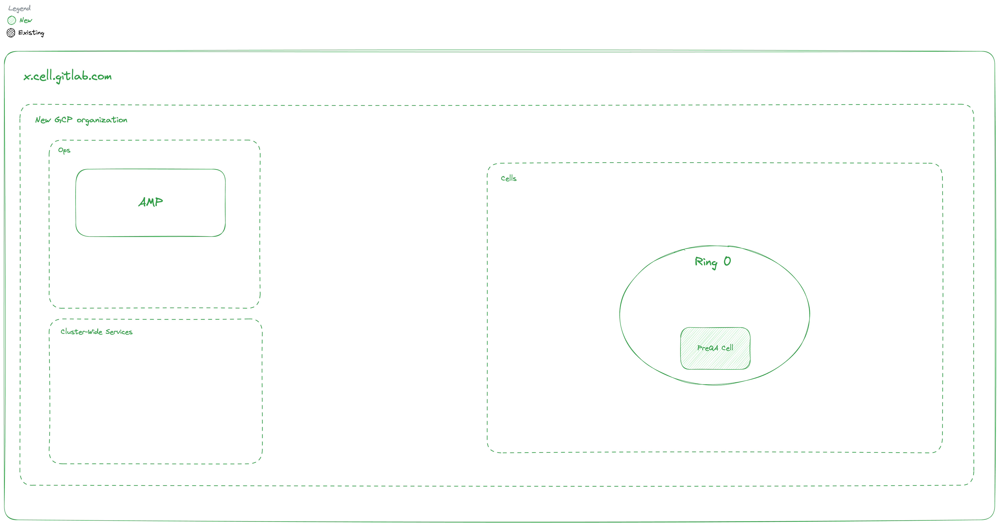
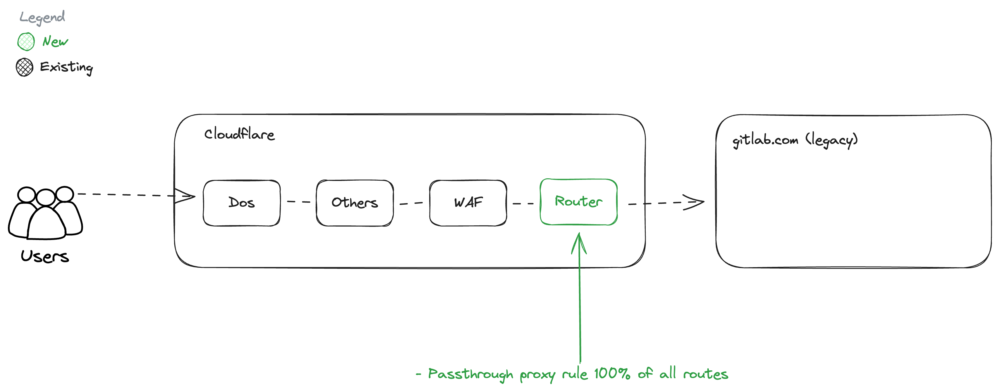
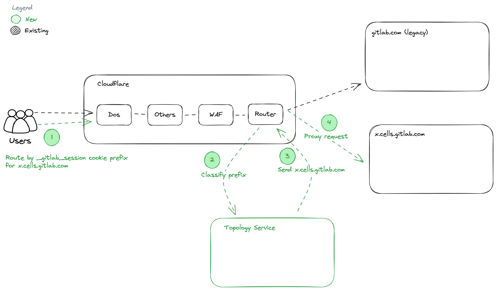
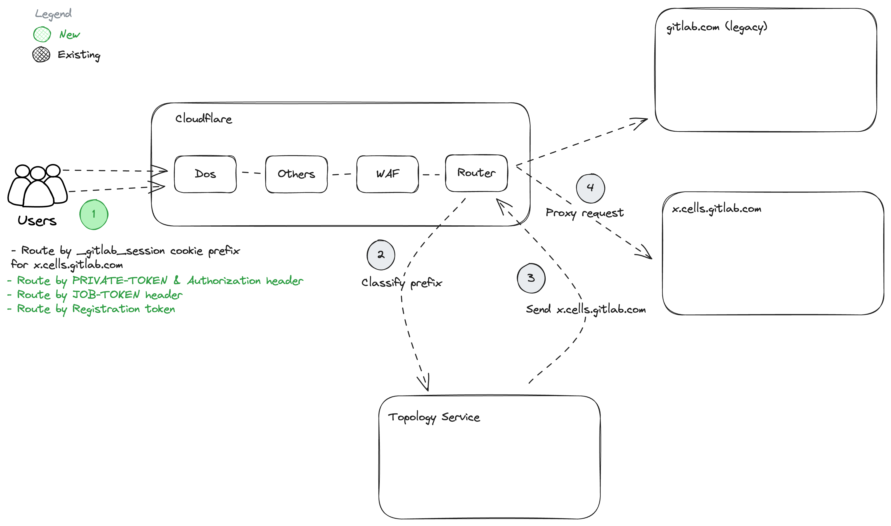

## Intro

Cells is a new architecture for our software as a service platform. This architecture is horizontally scalable, resilient, and provides a more consistent user experience. It may also provide additional features in the future, such as data residency control (regions) and federated features.

For more information about the goals of Cells, see [goals](https://docs.gitlab.com/ee/architecture/blueprints/cells/goals.html).

## Requirements and Architecture

Cells overall architecture [blueprint](https://docs.gitlab.com/ee/architecture/blueprints/cells/).

## Roadmap, Workstreams, and DRIs

### Roadmap

<table>
<tr>
<td>

[Cells 1.0](https://docs.gitlab.com/ee/architecture/blueprints/cells/iterations/cells-1.0.html)

</td>
<td>

[Cells 1.5](https://docs.gitlab.com/ee/architecture/blueprints/cells/iterations/cells-1.5.html)

</td>
<td>

[Cells 2.0](https://docs.gitlab.com/ee/architecture/blueprints/cells/iterations/cells-2.0.html)

</td>
</tr>
<tr>
<td>

- For internal customers only
- Organizations are private
- Users cannot interact with other Organizations (including GitLab Org)
- Groups and projects are private in the Organization
- For more details, see [Organizations on Cells 1.0](https://docs.gitlab.com/ee/architecture/blueprints/organization/index.html#organizations-on-cells-10)

</td>
<td>

- For existing/new customers of GitLab.com
- Organizations are private
- Existing users can interact with private Organizations on Secondary Cells
- Groups and projects are private in the Organization
- For more details, see [Organizations on Cells 1.5](https://docs.gitlab.com/ee/architecture/blueprints/organization/index.html#organizations-on-cells-15)

</td>
<td>

- Organizations are public or private
- Users can interact with other Organizations
- Groups and projects are private or public in the Organization
- For more details, see [Organizations on Cells 2.0](https://docs.gitlab.com/ee/architecture/blueprints/organization/index.html#organizations-on-cells-20)

</td>
</tr>
</table>

### DRIs and Stakeholders

<table>
<tr>
<td>

</td>
<td>Role</td>
<td>Responsibility</td>
</tr>
<tr>
<td>

[Sabrina Farmer](https://gitlab.com/sabrinafarmer)

</td>
<td>Executive Sponsor</td>
<td>

</td>
</tr>
<tr>
<td>

[Marin Jankovski](https://gitlab.com/marin)

</td>
<td>Senior Director of Engineering</td>
<td>

</td>
</tr>
<tr>
<td>

[Chun Du](https://gitlab.com/cdu1)

</td>
<td>Director of Engineering</td>
<td>

1. Liaison between project team and cross-functional engineering leaders
2. Coordinating temporary staffing arrangements within the Data Stores stage

</td>
</tr>
<tr>
<td>

[Nick Nguyen](https://gitlab.com/nhxnguyen)

</td>
<td>Senior Engineering Manager</td>
<td>

1. Coordinating staffing and unblocking groups in Data Stores
2. Drive cross-functional efforts in engineering
3. Report on Data Stores progress and mitigate risks

</td>
</tr>
<tr>
<td>

[Sissi Yao](https://gitlab.com/sissiyao)

</td>
<td>Tenant Scale Engineering Manager</td>
<td>

1. Status updates of Tenant Scale workstreams
2. Mitigate risks
3. Collaborate with Tenant Scale Product Manager on Organizations and Cells projects

</td>
</tr>
<tr>
<td>

[Joshua Lambert](https://gitlab.com/joshlambert)

</td>
<td>Director of Product Management </td>
<td>

1. Investment and staffing of Core Platform teams
2. Liaison between project team and cross functional product managers and product leaders
3. Escalation of product priorities competing with Cells
4. Decision maker for supported and un-supported features for each iteration of Cells

</td>
</tr>
<tr>
<td>

[Christina Lohr](https://gitlab.com/lohrc)

</td>
<td>Tenant Scale Product Manager</td>
<td>

1. Product definition, requirements, roadmap for Organization workstream within Tenant Scale
2. Product definition, requirements, roadmap for Cells workstreams within Tenant Scale
3. Point of contact to collaborate with product managers from other teams
4. Investment and staffing of Tenant Scale

</td>
</tr>
<tr>
<td>

[Darby Frey](https://gitlab.com/darbyfrey)

</td>
<td>Staff Fullstack Engineer, Expansion</td>
<td>

DRI of Expansion Software Development

</td>
</tr>

</table>

### Workstreams

<table>
<tr>
<td>

**Work stream**

</td>
<td>

**Engineering DRI**

</td>

<td>

**PM DRI**

</td>
</tr>

<tr>
<td>Application's Cell readiness</td>
<td>

[Kamil Trzciński](https://gitlab.com/ayufan)

</td>
<td>

[Josh Lambert](https://gitlab.com/joshlambert)

</td>
</tr>

<tr>
<td>Organization for Cells</td>
<td>

[Alex Pooley](https://gitlab.com/alex.pooley)

</td>
<td>

[Christina Lohr](https://gitlab.com/lohrc)

</td>
</tr>

<tr>
<td>Architecture</td>
<td>

[Kamil Trzciński](https://gitlab.com/ayufan)

</td>
<td>

[Josh Lambert](https://gitlab.com/joshlambert)

</td>
</tr>

<tr>
<td>Cells Services  (includes Router and Topology services)</td>
<td>

[Thong Kuah](https://gitlab.com/tkuah)

</td>
<td>

[Christina Lohr](https://gitlab.com/lohrc)

</td>
</tr>
<tr>

<td>Cell lifecycle automation and management</td>
<td>

[Steve Xuereb](https://gitlab.com/sxuereb)

</td>
<td>

[Christina Lohr](https://gitlab.com/lohrc)

</td>
</tr>

<tr>

<td>Observability</td>
<td>

[Rachel Nienaber](https://gitlab.com/rnienaber)

</td>
<td>

[Christina Lohr](https://gitlab.com/lohrc)

</td>
</tr>

<tr>
<td>Application Deployment</td>
<td>

[Dave Smith](https://gitlab.com/dawsmith)

</td>
<td>

[Sam Wiskow](https://gitlab.com/swiskow)

</td>
</tr>

<tr>
<td>Production readiness</td>
<td>

[Chun Du](https://gitlab.com/cdu1)

</td>
<td>

[Josh Lambert](https://gitlab.com/joshlambert)

</td>
</tr>
<tr>

<td>Operations</td>
<td>

[Rick Mar](https://gitlab.com/rmar1)

</td>
<td>

[Josh Lambert](https://gitlab.com/joshlambert)

</td>
</tr>

<tr>
<td>Performance validation of Cells</td>
<td>

[Andy Hohenner](https://gitlab.com/AndyWH)

</td>
<td>

[Christina Lohr](https://gitlab.com/lohrc)

</td>
</tr>
</table>

## Cells 1.0

All Cells 1.0 work is tracked under the [Cells 1.0 Epic](https://gitlab.com/groups/gitlab-org/-/epics/12383).
The Epic is split into multiple phases where each one represents a iteration to achieve Cells 1.0.
Some of these phases have dependencies over one another, and some can be run in parallel.

### Phase 1: PreQA Cell

Exit Criteria:

- New GCP organizations created.
- Break glass procedure.
- Ring definition exists.
- Cell provisioned using dedicated stack.
- Able to do configuration changes to Cell.
- Cell available at `xxx.cells.gitlab.com`.
- Cell doesn't handle data uniqueness.

[source](https://excalidraw.com/#json=DuwGFqR2LcS6k2TZlYu9u,LKDzUCdkiHLO11c3rgFVeQ)

Unblocks:

- [Phase 3](#phase-3-gitlabcom-https-session-routing): To provision runway deployment for Topology Service
- Delivery team: Start testing deploys on rings

Dependencies:

- None

Epic:

- <https://gitlab.com/groups/gitlab-com/gl-infra/-/epics/1293>

### Phase 2: GitLab.com HTTPS Passthrough Proxy

Exit Criteria:

- 100% of API traffic goes through router using passthrough proxy rule.
- 100% of Web traffic goes through router using passthrough proxy rule.
- 100% of Git HTTPS traffic goes through router using passthrough proxy rule.
- Requests meet [latency target](https://docs.gitlab.com/ee/architecture/blueprints/cells/http_routing_service.html#low-latency)
- registry.gitlab.com not proxied.

[source](https://excalidraw.com/#json=ymWufV5324javtKSrYiZW,5S-bkgtFS_yEIRxmVZ1rag)

Unblocks:

- [Phase 3](#phase-3-gitlabcom-https-session-routing): Router to be configured with additional rules in phase 3.

Dependencies:

- None

Epic:

- <https://gitlab.com/groups/gitlab-org/-/epics/12775>

### Phase 3: GitLab.com HTTPS Session Routing

Exit Criteria:

- PreQA Cell configured to generate `_gitlab_session` with prefix using rails config.
- Route `_gitlab_session` with matching prefix to PreQA Cell using TopologyService::Classify (REST only) with static config file.
- Continuous Delivery on Ring 0 with no rollback capabilities and doesn't block production deployments.
- Topology Service [Readiness Review](../production/readiness.md) for [Experiment](https://docs.gitlab.com/ee/policy/experiment-beta-support.html#experiment)
- Topology Service gRPC endpoint not implemented.

Unblocks:

- [Phase 4](phase-4-gitlab-com-https-token-routing)

Before/After:

[source](https://excalidraw.com/#json=z7-ihTQ69trj5vdpXZ-7V,k0NtksWZMRdaR-lHoH3JMQ)

Dependencies:

- [Phase 2](#phase-2-gitlabcom-https-passthrough-proxy): Passthrough proxy needs to be deployed.
- [Phase 1](#phase-1-preqa-cell): GCP organizations, Ring definition exists.

Epic:

- <https://gitlab.com/groups/gitlab-org/-/epics/14509>

### Phase 4: GitLab.com HTTPS Token Routing

Exit Criteria:

- Framework to generate routable tokens in Rails.
- Framework to classify routable tokens in HTTP Router.
- Topology Service being able to classify based on more criteria.
- Route Personal Access Tokens to different Cells using TopologyService::Classify.
- Support `PRIVATE-TOKEN:` and `Authorization:` HTTP headers for Personal Access Tokens, create issues for other to be solved in following phases.
- Each routing rule added should be covered with relevant e2e tests.
- Route Job Tokens and Runner Registration to different Cells using TopologyService::Classify.

Before/After:

[source](https://excalidraw.com/#json=rWNPd77fLEhwZpERiUYLA,Tb-v5Hen6NomaopcmE9_mw)

Epic:

- <https://gitlab.com/groups/gitlab-org/-/epics/14510>

## Communication

### Slack Channels

- [#f_cells_and_organizations (internal only)](https://gitlab.enterprise.slack.com/archives/C0609EXHX6F): Regular communication
- [#cto (internal only)](https://gitlab.enterprise.slack.com/archives/C9X79MNJ3): Weekly program status update

### Meetings

- Cells Standup weekly [Meeting notes (internal only)](https://docs.google.com/document/d/1hlGGrgZFWMyHCUcML6wYgu7iWwEL6uUMs_f9DnCzNDo)

### Status updates

- Weekly "Cells & Organizations Status Update - [yyyy-mm-dd]" issues in this [project](https://gitlab.com/gitlab-org/core-platform-section/status-update/-/issues/?sort=created_date&state=all&label_name%5B%5D=cells-organizations-status)
- Weekly status updates in Slack [#cto channel (internal only)](https://gitlab.enterprise.slack.com/archives/C9X79MNJ3) channel

## Additional Information

### Cells Fast Boot 2024

We held a Cells Fast Boot in Dublin, Ireland, between 2024-04-23 and 2024-04-24. Below are the artifacts from the event.

#### Agenda, Slides, and Videos

Please use the `Unfiltered` Google account to watch video recordings.

1. [Main agenda (internal only)](https://docs.google.com/document/d/1m5w8sVG5kCvZF0mg7h7HnKzVGREhTuH6e1FRhRlMjns/edit?usp=sharing)
1. Introductions, overview, and logistics: [Agenda (internal only)](https://docs.google.com/document/d/18gqKRORUE8BRULkqfBAv3FZk4yPpRw6BoqmGNUwKm50/edit?usp=sharing)
1. Cells Services - Global Service: [Agenda (internal only)](https://docs.google.com/document/d/1fTeiS6ksvhxJggui_DnCZ9tl5xIN23IZGrqgiqzB5JU/edit?usp=sharing), [Slides (internal only)](https://docs.google.com/presentation/d/12NlfOwolRf10DSLszQi9NjxFy0UUKc2XVC2kYW0HFGk), [Video (internal only)](https://www.youtube.com/watch?v=cNKsNda9Bkc)
1. Cells Services - Routing: [Agenda (internal only)](https://docs.google.com/document/d/1Z3fhilM5wYhLBhghqXeJJCLaO57YeTVdJROrTSgTuDg/edit?usp=sharing), [Slides (internal only)](https://docs.google.com/presentation/d/1wad5IOoXIPkLlVeJdzWnzGmpN_CvwRQi9cMesWj-kz0/edit?usp=sharing), [Video (internal only)](https://www.youtube.com/watch?v=1TgbM-qlQOM)
1. Application Readiness - Organizations and Users: [Agenda (internal only)](https://docs.google.com/document/d/18TH2FraEp2ISSlNOl4asBd3GYQv_homXl4jsLebveJ0/edit?usp=sharing)
1. Application Readiness - Dependencies and OKR alignments: [Agenda (internal only)](https://docs.google.com/document/d/1ySJDT2WQCsndCQikDFAN3VMDadvJwLg000qAI-u3M0I/edit?usp=sharing)
1. Deployment: [Agenda (internal only)](https://docs.google.com/document/d/1Pb280b90MkMNl7TU3i09hGZWAbBZmTUFATRoVFvssiE/edit?usp=sharing), [Slides (internal only)](https://docs.google.com/presentation/d/1rYQup9yc0UEBBrxPkVTDJ9ihzgtiLjmuGYOjZ68TZGs/edit?usp=sharing), [Video (internal only)](https://www.youtube.com/watch?v=Pf5BOMJ0A-0)
1. Provisioning: [Agenda (internal only)](https://docs.google.com/document/d/1Pb280b90MkMNl7TU3i09hGZWAbBZmTUFATRoVFvssiE/edit?usp=sharing)
1. Observability and Runners: [Agenda (internal only)](https://docs.google.com/document/d/1Pg7CKao-StGEbJQ-BEeF6x9xp-Ttux-NeiuvGmBstrQ/edit?usp=sharing)
1. Security: [Agenda (internal only)](https://docs.google.com/document/d/18a_q-g-l5RoUjwsMBp6rRHdvRT4wvD1_iBtwej8m4-M/edit?usp=sharing), [Slides (internal only)](https://docs.google.com/presentation/d/1ImP9KxwmMoZxUjYdoIz3pdPCbyUSTdhdn7JjWLK1tPE/edit?usp=drive_link), [Video (internal only)](https://drive.google.com/file/d/1qTQJZ3gEKTzEzhzb9yUygsqoy8WnQgM3/view?usp=drive_link)
1. Disaster Recovery: [Agenda (internal only)](https://docs.google.com/document/d/1eYFJAF3X_5kIgkBR-j3W_Ug3IMSK85vozCyrzF5gCao/edit?usp=sharing), [Slides (internal only)](https://docs.google.com/presentation/d/1JhWo_e6w_HYYwYCd2yN5vttntMS57aIDhPADEQD1aCw/edit?usp=sharing), [Video (internal only)](https://youtu.be/uDLDpwLYY3M)
1. Cells Mover and Isolation: [Agenda (internal only)](https://docs.google.com/document/d/1ySJDT2WQCsndCQikDFAN3VMDadvJwLg000qAI-u3M0I/edit?usp=sharing)
1. Scalability Headroom and Timeline: [Agenda (internal only)](https://docs.google.com/document/d/1XawTKX_MPM89Oyl_u3-9X1-A8QsOsZRlg8LB6ormP_8/edit?usp=sharing)

#### Decisions

1. No external customers on Cells 1.0, internal dogfooding only. Cells 1.x is the target to onboard new or existing external customers.

#### Artifacts

1. Day 1 recording: [Part 1 (internal only)](https://youtu.be/Y5mOBWqGCTQ), [Part 2 (internal only)](https://youtu.be/JtGoKK9NonE)
1. [Day 2 recording (internal only)](https://youtu.be/MM4Py3Ldnlg)
1. [Database breakout recording (internal only)](https://drive.google.com/drive/folders/13ZrWpPad_jg5ua7ocZvJ0b-XeWIp4uUy?usp=drive_link)
1. [Organizations breakout recording (internal only)](https://youtu.be/KqF1UARbMHA)
