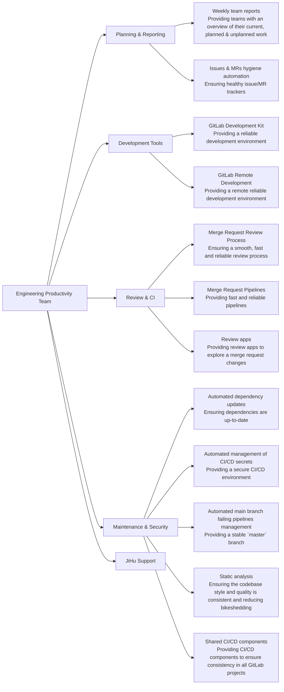

## Child Pages

[Issue triage](/handbook/engineering/infrastructure/engineering-productivity/issue-triage/)
{.h4}

[Wider Community Merge Request triage](/handbook/engineering/infrastructure/engineering-productivity/merge-request-triage/)
{.h4}

[Project Management](/handbook/engineering/infrastructure/engineering-productivity/project-management/)
{.h4}

[Triage Operations](/handbook/engineering/infrastructure/engineering-productivity/triage-operations/)
{.h4}

## Mission

- Constantly improve efficiency for our entire engineering team, to ultimately increase value for our customer.
- Measure what matters: quality of life, efficiency, and toil reduction improvements with quantitative and qualitative measures.
- Build partnerships across organizational boundaries to deliver broad efficiency improvements.

## Team

### Members

| Team Members                                     | Role                                                |
|------------------------------------------------- | --------------------------------------------------  |
|                | Acting Engineering Manager                          |
|            | Senior Backend Engineer, Engineering Productivity   |
|          | Senior Backend Engineer, Engineering Productivity   |
|              | Senior Backend Engineer, Engineering Productivity   |
|             | Senior Backend Engineer, Engineering Productivity   |
|            | Backend Engineer, Engineering Productivity          |
|            | Staff Backend Engineer, Engineering Productivity    |
|            | Principal Engineer, Infrastructure                  |


### Stable Counterpart

| Person | Role |
| --- | --- |
|  | [GDK Project Stable Counterpart](/handbook/engineering/infrastructure/engineering-productivity/gdk/), Application Security |

## Core Responsibilities



* **See it and find it**: Build automated measurements and dashboards to gain insights into the productivity of the Engineering organization to identify opportunities for improvement.
  * Implement new measurements to provide visibility into improvement opportunities.
  * Collaborate with other Engineering teams to provide visualizations for measurement objectives.
  * Improve existing performance indicators.
* **Do it for internal team**: Increase contributor and developer productivity by making measurement-driven improvements to the development tools / workflow / processes, then monitor the results, and iterate.
  * Identify and implement quantifiable improvement opportunities with proposals and hypothesis for metric improvements.
  * Automated [merge request quality checks](https://docs.gitlab.com/ee/development/dangerbot.html) and [code quality checks](https://docs.gitlab.com/ee/development/contributing/style_guides.html).
  * [GitLab project pipeline](https://docs.gitlab.com/ee/development/pipelines/) improvements to improve efficiency, quality or duration.
* **Dogfood use**: Dogfood GitLab product features to improve developer workflow and provide feedback to product teams.
  * Use new features from related product groups (Analytics, Monitor, Testing).
  * Improve usage of [Review apps](https://docs.gitlab.com/ee/development/testing_guide/review_apps.html) for GitLab development and testing.
* **Engineering support**:
  * [`#master-broken`](/handbook/engineering/workflow/#broken-master) pipeline monitoring.
  * KPI corrective actions such as [Review Apps stabilization](/handbook/engineering/infrastructure/performance-indicators/#review-app-deployment-success-rate).
  * [Merge Request Coach](/job-families/expert/merge-request-coach/) for ~"Community contribution" merge requests.
* **Engineering workflow**: Develop automated processes for improving label classification hygiene in support of product and Engineering workflows.
  * [Automated issues and merge requests triage](/handbook/engineering/infrastructure/engineering-productivity/triage-operations/).
  * Improvements to the labelling classification and automation used to support Engineering measurements.
  * See the [`gitlab-triage` Ruby gem](https://gitlab.com/gitlab-org/ruby/gems/gitlab-triage), and [Triage operations](https://gitlab.com/gitlab-org/quality/triage-ops) projects for examples.
* **Do it for wider community**: Increase efficiency for wider GitLab Community contributions.
* **Dogfood build**: Enhance and add new features to the GitLab product to improve engineer productivity.


## KPIs

[Infrastructure Performance Indicators](/handbook/engineering/infrastructure/performance-indicators/) are our single source of truth
- [Master Pipeline Stability](/handbook/engineering/infrastructure/performance-indicators/#master-pipeline-stability)
- [Merge request pipeline duration](/handbook/engineering/infrastructure/performance-indicators/#merge-request-pipeline-duration)

### PIs

- [Review App deployment success rate](/handbook/engineering/infrastructure/performance-indicators/#review-app-deployment-success-rate)
- [Time to First Failure P80](/handbook/engineering/infrastructure/performance-indicators/#time-to-first-failure-p80)
- [Time to First Failure](/handbook/engineering/infrastructure/performance-indicators/#time-to-first-failure)

### Shared

- [Quality Handbook MR Rate](/handbook/engineering/infrastructure/performance-indicators/#quality-handbook-mr-rate)
- [Quality Department Promotion Rate](/handbook/engineering/infrastructure/performance-indicators/#quality-department-promotion-rate)
- [Quality Department Discretionary Bonus Rate](/handbook/engineering/infrastructure/performance-indicators/#quality-department-discretionary-bonus-rate)

## OKRs

Objectives and Key Results (OKRs) help align our sub-department towards what really matters. These happen quarterly and are based on company OKRs. We follow the OKR process defined [here](/handbook/company/okrs/#okr-process-at-gitlab).

Here is an [overview](https://gitlab.com/gitlab-com/gitlab-OKRs/-/issues/?sort=created_date&state=opened&type%5B%5D=objective&label_name%5B%5D=Engineering%20Productivity&first_page_size=100) of our current OKRs.

### Communication

| Description | Link |
| --- | --- |
| **GitLab Team Handle** | [`@gl-quality/eng-prod`](https://gitlab.com/gl-quality/eng-prod) |
| **Slack Channel** | [`#g_engineering_productivity`](https://gitlab.slack.com/archives/CMA7DQJRX) |
| **Team Boards** | [Team Board](https://gitlab.com/groups/gitlab-org/-/boards/978615) & [Priority Board](https://gitlab.com/groups/gitlab-org/-/boards/1333450) |
| **Issue Tracker** | [`gitlab-org/quality/engineering-productivity/team`](https://gitlab.com/gitlab-org/quality/engineering-productivity/team/-/issues/) |

### Office hours

Engineering productivity has monthly office hours on the 3rd Wednesday of the month at 3:00 UTC (20:00 PST) on even months (e.g February, April, etc) open for anyone to add topics or questions to the [agenda](https://docs.google.com/document/d/1e1EXcOQl0y9ovtrnJfTKDi83QIwJ_UXMzCBsWVyY1_s/edit). Office hours can be found in the [GitLab Team Meetings calendar](/handbook/tools-and-tips/#gitlab-team-meetings-calendar)

### Meetings

Engineering Productivity has [weekly team meeting ](https://docs.google.com/document/d/1yzHuosvykzb_kaldjGP9I6wxpNpMXdNEvEFBkHyZpXs/edit#) in two parts (EMEA / AMER) to allow for all team members to collaborate in times that work for them.

- Part 1 is Tuesdays 11:00 UTC, 04:00 PST
- Part 2 is Tuesdays 22:00 UTC, 15:00 PST

### Work prioritization

The Engineering Productivity team has diverse responsibilities and reactive work. Work is categorized as planned and reactive.

### Guiding principles

- We focus on OKRs, corrective actions and preventative work.
- We adhere to the general release milestones like %x.y.
- We are ambitious with our targeted planned work per milestone. These targets are not reflective of a commitment. Reactive work load will ebb and flow and we do not expected to accomplish everything planned for the current milestone.
- [Priority labels](/handbook/engineering/infrastructure/engineering-productivity/issue-triage/#priority) are used to indicate relative priority for a milestone.

### Weighting

We follow the [department weighting guidelines](/handbook/engineering/infrastructure/test-platform/#weights) to relatively weight issues over time to understand a milestone velocity and increase predictability.

When weighting, think about knowns and complexity related to recently completed work. The goal with weighting is to allow for some estimation ambiguity that allows for a consistent predictable flow of work each milestone.

### Prioritization activities

| When | Activity | DRI |
| --- | --- | --- |
| Weekly | Assign `~priority::1`, `~priority::2` issues to a milestone | Engineering Productivity Engineering Manager |
| Weekly | Weight issues identified with `~"needs weight"` | Engineering Productivity Backend Engineer |
| Weekly | Prioritize all `~"Engineering Productivity"` issues | Engineering Productivity Engineering Manager |
| 2 weeks prior to milestone start | Milestone planned work is identified and scheduled | Engineering Productivity Engineering Manager |
| 2 weeks prior to milestone start | Provide feedback on planned work | Engineering Productivity team |
| 1 week prior to milestone start | Transition any work that is not in progress for current milestone to upcoming milestone | Engineering Productivity Engineering Manager |
| 1 week prior to milestone start | Adjust planned work for upcoming milestone | Engineering Productivity Engineering Manager |
| 1 week prior to milestone start | Final adjustments to planned scope | Engineering Productivity team |
| During milestone | Adjust priorities and scope based on newly identified issues and reactive workload | Engineering Productivity Engineering Manager |

### Projects

The Engineering Productivity team recently reviewed (2023-05-19) all our projects and discussed relative priority. Aligning this with our business goals and priorities is very important. The list below is ordered based on aligned priorities and includes primary domain experts for communication as well as a documentation reference for self-service.

| Project | Domain Knowledge | Documentation |
| ------- | ------------------------------------------ | ----- |
| GitLab CI Pipeline configuration optimization and stability | Jen-Shin, David, Nao | [Pipelines for the GitLab project](https://docs.gitlab.com/ee/development/pipelines/index.html) |
| Triaging master-broken | Jenn, Nao | [Broken Master](https://about.gitlab.com/handbook/engineering/workflow/#broken-master) |
| GitLab Development Kit (GDK) continued development | Nao, Peter | [GitLab Development Kit](https://gitlab.com/gitlab-org/gitlab-development-kit/) |
| Triage operations for issues, merge requests, community contributions | Jenn, Alina | [triage-ops](https://gitlab.com/gitlab-org/quality/triage-ops/) |
| Review Apps | David, Rémy | [Using review apps in the development of GitLab](https://docs.gitlab.com/ee/development/testing_guide/review_apps.html) |
| Triage engine, used by GitLab triage operations | Jen-Shin, Rémy | [GitLab Triage](https://gitlab.com/gitlab-org/ruby/gems/gitlab-triage/) |
| Danger & Dangerfiles (includes Reviewer roulette) for shared Danger rules and plugins | Rémy, Jen-Shin, Peter | [`gitLab-dangerfiles` Ruby gem](https://gitlab.com/gitlab-org/ruby/gems/gitlab-dangerfiles) for shared [Danger](https://docs.gitlab.com/ee/development/dangerbot.html#danger-bot) rules and plugins |
| JiHu | Jen-Shin | [JiHu Support](https://about.gitlab.com/handbook/ceo/chief-of-staff-team/jihu-support/) |
| Development department metrics for measurements of Quality and Productivity | Jenn, Rémy | [Development Department Performance Indicators](https://about.gitlab.com/handbook/engineering/development/performance-indicators/) |
| RSpec Profiling Statistics for profiling information on RSpec tests in CI | Peter | [rspec_profiling_stats](https://gitlab.com/gitlab-org/rspec_profiling_stats) |
| RuboCop & shared RuboCop cops | Peter | [`gitLab-styles` Ruby gem](https://gitlab.com/gitlab-org/ruby/gems/gitlab-styles) for shared [RuboCop cops](https://docs.gitlab.com/ee/development/contributing/style_guides.html#ruby-rails-rspec) |
| Feature flag alert for reporting on GitLab feature flags | Rémy | [Gitlab feature flag alert](https://gitlab.com/gitlab-org/gitlab-feature-flag-alert) |
| Chatops (especially for feature flags toggling) | Rémy | [Chatops scripts for managing GitLab.com from Slack](https://gitlab.com/gitlab-com/chatops) |
| CI/CD variables, Triage ops, and Internal workspaces infrastructure | David, Rémy | [Engineering Productivity infrastructure](https://gitlab.com/gitlab-org/quality/engineering-productivity-infrastructure) |
| Tokens management | Rémy | ["Rotating credentials" runbook](https://gitlab.com/gitlab-org/quality/engineering-productivity/team/-/blob/main/runbooks/rotating-credentials.md) |
| Gems management | Rémy | [Rubygems committee project](https://gitlab.com/gitlab-dependency-committees/rubygems-committee) |
| Shared CI/CD config & components | David, Rémy | [`gitlab-org/quality/pipeline-common`](https://gitlab.com/gitlab-org/quality/pipeline-common) and [`gitlab-org/components`](https://gitlab.com/gitlab-org/components) |
| Dependency management (Gems, Ruby, Vue, etc.) | Jen-Shin, Peter | [Renovate GitLab bot](https://gitlab.com/gitlab-org/frontend/renovate-gitlab-bot) |

### Metrics

The Engineering Productivity team creates metrics in the following sources to aid in operational reporting.

- [Engineering Productivity Collection](https://10az.online.tableau.com/#/site/gitlab/collections/fc447e0e-d368-4bc2-a8c6-ac782318ab96)
- [Broken Master Pipeline Root Cause Analysis](https://10az.online.tableau.com/#/site/gitlab/workbooks/2296993/views)
- [Time to First Failure](https://10az.online.tableau.com/#/site/gitlab/workbooks/2300061/views)
- [Flaky test issues](https://10az.online.tableau.com/#/site/gitlab/workbooks/2283052/views)
- [Test Intelligence Accuracy](https://10az.online.tableau.com/#/site/gitlab/views/DRAFTTestIntelligenceAccuracy/TestIntelligenceAccuracy)
- [Engineering Productivity Pipeline Durations](https://10az.online.tableau.com/#/site/gitlab/workbooks/2312755/views)
- [Engineering Productivity Jobs Durations](https://10az.online.tableau.com/#/site/gitlab/views/DRAFTEP-JobsDurations/EP-JobsDurations)
- Engineering Productivity Package And QA Durations (to be replaced in Tableau)
- GDK - Jobs Durations ([to be replaced in Tableau](https://gitlab.com/gitlab-data/tableau/-/issues/253#note_1730258820))
- [Issue Types Detail](https://10az.online.tableau.com/#/site/gitlab/workbooks/2203014/views)
- [GitLab-Org Native Insights](https://gitlab.com/groups/gitlab-org/-/insights)
- [Review Apps monitoring dashboard](https://app.google.stackdriver.com/dashboards/6798952013815386466?project=gitlab-review-apps)
- Triage Reactive monitoring dashboards
  - [Overview dashboard](https://console.cloud.google.com/monitoring/dashboards/builder/e3e9d8fc-54cd-4a98-b4a3-e81f01d37e26?project=gitlab-qa-resources&dashboardBuilderState=%257B%2522editModeEnabled%2522:false%257D&timeDomain=1w)
  - [Processors dashboard](https://console.cloud.google.com/monitoring/dashboards/builder/3338d66b-649c-4ea9-aec9-14ffba96c25f?project=gitlab-qa-resources&dashboardBuilderState=%257B%2522editModeEnabled%2522:false%257D&timeDomain=1w)

### Communication guidelines

The Engineering Productivity team will make changes which can create notification spikes or new behavior for
GitLab contributors. The team will follow these guidelines in the spirit of [GitLab's Internal Communication Guidelines](/handbook/people-group/employment-branding/people-communications/).

#### Pipeline changes

##### Critical pipeline changes

Pipeline changes that have the potential to have an impact on the GitLab.com infrastructure should follow the [Change Management](/handbook/engineering/infrastructure/change-management) process.

Pipeline changes that meet the following criteria must follow the [Criticality 3](/handbook/engineering/infrastructure/change-management/#criticality-3) process:

- update to the [`cache-repo` job](https://gitlab.com/gitlab-org/gitlab/-/blob/master/.gitlab/ci/cache-repo.gitlab-ci.yml) job

These kind of changes [led to production issues in the past](https://gitlab.com/gitlab-com/gl-infra/production/-/issues/3013).

##### Non-critical pipeline changes

The team will communicate significant pipeline changes to [`#development`](https://gitlab.slack.com/messages/C02PF508L) in Slack and the Engineering Week in Review.

Pipeline changes that meet the following criteria will be communicated:

- addition, removal, renaming, parallelization of jobs
- changes to the conditions to run jobs
- changes to pipeline DAG structure

Other pipeline changes will be communicated based on the team's discretion.

#### Automated triage policies

Be sure to give a heads-up to `#development`,`#eng-managers`,`#product`, `#ux` Slack channels
and the Engineering week in review when an automation is expected to triage more
than 50 notifications or change policies that a large stakeholder group use (e.g. team-triage report).

### Asynchronous Issue Updates

Communicating progress is important but status doesn't belong in one on ones as it can be more appropriately communicated with a broader audience using other methods. The "standup" model used by a lot of organizations practicing scrum assumes a certain time of day for those to happen. In the context of a timezone distributed team, there is no "9am" that the team shares. Additionally, the act of losing and gaining context after completing work for the day only to gain it again to share a status update is context switching. The intended audience of the standup model assumes that it's just the team but in GitLab's model, that means folks need to be aware of where this is being communicated (slack, issues, other). Since this information isn't available to the intended audience, the information needs to be duplicated which at worst means there's no single source of truth and at a minimum means copy pasting information.

The proposal is to trial using an Asynchronous Issue Update model, similar to [what the Package Group uses](/handbook/engineering/development/ops/package/#async-issue-updates). This process would replace the existing daily standup update we post in Slack with `Geekbot`. The time period for the trial would be a milestone or two, depending on feedback cycles.

The async daily update communicates the progress and confidence using an issue comment and the milestone health status using the Health Status field in the issue. A daily update may be skipped if there was no progress. Merge requests that do not have a related issue should be updated directly. It's preferable to update the issue rather than the related merge requests, as those do not provide a view of the overall progress. Where there are blockers or you need support, Slack is the preferred space to ask for that. Being blocked or needing support are more urgent than email notifications allow.

When communicating the health status, the options are:
- `on track` - when the issue is progressing as planned
- `needs attention` - when the issue requires attention or intervention to keep it on schedule
- `at risk` - when there is a risk the issue will not be completed according to schedule

The async update comment should include:
- what percentage complete the work is, in other words, how much work is done to put all the required MRs in review
- the confidence of the person that their estimate is correct
- notes on what was done and/or if review has started
- it could be good to specify the relevant dependencies in the update, if there are multiple people working on it

Example:
```
**Status**: 20% complete, 75% confident

Expecting to go into review tomorrow.
```

Include one entry for each associated MR

Example:
```
**Issue status**: 20% complete, 75% confident

Expecting to go into review tomorrow.

**MR statuses**:

- !11111+ - 80% complete, 99% confident - docs update - need to add one more section
- !21212+ - 10% complete, 70% confident - api update - database migrations created, working on creating the rest of the functionality next
```

##### How to measure confidence?

Ask yourself, how confident am I that my % of completeness is correct?.

For things like bugs or issues with many unknowns, the confidence can help communicate the level of unknowns. For example, if you start a bug with a lot of unknowns on the first day of the milestone you might have low confidence that you understand what your level of progress is.
Your confidence in the work may go down for whatever reason, it's acceptable to downgrade your confidence. Consideration should be given to retrospecting on why that happened.
#### Weekly Epic updates

A weekly update should be added to epics you're assigned to and/or are actively working on. The update should provide an overview of the progress across the feature. Consider adding an update if epic is blocked, if there are unexpected competing priorities, and even when not in progress, what is the confidence level to deliver by the expected delivery date. A weekly update may then be skipped until the situation changes. Anyone working on issues assigned to an epic can post weekly updates.

The epic updates communicate a high level view of progress and status for quarterly goals using an epic comment. It does not need to have issue or MR level granularity because that is part of each issue updates.

The weekly update comment should include:
- Status: ok, so-so, bad? Is there something blocked in the general effort?
- How much of the total work is done? How much is remaining? Do we have an ETA?
- What's your confidence level on the completion percentage?
- What is next?
- Is there something that needs help/support? (tag specific individuals so they know ahead of time)

##### Examples

Some good examples of epic updates that cover the above aspects:
- <https://gitlab.com/groups/gitlab-org/-/epics/8628#note_1090732793>
- <https://gitlab.com/groups/gitlab-org/-/epics/5152#note_1029337901>


## Test Intelligence

As the owner of [pipeline configuration](https://docs.gitlab.com/ee/development/pipelines/index.html) for the [GitLab project](https://gitlab.com/gitlab-org/gitlab), the Engineering Productivity team has adopted several test intelligence strategies aimed to improve pipeline efficiency with the following benefits:
- Shortened feedback loop by prioritizing tests that are most likely to fail
- Faster pipelines to scale better when Merge Train is enabled

These strategies include:
- Predictive test jobs via test mapping
- Fail-fast job
- Re-run previously failed tests early
- Selective jobs via pipeline rules
- Selective jobs via labels

#### Predictive test jobs via test mapping

Tests that provide coverage to the code changes in each merge request are most likely to fail. As a result, merge request pipelines for the [GitLab project](https://gitlab.com/gitlab-org/gitlab) run only the predictive set of tests by default. These include:
- [RSpec predictive jobs](https://docs.gitlab.com/ee/development/pipelines/#rspec-predictive-jobs) which runs relevant RSpec tests that are mapped to the code changes
- [Jest predictive jobs](https://docs.gitlab.com/ee/development/pipelines/#jest-predictive-jobs) which runs relevant Jest tests that are mapped to the code changes

See <https://docs.gitlab.com/ee/development/pipelines/index.html#predictive-test-jobs-before-a-merge-request-is-approved> for more information.

#### Fail-fast job

There is a [fail-fast job](https://docs.gitlab.com/ee/development/pipelines/#fail-fast-job-in-merge-request-pipelines) in each merge request pipeline aimed to run all the RSpec tests that provide coverage for the code changes, hence are most likely to fail. It uses the same [test_file_finder](https://gitlab.com/gitlab-org/ruby/gems/test_file_finder) gem for test mapping. The job provides faster feedback by running early and stops the rest of the pipeline right away if any of the fail-fast job tests fail.
Take a look at this [youtube video](https://www.youtube.com/watch?v=FCCbxZky5Nk) for details on how [GitLab](https://gitlab.com/gitlab-org/gitlab) implements the fail-fast job with test_file_finder.
Note that the current design only works with low-impacting merge requests which are only mapped to a small set of tests. If there is a large number of tests that are likely to fail for a merge request, putting them in a single job is not feasible and could result in a long-running bottleneck which defeats its purpose.

See <https://docs.gitlab.com/ee/development/pipelines/index.html#fail-fast-job-in-merge-request-pipelines> for more information.

Premium GitLab customers, who wish to incorporate the `Fail-Fast job` into their Ruby projects, can set it up with our [Verify/Failfast](https://docs.gitlab.com/ee/ci/testing/fail_fast_testing.html) template.

#### Re-run previously failed tests early

Tests that previously failed in a merge request are likely to fail again, so they provide the most urgent feedback in the next run.
To grant these tests the highest priority, the [GitLab](https://gitlab.com/gitlab-org/gitlab) pipeline [prioritizes previously failed tests by re-running them early](https://docs.gitlab.com/ee/development/pipelines/#re-run-previously-failed-tests-in-merge-request-pipelines) in a dedicated job, so it will be one of the first jobs to fail if attention is needed.

See <https://docs.gitlab.com/ee/development/pipelines/index.html#re-run-previously-failed-tests-in-merge-request-pipelines> for more information.

#### Selective jobs via pipeline rules

The GitLab pipeline consists of hundreds of jobs, but not all are necessary for each merge request. For example, a merge request with only changes to documenation files do not need to run any backend tests, so we can exclude all backend test jobs from the pipeline.
See [specify-when-jobs-run-with-rules](https://docs.gitlab.com/ee/ci/jobs/job_control.html#specify-when-jobs-run-with-rules) for how to include/exclude CI jobs based on file changes.
Most of the pipeline rules for the [GitLab project](https://gitlab.com/gitlab-org/gitlab) can be found in <https://gitlab.com/gitlab-org/gitlab/-/blob/master/.gitlab/ci/rules.gitlab-ci.yml>.

#### Selective jobs via labels

Developers can add labels to run jobs in addition to the ones selected by the pipeline rules. Those labels start with `pipeline:` and multiple can be applied. A few examples that people commonly use:

- `~"pipeline:run-all-rspec"`
- `~"pipeline:run-all-jest"`
- `~"pipeline:run-as-if-foss"`
- `~"pipeline:run-as-if-jh"`
- `~"pipeline:run-praefect-with-db"`
- `~"pipeline:run-single-db"`

See [docs](https://docs.gitlab.com/ee/development/pipelines/) for when to use these pipeline labels.

## Experiments

This is a list of Engineering Productivity experiments where we identify an opportunity, form a hypothesis and experiment to test the hypothesis.

| Experiment | Status | Hypothesis | Feedback Issue or Findings |
| --- | --- | --- | --- |
| [Automatic issue creation for test failures](https://gitlab.com/gitlab-org/quality/engineering-productivity/team/-/issues/182) | Complete | The goal is to track each failing test in `master` with an issue, so that we can later automatically quarantine tests. | [Feedback issue](https://gitlab.com/gitlab-org/quality/engineering-productivity/team/-/issues/182). |
| [Always run predictive jobs for fork pipelines](https://gitlab.com/gitlab-org/quality/team-tasks/-/issues/1170) | Complete | The goal is to reduce the compute minutes consumed by fork pipelines. The "full" jobs only run for canonical pipelines (i.e. pipelines started by a member of the project) once the MR is approved. | |
| [Retry failed specs in a new process after the initial run](https://gitlab.com/gitlab-org/quality/team-tasks/-/issues/1148) | Complete | Given that a lot of flaky tests are unreliable due to previous test which are affecting the global state, retrying only the failing specs in a new RSpec process should result in a better overall success rate. | [Results show that this is useful](https://gitlab.com/gitlab-org/quality/team-tasks/-/issues/1148#note_914106156). |
| [Experiment with automatically skipping identified flaky tests](https://gitlab.com/gitlab-org/quality/team-tasks/-/issues/1069) | Complete - Reverted | Skipping flaky tests should reduce the number of false broken `master` and increase the `master` success rate. | We found out that it can actually break `master` in some cases, so we reverted the experiment with [`gitlab-org/gitlab!111217`](https://gitlab.com/gitlab-org/gitlab/-/merge_requests/111217). |
| [Experiment with running previously failed tests early](https://gitlab.com/gitlab-org/gitlab/-/issues/333857) | Complete | We have not noticed a significant improvement in feedback time due to other factors impacting our Time to First Failure metric. | |
| [Store/retrieve tests metadata in/from pages instead of artifacts](https://gitlab.com/gitlab-org/gitlab/-/issues/335675) | Complete | We're only interested in the latest state of these files, so using Pages makes sense here. This simplifies the logic to retrieve the reports and reduce the load on GitLab.com's infrastructure. | This has been [enabled since 2022-11-09](https://gitlab.com/gitlab-org/gitlab/-/issues/377423#note_1166315874). |
| [Reduce pipeline cost by reducing number of rspec tests before MR approval](https://gitlab.com/gitlab-org/gitlab/-/issues/336063) | Complete | Reduce the CI cost for GitLab pipelines by running the most applicable rspec tests for changes prior to approval | Improvements needed to [identify and resolve selective test gaps](https://gitlab.com/groups/gitlab-org/quality/engineering-productivity/-/epics/6) as this impacted pipeline stability. |
| [Enabling developers to run failed specs locally](https://gitlab.com/gitlab-org/gitlab/-/merge_requests/58569) | Complete | Enabling developers to run failed specs locally will lead to less pipelines per merge request and improved productivity from being able to fix regressions more quickly | [Feedback issue](https://gitlab.com/gitlab-org/gitlab/-/issues/327660). |
| [Use dynamic analysis to streamline test execution](https://gitlab.com/gitlab-org/gitlab/-/issues/222369) | Complete | Dynamic analysis can reduce the amount of specs that are needed for MR pipelines without causing significant disruption to master stability | [Miss rate of 10%](https://gitlab.com/gitlab-org/gitlab/-/issues/222369#note_480768617) would cause a large impact to master stability. Look to leverage dynamic mapping with local developer tooling. Added [documentation](https://docs.gitlab.com/ee/development/pipelines/index.html#rspec-predictive-jobs) from the experiment. |
| [Using timezone for Reviewer Roulette suggestions](https://gitlab.com/gitlab-org/gitlab/-/merge_requests/34862) | Complete - Reverted | Using timezone in Reviewer Roulette suggestions will lead to a reduction in the mean time to merge | Reviewer Burden was inconsistently applied and specific reviewers were getting too many reviews compared to others. More details in the [experiment issue](https://gitlab.com/gitlab-org/quality/team-tasks/-/issues/563#note_397680373) and [feedback issue](https://gitlab.com/gitlab-org/gitlab/-/issues/227123) |
