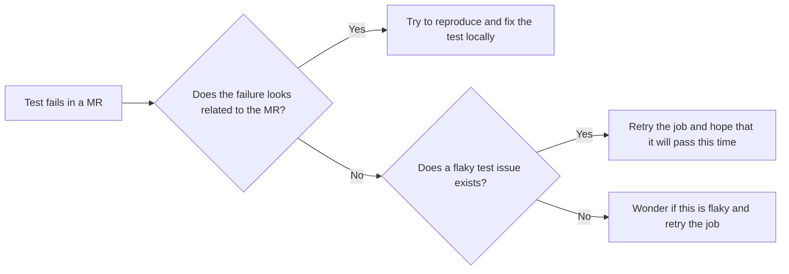

---

title: "Flaky tests Primer"
---

**Last reviewed**: 2021-10-28

- [Flaky tests technical documentation](https://docs.gitlab.com/ee/development/testing_guide/flaky_tests.html)
- [Measure and act on flaky specs](https://gitlab.com/groups/gitlab-org/-/epics/8789)
- [Flaky tests Sisense dashboard](https://10az.online.tableau.com/#/site/gitlab/workbooks/2283052/views)

### Introduction

A flaky test is an unreliable test that occasionally fails but passes eventually if you retry it enough times.

In a test suite, flaky tests are inevitable, so our goal should be to limit their negative impact as soon as possible.

### Current state and assumptions

| Current state | Assumptions |
| ------------- | ----------- |
| `master` success rate (with manual retrying of flaky tests) [is between 88% and 92% for August/September/October 2021](https://10az.online.tableau.com/#/site/gitlab/workbooks/2312755/views) | We don't know exactly what would be the success rate if we'd stop retrying flaky tests, but based on this exploratory chart, it could go down by approximately 7% |
| [175 programmatically identified flaky tests](https://10az.online.tableau.com/#/site/gitlab/workbooks/2283052/views) and [211 `~"failure::flaky-test" issues](https://10az.online.tableau.com/#/site/gitlab/views/DRAFTFlakytestissues/FlakyTests?:iid=1) out of a total of 159,590 tests | It means [we identified 0.1% of tests as being flaky](https://docs.gitlab.com/ee/development/testing_guide/flaky_tests.html#automatic-retries-and-flaky-tests-detection). This is in line with the ["RSpec Job Flaky Failure Probability"](https://10az.online.tableau.com/#/site/gitlab/views/SlowRSpecTestsIssues/SlowRSpecTestsIssuesDashboard?:iid=1). [GitHub identified that 25% of their tests were flaky at some point](https://github.blog/2020-12-16-reducing-flaky-builds-by-18x/#how-far-weve-come), our reality is probably in between. |
| [Coverage is currently at 97.86%](https://gitlab-org.gitlab.io/gitlab/coverage-ruby/#_AllFiles) | Even if we'd removed the 175 flaky tests, we don't expect the coverage to go down meaningfully. |
| ["Average Retry Count"](https://10az.online.tableau.com/#/site/gitlab/workbooks/2283052/views) per pipeline is currently at 0.08, it means given [RSpec jobs' current average duration of 23 minutes](https://10az.online.tableau.com/#/site/gitlab/views/DRAFTEP-JobsDurations/EP-JobsDurations?:iid=2), this results in an additional `0.08 * 23 = 1.84` minutes on average per pipeline , not including the idle time between the job failing and the time it is retried. [Explanation provided by Albert](https://gitlab.com/gitlab-org/quality/team-tasks/-/issues/874#note_575599680). | Given we have approximately [11k MR pipelines per month](https://10az.online.tableau.com/#/site/gitlab/workbooks/2312755/views), that means flaky tests are wasting 20,240 minutes per month = **337 engineer hours** = 14 days. Given our private runners cost us $0.0845 / minute, this means flaky tests are wasting $1,710 per month. |

When a flaky test fails in an MR, following is the workflow the author might follow:

### Why is this important?

Flaky tests negatively impact several teams and areas:

| Impacted department/team | Impacted area | Impact description | Impact quantification |
| --------------- | ------------- | ------------------ | --------------------- |
| Development department | MR & deployment cycle time | Wasted time (by forcing people to look at the failure and retry them manually) | ~$26,000 wasted time per month based on 337 engineer hours and using $77 hourly rate for an Engineer |
| Infrastructure department | CI compute resources | Wasted money | At least $1,710 worth of wasted CI compute time per month |
| Delivery team & Quality department | Deployment cycle time | Distraction from actual CI failures & regressions, leading to slower detection of those | TBD |

### Goal

- Increase `master` stability to a solid 95% success rate without manual action
- Improve productivity - MR merge time - [lower "Average Retry Count"](https://10az.online.tableau.com/#/site/gitlab/workbooks/2283052/views)
- Removes doubts on whether `master` is broken or not and default action of retry
- Defining acceptable thresholds for action like quarantining/focus on refactoring
- Step towards unlocking merge train

