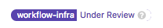

---

title: "The Infrastructure SaaS Platforms Project Management"
---

## Project Management in SaaS Platforms

We use GitLab epics and issues to communicate the progress and status of our work. 
The [SaaS Platforms epic](https://gitlab.com/groups/gitlab-com/-/epics/2115) is indexing the top level epic for each team, and links to active OKR's for a given quarter.
All teams in SaaS Plaforms follow these guidelines so that it is easy for team-members to contribute to different projects if needed.

### Projects are reviewed weekly in the Grand Review

**Every Wednesday**, the DRI for a project is expected to update the status block in the epic description to: 
1. Indicate any project blockers.
2. Briefly highlight progress since the last update.
3. Indicate planned next steps, or mitigations required to progress.
This enables other engineers and other managers to have good information about projects in an asynchronous fashion. 

Completed epics should remain "Open" with the ~"workflow-infra::In Progress" label. 
Update the status block in the epic description to summarize the project and share the completed status. 
Completed epics will be reviewed, celebrated, and updated to closed in the next [`Platforms Grand Review`](https://www.youtube.com/playlist?list=PL05JrBw4t0KqDXSHdlUvPWHOj_Hw8JdQ1) (Playlist accessible using GitLab Unfiltered account). 

## Labels

The SaaS Platform teams uses the following set of labels:

| Description | Labels |
|-------------|--------|
| The group label | `group::Scalability`  `group::Delivery`  `group::GitLab Dedicated`  `group::Production Engineering`|
| The team label | `team::Scalability-Observability`   `team::Scalability-Practices`   `team::Delivery:Deployment`   `team::Orchestration`   `team::Environment Automation`   `team::Switchboard`   `team::US PubSec`   `team::Foundations`   `team::Ops`|
| Scoped `workflow-infra::*` labels | (see below) |
| Optional Scoped `Service` labels | `Service::*` |

### Workflow labels

We leverage scoped workflow labels to track different stages of work.
They show the progression of work for each issue and allow us to remove blockers or change focus more easily.

While issues may not need to go through every state, the standard progression of workflow is from top to bottom in the table below:

| State Label | Description |
| ----------- | ----------- |
|  | Default label. Task is raised and effort is needed to determine the correct action, work required or team ownership |
|  | Proposal is created following triage and put forward for a review.  If there are no further questions or blockers, the issue can be moved into "Ready". |
|  | Proposal is complete and the issue is waiting to be picked up for work. |
|  | Issue is assigned and work has started.  While in progress, the issue should be updated to include steps for verification that will be followed at a later stage.|
|  | Issue has an MR in review. |
|  | MR was merged and we are waiting to see the impact of the change to confirm that the initial problem is resolved. |
|  | Issue is updated with the latest graphs and measurements, this label is applied and issue can be closed. |

There are three other workflow labels of importance:

| State Label | Description |
| ----------- | ----------- |
|  | Work in the issue is being abandoned due to external factors or decision to not resolve the issue. After applying this label, issue will be closed. |
|  | Work is not abandoned but other work has higher priority. After applying this label, team Engineering Manager is mentioned in the issue to either change the priority or find more help. |
|  | Work is blocked due external dependencies or other external factors. Where possible, a [blocking issue](https://docs.gitlab.com/ee/user/project/issues/related_issues.html) should also be set. After applying this label, issue will be regularly triaged by the team until the label can be removed. |

### Priority labels

The SaaS Platform section has only one priority label: `SaaS Platforms::P1`.

Only issues of the utmost importance are given this label.

When an issue is given this label, a message should be pasted in the section's Slack channel so that an owner can be found as quickly as possible.

These issues should be picked up soon as possible after completing ongoing tasks unless directly communicated otherwise.

It is a scoped label as we previously had 4 levels of priority. 
We found that in practise we primarily used P4, and used P1 to indicate the issues of greatest importance.
This was discussed on a [Scalability issue](https://gitlab.com/gitlab-com/gl-infra/scalability/-/issues/863), but we have seen similar usage in other teams.

### Labels in gitlab-org group

Stage groups use [type labels](/handbook/engineering/metrics/#data-classification) to label merge requests in projects in the `gitlab-org` group. 
If you need a stage group to perform work, it is best to apply the relevant stage group label when the issue is created. 

## Issue Trackers 

This is a list of the group issue trackers:

| Group | Tracker |
|-------|---------|
| Dedicated | [issue tracker](https://gitlab.com/gitlab-com/gl-infra/gitlab-dedicated/team/-/issues)|
| Delivery | [issue tracker](https://gitlab.com/gitlab-com/gl-infra/delivery/-/issues) |
| Production Engineering | [issue tracker](https://gitlab.com/gitlab-com/gl-infra/production-engineering/-/issues)|
| Scalability | [issue tracker](https://gitlab.com/gitlab-com/gl-infra/scalability/-/issues) |

