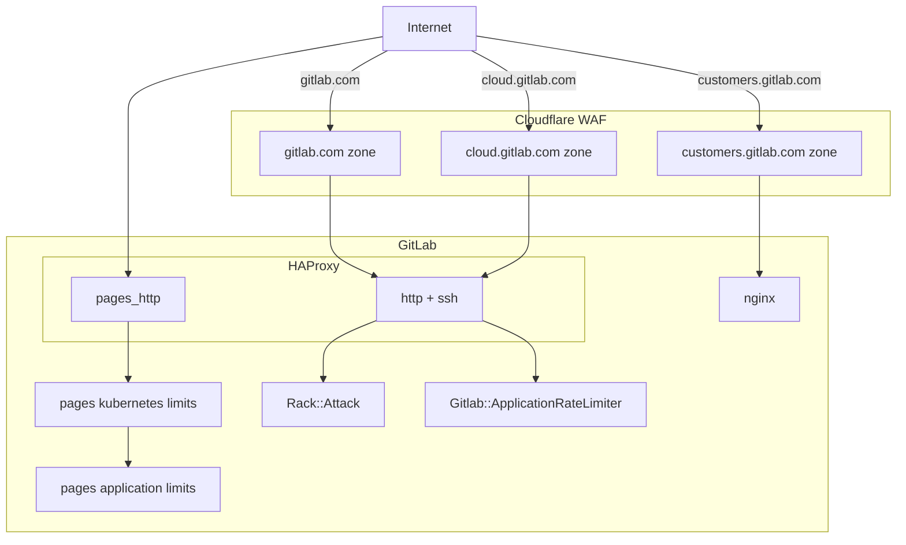

## Overview

Rate limiting is a critical feature in GitLab that enhances security and performance by restricting the number of requests users or IP addresses can make within a set timeframe. GitLab's approach to rate limiting helps prevent abuse, ensures fair resource allocation, and maintains system stability, effectively safeguarding against potential attacks and ensuring a reliable user experience.

Rate limited requests will return a `429 - Too Many Requests` response.

## Processes

- Changes to rate limits require a [Change Request](change-management.md/#change-request-workflows).
- Request assistance for a user's rate limiting settings with [this issue template](https://gitlab.com/gitlab-com/gl-infra/production-engineering/-/issues/new?issuable_template=request-rate-limiting).
- For internal teams seeking a bypass, please refer to the [Rate Limit Bypass Policy](https://gitlab.com/gitlab-com/runbooks/-/blob/master/docs/rate-limiting/bypass-policy.md).

## GitLab.com Rate Limit Architecture

Rate limits exist in multiple layers for GitLab.com, each boxed area above represents a place where rate limits are implemented.

### Limits

To minimise duplication, please see the following sources to determine the current active rate limits:

<table>
<tr>
<th>
Cloudflare
</th>
<td>

- GitLab.com:
  - [Cloudflare Dashboard](https://dash.cloudflare.com/852e9d53d0f8adbd9205389356f2303d/gitlab.com/security/waf/rate-limiting-rules)
  - [Cloudflare Rules Terraform](https://ops.gitlab.net/gitlab-com/gl-infra/config-mgmt/-/blob/main/environments/gprd/cloudflare-rate-limits-waf-and-rules.tf)

</td>
</tr>

<tr>
<th>
Application
</th>
<td>

- [Application Settings](https://gitlab.com/admin/application_settings/network) (admin access only)
  - See `User and IP Rate Limits` and `Protected Paths`
- [GitLab.com Docs](https://docs.gitlab.com/ee/user/gitlab_com/#gitlabcom-specific-rate-limits) (published manually)

</td>
</tr>

</table>

### Bypasses

[Published rate limits](https://docs.gitlab.com/ee/user/gitlab_com/index.html#gitlabcom-specific-rate-limits) apply to all customers and users with no exceptions.

Please see the [Rate Limit Bypass Policy](https://gitlab.com/gitlab-com/runbooks/-/blob/master/docs/rate-limiting/bypass-policy.md) for more detailed information.

## Traffic management Rate Limits

### Cloudflare

Cloudflare serves as our "outer-most" layer of protection, sitting at the network edge on inbound traffic. We use Cloudflare's standard DDoS (Distributed Denial of Service) protection plus [Spectrum](https://www.cloudflare.com/products/cloudflare-spectrum/) to protect git over ssh.

How rate limits are applied in Cloudflare:

<table>
<tr>
<th>
Page Rules
</th>
<td>

- Configured by Terraform in [config-mgmt](https://ops.gitlab.net/gitlab-com/gl-infra/config-mgmt/-/blob/main/environments/gprd/cloudflare-pagerules.tf).
- URL pattern matching.
- Control Cloudflare's DDoS interventions and caching (e.g. bypasses, security levels etc).
- No rate limits configured by default, but they can be enabled when under an attack

</td>
</tr>
<tr>

<th>
Rate Limiting
</th>
<td>

- Configured by Terraform in [config-mgmt](https://ops.gitlab.net/gitlab-com/gl-infra/config-mgmt/-/blob/main/environments/gprd/cloudflare-rate-limits-waf-and-rules.tf).
  - Covers a wide range of cases:
  - Global limits per `IP`
  - Global limits per `session` (cookies) or `tokens` (headers) can be used as rate counters to avoid IP scope false positives, e.g. many users behind a single IP, VPN.
- Endpoint specific limits.
- Independent of application rate limits.

</td>
</tr>
</table>

**Note:** Cloudflare is _not_ application aware and does not know how to map to our users and groups.

Our [Cloudflare runbook](https://gitlab.com/gitlab-com/runbooks/-/blob/master/docs/cloudflare/) contains more detail on configuring this layer of our infrastructure.

Changes to Cloudflare rate limits require a [Change Request](change-management.md/#change-request-workflows), and should
be discussed with the [Production Engineering::Foundations](https://gitlab.com/gitlab-com/gl-infra/production-engineering/-/issues/new?issuable_template=request-rate-limiting) SRE team before implementing.

### HAProxy

The [Production Engineering::Foundations team](team/foundations/) has been moving the majority of GitLab's traffic management rate limits out of HAProxy and into Cloudflare. As such, it is only configured to rate limit GitLab Pages as it [does not have CDN support](https://gitlab.com/groups/gitlab-org/-/epics/6757).

Additionally, HAProxy is responsible for handling the bypass header, which allows for a configured list of IP addresses to bypass rate limits in HAProxy or Rack Attack. There are two types:

1. **Internal**: Full bypass, including some other protections. Only CI runner managers (or similar) should ever be added to the internal list. Managed in Chef.
1. **External IPs**: An allowlist of IP addresses. Managed in [Chef](https://gitlab.com/gitlab-com/gl-infra/chef-repo/-/blob/62302c2219550f83b4427ceec2e303952c6ce333/roles/gprd-base-haproxy-main-config.json#L176). Requests from these IP addresses are still subject to additional checks, before bypassing the rest of the rate-limiting.

A full list of cases where the `X-GitLab-Rate-Limit-Bypass` header is used can be found in the [HAProxy cookbook](https://gitlab.com/gitlab-cookbooks/gitlab-haproxy/-/blob/65f8adc65b62db74714bd53dd48a50f7d9cfede3/templates/default/frontends/https.erb#L49).

Changes to HAProxy rate limits require a [Change Request](change-management.md/#change-request-workflows), and any customers or internal teams seeking a bypass should refer to the [Rate Limit bypass policy](https://gitlab.com/gitlab-com/runbooks/-/blob/97e57cb9c3da82c404754698010c7ec3c6b94fba/docs/rate-limiting/bypass-policy.md).

## Application Rate Limits

There are multiple application rate limiting mechanisms in place that can often be referred to interchangeably. These allow for more informed traffic management compared to that implemented by Cloudflare as the application has access to user information:

- [Rack Attack](https://gitlab.com/gitlab-org/gitlab/blob/master/lib/gitlab/rack_attack.rb)
- [Application Rate Limiter](https://gitlab.com/gitlab-org/gitlab/-/blob/master/lib/gitlab/application_rate_limiter.rb)
- [Plan Limits](https://gitlab.com/gitlab-org/gitlab/-/blob/master/app/helpers/plan_limits_helper.rb)

Please see [Application Limits Development](https://docs.gitlab.com/ee/development/application_limits.html) to contribute application limits to GitLab.

### Overview

The rate limit period is 1 minute (60 seconds).

<table>
<tr>
<th>

Category

</th>
<th>

Identifier

</th>
</tr>

<tr>
<th>

Unauthenticated

</th>
<td>

IP address

</td>
</tr>

<tr>
<th>

Authenticated

</th>
<td>

User information (user, project, etc)

</td>
</tr>

<tr>
<th>

Protected Paths

</th>
<td>

Configurable list of paths e.g. `/user/sign_in`

</td>
</tr>

</table>

### RackAttack

GitLab utilises [RackAttack](https://docs.gitlab.com/ee/development/application_limits.html#implement-rate-limits-using-rackattack) as middleware to throttle Rack requests. These can be configured by extending `Gitlab::RackAttack` and `Gitlab::RackAttack::Request`.

For more information about configuring rate limits for a GitLab instance, see the [User and IP rate limits](https://docs.gitlab.com/ee/administration/settings/user_and_ip_rate_limits.html) doc.

You can read more information about [rate limits specific to GitLab.com](https://docs.gitlab.com/ee/user/gitlab_com/index.html#gitlabcom-specific-rate-limits), alongside RackAttack configuration documentation in [runbooks](https://gitlab.com/gitlab-com/runbooks/-/tree/master/docs/rate-limiting#application-rackattack).

### ApplicationRateLimiter

The GitLab application has simple rate limit logic that can be used to throttle certain actions which is used when we need more
flexibility than what Rack Attack can provide, since it can throttle at the controller or API level. These rate limits are set configured in [application_rate_limiter.rb](https://gitlab.com/gitlab-org/gitlab/-/blob/master/lib/gitlab/application_rate_limiter.rb). The scope is up to the individual limit implementation and can be any ActiveRecord object or combination of multiple.  It is commonly per-user or per-project (or both), but it can be anything, e.g. the RawController limits by project and path.

There is no way to bypass these rate limits (e.g. for select users/groups/projects); when the rate limit is reached a plain response with a 429 status code is issued without rate limiting headers.

Instructions for configuring these rate limits can be found in the [GitLab docs](https://docs.gitlab.com/ee/development/application_limits.html#implement-rate-limits-using-gitlabapplicationratelimiter).

For more information about introducing new Rate Limits for GitLab, see the [Product Processes Handbook](product/product-processes/#introducing-application-limits) page.

## Other Rate Limits

### GitLab Pages

Because GitLab Pages is not behind CloudFlare and doesn't have CDN support, rate limits are set in several places:

1. There exist some limits in [HAProxy](https://gitlab.com/gitlab-cookbooks/gitlab-haproxy/-/blob/master/templates/default/frontends/pages_http.erb).
2. Within the [kubernetes settings](https://gitlab.com/gitlab-com/gl-infra/k8s-workloads/gitlab-com/-/blob/1c12c9ac84921893ac774e95e1087f144dd3b04a/releases/gitlab/values/values.yaml.gotmpl#L492) for GitLab.com.
3. In the [go ratelimiter module](https://gitlab.com/gitlab-org/gitlab-pages/-/blob/master/internal/ratelimiter/ratelimiter.go?ref_type=heads) for Pages.

For more information, see the [Pages Rate Limit documentation](https://docs.gitlab.com/ee/administration/pages/index.html#rate-limits).

## Headers

Below are the list of semi-standard rate limiting response headers that can be returned on rate limited requests.

<table>
<tr>
<th>

RateLimit-Limit

</th>
<td>

The request quota for the client each minute.

</td>
</tr>

<tr>
<th>

RateLimit-Observed

</th>
<td>

The number of requests associated to the client in the time window.

</td>
</tr>

<tr>
<th>

RateLimit-Remaining

</th>
<td>

The remaining quota in the time window (Limit - Observed).

</td>
</tr>

<tr>
<th>

RateLimit-Reset

</th>
<td>

[Unix time](https://en.wikipedia.org/wiki/Unix_time) when the request quota is reset.

</td>
</tr>

<tr>
<th>

RateLimit-ResetTime

</th>
<td>

[RFC2616](https://www.rfc-editor.org/rfc/rfc2616#section-3.3.1) formatted time when the request quota is reset.

</td>
</tr>

<tr>
<th>

RateLimit-Name

</th>
<td>

Name of the throttle blocking the requests.

</td>
</tr>

<tr>
<th>

Retry-After

</th>
<td>

A standard HTTP header for when the quota is reset.

</td>
</tr>

</table>

### Important Information

- `Cloudflare` does not return rate limit response headers on any request.
- `RackAttack` returns rate limit response headers on throttled requests only.
- `ApplicationRateLimiter` will return rate limit response headers once [this issue](https://gitlab.com/gitlab-com/gl-infra/production-engineering/-/issues/25372) is implemented.
- `GraphQL` endpoints currently do not return rate limit response headers.

## Troubleshooting

### Observability

Our support team also have a [Kibana dashboard](support/workflows/ip-blocks/) showing metrics around rate limited responses. Cloudflare rate limits responses can be seen in the [Cloudflare UI](https://dash.cloudflare.com/) (Gitlab Cloudflare account access required).

#### Investigating RackAttack logs

- `json.meta.user` field is set if a request is authenticated, and missing if it was anonymous.
- `json.env` will either be set to `throttle` or `blocklist`, the latter which comes from [failed authentication bans](https://docs.gitlab.com/ee/security/rate_limits.html#failed-authentication-ban-for-git-and-container-registry).

## Important Links

- [GitLab.com Rate limits overview](https://gitlab.com/gitlab-com/runbooks/-/tree/master/docs/rate-limiting)
- [docs: GitLab.com](https://docs.gitlab.com/ee/user/gitlab_com/index.html#gitlabcom-specific-rate-limits)
- [docs: Self Managed (and Dedicated)](https://docs.gitlab.com/ee/security/rate_limits.html)
