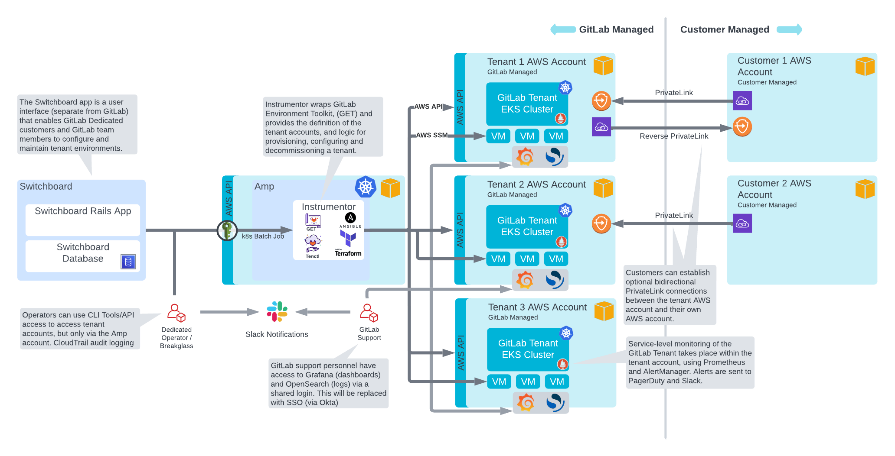
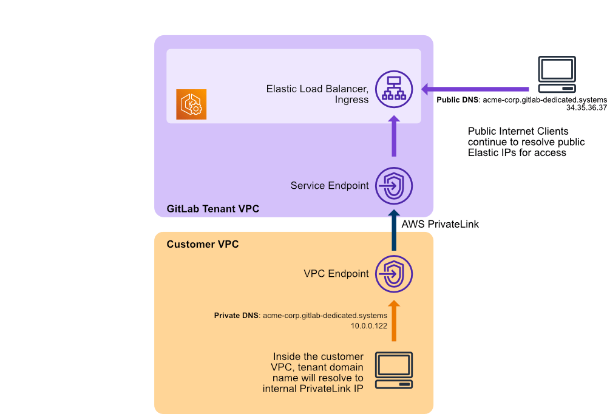
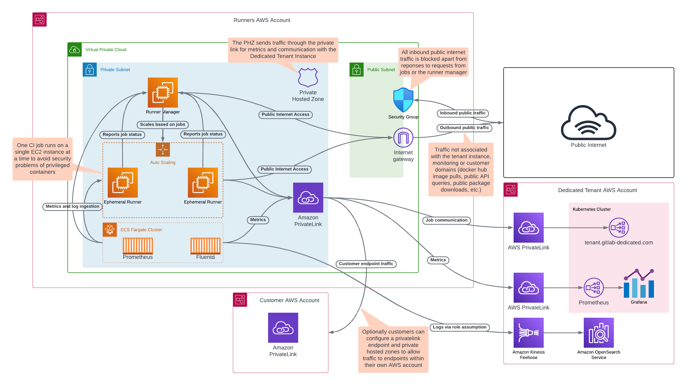

## Architecture

This page collects a set of architectural documents and diagrams for GitLab Dedicated.

## High level overview

## Tenant network

### Gitaly Setup

GitLab Dedicated deploys Gitaly [in a sharded setup](https://docs.gitlab.com/ee/administration/gitaly/#before-deploying-gitaly-cluster), not a Gitaly Cluster. In this setup:

- Customer repositories are spread across multiple virtual machines.
- GitLab manages [storage weights](https://docs.gitlab.com/ee/administration/repository_storage_paths.html#configure-where-new-repositories-are-stored) on behalf of the customer.

### Geo Setup

GitLab Dedicated leverages GitLab Geo for [Disaster Recovery](https://docs.gitlab.com/ee/subscriptions/gitlab_dedicated/#disaster-recovery).

Note: GitLab Geo is not an "active/active" system. To learn more about how GitLab Geo works, see [the solution overview page](https://about.gitlab.com/solutions/geo/).

### AWS PrivateLink connection

## Hosted Runners for GitLab Dedicated

### Architecture diagram

For more information on how runners are authenticating and executing the job payload, see [Runner Execution Flow](https://docs.gitlab.com/runner#runner-execution-flow).

### Security of hosted runners for GitLab Dedicated

The following section provides an overview of the additional built-in layers that harden the security of the GitLab Runner build environment.

Hosted runners for GitLab Dedicated are configured as such:

- Firewall rules only allow outbound communication from the ephemeral VM to the public internet.
- Inbound communication from the public internet to the ephemeral VM is not allowed.
- Firewall rules do not permit communication between VMs.
- The only internal communication allowed to the ephemeral VMs is from the runner manager.
- VM isolation between job executions.
- Ephemeral runner VMs will only serve a single job and will be deleted right after the job execution.
- On-demand: Hosted runners can be connected to customers' AWS accounts via a private link bypassing the public Internet.

## Documents

- [From Dedicated to Cells: a Technical Analysis](from-dedicated-to-cells-technical-analysis.html)
