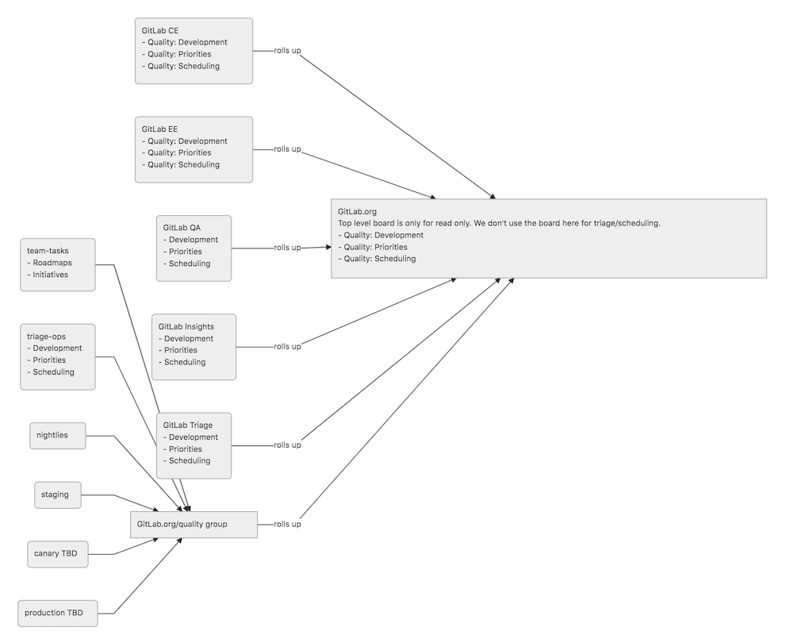

---

title: "Test Platform Project Management"
description: "Guidelines for project management for the Test Platform Sub-Department at GitLab"
---

## Projects

The Test Platform sub-department currently works cross-functionally, and our task ownership spans multiple projects. Most of our projects can be found [here](https://gitlab.com/gitlab-org/quality).

- **GitLab.org**
  - [GitLab](https://gitlab.com/gitlab-org/gitlab)
  - [GitLab QA](https://gitlab.com/gitlab-org/gitlab-qa)
  - [GitLab CustomersDot](https://gitlab.com/gitlab-org/customers-gitlab-com)
  - **Test Platform Group**
    - [Quality Team Tasks](https://gitlab.com/gitlab-org/quality/quality-engineering/team-tasks)
    - [GitLab Environment Toolkit (GET)](https://gitlab.com/gitlab-org/gitlab-environment-toolkit)
    - [GitLab Performance Tool (GPT)](https://gitlab.com/gitlab-org/quality/performance)
    - [Pipeline Common](https://gitlab.com/gitlab-org/quality/pipeline-common)
    - [Run Books](https://gitlab.com/gitlab-org/quality/runbooks)
    - [Test Cases](https://gitlab.com/gitlab-org/gitlab/-/quality/test_cases)

### Reviewers and maintainers

Upon joining the Test Platform sub-department, team members are granted either developer, maintainer, or owner access to a variety of core projects. For projects where only developer access is initially granted, there are some criteria that should be met before maintainer access is granted.

- [GitLab (/qa)](https://gitlab.com/gitlab-org/gitlab/-/tree/master/qa)
  - Test Platform team members are code owners for this directory. If you are tagged by a developer and don't yet feel comfortable approving a merge request, please tag another member of the Test Platform sub-department to help review.
  - In general, we expect that team members will generally feel comfortable and will be granted maintainer access once they have:
    - Authored and reviewed 3 MRs related to improvements to the framework.
    - Authored and reviewed 5 MRs related to adding new end-to-end tests or making substantial improvements to existing ones.
- [GitLab-QA](https://gitlab.com/gitlab-org/gitlab-qa)
  - Authored and reviewed 5 merged MRs that demonstrate good understanding of the codebase.
  - Reviewed 5 MRs that make substantial improvements.
- [GitLab CustomersDot (/qa)](https://gitlab.com/gitlab-org/customers-gitlab-com/-/tree/staging/qa/)
  - Test Platform team members are code owners for this directory. If you are tagged by a developer and don't yet feel comfortable approving a merge request, please tag another member of the Test Platform team to help review.
  - In general, we expect that team members will generally feel comfortable and will be granted maintainer access once they have:
    - Authored and reviewed 5 MRs related to improvements to the framework.
    - Authored and reviewed 10 MRs related to adding new end-to-end tests or making substantial improvements to existing ones.
- [GitLab Environment Toolkit (GET)](https://gitlab.com/gitlab-org/gitlab-environment-toolkit)
  - Select Self-Managed Platform team members are code owners for this directory. If you are tagged by a developer and don't yet feel comfortable approving a merge request, please reach out to the Self-Managed Platform team to help review.
  - In general, team members looking to become maintainers of this project are recommended to have a good working knowledge of [Terraform](https://www.terraform.io/), [Ansible](https://www.ansible.com/) and the GitLab application itself first before applying. We expect that team members will generally feel comfortable and will be granted maintainer access once they have:
    - Authored and reviewed 10 MRs related to improvements to the toolkit.
    - Authored and reviewed 5 MRs related to adding making substantial improvements or additions.
  - After completing the above requirement, the maintainer should be vetted by an existing maintainer for the Toolkit. An issue should be created in the project outlining the reasons why this person should be a maintainer. List all 15 MRs in the issue to help aid with review.
- [GitLab Performance Tool (GPT)](https://gitlab.com/gitlab-org/quality/performance)
  - Select Self-Managed Platform team members are code owners for this directory. If you are tagged by a developer and don't yet feel comfortable approving a merge request, please reach out to the Self-Managed Platform team to help review.
  - In general, team members looking to become maintainers of this project are recommended to have a good working knowledge of performance testing in general, [k6](https://k6.io/) and the GitLab application itself first before applying. We expect that team members will generally feel comfortable and will be granted maintainer access once they have:
    - Authored and reviewed 5 MRs related to new tests in the Tool.
    - Authored and reviewed 3 MRs related to improvements to the Tool.
  - After completing the above requirement the maintainer should be vetted by an existing maintainer for the Tool. An issue should be created in the project outlining the reasons why this person should be a maintainer. List all 10 MRs in the issue to help aid with review.

#### Becoming a maintainer

The following guidelines will help you to become a maintainer. Remember that there is no specific
timeline on this, and that you should work together with your manager and current maintainers.

To start the process of becoming a maintainer, see the [maintainer section](/handbook/engineering/workflow/code-review/#how-to-become-a-project-maintainer)
of the code review guidelines.

In general, you're required to author and review 3 - 10 MRs that demonstrate good overall understanding
of the existing codebase and framework. See the section above for [further details of the requirements](#reviewers-and-maintainers).
You can seek out more opportunities to work on framework improvements by asking on the `#test-platform` Slack channel.

Your reviews should aim to cover maintainer responsibilities as well as reviewer responsibilities.
Your approval means you think it is ready to merge.

It is your responsibility to set up any necessary meetings to discuss your
progress with current maintainers, as well as your manager. These can be at any
frequency that is right for you.

## Project Management

Our sub-department's work can span over 10k+ issues hence as a result, we have specific team boards for the 3 teams in Test Platform Sub-department.

### Test and Tools Infrastrcuture

[This board](https://gitlab.com/groups/gitlab-org/-/boards/425899) shows the current ownership of workload / issues related to test tooling and test infrastructure needs.

### Self-Managed Platform team

[This board](https://gitlab.com/groups/gitlab-org/-/boards/978354) shows the current ownership of workload / issues related to Self-Managed tooling and Core Platform testing needs.

### Test Engineering

[This board](https://gitlab.com/groups/gitlab-org/-/boards/1512645?label_name[]=Quality) shows the current ownership of workload / issues related to testing and tooling needs to support feature development within Core Development and Expansion Development department.

## How to use the boards

Each project planning, scheduling and triaging process will happen in the team boards.

The boards are using a consistent configuration and is the same across all of our projects. This means that anyone on the team can work using the same set of tools everywhere.

Think of all these projects as different class of objects with stable interface methods that is consistent and cross-compatible.

This also ensures that the data rolled up to the top level board is consistent.

### Board Overview

