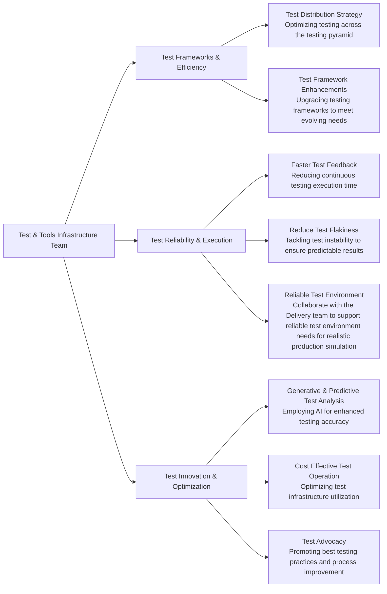

## Team handles

| **Category**            | **Handle** |
|-------------------------|-------------|
| **GitLab Team Handle**  | [`@gl-quality/tp-test-tools-infrastructure`](https://gitlab.com/gl-quality/tp-test-tools-infrastructure) |
| **Slack Channel**               | [`#test-tools-infrastructure-team`](https://gitlab.slack.com/archives/C064M4D2V37) |
| **Slack Handle**               | `@test-tools-infrastructure` |
| **Team Boards**         | [`Board`](https://gitlab.com/groups/gitlab-org/-/boards/7168288?label_name[]=team%3A%3ATest%20and%20Tools%20Infrastructure) |
| **Issue Tracker**       | [`quality/team-tasks`](https://gitlab.com/gitlab-org/quality/team-tasks/issues/) |

## Team vision

The Test & Tools Infrastructure team, under the [Test Platform sub-department](../_index.md) at GitLab, aspires to be a pioneering force in the innovation and maintenance of advanced testing frameworks and test infrastructure to support Gitlab's principle of [Quality is everyone's responsibility](https://about.gitlab.com/handbook/engineering/quality/#our-principles).

As an integral part of our vision, we aim to:
- Build a highly performant team of engineers, combining operational and software development experience to implement and support the best-in-class reliable testing processes & infrastructure.
- Work publicly in accordance with GitLab's [`transparency`](https://about.gitlab.com/handbook/values/#transparency) value.
- Leverage [`dogfooding`](https://about.gitlab.com/handbook/engineering/infrastructure/#dogfooding) to prepare, build, deliver test tooling that improves the product itself.
- Align our strategy with the industry trends, company direction, and customer needs.

## Team mission

The key components of our mission are to:
- **Make testing simple** to enable easy contribution from everyone in the testing process, including test creation, execution, and debugging. This approach democratizes testing and fosters a culture of collective responsibility for quality.
- **Make testing efficient** to minimize time and resources while maximizing output, ensuring that testing is a facilitator, not a bottleneck, in the software development lifecycle.
- **Make testing reliable** to consistently deliver accurate and dependable results, ensuring trust in the test system & building confidence in every release.
- **Foster innovation** to explore, integrate, and build the latest technologies and methodologies in testing to keep GitLab at the forefront of software development innovation.

## Team members



## Core Responsibilities



## Team Rituals

- We prioritize asynchronous communication and a handbook-first approach, in line with GitLab's all-remote, timezone-distributed structure.
- We emphasize the [Maker’s Schedule](http://www.paulgraham.com/makersschedule.html), focusing on productive, uninterrupted work.
- Most mandatory recurring meetings are scheduled on Tuesdays and Thursdays.
- We reserve approximately 3-4 hours per week of focus time for learning new technologies and conducting research work, ensuring our team stays abreast of industry trends and fosters innovation in our projects. This time is dedicated to exploring emerging tools, deep-diving into subjects relevant to our work, engaging in self-directed learning, and experimenting with new ideas or proof-of-concepts. Team members have their calendars marked with this dedicated learning time. Any new meeting requests during these hours should be communicated beforehand, respecting this essential personal and professional development period.
- All meeting agendas could be found in the [Team Shared Drive](https://drive.google.com/drive/folders/1uZg0J5hYsOUu3WMNR-PoAcmrhhmDxxoA?usp=drive_link) as well as in the meeting invite.

### Work Related Rituals
#### Standup Notes [Async]
- **Cadence**: Daily
- **Guidelines**:
    1. Share daily plans via Geekbot update in `#test-tools-infrastructure-team`.
    2. Keep updates concise and focused.

#### End-of-Week Status Update [Async]
- **Cadence**: Every Thursday EOD
- **Guidelines**:
    1. The weekly update comment should summarize the current status, progress and remaining work with ETA, confidence in completion, upcoming steps, and highlight any areas requiring help or support.
    2. Some good examples for the EOW updates can be found [here](https://gitlab.com/groups/gitlab-org/-/epics/8628#note_1090732793) and [here](https://gitlab.com/groups/gitlab-org/-/epics/5152#note_1029337901). Tag the required individuals along with the manager of the team in the EOW updates. 
    3. **Ensure that issues and epics are updated by Thursday of each week**. This allows for a comprehensive summary to be provided to the `#test-platform` sub-department channel on Friday, enhancing overall visibility and coordination.

#### Monthly Retrospective [Async]
- **Cadence**: Monthly
- **Guidelines**:
    1. Contribute to the retrospective issue created in the [Quality Retrospective project](https://gitlab.com/gl-retrospectives/quality). The retrospective issue will be automatically created and shared in the `#test-platform-lounge` channel on the first Monday of every month.
    2. Engage in constructive feedback and action-oriented discussions.
    3. Engineering Manager to summarize action items by the end of the week. The kudos will also be summarized and shared to `#thanks` for organization visibility.
    4. The team retrospective will be in line with [Gitlab's retrospective guidelines](/handbook/engineering/management/group-retrospectives/)

#### Team Meeting and Demos [Sync]
- **Cadence**: Bi-weekly on Tuesday, 45 mins
- **Guidelines**:
    1. Bi-weekly meetings will occur within Project tracks and within working groups. Time zone differences will lead to segmented meetings. Solo project track members may opt for asynchronous updates and detailed discussions in 1:1s.
    2. Focus on live discussions, milestone reviews, and backlog refinement.
    3. Record quick ~5 mins demo for completed work and share in the agenda doc. We also encourage everyone to record videos and post to GitLab Unfiltered. [The handbook page on YouTube](/handbook/marketing/marketing-operations/youtube/#post-everything) does an excellent job of telling why we should be doing this. If you’re uploading a video for the demos, be sure to do the following extra steps:
       1. Add `test-platform` & `test-and-tools-infrastructure` as video tags.
       2. Add it to the [Test Platform  department's](https://www.youtube.com/playlist?list=PL05JrBw4t0KpZUzlEnvlvBtf_NwShU_ot) playlist.
       3. Share it to `#test-tools-infrastructure-team` and cross-post to `#test-platform`.

#### Social Hours [Sync]
- **Cadence**: Quarterly
- **Guidelines**:
    1. This is a virtual team building activity adhering to the [Gitlab's team building policy](/handbook/finance/expenses/#team-building).
    2. Social hours will be organized across different time zones, in sync with the `test-platform` sub-department's schedule.

### Personal/Career Development Rituals
#### Weekly 1:1 Meeting with Engineering Manager
- **Cadence**: Weekly, 25 mins
- **Guidelines**:
    1. Discuss both professional and personal development goals.
    2. Maintain confidentiality and openness.
    3. Follow the [1:1 process](/handbook/leadership/1-1/) mentioned in the handbook. 

#### Goal Setting & Review
- **Guidelines**:
    1. We follow the [individual gowth plan model](/handbook/people-group/learning-and-development/career-development/igp-guide/). The process of launching your IGP is documented [here](/handbook/people-group/learning-and-development/career-development/igp-guide/).
    4. Leverage 1:1s with your manager to discuss the progress on the goals and next steps. 
    5. Additionaly, consider preparing a worklog issue in the [Team Workbook](https://gitlab.com/gitlab-org/quality/work-log/-/blob/main/templates/worklog-temaplte.md?ref_type=heads) to keep track of your contributions. This will assist in remembering contributions beyond usual project activities, highlighting them for consideration in performance reviews. One such example could be found [here](https://gitlab.com/gitlab-org/quality/work-log/-/issues/1). 
       1. Create an issue with format - `<Name>-Worklog-<Financial Year>`.
       2. Keep updating the worklog each week.
       3. Once the quarter ends, add a summary of the major contributions of the quarter to the description. 

### Project Management

#### Guiding principle

Our project tracks are guided by the [Lean Startup Principles](https://theleanstartup.com/principles), particularly the Build-Measure-Learn feedback loop, which emphasizes rapid prototyping, continuous iteration, and learning from real-world feedback. The stages include:
    
    ```mermaid
    graph LR
        A[Build-Measure-Learn Feedback Loop]
        A --> B[Discovery]
        B --> C[Prototyping]
        C --> D[Implementation]
        D --> E[Guardrailing]
        E --> F[Monitoring]

        B -->|Learn Phase| G[Understand Developer Needs]
        C -->|Fail-Fast Mechanism| H[Create POC]
        D -->|Agility & Scaling| I[MVC iteration]
        E -->|Prevent Regression| J[Process & technology guardrails to prevent fallback]
        F -->|Data-Driven| K[User Feedback & Business Metrics]
    ```

#### Feature work
  - Each financial year, we develop a clear roadmap for the team to enhance visibility and alignment.
  - Our roadmap preparation is an intensive month long exercise (usually last month of Q4), led by a [DRI](https://handbook.gitlab.com/handbook/people-group/directly-responsible-individuals/). During this phase, DRIs take the lead in drafting the roadmap using [the roadmap prep-work template](https://gitlab.com/gitlab-org/quality/work-log/-/blob/main/templates/roadmap-pre-work-template.md?ref_type=heads) for necessary project tracks. This involves gathering inputs from the team, various stakeholders, assessing past performance, and aligning with the strategic goals of the Test and Tools Infrastructure Team. 
  - Upon completion of the preparation phase, the roadmap is presented to the Test-Platform leadership for review and sign-off. This ensures alignment with broader organizational objectives and secures executive buy-in.
  - This translation process is meticulous, ensuring that each milestone is broken down into manageable, clearly defined tasks following the [issue creation guideline for tracks](../roadmap.md#overview). 
  - Project track specific [GitLab issue board](https://docs.gitlab.com/ee/user/project/issue_board.html) is created with the combination of epic, team label ~"team::Test and Tools Infrastructure" and the [Workflow Labels](../project-management/index.md#workflow-labels). 
  - Each issues/epics in the roadmap is assigned to a DRI.  
  - Adhering to our team's [bi-weekly ritual](#team-meeting-and-demos-sync), we conduct reviews to assess progress, address challenges, and recalibrate goals if necessary.
  - We provide comprehensive quarterly reports using this [template](https://gitlab.com/gitlab-org/quality/work-log/-/blob/main/templates/quarterly-business-report-template.md?ref_type=heads), detailing the progress of our roadmap initiatives contributing to transparent communication and strategic planning for upcoming quarters.
  - We ensure adjusting the roadmap in each quarter based on the change in business priority.


#### Working with us
We estimate ~20% of weekly time for support tasks, and balancing our roadmap work with emerging support needs. Please note this estimate varies depending upon ongoing priorities. 
  - For individual questions please reach out to the team via our slack channels: `#test-platform`, `#test-tools-infrastructure-team`.
  - Raise support requests as issues in [team-tasks project](https://gitlab.com/gitlab-org/quality/quality-engineering/team-tasks). Add `~"team::Test and Tools Infrastructure"` label in the issues to track it in the [team's support request board](https://gitlab.com/gitlab-org/quality/quality-engineering/team-tasks/-/boards/7253736?label_name%5B%5D=team%3A%3ATest%20and%20Tools%20Infrastructure). 
  - Ensure each issue is tagged with one of `~"type::feature"`, `~"type::bug`, `~"type::maintenance` following [workflow classification guidelines](handbook/engineering/metrics/#work-type-classification).
  - Team members analyze the issue and add a priority based on the [Reliability Department's prioritization framework](https://handbook.gitlab.com/handbook/engineering/infrastructure/team/reliability/issues/#priority). P1 issues will be taken up on an urgent basis the same week based on the availability of the relevant team members. Lower-priority issues are scheduled for review and discussion in our next bi-weekly meeting for capacity planning.
  - The issues should be following the [workflow label guidelines](../project-management/index.md#workflow-labels).

### Borrow requests

Depending on the business needs, skillsets, timelines, and workload on SETs in other teams, members of the Test Tools and Infrastructure team could be requested to assist in other areas. In such case, the following process should be adhered to:

1. Initiate a [borrow request issue](https://gitlab.com/gitlab-com/Product/-/issues/new?issuable_template=Borrow-Request-Lite) with the `~SET Borrow` label.
2. Submit requests at least two weeks in advance for adequate preparation and resource planning.
3. The leadership team of the Test Platform will triage and determine the appropriate team for each request. Once decided, they will signify this by adding a specific team label to the request. For Test and Tools Infrastructure team, the team label is ~"team::Test and Tools Infrastructure". 
4. Borrow requests are prioritized based on urgency and the potential impact on product development.

### On-call activities

Test and Tools Infrastructure team follows the Test Platform on-call rotations: pipeline triage (SET-led) and incident management (QEM-led). These are scheduled in advance to share the responsibilities of debugging pipeline failures and representing Quality in incident responses.
For more information, please visit our [on-call rotation page](oncall-rotation).

## Tooling
The team currently works cross-functionally, and our task ownership spans multiple tools and projects. 

| Tool | Description |
|------|-------------|
| [`gitlab/qa`](https://gitlab.com/gitlab-org/gitlab/-/tree/master/qa) | GitLab's Capybara-based end-to-end (E2E) testing framework |
| [`gitlab-qa orchestrator`](https://gitlab.com/gitlab-org/gitlab-qa) | An orchestration tool that enables running various end-to-end scenarios against any GitLab instance |
| [`GitLab Data Seeder`](https://docs.gitlab.com/ee/topics/data_seeder.html) | Data seeding harness that can seed customized data directly into a user or group namespace using low-level ORM calls |
| [`customers-dot/qa`](https://gitlab.com/gitlab-org/customers-gitlab-com/-/tree/main/qa) | E2E testing framework for The [CustomersDot App](https://customers.gitlab.com/) |
| [`quality-pipeline-common`](https://gitlab.com/gitlab-org/quality/pipeline-common) | Reusable pipeline configurations for multiple testing projects within GitLab |
| [`dri`](https://gitlab.com/gitlab-org/quality/dri) | Tool that assists Pipeline Triage engineers to triage and report GitLab's E2E pipeline test failures |
| [`chemlab`](https://gitlab.com/gitlab-org/ruby/gems/chemlab) | A Watir wrapper, a design scaffold and a CLI designed to join the existing testing practices at GitLab from two separate frameworks, the GitLab Capybara Framework, and the CustomersDot Watir framework into one |
| [`gitlab_quality-test_tooling`](https://gitlab.com/gitlab-org/ruby/gems/gitlab_quality-test_tooling) | A Ruby gem for test-related GitLab automation/reporting |
| [`quality/toolbox`](https://gitlab.com/gitlab-org/quality/toolbox) | A collection of scripts for pipeline automation and analysis. Co-owned by the Engineering Productivity team |
| [`gitlab-qa-resources`](https://gitlab.com/gitlab-org/quality/engineering-productivity-infrastructure) | Collection of terraform resources for Test Platform related infrastructure management. Co-owned by the Engineering Productivity team |
| [`gitlab-junior-toy-app`](https://gitlab.com/gitlab-org/quality/technical-interviews/gitlab-junior-toy-app) | A toy app used for technical interviews while recruiting for the Software Engineer in Test (SET) position. Internal to the Test Platform sub department |


## Current OKR 

Every quarter, the team commits to [Objectives and Key Results (OKRs)](/company/okrs/). Here is an [overview](https://gitlab.com/gitlab-com/gitlab-OKRs/-/work_items/5399) of our current Test and Tools Infrastructure team OKR. 

## Performance Indicators
TBD
