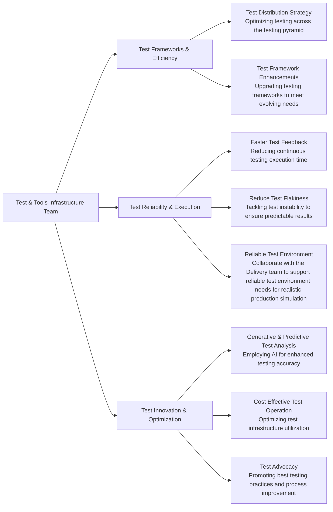

## Team handles

| **Category**            | **Handle** |
|-------------------------|-------------|
| **GitLab Team Handle**  | [`@gl-quality/tp-test-tools-infrastructure`](https://gitlab.com/gl-quality/tp-test-tools-infrastructure) |
| **Slack Channel**               | [`#test-tools-infrastructure-team`](https://gitlab.slack.com/archives/C064M4D2V37) |
| **Slack Handle**               | `@test-tools-infrastructure` |
| **Team Boards**         | [`Board`](https://gitlab.com/groups/gitlab-org/-/boards/7168288?label_name[]=team%3A%3ATest%20and%20Tools%20Infrastructure) |
| **Issue Tracker**       | [`quality/team-tasks`](https://gitlab.com/gitlab-org/quality/team-tasks/issues/) |

## Team vision

The Test & Tools Infrastructure team, under the [Test Platform sub-department](https://about.gitlab.com/handbook/engineering/quality/quality-engineering/) at GitLab, aspires to be a pioneering force in the innovation and maintenance of advanced testing frameworks and test infrastructure to support Gitlab's principle of [Quality is everyone's responsibility](https://about.gitlab.com/handbook/engineering/quality/#our-principles).

As an integral part of our vision, we aim to:
- Build a highly performant team of engineers, combining operational and software development experience to influence the best-in-class reliable testing processes & infrastructure to support the same.
- Work publicly in accordance with GitLab's [`transparency`](https://about.gitlab.com/handbook/values/#transparency) value.
- Leverage [`dogfooding`](https://about.gitlab.com/handbook/engineering/infrastructure/#dogfooding) to prepare, build, deliver test tooling that improves the product itself.
- Align our strategy with the industry trends, company direction, and customer needs.

## Team mission

The key components of our mission are to:
- **Make testing simple** to enable easy contribution from everyone in the testing process, including test creation, execution, and debugging. This approach democratizes testing and fosters a culture of collective responsibility for quality.
- **Make testing efficient** to minimize time and resources while maximizing output, ensuring that testing is a facilitator, not a bottleneck, in the software development lifecycle.
- **Make testing reliable** to consistently deliver accurate and dependable results, ensuring trust in the test system & building confidence in every release.
- **Foster innovation** to explore, integrate, and build the latest technologies and methodologies in testing to keep GitLab at the forefront of software development innovation.

## Team members



## Core Responsibilities

## Team Rituals

- We prioritize asynchronous communication and a handbook-first approach, in line with GitLab's all-remote, timezone-distributed structure.
- We emphasize the [Maker’s Schedule](http://www.paulgraham.com/makersschedule.html), focusing on productive, uninterrupted work.
- Most mandatory recurring meetings are scheduled on Tuesdays and Thursdays.
- All meeting agendas could be found in the [Team Shared Drive]() as well as in the meeting invite.

### Work Related Rituals
#### Standup Notes [Async]
- **Cadence**: Daily
- **Rules**:
    1. Share daily plans via Geekbot update in `#test-tools-infrastructure-team`.
    2. Keep updates concise and focused.
    3. This is **optional**, respecting individual work styles [discussed [here](https://gitlab.com/gitlab-org/quality/quality-engineering/team-tasks/-/issues/2181#note_1646017808)].

#### End-of-Week Status Update [Async]
- **Cadence**: Every Thursday EOD
- **Rules**:
    1. The weekly update comment should summarize the current status, progress and remaining work with ETA, confidence in completion, upcoming steps, and highlight any areas requiring help or support.
    2. Some good examples for the EOW updates can be found [here](https://gitlab.com/groups/gitlab-org/-/epics/8628#note_1090732793) and [here](https://gitlab.com/groups/gitlab-org/-/epics/5152#note_1029337901). 
    3. **Ensure that issues and epics are updated by Thursday of each week**, enabling the Engineering Manager to provide a summary to the `#test-platform` sub-department for enhanced visibility on Friday.

#### Monthly Retrospective [Async]
- **Cadence**: First Monday to Wednesday of each month
- **Rules**:
    1. Contribute to the retrospective issue for the `Test & Tools Infrastructure Team` specifically in the [Quality Retrospective project](https://gitlab.com/gl-retrospectives/quality). The issue will be automatically shared in the team channel.
    2. Engage in constructive feedback and action-oriented discussions.
    3. Engineering Manager to summarize action items by the end of the week. The kudos will also be summarized and shared to `#thanks` for organization visibility. A summary of the retrospective will be shared to `#test-platform` for broader sub-platform level visibility.
    4. The team retrospective will be in line with [Gitlab's retrospective guidelines](https://handbook.gitlab.com/handbook/engineering/management/group-retrospectives/)

#### Team Meeting and Demos [Sync]
- **Cadence**: Bi-weekly on Tuesday, 25 mins
- **Rules**:
    1. Bi-weekly meetings will occur within Project tracks and within working groups. Time zone differences will lead to segmented meetings. Solo project track members may opt for asynchronous updates and detailed discussions in 1:1s.
    2. Focus on live discussions, milestone reviews, and backlog refinement.
    3. Record quick ~5 mins demo for completed work and share in the agenda doc. We also encourage everyone to record videos and post to GitLab Unfiltered. [The handbook page on YouTube](https://handbook.gitlab.com/handbook/marketing/marketing-operations/youtube/#post-everything) does an excellent job of telling why we should be doing this. If you’re uploading a video for the demos, be sure to do the following extra steps:
       1. Add `test-platform` & `test-and-tools-infrastructure` as video tags.
       2. Add it to the Quality Team's playlist.
       3. Share it to `#test-tools-infrastructure-team` and cross-post to `#test-platform`.

#### Social Hours [Sync]
- **Cadence**: Monthly on last Thursday, 45 mins
- **Rules**:
    1. Foster non-work-related interactions (playing online retro-games, discussion on wines and what not!) for team bonding.
    2. The social hours will be scheduled inclusively across multiple time zones.
    3. This is also an **optional** meeting, respecting individual's priorities. 

### Personal/Career Development Rituals
#### Weekly 1:1 Meeting with Engineering Manager
- **Cadence**: Weekly, 25 mins
- **Rules**:
    1. Discuss both professional and personal development goals.
    2. Maintain confidentiality and openness.
    3. Follow the [1:1 process](https://handbook.gitlab.com/handbook/leadership/1-1/) mentioned in the handbook. 

#### Goal Setting & Review
- **Rules**:
    1. A confidential issue will be created in the [Team Workbook](https://gitlab.com/gitlab-org/quality/work-log) for setting individual goals. 
    2. Ensure every team member establishes their goals by the first quarter of each financial year. For new hires, the goal setting process should be accomplished in the onboarding process.
    3. Align individual goals with team and company objectives.
    4. Leverage 1:1s with your manager to discuss the progress on the goals and next steps. 
    5. Consider preparing a worklog document each week following this [template](https://docs.google.com/document/d/1LXP5cqVfOZ983QJYbP870tZXO0iIs4OwqLIcT-REekk/edit?usp=sharing) in the [Team Workbook](https://gitlab.com/gitlab-org/quality/work-log) to keep track of your contributions. This will assist in remembering contributions beyond usual project activities, highlighting them for consideration in performance reviews. One such example could be found [here](https://gitlab.com/gitlab-org/quality/work-log/-/issues/1). 
       1. Create an issue with format - `<Name>-Worklog-<Financial Year>-<Quarter>`.
       2. Keep updating the worklog each week.
       3. Once the quarter ends, summarize the worklog issue with major contributions and close the same. 

## How we work

### Roadmap Planning

- Pre-work and departmental sign-off (~3 weeks)
    - Our roadmap preparation is an intensive two-week process, led by a [DRI](https://handbook.gitlab.com/handbook/people-group/directly-responsible-individuals/). During this phase, DRIs take the lead in drafting the roadmap using [the roadmap prep-work template]() for necessary project tracks. This involves gathering inputs from the team, various stakeholders, assessing past performance, and aligning with the strategic goals of the Test and Tools Infrastructure Team. 
    - Upon completion of the preparation phase, the roadmap from various project tracks is assembled into a handbook page MR and presented to the Test-Platform Sub-Department Director for review and sign-off. This ensures alignment with broader organizational objectives and secures executive buy-in.
    - Merge the MR once approved and share it across the Test Platform department.

- Translating the roadmap into actionable items (~1 week)
  - This translation process is meticulous, ensuring that each milestone is broken down into manageable, clearly defined tasks following the [issue creation guideline for tracks](../roadmap.md#overview).
  - Project track specific GitLab board is created with the combination of epic, team label ~"team::Test and Tools Infrastructure" and the [Workflow Labels](../project-management/index.md#workflow-labels). 
  - Each issues/epics in the roadmap is assigned.  
  - A MR is raised and merged to add the Epics and Issue Board in the [Roadmap handbook page](./roadmap-test-and-tools-infrastructure.md).

- Our project tracks are guided by the [Lean Startup Principles](https://theleanstartup.com/principles), particularly the Build-Measure-Learn feedback loop, which emphasizes rapid prototyping, continuous iteration, and learning from real-world feedback. The stages include:
  - **Discovery**: Engaging in data-driven analysis to develop clear, actionable goals. This aligns with the 'Learn' phase, where understanding customer needs is crucial.
  - **Prototyping**: Conducting exploratory studies and developing proof-of-concepts. We adopt a fail-fast mechanism, encouraging innovation and risk-taking to create a minimal viable product (MVP).
  - **Implementation**: Executing the plan with agility having an emphasis on scaling the MVP to [MVC](../../../../product/product-principles.md#the-minimal-viable-change-mvc) and iterate over it.  
  - **Guardrailing**: Build necessary guardrails (both process and technology) to prevent regression to previous states. 
  - **Monitoring**: Continuous data-driven monitoring for user feedback, anomalies and assess the impact on key business metrics and performance indicators.

- Roadmap review and reporting
    - Adhering to our team's [bi-weekly ritual](#team-meeting-and-demos-sync), we conduct reviews to assess progress, address challenges, and recalibrate goals if necessary. These sessions are crucial for maintaining momentum and ensuring alignment with our roadmap.
    - We provide comprehensive quarterly reports using this [template](), detailing the progress of our roadmap initiatives. These reports offer insights into achievements, learnings, and areas needing attention, contributing to transparent communication and strategic planning for upcoming quarters.

### Support Assistance
  - Around 20% of weekly time is set aside for support tasks, balancing our roadmap work with emerging support needs.
  - Team members diligently monitor `#test-platform` and other pertinent slack channels and issue discussions, staying alert for any requests for assistance or support. 
  - Relevant support requests are converted into issues. Add ~"team::Test and Tools Infrastructure" label in the issues to track it in the team's [backlog board](https://gitlab.com/groups/gitlab-org/-/boards/7168288?label_name%5B%5D=team%3A%3ATest%20and%20Tools%20Infrastructure). Issue creation is a critical activity for our team, even for issues that are quickly resolved through Slack communications. Documenting both the problem and its resolution in an issue helps in maintaining a comprehensive record. This not only assists in future reference and knowledge sharing but also allows us to track the time and resources invested in resolving these issues.
  - Ensure each issue is tagged with a `type` label that indicates its association with specific tooling, enabling streamlined tracking and management. 
    - [TBD relevant types for TTI team to track, eg. `type::maintenance`]
  - Team members analyze the ticket and add a priority based on the [Reliability Department's prioritization framework](https://handbook.gitlab.com/handbook/engineering/infrastructure/team/reliability/issues/#priority). P1 issues will be taken up on an urgent basis the same week based on the availability of the relevant team members. Lower priority issues are scheduled for review and discussion in our next bi-weekly meeting for capacity planning.
  - The issues should be following the [Test Platform workflow label guidelines](../project-management/index.md#workflow-labels).
  - Updates on the support requests should be communicated at the end of each week in the issue comments.
  - Team members should record support activities (usually outside of general project tracks) and progress in the worklog for transparency and tracking.

### Borrow requests

It is highly unlikely that members of the Test Tools and Infrastructure team will be borrowed, as our focus does not align with general Test Engineering support. Our work is driven by a unique [roadmap](./roadmap-test-and-tools-infrastructure.md), and any incoming requests are calibrated based on our [Support Assistance Process](#support-assistance). However, if a team is developing their test tooling and infrastructure and requires short-term support to centralize their solution with expert guidance, the following process should be adhered to:

1. Initiate a [borrow request issue](https://gitlab.com/gitlab-com/Product/-/issues/new?issuable_template=Borrow-Request-Lite) with the `~SET Borrow` label.
2. Submit requests at least two weeks in advance for adequate preparation and resource planning.
3. The leadership team of the Test Platform will triage and determine the appropriate team for each request. Once decided, they will signify this by adding a specific team label to the request. For Test and Tools Infrastructure team, the team label is ~"team::Test and Tools Infrastructure". 
4. Borrow requests are prioritized based on urgency and the potential impact on product development.

### On-call activities
Test and Tools Infrastructure team follows the Test Platform on-call rotations: pipeline triage (SET-led) and incident management (QEM-led). These are scheduled in advance to share the responsibilities of debugging pipeline failures and representing Quality in incident responses.
For more information, please visit our [on-call rotation page](oncall-rotation).

## Tooling
The team currently works cross-functionally, and our task ownership spans multiple tools and projects. 

| Tool | Description |
|------|-------------|
| [`gitlab/qa`](https://gitlab.com/gitlab-org/gitlab/-/tree/master/qa) | GitLab's Capybara-based end-to-end (E2E) testing framework |
| [`gitlab-qa orchestrator`](https://gitlab.com/gitlab-org/gitlab-qa) | An orchestration tool that enables running various end-to-end scenarios against any GitLab instance |
| [`GitLab Data Seeder`](https://docs.gitlab.com/ee/topics/data_seeder.html) | Data seeding harness that can seed customized data directly into a user or group namespace using low-level ORM calls |
| [`customers-dot/qa`](https://gitlab.com/gitlab-org/customers-gitlab-com/-/tree/main/qa) | E2E testing framework for The [CustomersDot App](https://customers.gitlab.com/) |
| [`quality-pipeline-common`](https://gitlab.com/gitlab-org/quality/pipeline-common) | Reusable pipeline configurations for multiple testing projects within GitLab |
| [`dri`](https://gitlab.com/gitlab-org/quality/dri) | Tool that assists Pipeline Triage engineers to triage and report GitLab's E2E pipeline test failures |
| [`chemlab`](https://gitlab.com/gitlab-org/ruby/gems/chemlab) | A Watir wrapper, a design scaffold and a CLI designed to join the existing testing practices at GitLab from two separate frameworks, the GitLab Capybara Framework, and the CustomersDot Watir framework into one |
| [`gitlab_quality-test_tooling`](https://gitlab.com/gitlab-org/ruby/gems/gitlab_quality-test_tooling) | A Ruby gem for test-related GitLab automation/reporting |
| [`quality/toolbox`](https://gitlab.com/gitlab-org/quality/toolbox) | A collection of scripts for pipeline automation and analysis. Co-owned by the Engineering Productivity team |
| [`gitlab-qa-resources`](https://gitlab.com/gitlab-org/quality/engineering-productivity-infrastructure) | Collection of terraform resources for Test Platform related infrastructure management. Co-owned by the Engineering Productivity team |
| [`gitlab-junior-toy-app`](https://gitlab.com/gitlab-org/quality/technical-interviews/gitlab-junior-toy-app) | A toy app used for technical interviews while recruiting for the Software Engineer in Test (SET) position. Internal to the Test Platform sub department |

## Current OKR 

Every quarter, the team commits to [Objectives and Key Results (OKRs)](/company/okrs/). The below shows current quarter OKRs and is updated regularly as the quarter progresses. Here is an [overview](https://gitlab.com/gitlab-com/gitlab-OKRs/-/work_items/5399) of our current Test and Tools Infrastructure team OKR.

## Performance Indicators
TBD
