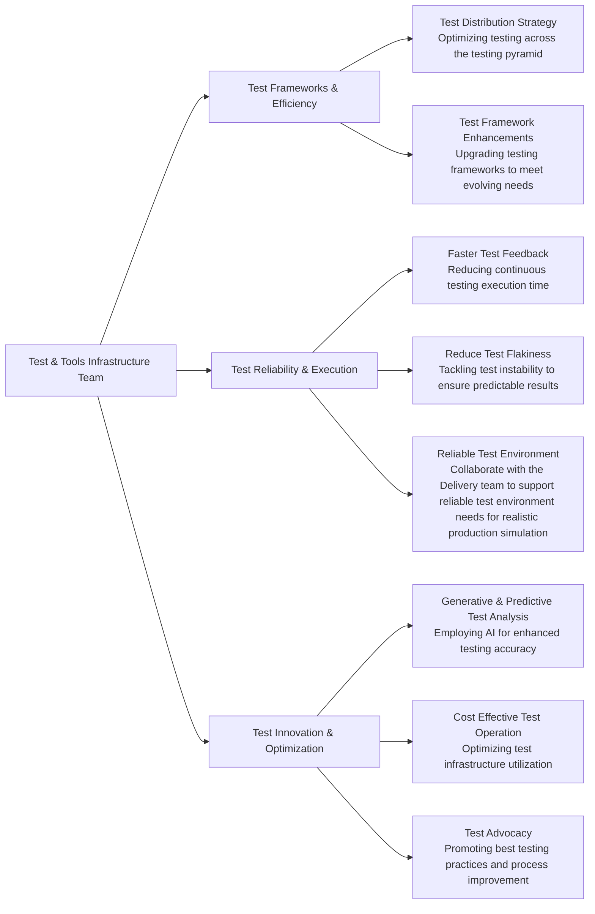

## Team handles

| **Category**            | **Handle** |
|-------------------------|-------------|
| **GitLab Team Handle**  | [`@gl-quality/tp-test-tools-infrastructure`](https://gitlab.com/gl-quality/tp-test-tools-infrastructure) |
| **Slack Channel**               | [`#test-tools-infrastructure-team`](https://gitlab.slack.com/archives/C064M4D2V37) |
| **Slack Handle**               | `@test-tools-infrastructure` |
| **Team Boards**         | [`Board`](https://gitlab.com/groups/gitlab-org/-/boards/7168288?label_name[]=team%3A%3ATest%20and%20Tools%20Infrastructure) |
| **Issue Tracker**       | [`quality/team-tasks`](https://gitlab.com/gitlab-org/quality/team-tasks/issues/) |

## Team vision

The Test & Tools Infrastructure team, under the [Test Platform sub-department](https://about.gitlab.com/handbook/engineering/quality/quality-engineering/) at GitLab, aspires to be a pioneering force in the innovation and maintenance of advanced testing frameworks and test infrastructure to support Gitlab's principle of [Quality is everyone's responsibility](https://about.gitlab.com/handbook/engineering/quality/#our-principles).

As an integral part of our vision, we aim to:
- Build a highly performant team of engineers, combining operational and software development experience to influence the best in reliable testing processes & infrastructure to support the same.
- Work publicly in accordance with GitLab's [`transparency`](https://about.gitlab.com/handbook/values/#transparency) value.
- Leverage [`dogfooding`](https://about.gitlab.com/handbook/engineering/infrastructure/#dogfooding) to prepare, build, deliver tooling that improves the product itself.
- Align our strategy with the industry trends, company direction, and customer needs.

## Team mission

The key components of our mission are to:
- **Make testing simple** to enable easy contribution from everyone in the testing process, including test creation, execution, and debugging. This approach democratizes testing and fosters a culture of collective responsibility for quality.
- **Make testing efficient** to minimize time and resources while maximizing output, ensuring that testing is a facilitator, not a bottleneck, in the software development lifecycle.
- **Make testing reliable** to consistently deliver accurate and dependable results, ensuring trust in the test system & building confidence in every release.
- **Foster innovation** to explore, integrate, and build the latest technologies and methodologies in testing to keep GitLab at the forefront of software development innovation.
- **Collaboration and Knowledge sharing** to promote a culture of quality within the team and across departments, enhancing the collective testing acumen and driving better outcomes. 
- **Adapt and respond** to stay agile and responsive to the evolving needs of the development teams and the broader GitLab community, ensuring our tools and processes remain relevant and effective. 

## Team members



## Core Responsibilities

## Team Rituals
We prioritize asynchronous communication and a handbook-first approach, in line with GitLab's all-remote, timezone-distributed structure.

### Work Related Rituals
#### Standup Notes [Async]
- **Cadence**: Daily
- **Rules**:
    1. Share daily plans via Geekbot update in `#test-tools-infrastructure-team`.
    2. Keep updates concise and focused.
    3. This is **optional**, respecting individual work styles [discussed [here](https://gitlab.com/gitlab-org/quality/quality-engineering/team-tasks/-/issues/2181#note_1646017808)].

#### End-of-Week Status Update [Async]
- **Cadence**: Every Thursday EOD
- **Rules**:
    1. Reflect on weekly progress and upcoming tasks.
    2. Update blockers in the issues to mitigate risks.
    3. **Ensure that issues and epics are updated by Thursday of each week**, enabling the Engineering Manager to provide a summary to the `#test-platform` sub-department for enhanced visibility on Friday.

#### Monthly Retrospective [Async]
- **Cadence**: First Monday to Wednesday of each month
- **Rules**:
    1. Contribute to the retrospective issue for the `Test & Tools Infrastructure Team` specifically in the [Quality Retrospective project](https://gitlab.com/gl-retrospectives/quality). The issue will be automatically shared in the team channel.
    2. Engage in constructive feedback and action-oriented discussions.
    3. Engineering Manager to summarize action items by the end of the week. The kudos will also be summarized and shared to `#thanks` for organization visibility. A summary of the retrospective will be shared to `#test-platform` for broader sub-platform level visibility.
    4. The team retrospective will be in line with the [group retrospective guidelines](https://handbook.gitlab.com/handbook/engineering/management/group-retrospectives/)

#### Team Meeting & Demos [Sync]
- **Cadence**: Bi-weekly on Monday, 25 mins
- **Rules**:
    1. Bi-weekly meetings will occur within Project tracks and within working groups. Time zone differences will lead to segmented meetings. Solo project track members may opt for asynchronous updates and detailed discussions in 1:1s.
    2. Focus on live discussions, milestone reviews, and backlog refinement.
    3. Record quick ~5 mins demo and share in the agenda Doc. 

#### Social Hours [Sync]
- **Cadence**: Quarterly, 45 mins
- **Rules**:
    1. Foster non-work-related interactions for team bonding.
    2. The social hours will be scheduled inclusively across multiple time zones.
    3. An issue will be created in the [Team Workbook](https://gitlab.com/gitlab-org/quality/work-log) to discuss on social hour ideas.

### Personal/Career Development Rituals
#### Weekly 1:1 Meeting with Engineering Manager
- **Cadence**: Weekly, 25 mins
- **Rules**:
    1. Discuss both professional and personal development goals.
    2. Maintain confidentiality and openness.
    3. Follow the [1:1 process](https://handbook.gitlab.com/handbook/leadership/1-1/) mentioned in the handbook. 

#### Worklog/Brag Document
- **Cadence**: Ongoing
- **Rules**:
    1. Consider preparing a worklog document following this [template](https://docs.google.com/document/d/1LXP5cqVfOZ983QJYbP870tZXO0iIs4OwqLIcT-REekk/edit?usp=sharing) in the [Team Workbook](https://gitlab.com/gitlab-org/quality/work-log)
    2. Regularly update with achievements and learnings.
    3. Use it as a reference for 1:1s and performance reviews.

#### Goal Setting & Review
- **Rules**:
    1. A confidential issue will be created in the [Team Workbook](https://gitlab.com/gitlab-org/quality/work-log) for setting individual goals. 
    2. Ensure every team member establishes their goals by the start quarter of each financial year. For new hires, the goal setting process should be accomplished in the onboarding process.
    3. Align individual goals with team and company objectives.
    4. Leverage 1:1s with your manager to discuss the progress on the goals and next steps. 

## Tooling
The team currently works cross-functionally, and our task ownership spans multiple tools and projects. 

| Tool | Description |
|------|-------------|
| [`gitlab/qa`](https://gitlab.com/gitlab-org/gitlab/-/tree/master/qa) | GitLab's Capybara-based end-to-end (E2E) testing framework |
| [`gitlab-qa orchestrator`](https://gitlab.com/gitlab-org/gitlab-qa) | An orchestration tool that enables running various end-to-end scenarios against any GitLab instance |
| [`GitLab Data Seeder`](https://docs.gitlab.com/ee/topics/data_seeder.html) | Data seeding harness that can seed customized data directly into a user or group namespace using low-level ORM calls |
| [`customers-dot/qa`](https://gitlab.com/gitlab-org/customers-gitlab-com/-/tree/main/qa) | E2E testing framework for The [CustomersDot App](https://customers.gitlab.com/) |
| [`quality-pipeline-common`](https://gitlab.com/gitlab-org/quality/pipeline-common) | Reusable pipeline configurations for multiple testing projects within GitLab |
| [`dri`](https://gitlab.com/gitlab-org/quality/dri) | Tool that assists Pipeline Triage engineers to triage and report GitLab's E2E pipeline test failures |
| [`chemlab`](https://gitlab.com/gitlab-org/ruby/gems/chemlab) | A Watir wrapper, a design scaffold and a CLI designed to join the existing testing practices at GitLab from two separate frameworks, the GitLab Capybara Framework, and the CustomersDot Watir framework into one |
| [`gitlab_quality-test_tooling`](https://gitlab.com/gitlab-org/ruby/gems/gitlab_quality-test_tooling) | A Ruby gem for test-related GitLab automation/reporting |
| [`quality/toolbox`](https://gitlab.com/gitlab-org/quality/toolbox) | A collection of scripts for pipeline automation and analysis. Co-owned by the Engineering Productivity team |
| [`gitlab-qa-resources`](https://gitlab.com/gitlab-org/quality/engineering-productivity-infrastructure) | Collection of terraform resources for Test Platform related infrastructure management. Co-owned by the Engineering Productivity team |
| [`gitlab-junior-toy-app`](https://gitlab.com/gitlab-org/quality/technical-interviews/gitlab-junior-toy-app) | A toy app used for technical interviews while recruiting for the Software Engineer in Test (SET) position. Internal to the Test Platform sub department |

## Current OKR 

Every quarter, the team commits to [Objectives and Key Results (OKRs)](/company/okrs/). The below shows current quarter OKRs and is updated regularly as the quarter progresses. Here is an [overview](https://gitlab.com/gitlab-com/gitlab-OKRs/-/work_items/5399) of our current Test and Tools Infrastructure team OKR.

## Performance Indicators
TBD
