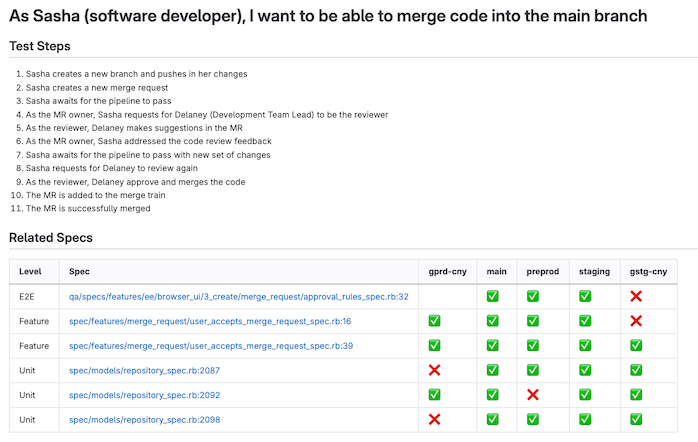

## Common Links

| **Category**            | **Handle** |
|-------------------------|------------|
| **GitLab Team Handle** | [`@gl-quality/tp-test-engineering`](https://gitlab.com/gl-quality/tp-test-engineering) |
| **Slack Channel** | [#test-engineering-team](https://gitlab.slack.com/archives/C064M4S0FU5) |
| **Team Boards** | [Team Board](https://gitlab.com/groups/gitlab-org/-/boards/7364900?not[label_name][]=failure%3A%3A*&label_name[]=team%3A%3ATest%20Engineering) |
| **Issue Tracker** | [quality/team-tasks](https://gitlab.com/gitlab-org/quality/team-tasks/issues/) |

Engineers in this team support the product sections supported by the [Core Development] and [Expansion Development] Department.

## Team members

Engineering Manager: Ksenia Kolpakova

| S.No     | Department            | Section                   | Stage         | SET Counterpart    |
|-------|-----------------------|-------------------------|---------------|--------------------|
| 1        | [Core Development](/handbook/engineering/core-development/)      | [Dev section](/handbook/product/categories/#dev-section)              | [Create](/handbook/product/categories/#create-stage)      | Jay McCure         |
| 2     | [Core Development](/handbook/engineering/core-development/)      | [Dev section](/handbook/product/categories/#dev-section)            | [Plan](/handbook/product/categories/#plan-stage)        | Désirée Chevalier  |
| 3        | [Core Development](/handbook/engineering/core-development/)      | [CI section](/handbook/product/categories/#ci-section)              | [Verify](/handbook/product/categories/#verify-stage)      | Tiffany Rea, Joy Roodnick |
| 4        | [Core Development](/handbook/engineering/core-development/)      | [CI section](/handbook/product/categories/#ci-section)               | [Package](/handbook/product/categories/#package-stage)     | Tiffany Rea       |
| 5        | [Core Development](/handbook/engineering/core-development/)      | [CD section](/handbook/product/categories/#cd-section)               | [Deploy](/handbook/product/categories/#deploy-stage)      | -                  |
| 6     | [Expansion Development](/handbook/engineering/expansion-development/) | [Sec section](/handbook/product/categories/#sec-section)              | [Secure](/handbook/product/categories/#secure-stage)      | Will Meek          |
| 7     | [Expansion Development](/handbook/engineering/expansion-development/) | [Sec section](/handbook/product/categories/#sec-section)           | [Govern](/handbook/product/categories/#govern-stage)      | Harsha Muralidhar  |
| 8    | [Expansion Development](/handbook/engineering/expansion-development/) | [Fulfillment section](/handbook/product/categories/#fulfillment-section)   | [Fulfillment](/handbook/product/categories/#fulfillment-stage) | Valerie Burton     |
| 9    | [Expansion Development](/handbook/engineering/expansion-development/) | [Fulfillment section](/handbook/product/categories/#fulfillment-section)   | [Fulfillment](/handbook/product/categories/#fulfillment-stage) | Richard Chong      |
| 10    | [Expansion Development](/handbook/engineering/expansion-development/) | [Data Science section](/handbook/product/categories/#data-science-section)  | [ModelOps](/handbook/product/categories/#modelops-stage)    | -                  |
| 11    | [Expansion Development](/handbook/engineering/expansion-development/) | [Data Science section](/handbook/product/categories/#data-science-section)  | [AI-powered](/handbook/product/categories/#ai-powered-stage)  | Ramya Authappan    |

* FYI - There are no hiring plans for SETs in FY25.

## OKRs

Every quarter, the team commits to [Objectives and Key Results (OKRs)](/handbook/company/okrs/). The below shows current quarter OKRs and is updated regularly as the quarter progresses.

Here is an [overview](https://gitlab.com/gitlab-com/gitlab-OKRs/-/work_items/6583) of our current Test Engineering OKRs.

## How we work

### Project management

#### Iterations

* We plan our work in 2 weeks long iterations
* We maintain and regularly update [Test Engineering team board](https://gitlab.com/groups/gitlab-org/-/boards/7364900?not[label_name][]=failure%3A%3A*&label_name[]=team%3A%3ATest%20Engineering). This board reflect the actual status of the ongoing work

#### Issue weights

We estimate every task during iteration planning. Our weighting strategy is based on [Test Platform Weighting](/handbook/engineering/infrastructure/test-platform/#weights)

| Weight | Description | Approximate time | Example issues |
|--------|-------------|------------------|----------------|
| 1         | Trivial     | ~1 hour          | TBD |
| 2      | Small       | ~0.5-1 day       | TBD |
| 3         | Medium      | ~3 days          | TBD |
| 5         | Large       | ~1 week          | TBD |
| 8         | X-Large     | ~2 weeks          | TBD |
| 13+    | XXL         | >>2 weeks          | TBD |

* Approximate  time estimate - is time spent actively working on the issue: from design to requesting the review
* It is not manadatory to create Trivial tasks
* Consider breaking down Large tasks into smaller items
* XL and XXL tasks has to be broken down into smaller tasks and might require creating Spike issue first

### Enabling Teams in E2E Test Development

The Test Platform team aims to better enable teams to apply the principle that [quality is everyone's responsibility](/handbook/engineering/development/principles/#quality).

To that aim, we have been working to make it easier to contribute to E2E test development, and we want to begin gradually transitioning product teams to own E2E tests. During and after the transition, the Test Engineering team will act more as coaches, helping to provide the platform that enables effective testing among the team.

Below is a general template that teams can use to get started on this transition process.

Teams should feel encouraged to tailor this process to what works best for them. Like everything we do at GitLab, this is an iterative process, and we always welcome feedback for improvement.

#### Transition Process

1. Engineering Manager (EM) or Product Manager (PM) creates an issue to request support from a Software Engineer in Test (SET) for a new `~priority::1` project, and tags the Test Engineering manager and respective SETs for that stage.
2. An SET is assigned to the project for coaching and test platform needs.
3. SET reviews project requirements and creates a test planning issue to collaborate with EM, PM, UX and the developers who will be DRIs for the project to define new test cases and determine where existing tests need to be updated.
   * With [Defining a criteria on when to write E2E tests](https://gitlab.com/gitlab-org/quality/quality-engineering/team-tasks/-/issues/2359), we will be reinventing the way we think about E2E test coverage. While the full details are still being decided, below are a few ways teams can get started with this new approach:
     * Engage with key DRIs listed above to define [persona](/handbook/product/personas) use cases, with the goal of illustrating how different customers will use these new features.
     * Keeping the entire [testing pyramid](https://docs.gitlab.com/ee/development/testing_guide/testing_levels.html) in mind, evaluate which parts of the use cases can be sufficiently covered by lower level tests, and which ones should have coverage in E2E tests.
     * This screenshot illustrates an example of what test coverage for a use case might look like once all tests are implemented:
     * 
4. SET evaluates what E2E framework, tooling or infrastructure work (if any) will need to be completed ahead of time, and creates the respective issues.
   * The Test Engineering team should collaborate with the Test Tools and Infrastructure team for these changes, especially if the scope is large and could affect all E2E tests / frameworks.
   * If the scope of the change is more specific to the features or product area to be tested within the project, the Test Engineering team is encouraged to implement these changes.
5. SET is assigned to any E2E testing issues, and EM also assigns the appropriate developer(s).
6. The developer can reach out to this SET as their coaching buddy for pairings, questions and reviews while they develop / update the E2E tests.
7. If there is a change mid-project in implementation or direction that would affect the previously planned E2E test changes, it is the responsibility of the developer to update the test issues and notify the SET to keep them in the loop.
8. After E2E test(s) are merged, if a test failure is encountered within a merge request, it is the responsibility of the author to investigate. If an SET creates or is assigned to a failure issue from a scheduled pipeline, the SET will also assign the issue to the relevant developer. The SET can then help guide the developer through troubleshooting and supporting them with test maintenance.
