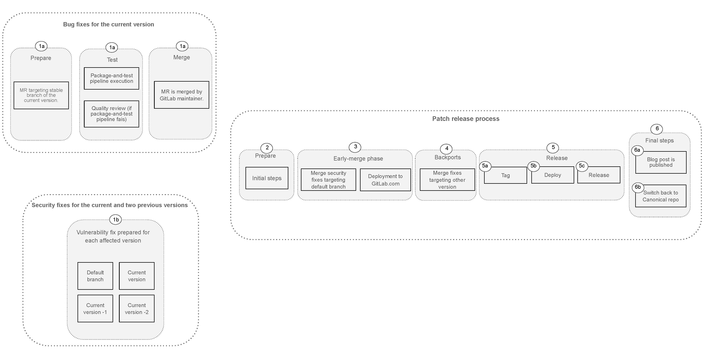
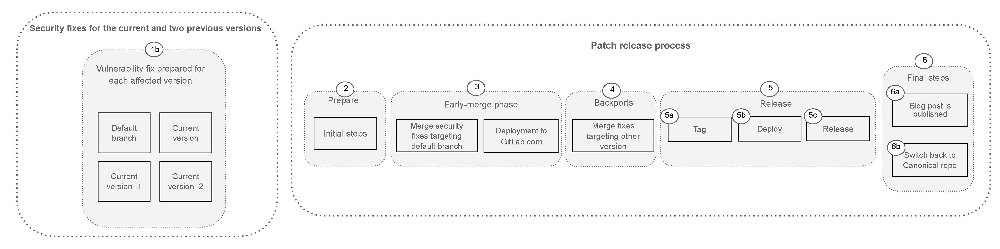

## Patch release overview

Patch releases are performed according to the [GitLab Maintenance Policy]:

* Backport bug fixes to the current stable released version of GitLab.
* Backport security fixes to the current, and previous two GitLab Versions.

Patches that are outside of our maintenance policy must be requested and agreed upon by the release managers and the requester (see [backporting to versions outside the maintenance policy] for details).

Patch releases are prepared in parallel with regular GitLab.com deployments so that continuous deployment is not blocked. In this way we can apply security fixes to GitLab.com instances before the public release.

If you're a GitLab engineer looking to:

* Include a security fix in a patch release, please follow the steps on the [security runbook for GitLab engineers].
* Include a bug fix in a patch release, please follow the steps on the [patch release runbook for GitLab engineers].

## Patch release process

Patch releases have multiple touchpoints between many teams to prepare, validate and publish packages containing
bug and vulnerability fixes.

At GitLab, we have two types of patch releases:

1. Planned (default): A planned patch release to publish all available bug and vulnerability fixes per the [GitLab Maintenance Policy]. This is an SLO driven type that take place around the [monthly release](https://about.gitlab.com/releases/).
1. Unplanned critical: An unplanned, immediate patch and mitigation is required.

An overview of both types of patch release and their touchpoints is included below.

### Planned patch release process

Planned patch releases are driven by the [bug SLO] and [Security Remediation SLAs], they are scheduled twice a month on
the second and fourth Wednesdays, around the monthly release week. These are best-effort dates and they might
be subject to change.

The patch release includes all bug and security fixes ready at the time of the patch release preparation. Bug fixes are
worked on in the canonical GitLab repositories, while security fixes are worked on in the mirrored GitLab security repositories
to avoid revealing vulnerabilities before the release.

Security vulnerabilities in GitLab and its dependencies are to be addressed following the [Security Remediation SLAs].

The end-to-end process consists of the following stages:

* [Diagram source - internal](https://docs.google.com/presentation/d/12JXlLnZ8lQp7ATdaSoL4x_oCUv04rmqzYp6dQb8AXHE/edit#slide=id.g2d0bc50ab08_0_5)

At any given time, GitLab Engineers prepare bug fixes for the current version and vulnerability fixes
to the current and previous two GitLab versions:

* **Step 1a: Bug fix prepared** - A merge request backporting a bug fix to the current version is prepared by
   GitLab engineers:
    * The merge request executes end-to-end tests via package-and-test pipeline to guarantee the bug fix meets the quality standards.
    * If the package-and-test pipeline fails, a review from a Software Engineer in Test is required.
    * The merge request is merged by a GitLab maintainer in the stable branch associated
* **Step 1b: Vulnerability fix prepared** - Engineers fix vulnerabilities in the relevant [Security repository]. A fix is considered complete only when it has a [security implementation issue] with the following:
    * All checkboxes checked to show all steps have been completed.
    * An AppSec and Maintainer approved MR targeting the default branch.
    * A backport MR for each intended version. In most cases this will mean 4 MRs to cover each supported version. Each MR must have passing pipelines, required approvals and be assigned to the release bot for processing.
    * The `~"security-target"` label is applied. This will automatically review the issue and link it to the security tracking issue if it is ready.

Two days before the planned due date, release managers start the patch release process, they make sure that
all prepared bug and security fixes are safely released. Deployments to GitLab.com run in parallel.

A patch release has the following phases:

* **Step 2: First steps** Release preparation begins when release managers run the `prepare` chatops command to create the new release task issue to guide the patch release. From here they follow the checklist to complete the initial set up and communication issues needed to prepare the release.
* **Step 3: Early Merge Phase** - Release Managers deploy security fixes to GitLab.com. Fixes with the `~"security-target"` label that are linked to the security tracking issue will have the MR targeting the default branch merged. This allows fixes to be deployed to GitLab.com before they are released to self-managed users.
* **Step 4: Merge backports** - The day before the release due date, backports with security fixes targeting the supported versions are merged. At this point, everything included in the patch must be deployed to GitLab.com, and backports must apply to all stable branches.
* **Step 5: Release preparation*** -  When all fixes are deployed and merge, Release managers prepare and test the packages.
   * **Step 5a: Tag** - Release managers tag new patch release packages for the current and previous two GitLab versions.
   * **Step 5b: Deploy** - The patch release package is deployed and tested to the GitLab release instance.
   * **Step 5c: Release** - Release managers publish the packages associated with the patch release.
* **Step 6: Final steps** - At this point patch release packages are available to all users. Release managers wrap up the final steps of the patch release.
  * **Step 6a**: Patch release blog post is published
  * **Step 6b**: Default branches, stable branches, and tags are synced from Security to Canonical to return to our default state of working in the open.

### Unplanned critical patch release process

Unplanned critical patch releases are ad-hoc processes used to immediately patch and
mitigate a high-severity vulnerability in order to meet the [Security Remediation SLAs].

Following the [GitLab Maintenance Policy], the vulnerability will be
fixed in all supported versions following the [Security Remediation SLAs].

The AppSec team is responsible for assessing the vulnerability and working with development to decide on the best approach to resolve it. If an unplanned critical
patch release is needed, the AppSec engineer will work with Release Managers to agree on a timeline for the release.

* [Diagram source - internal](https://docs.google.com/presentation/d/12JXlLnZ8lQp7ATdaSoL4x_oCUv04rmqzYp6dQb8AXHE/edit#slide=id.g2d10e121945_0_53)

* **Step 1: Fix for the high-severity vulnerability is prepared** - Engineers prepare a fix for the vulnerability in the relevant Security repository. A fix is considered complete only when it has a [security implementation issue] with the following:
    * All checkboxes checked to show all steps have been completed.
    * An AppSec and Maintainer approved MR targeting the default branch.
    * A backport MR for each intended version. In most cases this will mean 4 MRs to cover each supported version. Each MR must have passing pipelines, required approvals and be assigned to the release bot for processing.
    * The `~"security-target"` label is applied. This will automatically review the issue and link it to the security tracking issue if it is ready.
* **Step 2: Critical patch release** - Release Managers start working on an Unplanned critical patch release once a fix is available, and on the agreed timeline.
Release Managers coordinate the release steps to make sure that all prepared fixes are safely released. Deployments to GitLab.com run in parallel. A release has the following phases:
    * **Step 3: First steps** - Release preparation begins when release managers run the `prepare` chatops command to create the new release task issue to guide the security release. From here they follow the checklist to complete the initial set up and communication issues needed to prepare the release.
    * **Step 4: Release preparation** - Release managers merge the fix into the default branch and make sure it is deployed to GitLab.com. From here, backports are merged and the release is created and tested. If all tests pass, the packages can be published and an AppSec-reviewed blog post is merged. At this point, the release is available to all users.
* **Step 5: Resync the security and canonical repos**. To complete the release we re-sync the default branches, stable branches and tags to return to our default state of working in the open.

## Patch release FAQs

### How can I backport a bug fix to the next patch release?

If you're a GitLab engineer looking to include a bug fix in a patch release, please follow the steps on the [patch release runbook for GitLab engineers]

### Where can I find the next patch release information?

Patch release information, including targeted versions, scheduled date and status can be found on the internal Grafana [release dashboard]

### A security issue was assigned to me, where should I start?

See the [Security process as Engineer] documentation for more information.

### Why wasn't my security fix included in the Patch Release?

Security issues created on [GitLab Security] need to be associated with the Security Tracking issue for them to be included on the Security
Release. Make sure to use the [security issue template] and follow the listed steps.

### How many backports do I need when working on a security issue?

Besides the merge request targeting `master`, three backports will be needed targeting the last two monthly releases and the current release.
For more information, see [security backports].

### How can I revert a security merge request?

Once a security merge request has been merged, it's not advisable to revert it for multiple reasons:

1. Reverting requires rolling back a security fix, compromising the integrity of GitLab.com and self-managed instances
1. Reverting without making another fix into the release risks disclosing the vulnerability to the public when we make the release.
   This is unacceptable
1. Patch releases are performed in a restricted time constraint, reverting a security merge request requires another fix to be
   prepared in time to avoid impacting the patch release timeframe

If a security vulnerability introduced a non-vulnerability bug, in most cases, the appropriate path forward is to fix the issue in the canonical repository (after the patch release has been published).

If a security vulnerability introduced a high severity non-vulnerability bug, engage with AppSec and release managers to coordinate next steps.

For more information, see [How to Mitigate Bugs Introduced by Security Merge Request] runbook.

[backporting to versions outside the maintenance policy]: https://docs.gitlab.com/ee/policy/maintenance.html#backporting-to-older-releases
[bug SLO]: https://handbook.gitlab.com/handbook/engineering/infrastructure/engineering-productivity/issue-triage/#severity-slos
[GitLab Security]: https://gitlab.com/gitlab-org/security/
[GitLab Maintenance Policy]: https://docs.gitlab.com/ee/policy/maintenance.html
[How to Mitigate Bugs Introduced by Security Merge Request]: https://gitlab.com/gitlab-org/release/docs/-/blob/master/general/security/bugs_introduced_by_security_merge_request.md
[patch release runbook for GitLab engineers]: https://gitlab.com/gitlab-org/release/docs/-/blob/master/general/patch/engineers.md
[release dashboard]: https://dashboards.gitlab.net/d/delivery-release_info/delivery3a-release-information?orgId=1
[security backports]: https://gitlab.com/gitlab-org/release/docs/-/blob/master/general/security/engineer.md#backports
[security issue template]: https://gitlab.com/gitlab-org/gitlab/-/blob/master/.gitlab/issue_templates/Security%20developer%20workflow.md
[security implementation issue]: https://gitlab.com/gitlab-org/release/docs/-/blob/master/general/security/process.md#terminology
[Security process as Engineer]: https://gitlab.com/gitlab-org/release/docs/-/blob/master/general/security/engineer.md
[Security Remediation SLAs]: https://handbook.gitlab.com/handbook/security/threat-management/vulnerability-management/#remediation-slas
[security runbook for GitLab engineers]: https://gitlab.com/gitlab-org/release/docs/-/blob/master/general/security/process.md#guides-by-role
[Security repository]: https://gitlab.com/gitlab-org/security/
