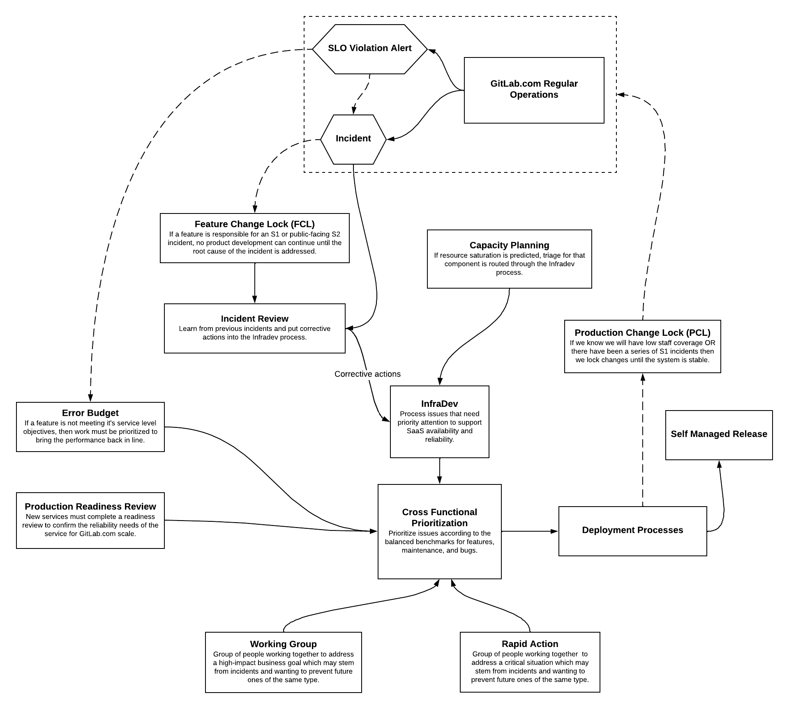

At GitLab we have a number of engineering processes that we use on a daily basis.

The diagram below shows how these processes interact with one another. Links to each process are available below the image.

## Links

1. [Feature Change Lock (FCL)](https://about.gitlab.com/handbook/engineering/#feature-change-locks)
1. [Production Change Lock (PCL)](https://about.gitlab.com/handbook/engineering/infrastructure/change-management/#production-change-lock-pcl)
1. [Error budgets](https://about.gitlab.com/handbook/engineering/error-budgets/)
1. [Capacity planning](https://about.gitlab.com/handbook/engineering/infrastructure/capacity-planning/)
1. [Rapid actions](https://about.gitlab.com/handbook/product/product-processes/#rapid-action)
1. [Working groups](https://about.gitlab.com/company/team/structure/working-groups/)
1. [InfraDev](https://about.gitlab.com/handbook/engineering/workflow/#infradev)
1. [Cross Functional Prioritization](https://about.gitlab.com/handbook/product/product-processes/#prioritization)
1. [Incident Review](https://about.gitlab.com/handbook/engineering/infrastructure/incident-review/)
1. [Production readiness reviews](https://about.gitlab.com/handbook/engineering/infrastructure/production/readiness/)
1. [Deployment Processes](https://about.gitlab.com/handbook/engineering/releases/#gitlabcom-deployments)
1. GitLab.com Operational Processes
