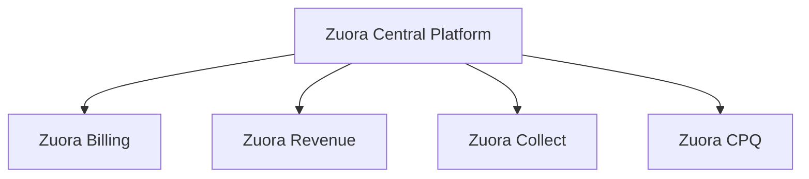
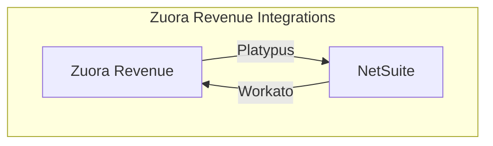

> **Note:** Refer to the **[Tech Stack Index](https://about.gitlab.com/handbook/business-technology/tech-stack/)** to browse Apps and **[Tech Stack Applications](https://about.gitlab.com/handbook/business-technology/tech-stack-applications/)** to manage Apps.

{}

### Implementation

Zuora consists of several app modules built on the [Zuora Central Platform](https://www.zuora.com/products/zuora-central-platform/). [Zuora Revenue](https://www.zuora.com/products/revenue/) is one of these modules.

### System Diagrams

[Zuora Revenue](https://www.zuora.com/products/revenue/) is one of several modules within the larger [Zuora Central Platform](https://www.zuora.com/products/zuora-central-platform/).

### Data Model

TBD

### Integrations

#### Zuora to NetSuite

Zuora Revenue data is synced to NetSuite using the [Zuora Revenue to NetSuite Integration](https://about.gitlab.com/handbook/business-technology/enterprise-applications/integrations/wiki/integrations-list/zuora-revenue-to-netsuite/).

### Key Reports / Dashboards

We have a collection of Sisense Dashboards that include Zuora Data. These dashboards include data from other data sources such as Salesforce:

- [TD: Zuora Revenue Waterfall](https://about.gitlab.com/handbook/business-technology/data-team/data-catalog/zuora_revenue_waterfall/)

