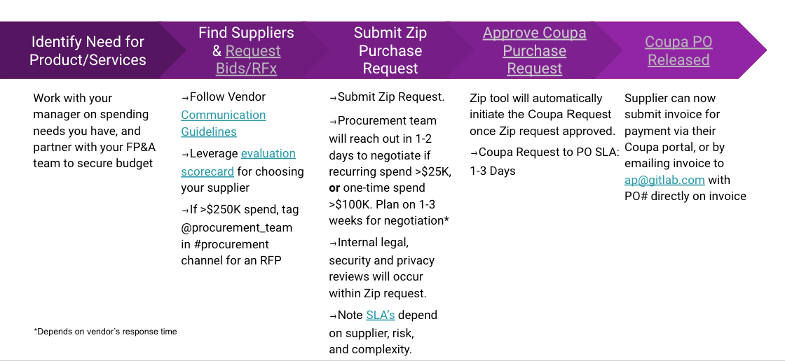

<!-- markdownlint-disable MD051 -->
## What is Procurement?

The Procurement team manages GitLab’s [Supplier Lifecycle](#vendor-lifecycle-management) through the process of strategically vetting and selecting vendors, negotiating commercial terms, the purchasing of goods and services, and managing the renewal or vendor offboarding process.

### Procurement Team Alignment

Division alignment for spend over >$25k USD:

- Marketing - Ashley Abbate
- Sales - Ashley Abbate
- Product - Adrienne Ruhaak
- Engineering - Adrienne Ruhaak
- People - Adrienne Ruhaak
- Finance - Adrienne Ruhaak
- Legal - Adrienne Ruhaak
- All division spend <$25k USD - Dasha Yarmusik
- Individual Software Purchases - Anam Shaikh

### Shared Goals

Procurement is a cross-functional team that supports GitLab as a public company. We have four key objectives monitored in the following ways:
1. Strategic partnerships with business stakeholders - meet on a quarterly basis to review new or renewing third party spend and supplier management opportunities
    - Metric(s): Supplier segmentation tiers 
1. Achieving annual cost avoidance (soft) savings and year over year (hard) savings
    - Metric(s): **Soft Savings** (cost avoidance) is mitigating proposed cost increases or any negotiations for new purchases. **Hard Savings** (year over year) is a decrease in cost from last year and is only valid for renewals. This can include decreasing unit costs, removing users and/or scaling back services and scope
1. [Third party risk management](#third-party-risk-management) and ensuring we are getting the best commercial terms with the least amount of risk for GitLab
    - Metric(s): the number of active and new vendors each quarter, and reported and monitored via internal and external audit
1. Responsible sourcing/purchasing and supplier diversity - managed through the Zip and Coupa onboarding and purchasing process
    - Metric(s): [Zip SLAs](#review-steps-timeline-and-considerations) and diverse suppliers

### Vendor Lifecycle Management

The Procurement team is responsible for ensuring there is a process for suppliers to be managed throughout their lifecycle of doing business with GitLab from initial selection and contracting to recurring reviews and renewals to cancellation.

#### 1. RFP and Vendor Selection

All new spend, changing of vendors for existing services, and market reviews every 3 years for existing contracts should follow the [RFP and Vendor Selection process](https://internal.gitlab.com/handbook/finance/procurement/), unless approved by your Procurement Category Manager, to ensure we are choosing the best partner for GitLab with the best commercial terms. This must be done prior to verbally agreeing to terms or contracting with any new or existing vendor.
- Follow the RFP process outlined in the [internal handbook](https://internal.gitlab.com/handbook/finance/procurement/). You will find resources and templates for RFP events at any level, whether it is a quick bid or a full procurement-led RFP with 5+ vendors. Always reach out to your Procurement Cateogry Manager to notify them that an RFP is being conducted- they can assist in the process and can answer any questions.
    - As part of this process, create an issue with the [RFP Intake template](https://gitlab.com/gitlab-com/Finance-Division/procurement-team/procurement/-/issues/new#) and tag your [Category Manager](#procurement-team-alignment).

Before sharing details and/or confidential information regarding GitLab business needs, obtain a [Mutual Non-Disclosure Agreement](https://about.gitlab.com/handbook/legal/NDA/#) from the potential vendor(s). Refer to the [Signature Authorization Matrix](https://internal.gitlab.com/handbook/company/authorization-matrix/) for signing authority.

All vendors must adhere to the [GitLab Partner Code of Ethics](https://about.gitlab.com/handbook/legal/partner-code-of-ethics/). It is mandatory all vendors contractually adhere to this if they would like to do business with us. (Note these are typically not required in event related agreements unless the vendor is providing services).

#### 2. Negotiation, Privacy and Security Review

Depending on the amount of spend, Procurement will assist or lead in negotiating the pricing and commercial terms of the contract.

Depending on the types of data shared with the vendor, Privacy and Security will need to complete a review of the vendor

For more information on these requirements and steps, see the [Review Steps, Timeline, and Considerations section](#review-steps-timeline-and-considerations) 

#### 3. Contracting

All work that is done with a vendor must have a completed contract to be compliant and work may not be started until a contract is in place. Contracts include [NDAs](https://about.gitlab.com/handbook/legal/NDA/#), Master Service Agreements and Statements of Works. Our legal team assists with this step in the process. Please see the [legal review process](#3a-legal-review-3-to-21-days) for more details. 

Additionally, please note that a small number of team members can sign agreements on behalf of GitLab - please see the [Authorization Matrix](https://internal.gitlab.com/handbook/company/authorization-matrix/) for more details.

#### 4. Vendor Onboarding

In order for vendors to be paid, they need to complete their onboarding in our systems. Please see the [New Vendor Onboarding](#1b-new-supplier-onboarding-2-3-days-if-required) section for more details.

#### 5. Recurring Vendor Reviews and Management

Procurement will work with you through the Quarterly Procurement & Business Spotlights to review upcoming renewals and cancellations, new spend projects, and identifying [vendor’s segmentation tier:](https://docs.google.com/spreadsheets/d/1tgNYN15VcHwNCeM6_D3ligLiJdYlesvsq3TNEG0VRBI/edit?usp=sharing) Strategic, Niche, Commodity, or Transactional. 

Identifying the Segmentation Tier your supplier(s) falls within helps determine the right vendor management approach, e.g. renew the contract, RFP, business reviews on a recurring cadence, continuous improvement plans, etc.

If holding a business review with a vendor, the following topics should be discussed:
- Success criteria of the contract
- What is going well
- What can be improved
- Review of any issues and remediation expected
- Overview of the contract and its utilization

##### Vendor Renewals

On a quarterly basis, the Procurement team will meet with business stakeholders in each department to review a rolling 12 month list of renewals, focusing on the upcoming 2 quarters. This list is pulled from Zip and Coupa. The list should be reviewed and prioritized with the business owners. The renewal process should start at least 90 days ahead of the renewal date providing ample time to review the terms and decide:
- Are there any additional security requirements for the vendor?
- Has the vendor had an RFP for pricing in last 3 years?
- Do we want to terminate or reduce spend and need to proactively notify per the contract?
- Do we want to change any terms of our contract?

#### 6. Cancellation

The following methods will be used to capture cancellations (which include terminations and/or non-renewals):

1. **Automated Notice:** The DRI for the purchased item will receive notification of an upcoming renewal;
2. **Procurement Led:** The Procurement Team will review upcoming renewals, and active purchases, during the quarterly "Category Spotlight" meetings. 
3. **DRI Led:** DRI's and other stakeholders may determine that products, events and/or services are no longer needed. 

For each of the above, if a cancellation is desired (which include terminations and/or non-renewals) please follow the "Cancellation Process" outlined below:

1. Submit a **Termination/Non-Renewal Request** through Zip by completing the intake form and providing copies of the existing contract(s) that you are canceling.
2. Through Zip, Procurement and Legal will work with the requester to provide instructions on how, when, and who should notify the vendor. For most non-renewal notices, the business owner will notify the vendor via Legal’s guidance.
   - Security and Privacy will also be added for awareness and review if data is being shared with the vendor to determine the requirements of returning or deleting the data.
3. For certain cancellation requests, like Software for example, IT will be included in the Zip workflow to determine and complete the proper deprovisioning and system offboarding requirements 
4. If necessary, the requester and/or business owner will need to create and execute on a communication plan to notify all or impacted team members of the cancellation.

Upcoming terminations/non-renewals should be discussed with Procurement during the Quarterly Category Spotlight meetings that Procurement holds with category leads/budget owners. As Procurement is made aware of upcoming cancellations during these meetings, Procurement will review on a quarterly basis any known cancellations with Legal to ensure notification requirements are met. Procurement and Legal will then work with the business owner on completing the above process. If a cancellation is determined outside of this quarterly cadence, notify your Procurement Category Manager and complete the above process as soon as possible.

## The Procurement Process
Anytime a group of suppliers are being evaluated for services/goods or a purchase is being made on behalf of GitLab that does not qualify as a [personal expense](https://about.gitlab.com/handbook/finance/expenses/) or meet the list of [exceptions](#what-are-the-exceptions-to-the-po-policy), Procurement must be engaged BEFORE a purchase and/or work can begin. Start the Procurement Process

1. Before agreeing to any business, legal and/or pricing terms with a supplier, whether in conversation or email
2. Immediately when you receive a contract and/or quote for new and/or recurring business
    - If you have received a contract from a supplier, tell them you will send to your procurement team for review
3. When evaluating a group of suppliers and/or starting the [RFP Process](https://internal.gitlab.com/handbook/finance/procurement/)
4. If unsure where or when to begin, tag the @procurement_team in the #procurement slack channel for support. You can also reach out to your [Procurement Category Manager](#procurement-team-alignment) directly.

### How to start the Procurement Process
Majority of the Procurement Process lives within our Procurement system called Zip. You can access Zip via your [Okta home page](https://gitlab.okta.com/app/UserHome#), or if you need Zip access, [submit an access request here](https://gitlab.com/gitlab-com/team-member-epics/access-requests/-/issues/new?issuable_template=Individual_Bulk_Access_Request&_gl=1*bsfkbc*_ga*MzkwMDUyMjg5LjE2MzU3NzYxMDA.*_ga_ENFH3X7M5Y*MTY3NzYyMDEwMi4xMzkuMS4xNjc3NjIwOTc3LjAuMC4w).

For more Zip training materials, review the [Zip End Users Guide](/handbook/business-technology/enterprise-applications/guides/zip-guide/) and the [Tips for Submitting a Zip Request page]().

Depending on a few factors of your purchase, there are different ways to engage Procurement and start the Procurement process:
1. Submit a Zip Request for
   1. [Purchase Requests for renewals of existing vendor's services](https://about.gitlab.com/handbook/business-technology/enterprise-applications/guides/zip-guide/#how-to-initiate-a-new-request)
   2. [Purchase Requests for new spend **under $25k**](https://about.gitlab.com/handbook/business-technology/enterprise-applications/guides/zip-guide/#how-to-initiate-a-new-request)
   3. [Change Requests to existing POs](https://about.gitlab.com/handbook/business-technology/enterprise-applications/guides/zip-guide/#how-to-do-a-request-change)
   4. [$0 contract reviews including demos and trials](https://about.gitlab.com/handbook/business-technology/enterprise-applications/guides/zip-guide/#how-to-request-a-signature-on-a-poc-agreement)
   5. Partner Revenue Payments
   6. [Individual Use Software](https://about.gitlab.com/handbook/finance/procurement/personal-use-software/)
   7. [Providing Termination or Non-Renewal Notice](https://about.gitlab.com/handbook/finance/procurement/#6-cancellation)
2. For new spend, changing vendors for existing services, or after 3 years of renewing a service, follow the [RFP Process](https://internal.gitlab.com/handbook/finance/procurement/)
   1. Over $250K: Procurement led RFP, typically 5+ vendor bids
   2. $100K - $250K: Business led RFP, 2-3 vendor bids required
   3. $25K - $100K: Business led quick-bid, 2 vendor bids required
   4. Under $25K: no bid required

### Step 2: Submit your Zip Request

On the Zip homepage, click “New Requests” in the top right corner of the webpage. From there, you will have the option to request a Purchase, NDA, or Change Request, which will prompt you to fill in all the details about your purchase.

#### Purchase Request

#### General Information

1. Description & Category
    - Provide a brief description of your purchase and be sure to select the correct category and subcategories as needed.
       - 

          
Submitting a Purchase Request for a Contractor

          - A Contractor or an Independent Contractor (IC) is *an individual* (not an entity / business) who provides goods, labor, or services to an organization but is not employed by the business. Instead, they work with the business as or part of a third party. Instead of being hired through the talent acquisition process, a Contractor communicates directly with the manager for the project and submits a competitive bid to be hired.
          - For GitLab purposes, a Contractor will likely communicate directly with the Procurement Team initially for onboarding and regarding the terms of the contract and the statement of work. Contractors set their own schedules and are responsible for arranging their own training and covering the costs of training. The specific test of whether someone is an “employee” or truly meets the definition of a “Contractor” depends on the law of the jurisdiction where the Contractor is located. For example, in California, a worker is by default considered an employee, unless the hiring entity meets all three conditions of the ABC Test:

          1. The person is independent of the hiring organization in connection with the performance of the work, both under the contract for the performance of the work and in fact.
          1. The person performs work that is outside the hiring entity’s business
          1. The person is routinely doing work in an independently established trade, occupation, or business that is the same as the work being requested and performed.

          *NOTE:* All requests for an Independent Contractor should include the requestor and/or Procurement asking if the potential Independent Contractor has a company under which they will, (i) receive payment(s), or (ii) enter into terms and conditions with GitLab for the delivery of services. GitLab's preference is to enter into a business-to-business relationship with all vendors.

          For GitLab procurement process purposes, the term Independent Contractor (IC) is used when the ICSA form is required for completion and the IC is separate (independent) from a Third Party Professional Services vendor. If you have any questions on the definition or when to use the applicable contracts/terms, please reach out to Procurement in the Procurement slack channel.

#### How to Submit a Zip Request for a Contractor

          1. Before submitting a Zip request for a Contractor:
             1. Confirm you have internal approval from FP&A and your management to hire a Contractor and that this role is (i) not currently being performed by a GitLab Employee or (ii) there is not an open headcount position for this role.
             1. Confirm the potential Independent Contractor does not own / operate a business or entity which should be used to enter into applicable terms and conditions
             1. If the Contractor requires access to GitLab [Orange or Red data](https://internal.gitlab.com/handbook/security/data_classification/), a [background screening]() and subsequent Zip approval must be obtained from PeopleOps. Additionally, access to Orange or Red data requires [appropriate security measures]() are in place. As such, a GitLab laptop must be issued followed by a Zip approval from IT Ops validating laptop issuance.
             1. If the Contractor requires [GitLab equipment](https://gitlab.com/gitlab-com/www-gitlab-com/-/blob/a97ab3e71d08b55aea70f119caf5d41689ae9549/sites/handbook/source/handbook/finance/procurement/index.html.md#security-approval-requirements-for-contractors-consultants)(i.e. has access to Orange or Red data), the Zip purchase requisition will need to be submitted 10 days in advance of the normal approval [timeline](#-how-long-does-it-take-to-approve-my-zip-purchase-request) to account for ordering and shipping of the equipment. [Certain locations](https://gitlab.com/gitlab-com/www-gitlab-com/-/merge_requests/127746#note_1497241068) will require IT Approval before providing the equipment. If you are unsure if the IC will require GitLab equipment, please reach out to the #it_help channel in slack.
                1. Lead times start once the purchase requisition has been fully approved and the PO is released. Please account for this time and the Zip [approval times](#-how-long-does-it-take-to-approve-my-zip-purchase-request) to determine how far in advance your Zip Request needs to be submitted prior to the IC’s start date.
          1. Open Zip to submit your request for a contractor by selecting “Request a Purchase”
             1. You must select the following to receive the required approvals:
                1. Category = Consulting, Professional Services & Training
                1. Subcategory = Consulting fees
                1. Commodity = Consulting fees
             1. In the Professional Services section, the type of contract required is determined by the “How is this contractor being hired?” question
                1. For Contractors hired through a Third Party Professional Services Vendor, for example: Upwork, select “Contractor hired through a 3rd Party Professional Services Vendor”. These types of requests will require a governing Agreement and Statement of Work
                1. For Independent Contractors, as defined above, select “Contractor hired directly and independent of a 3rd Party (requires ICSA completion)”. These types of requests require the [ICSA template](https://docs.google.com/document/d/1KDkv6oWv6V-6k9v5GhjF7WPMoQJOV5iubCZzLGn7xfY/edit?usp=sharing) to be completed.
                   1. Once this template is complete, you can download it and attach it to your Zip request.
          1. The Zip Request will be reviewed by the applicable stakeholders
          1. Once the Zip Request is approved, open and complete the [Individual Contributor Onboarding Issue](https://gitlab.com/gitlab-com/temporary-service-providers/lifecycle/-/issues/new?issuable_template=orientation-issue)
          1. If you need to extend the contract term of an IC, submit a [Zip Change Request](#step-2-submit-your-zip-request)
          1. If you need to cancel / terminate the Contractor’s agreement earlier than the specified term, review the [Termination process](#termination) and reach out to the Procurement Team in the #procurement slack channel

          *Contractors / Consultants that require Orange and Red Data access, that will be processed or stored outside GitLab's systems, are considered "Professional Services" and and are subject to a full security review. Please see the [Security Third Party Risk Management Handbook]() for more details.

          

    - “New” purchase would be any product or service that is brand new. “Renewal” would be any renewals or add-ons with an existing vendor.
       - For New Software, Vendors will need to complete the [IT Questionnaire tab](https://docs.google.com/spreadsheets/d/17-NdZF0SeOS_b59XE9lLg9cuCD9iKKlO/edit#gid=392482466). IT request this information to perform a comprehensive assessment of applications against GitLab technology requirements. Please make a copy of this tab (if not filled out during a formal RFP), have vendor complete, and attach in the documents section of your Zip Request for IT review.
          - If you have any questions regarding the IT Questionnaire, please contact the Enterprise Applications team in the *#enterprise-apps* slack channel.

1. Will a virtual card be used to pay this vendor?
    - This applies to instances where the supplier only accepts online credit card payments. More info on allowed uses here (link to new Virtual Card page)
    - If yes, select “Yes,” fill in the supplier contact information, and proceed with the request.

1. Vendor Name and Primary Contact
    - If an existing vendor or you are unsure, start typing the vendor name in Zip. If vendor exists, Zip will populate it in the dropdown. You can then select the existing Primary Vendor Contact or select ‘Add new contact’ and complete the the contact information
    - If New Vendor:
        - Review Vendor Selection Process and ping the #procurement slack channel if you would like support choosing a new vendor and/or executing an RFP.
        - When you fill in the details of your Zip request, you will be asked to fill in the supplier name. If this supplier is not already in our system, you will need to click the “add new” option once you type in the supplier name. Please be sure to fill in all details so that the procurement team can add the supplier to Coupa. While we use Zip internally now, Coupa will still be the tool used to pay our suppliers.
        - After you’ve submitted your request for a new supplier, the procurement and AP teams will review and approve within 1-2 business days.
        - If you need this escalated:
            - Tag the procurement team in the #procurement slack channel
            - Include link to the new supplier request and reason for escalation
            - Once the procurement team approves, the supplier will receive an onboarding email from Coupa requesting them to complete the onboarding process. This includes providing tax and banking information that only the supplier can provide.

{}
To help expedite the review and approval of your purchase request, be prepared to provide the following information in your Zip Request. If you don't know all of this information yet or are wanting support to negotiate that's ok!
- Spend Information:
    - Provide all of the spend details including required budget amount, contract term, and line item details.
    - The Line Item Breakdown should match the line items on the Order Form/Contract and should be entered separately for each year of the contract if a multi-year term.
    - The sum of the Line Items must equal the amount entered for budget.
    - Check the boxes of the supporting documentation received. You will upload these in the Documents section at the end of the request process
- IT & Security Information:
    - Complete the Data Information section. Depending on your selection(s), additional required questions will appear.
        - If any data will be shared, a Vendor Security Review will be completed. The vendor will receive an email communication from ZenGRC requesting information regarding their security protocols.
        - If any personal data will be shared or accessed, a Privacy Review may be required. The vendor will receive communication from Zip requesting information regarding their data privacy practices.
        - Be as specific as you can about the type of data the vendor and/or system will have access to, and specifics about how they will receive that data. Failure to complete this section accurately will delay the review and approval of your request.
        - If any personal data will be shared, the Vendor will need to sign our DPA and SCC’s as directed by state and/or country statutory requirements.
            - **TIP:** To increase speed of approval send your supplier contact GitLab's [DPA/SCCs](https://docs.google.com/document/d/1MXluQhBlLtRqD854SdsbjtLMnqVwCcqx/edit) for review right away. For the DPA, please inform the supplier contact that Scheudle 1 and Schdule 3 must be completed by the supplier.  Also alert them to the request from ZenGRC for security completion and Zip for privacy review completion. Let them know review and approval can't begin without these pieces.
- Documents & Surveys:
    - For any software renewal/add-on that is based on usage (e.g. user quantities), a usage report is required for Procurement’s review. This can be uploaded in the Documents section under ‘Please attach any additional files for reference’ at the end of the request process.
        - Based on the usage report, Procurement will review the request to increase, decrease, or hold quantities flat.
    - Upload any contracts and/or quotes you've received.
        - Draft contracts are okay. Make note of any terms and/or pricing still being finalized- this can be done in the Comments section once you submit your request.
{}

### Step 4: Monitor Progress in Zip

You can check the status of your Zip request at any time by looking at the approval flow chart in the “Overview” section of the request.

- Buyer Review: Procurement is checking to ensure all request details are complete and accurate. This will also include setting up any new suppliers in Coupa, which may take several days depending on the response time of the vendor.
- Security/Privacy/Legal/Buyer Negotiation: These steps can occur concurrently, and each team will conduct their review at the same time to reduce overall approval times.
- Final Buyer Review and Create Coupa Purchase Request (PR): Procurement will double check all request details and activate the Zip<>Coupa integration to create the Coupa request. Coupa requests now only require FP&A and management hierarchy approvals. The Zip requester will not need to take any action in Coupa.
- Coupa Approval and Execute Contract: Once Coupa approvals are complete, Procurement will send any relevant contracts for signature via DocuSign; signatories are determined by GitLab’s [authorization matrix](). Once the contract is fully executed by both parties, the procurement team will approve the Zip & Coupa Request, fully approving the Purchase Request and simultaneously releasing the Coupa Purchase Order (PO) to facilitate supplier payment.

### Step 5: Congratulations on your Purchase Order (PO)!

1. Once the PO is generated, GitLab has officially placed an order for your purchase!! You may now begin work and/or obtaining the products/services.
1. The supplier will receive a copy of the PO order and number at the email address they supplied for Accounts Payable.
1. The supplier will receive communication from Coupa indicating how to make payment one of two ways:
    - Directly in their Coupa portal
    - Send invoice to ap@gitlab.com with PO number included on the invoice
        - Failure to follow these instructions will delay payment
        - Invoices uploaded to Coupa by a GitLab team member are not routed for payment.
1. If your request was new software, [update the tech stack](/handbook/business-technology/tech-stack-applications/#add-new-system-to-the-tech-stack) after the Zip Request is fully approved and the contract signed.

Congratulations and thank you for following this process to support GitLab as a public company!

## <i class="far fa-paper-plane" id="biz-tech-icons"></i> How long does it take to approve my Zip Purchase Request?

As a general rule, plan on **5 Business Days** to approve your Purchase Request for an **existing supplier with standard terms, conditions, and low risk.**

If your request [requires negotiation](#-when-does-procurement-negotiate-my-contract-and-how-long-does-that-take), a [vendor security review](), and/or legal revisions, this will take longer as noted below.

Please plan accordingly and open your Zip Purchase Request allowing the cross-functional teams enough time to complete the review

If your request meets any of the below criteria, add the additional time noted for the activity to the 5 day baseline above:

### New Supplier Onboarding: 2-3+ Days

- This is entirely dependent upon the suppliers response time.
- Once supplier information has been submitted in Zip and the Procurement team sets the vendor up in Coupa, the supplier receives an email from Coupa requesting banking and tax information to facilitate payment.
- The procurement team cannot complete this on the supplier’s behalf since we do not know this information. If we did, it would be a violation of SOX Compliance guidelines.
- If your supplier isn’t onboarded after 2 days, contact your supplier directly requesting they do so ASAP since their contract cannot be reviewed or approved until this is completed. Carbon copy procurement@gitlab.com

**In the event two or more of the below activities are required, they will happen in parallel to one another:**

### Negotiation: 1-3 Weeks

- Required for: SaaS contracts >$25K, and one-time contracts >$100K.
- Turn time is based on the level of negotiation required and the suppliers willingness to meet budget and benchmark indicators.

### Security Review: 4-14 Days

- [Security Third Party Risk Management]() reviews are required for vendors that collect, process, or store Orange / Red Data, software providers (SaaS and On-premise), and independent contractors / consultants. (Excluding field marketing events)
- This activity cannot begin until **after** the supplier completes the security questionnaire and supplies their security documentation. Oftentimes, it can take 1-2 weeks for the supplier to respond and complete the requested materials. The security review SLA begins once that is completed. Time before this activity can begin is entirely dependent upon the supplier's response time and maturity of security protocols.
- **TIP:** To increase speed of approval, upload any security compliance documentation (SOC-2 Report, ISO27001 Certificate) to the ZipHQ Request and notify your supplier contact they will be receiving a request from ZenGRC for completion ASAP.
- For any inquiries and questions, please tag @securityrisk in the #procurement slack channel.

### PeopleOps Review: 1-4 Days

- PeopleOps serve as reviewers on all professional services requisitions to determine if a background screening is necessary.
- Per GitLab's [People Policies]() contractors are subject to complete a background screening. GitLab will accept a completed background screening from a contractor's employer. However, if a background screening was never conducted GitLab will either complete one or ask that one be completed.
- A background screening can be requested by opening an issue in the [Lifecycle Management](https://gitlab.com/gitlab-com/temporary-service-providers/lifecycle/-/issues) project by using the `background_check_request` template.
- Approval will occur once proof of a completed or an initiated background screening has been shared or once the contractor has submitted their background screening for processing.
- The Sr. Background Check Specialist will only follow up if a result of concern returns on the background screening.
- Questions and/or proof regarding background screenings on professional service requisitions in Zip can be sent to [backgroundchecks@gitlab.com](mailto:backgroundchecks@gitlab.com).

### Privacy Review: 4-14 Days

- This activity begins **after** the supplier completes a Privacy and Trade Compliance Assessment form and a Transfer Impact Assessment Form (where personal data is transferred from the EU to the U.S.) Oftentimes, it can take a week for the supplier to respond and complete the requested forms. The SLA begins once that is completed.
- Time before this activity can begin is entirely dependent upon the supplier's response time and whether a DPA/SCCs are required.
- A Privacy Review is required for all SaaS purchases and other purchase types where the supplier will receive from GitLab or collect on GitLab's behalf red/orange data.
- A DPA/SCCs are often made part of the agreement with the supplier. Generally, Privacy would prefer to use our DPA/SCCs but if the the supplier provides their DPA/SCCs as an exhibit to the main agreement, Legal and Privacy may use the supplier's version to arrive at a final agreed upon version. Procurement will obtain executed versions of DPA/SCCs in the Final Buyer Review stage.
- **TIP:** To increase speed of approval, add a link to the suppliers privacy notice; upload the suppliers Transfer Impact Assessment Guide; and upload a word version of their DPA/SCCs if the supplier requuests us to use their version.

### Legal Review: 3 Days - 3+ Weeks

*Note: The amount of time for review, and to reach execution, is based on the details below. Use these SLA's as guidelines, noting that each contract review process is unique and if additional terms, requirements, and/or risks are identified the timeline for completion may be extended*

- **Existing Vendors: 3-5 Days**
    - If new terms, and/or risks are introduced or required, this may take longer.
    - Any delays from the supplier, will delay final approvals.
- **New Vendors: 1-3+ weeks**
    - If vendor doesn't readily accept the GitLab standard terms, additional rounds of red-lines and negotiations may be required, extending this SLA.
    - Whenever possible, the legal team hopes to achieve red-lines--to be provided back to the vendor--no later than five (5) business days after being assigned.

**Types of Vendors**

- Net New:
    - These require the most amount of time as GitLab will be establishing (for the first time) terms and conditions which will govern the use of the products and/or services being procured.
    - Negotiations can vary from 1 week to multiple months based on the level of detail and modifications required to reach executable terms.
- Renew / Upsell:
   - These generally require much less time as existing terms are in place which will underline the products and/or services being offered.
   - That being said, in the event GitLab where to add a new product and/or service (from an existing Vendor) additional cycles may be required in order to create amendment(s) to the existing agreement.
- One-time Transaction:
   - These generally require much less time as existing terms are in place which will underline the products and/or services being offered.

**Types of Agreements (generally broken into three (3) categories)**

- Software (SaaS & On-Prem): Requires the most rigorous review to ensure the rights and obligations placed upon GitLab are, (i) reasonable given the Software being provided, and (ii) align with GitLab contracting and industry standards.
- Professional Services / Training: Requires detailed review to ensure intellectual property ownership aligns with our intentions, as well as, reasonable obligations being placed upon GitLab.
- Marketing / Events: Generally, requires the least amount of time to review as the obligations are standardized given the event in question and program provided. Details regarding events may include negotiations with regards to Force Majeure, cancellation (including penalty), and ensuring the terms of the Agreement align with those of the requesting GitLab Team Members.
- Data Processing Agreement (DPA)/Standard Contractual Clauses (SCCs): Required when personal data is shared with, accesssed, or collectd by the supplier on behalf of GitLab. DPA/SCCs are generally affixed to an agreement but may be required as a separate agreement upon the determination of Privacy.

**Additional Details**

- As discussed above, the turnaround time for the review of an Agreement is contingent on many factors. The goal of the legal team is to review and provide red-lines as thoroughly and promptly as possible.
- The ability for GitLab to process and work efficiently through an agreement negotiation relies on the vendor, and vendor counsel, to respond promptly to GitLab red-lines and comments.

## <i class="far fa-paper-plane" id="biz-tech-icons"></i> What if I have an Urgent Request?

If you are unable to plan and have a legitimate reason to escalate a purchase request, follow the process below.

- Post in #procurement slack channel request for escalation with:
    - Link to your Zip Request
    - Date needed
    - Specific and quantifiable impact to the business if date is missed.
        - "Supplier wants it signed today" does not qualify as a reason for escalation and these requests will be denied.
        - "Price will increase $45K if not signed by Friday" or "Material negative brand impact if not signed by Friday due to missed PR deadlines" are specific, tangible, business impacts that will be reviewed.
- Truly urgent and business critical requests will be evaluated, please note these are disruptive to our workflow and our ability to meet SLA's for requests opened on time.
- We may or may not be able to accommodate your urgent request based on the risk and bandwidth available.
- When you know you have a critical request with a deadline, enter the request into Zip 1-2 weeks prior to needing approval to avoid needing escalation. Do this even if the contract isn’t final yet to help expedite the process.

## <i class="far fa-paper-plane" id="biz-tech-icons"></i> How do I increase the dollar amount for an existing PO?

- If you have a PO with an existing supplier and the cost has increased, you can update the existing PO for the new dollar amount.
- When you log into Zip and select “New Request,” you will see an option to “Request a Change (amend contract or PO change)”
- Fill in all the required information and the Procurement team will amend the PO in Coupa on your behalf.
- Attach supporting documentation from the supplier for the change in amount. This could be a SOW, Change Request, and/or Order Form based on the purchase type.
- This will require the same approvals as a net new request.

## <i class="fas fa-book" id="biz-tech-icons"></i> What are the exceptions to the PO Policy?

Exceptions to the PO Policy are:

1. Purchases under $5K
1. Charitable Contributions (Donations)
1. Computer/Hardware Advances (if unable to be paid through Payroll Dept)
1. Interview Candidate Reimbursement
1. Legal Fees
1. Audit, Tax, and Insurance Fees
1. Benefits, PEO Providers and Payroll
1. AR/Customer Refunds
1. Board of Director Payments
1. Financing, Banking and Investing (incl interest, debt, FX, fees)
1. Corporate Credit Card
1. Urgent Payments not included on list above (approval required from VP, Corporate Controller and/or PAO)

## <i class="fas fa-stream" id="biz-tech-icons"></i> Vendor lifecycle management

### Summary

The procurement team is responsible for ensuring there is a process for vendors to be managed throughout the lifecycle from:
    - Selection
    - Security Review
    - Contracting
    - Negotiation
    - Onboarding
    - Recurring management and vendor review
    - Vendor Renewal
    - Termination

### Vendor Selection and RFP

Please review the below guidelines:
1. Review the market capabilities defined by your overall spend before selecting your vendor.
1. Before sharing details and/or confidential information regarding GitLab business needs, obtain a [Mutual Non-Disclosure Agreement](https://drive.google.com/file/d/1kQfvcnJ_G-ljZKmBnAFbphl-yFfF7W5U/view?usp=sharing) from the potential vendor (s). Refer to the [Signature Authorization Matrix]() for signing authority.
1. Follow the RFP process outlined in the [internal handbook](https://internal.gitlab.com/handbook/finance/procurement/). You will find resources and templates for RFP events at any level, whether it is a quick bid or a full procurement-led RFP with 5+ vendors. Always reach out to your Procurement Cateogry Manager to notify them that an RFP is being conducted- they can assist in the process and can answer any questions.
    - As part of this process, create an issue with the [RFP Intake template](https://gitlab.com/gitlab-com/Finance-Division/procurement-team/procurement/-/issues/new#) and tag your Category Manager.
1. All vendors must adhere to the [GitLab Partner Code of Ethics](https://about.gitlab.com/handbook/legal/partner-code-of-ethics/). It is mandatory all vendors contractually adhere to this if they would like to do business with us. (Note these are typically not required in event related agreements unless the vendor is providing services).
1. Identify your bid requirements based on your estimated spend. This applies to all new vendor spend and every 3 years for existing contracts:
    - $0 - $25K: No bid required
    - $25k - $100k: 2+ bids, business led quick-bid
    - $101K - $250K: 2 -3+ Bids, business-led RFP
    - Greater than $250K: 5+ bids, procurement-led RFP

### Contracting

All work that is done with a vendor must have a completed contract to be compliant and work may not be completed until a contract is in place. Contracts include NDAs, Master Service Agreements and Statements of Works. Our legal team assists with this step in the process. Please see the [legal review process](#legal-review-3-days---3-weeks) for more details. Additionally, please note that a small number of team members can sign agreements on behalf of GitLab - please see the [authorization matrix]() for more details.

### Negotiation

Procurement team can assist you in your negotiation. The goal is to get the best price inline with benchmarks.

### Security Review

All vendors require a security review. Please see the details of SLA and how to complete this process in our [Zip documentation section](#security-review-4-14-days).

### Privacy Review

All vendors processing [Personal Data]() require a privacy review. A full privacy review is only required every 24-months, provided the Vendor completed a full and satisfactory privacy review during the prior procurement cycle. Please see the details of SLA and how to complete this process in our [Zip documentation section](#privacy-review4-14-days)

### Onboarding

In order for your vendor to be able to be paid they need to be onboarded into our systems. The details are in our [Zip documentation section](#new-supplier-onboarding-2-3-days).

### Recurring management and vendor review

The business owner must run an annual business review with vendors who meet the following criteria:

- Over $100K in annual spend
- Is up for renewal

The business owner must run a bi-annual business review with vendors who meet the following criteria:

- Over $500K in annual spend
- Is mission critical software

The business review must cover:

- Success criteria of the contract
- What is going well
- What can be improved
- Review of any issues and remediation expected

### Vendor Renewal Process

The procurement team should pull a list every quarter of a rolling 12 month renewals. The source system for this pull is XXX. The list should be reviewed and prioritized with the business owners. The renewal process should start at least 90 days ahead of the renewal date providing ample time to review the terms and decide:

- Are there any additional security requirements for the vendor?
- Has the vendor had an RFP for pricing in last 3 years?
- Do we want to terminate or reduce spend and need to proactively notify per the contract?
- Do we want to change any terms of our contract?

## Termination

The following methods will be used to capture cancellations (which include terminations and/or non-renewals):

1. **Automated Notice:** The DRI for the purchased item will receive notification of an upcoming renewal;
1. **Procurement Led:** The Procurement Team will review upcoming renewals, and active purchases, during the quarterly "Category Spotlight" meetings.
1. **DRI Led:** DRI's and other stakeholders may determine that products, events and/or services are no longer needed.

For each of the above, if a cancellation is desired (which include terminations and/or non-renewals) please follow the "Cancellation Process"

### Cancellation Process

1. Complete and submit a [Cancellation Request Issue Template](https://gitlab.com/gitlab-com/Finance-Division/procurement-team/procurement/-/issues/new?issuable_template=cancellation_request). The purpose of this template is to notify other impacted teams, such as IT for software cancellation, and complete all discovery to ensure we can cancel prior to engaging Legal and Procurement.
1. Once discovery is complete in the issue, a **Zip Cancellation Request** can be submitted.
1. Through Zip, Procurement and Legal will work with the requester to provide instructions on how, when, and who should notify the vendor. For most non-renewal notices, the business owner will notify the vendor via Legal’s guidance.
   1. Security and Privacy will also be added for awareness and review if data is being shared with the vendor to determine the requirements of returning or deleting the data.
1. If necessary, the requester and/or business owner will need to create and execute on a communication plan to notify all or impacted team members of the cancellation.

Upcoming terminations/non-renewals should be discussed with Procurement during the Quarterly Category Spotlight meetings that Procurement holds with category leads/budget owners. As Procurement is made aware of upcoming cancellations during these meetings, Procurement will review on a quarterly basis any known cancellations with Legal to ensure notification requirements are met. Procurement and Legal will then work with the business owner on completing the above process. If a cancellation is determined outside of this quarterly cadence, notify your Procurement Category Manager and complete the above process as soon as possible.

## <i class="fas fa-book" id="biz-tech-icons"></i> Third Party Risk Management

The procurement team from a compliance and risk perspective has developed a process to handle third party risk to reduce the risk of the following:

- Financial Fraud or exposure created by third party behavior such as data leakage, security breach, business continuity, etc
- Failure of financial viability of third party impacting delivery
- Reputational damage arising from third party behavior
- Breach of regulation or law through third party action
- Disruption in customer service due to third parties

### When do we require a financial viability check?

When all of the following is met:

- Vendor is private company, LLC or self-employed
- Services provided are required for continued operations
    - Cloud hosting services
    - Services directly related to servicing customers with an uptime requirement
    - Storage of data that is not recoverable if vendor goes out of business
    - Software or services where it would take over 1 week to replace or swap

### How do we ensure terms to establish GitLab (and our Vendors) rights and responsibilities?

Any time GitLab engages with a third party for the procurement of goods and/or services, which require GitLab to engage in a contract, the GitLab Legal Procurement team will review the terms and conditions. The purpose of this team is to review the contract which GitLab will enter into, and ensure the following:

- Terms and conditions which are fair and reasonable given the type(s) of products and/or services being procured; and
- Adequate obligations on behalf of GitLab vendors to ensure compliance with, (a) GitLab’s Code of Conduct and other company policies, (b) applicable laws, rules and regulations (including protection of personal data), and (c) the delivery, support and provision of goods and/or services

In addition to ensuring terms and conditions, the GitLab Legal Procurement team collaborates frequently with procurement and business stakeholders to ensure any (and all) contracts align with the needs of the team. The GitLab Legal Procurement team addresses the needs of stakeholders ranging from complex technical application and platform services, to creating and drafting event contracts to meet the needs of GitLab events.

### How do we prevent disruption in customer service?

Agreements, as GitLab does with its own customers, include obligations that vendor’s have to GitLab. These can include uptime / downtime commitments (for SaaS providers), SLAs (for support), termination rights, and other commercial contract provisions which would enable GitLab to seek relief in the event of disruption

### Large Internal Events Process

For any large internal events with a total cost greater than $1M, such as SKO, President’s Club, Commit, etc, the following should be completed before any contracts are executed or any work is conducted. The planning stages for events of this size should be completed at least 18-24 months prior to the actual event. This allows for ample time to get the necessary internal approvals, run any RFPs needed, and book large hotel blocks or buyouts.

- Connect with your Procurement Category Manager and FP&A Business Partner to determine the various vendors needed to run the event and line item detail in the total event budget. This would include lodging, food & beverage, event planning, on-site support, excursions, travel, etc.
- Determine with your Procurement contact how these vendors will be selected and the timeline to run any necessary RFPs. RFPs should be conducted at least 20 months prior to the event dates.
- Upon completion of RFPs, the top 2-3 location options and their total pricing will be presented to the E Group DRI (CRO/CMO) and VP of Finance to determine the preferred location choice and corresponding budget. All information should be summarized in an issue where these approvals may be documented.
- Once preferred location and budget are tentatively chosen, this information will be presented to the CFO for approval, and will then be presented to the Board for approval at their quarterly meeting, or via email as necessary. Please note that Board approvals may take multiple weeks. CFO and Board approvals should be obtained no less than 18 months prior to the event dates.
- After all executive approvals are received, the Zip request(s) should be created to document official approvals, obtain signatures on contracts, and release PO(s).

## <i class="fas fa-book" id="biz-tech-icons"></i> Helpful Documents and Templates

### Contract Templates

- [GitLab Vendor Terms and Conditions]()
- [Logo Authorization Template](https://drive.google.com/file/d/1Vtq3UHc8lMfIbVFJ3Mc-PZZjb6_CKAvm/view?usp=sharing)
- [Data Processing Addendum (unlocked for editing)](https://docs.google.com/document/d/1U8jCxpRc21fNu6_VsYxsSSun3G7s4b2Q/edit?usp=share_link&ouid=101595031187349560306&rtpof=true&sd=true)
- [EU Standard Contractual Clauses](https://drive.google.com/file/d/17I4nirg99UPsrDi28VS1-R0B2FcKTKbz/view?usp=share_link)
- [US Contractor Agreement](https://docs.google.com/document/d/1KDkv6oWv6V-6k9v5GhjF7WPMoQJOV5iubCZzLGn7xfY/edit#)
- [SOW Template](https://docs.google.com/document/d/1IUgGGxmNSPZ3gJK-qt2LZ1vsKJZG1oWs/edit?usp=sharing&ouid=101595031187349560306&rtpof=true&sd=true)
- [Change Request Template](https://docs.google.com/document/d/1AHagOA8g_RSt9cpVHrlxiRHKOutcxvJ6/edit?usp=sharing&ouid=101595031187349560306&rtpof=true&sd=true)

#### Documentation

- [Non-Disclosure Agreement (NDA) Process](https://about.gitlab.com/handbook/legal/NDA/)
- [Certificate of Insurance Request Process](https://about.gitlab.com/handbook/legal/procurement-guide-collaborating-with-gitlab-legal/#requesting-a-certificate-of-insurance)
- [Uploading Third Party Contracts to ContractWorks](https://about.gitlab.com/handbook/legal/vendor-contract-filing-process/)
- [Company Information](https://gitlab.com/gitlab-com/Finance-Division/finance/-/wikis/company-information) - general information about each legal entity of the company
- [Trademark](https://about.gitlab.com/handbook/marketing/brand-and-product-marketing/brand/brand-activation/trademark-guidelines) - information regarding the usage of GitLab's trademark
- [Authorization Matrix]() - the authority matrix for spending and binding the company and the process for signing legal documents

#### Other Services

- [Home Office and Supplies]()
- [Individual Use Software]()
- [RFP and Vendor Selection Process](https://internal.gitlab.com/handbook/finance/procurement/)
- [Vendor Terms and Conditions]()
- [Non-Disclosure Agreement (NDA)](https://about.gitlab.com/handbook/legal/NDA/#)
- [Charitable Contributions]()
- [Non-Cost Related Agreements (Including Trials/Demos)]()
<!-- markdownlint-enable MD051 -->
