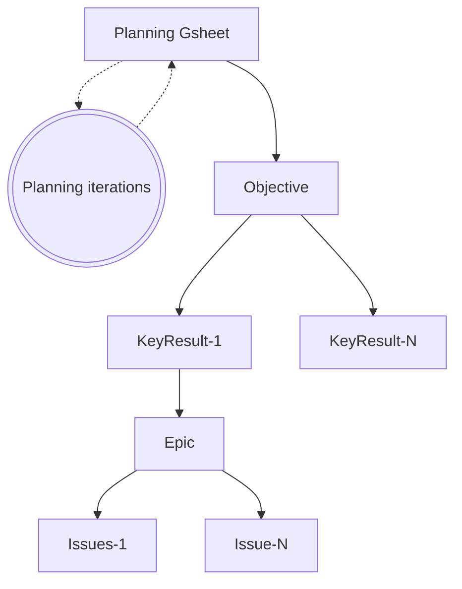

## Data Team Planning Process

The Data Team Planning Process is a pre-set activity that happens every quarter. The Planning Process adheres to GitLab's financial year/quarter schedule and [Quarterly Objective and Key Results](/handbook/company/okrs/#what-are-okrs) for prioritization and alignment. The goal of the Planning Process is to improve our ability to prioritize, plan and estimate work through collaboration and transparency.

This approach has many benefits, including:

1. It helps ensure the highest priority projects are being completed
1. It can help leadership identify issues that are blocked
1. It provides visibility into the work of the data team, including specialty analysts whose priorities are set from outside the data function
1. It encourages consistent throughput from team members
1. It makes clear to stakeholders where their ask is in priority
1. It makes clear to all team where their duty is in priority
1. It helps alleviate the pressure of planning the next iteration, as issues are already ranked

## Quarterly OKR Planning

Data Team OKRs aspire to align with divisional and company OKRs as well as GitLab Yearlies. The Data Team will also create OKRs for [Data Platform](/handbook/business-technology/data-team/platform/) infrastructure development and these OKRs may not always map to immediate term Business Partner OKRs. Overall, OKRs constitute 50-60% of the Data Team's Quarterly Capacity, with Production Operations as the only established higher priority.

Currently we do our planning via a [gSheet](https://docs.google.com/spreadsheets/d/16-KbbdgO3rWt-jrvQsgfJagPIfv5asULXaGdnzBbfk8/edit?usp=sharing) which gets communicated with all team members and stakeholders. Data Team OKRs are **managed** with [GitLab Plan](https://about.gitlab.com/direction/plan/) using a combination of Objectives, Key Results, Epics, and Issues. 

This approach:

- enables async contributions and planning
- clearly defines Data Team priorities
- leverages KR health statuses for progress reporting

OKRs across the Data Team are written using GitLab's [How to Write OKRs](/handbook/company/okrs/#how-to-write-okrs) handbook page. The below formulas are used to write OKRs:

- Objectives: Verb + What you want to do + In order to/for/so that (what you hope to achieve or rationale for objective). Objective Example: Increase awareness of company in the market in order to increase sales.
- Key Results: Verb + what you're going to measure + from "x to y". Key Result Example: 100% of employees certified on OKR expectations and process.

### Planning OKRs

OKRs are drafted in collaboration with our Business Partners and every KRs that is put up for scheduling must have an opportunity canvas, see the [project intake](/handbook/business-technology/data-team/how-we-work/#project-intake). Everyone at GitLab is welcome to [open](https://gitlab.com/gitlab-data/analytics/-/blob/master/.gitlab/issue_templates/%5BNew%20Request%5D%20Create%20Opportunity%20Canvas.md?ref_type=heads) an opportunity canvas and we ask the Data Team members to contribute to the planning process by updating the gSheet with KRs they think are important and should be considered for scheduling. This collaborative approach ensures that all team members have a voice in the planning process and can contribute their insights and expertise.

Once the initial draft of OKRs is complete, the Data Leadership Team reviews and refines the OKRs to ensure alignment with company goals and strategic priorities. The finalized OKRs are then communicated to the entire Data Team and relevant stakeholders. If needed prioritization is raised and discussed within the Data Leadership Forum. KRs are converted into GitLabs [OKR functionality](https://docs.gitlab.com/ee/user/okrs.html). 

### Prioritization

The Data Team uses a prioritization framework to ensure that we focus on the most impactful work. Our prioritization process takes into account several factors:

1. Strategic Alignment: How well does the work align with GitLab's overall strategy and goals?
2. Time Criticality: How urgent is the work?
3. Revenue or Efficiency Impact: What is the potential financial impact of the work?
4. Regulatory or Legal Impact: Are there any compliance or legal requirements that necessitate this work?

We use a scoring system to evaluate each of these factors, which helps us calculate a priority score for each piece of the work. The priority score is calculated as follows:

priority_score = `(Strategic Alignment + Time Criticality + Revenue or Efficiency Impact + Regulatory or Legal Impact) / Job Size`

Note: Carry-over KRs are prioritized (if still applicable) as we want to complete ongoing work first to achieve results. 

#### Scoring breakdown

Value drivers:

| Value                        | Weight  | 1                 | 2                    | 3                             | 4                               | 5                               |
| -----------------------------| ------- | ----------------- | -------------------- | ----------------------------- | ------------------------------- | ------------------------------- |
| Strategic Alignment          | 30%     | Team              | Department           | Division                      | Multiple Divisions              | Enterprise                      |
| Time Criticality             | 40%     | Nice to have      | within the next year | within the next 6 months      | within next quarter             | urgent ASAP                     |
| Revenue or Efficiency Impact | 20% | < $5k | < $50k | < $500k | < $5 M| > $5M |
| Regulatory or Legal Impact   | 10%     | None/Nice to Have | Must Have            | Fine and/or Brand Damage <$1M |  Fine and/or Brand Damage <$10M | Fine and/or Brand Damage > $10M |

| Value        | 1  | 2 | 3 | 4 | 5  | 6   |  
| ------------ | -- | - | - | - | -- | --- |
| T-Shirt Size | XS | S | M | L | XL | XXL |

As the Job size is an important factor, we encourage to breakup KRs (over multiple quarters) which aligns with GitLabs value of [iteration](/handbook/values/#iteration). 

#### T-Shirt Sizing Approach

We use a T-Shirt sizing approach for quickly sizing the work required to deliver new issues, epics, and longer-term initiatives. The T-Shirt sizing approach is designed to support work breakdowns towards the creation of detailed work plans, but also intended to provide a sufficient level of detail to manage overall scope.

| Size | Dedicated Person Time | Weight (issue points) | Examples |
| :--: | :--: | :-- | :-- |
| XS | 1/2 Day | 1 | Update existing handbook page. #data research/response. New Trusted Data Test. Opening AR to get access to a data source. |
| S | 1 Day | 2-3 | New handbook page; typical triage issue. New dashboard on top of existing models. Align on data scope for new data source. |
| M | 1 Week | 5-8 | New dashboard requiring new models. New data source with Stitch or Fivetran. |
| L | 2-3 Weeks | 13 | New fact table implementation & testing. Full XMAU solution. |
| XL | 1-2 Months | 26 | New Data Pump to new system. New Data Source with complex source API. |
| XXL | 2-4 Months | 52+ | New Dimensional Model subject area with New Data Sources. |

#### Assigning KRs

We encourage all Data Team Members to add their name to a KR in the list for the upcoming quarter (`Column F` - `Data Team DRI`) if they prefer to get a particular KR assigned to them. Possible reasons (not limited) to indicate you are up for a specific KR is that this is inline with your experience and expertise, previously worked on that area or the aspiration to learn more about it. You can also discuss with your manager the KRs you are interested in contributing to when you add your name as a Data Team DRI. It is not a guarantee it will also be assigned as this depends on other factors as well.

Assigning KRs will happen towards the end of the quarter by adding team members and issue points `Columns Q - X` to the KRs.

### Data Platform Vision and KRs

Although we encourage everyone within the team to contribute, in particular [Staff](/job-families/finance/data-engineer/#staff-data-engineer)+ level Data Engineers are expected to contribute to the long-term vision and strategic [direction](/handbook/business-technology/data-team/organization/engineering/) of the Data Platform, ensuring that our infrastructure and capabilities evolve to meet the changing needs of the business. They do this by discussing quarterly our Data Platform vision and translate if needed into KRs. Any updates or outcomes from these discussions are incorporated into the overall OKR planning process and communicated to the entire Data Team.

Key aspects include:

1. Identifying emerging technologies and trends in data engineering
1. Assessing current platform limitations and areas for improvement
1. Aligning platform development with overall company strategy
1. Proposing innovative solutions to enhance data processing, storage, and analysis capabilities
1. Collaborating with other teams to understand their evolving data needs

The resulting KRs from these discussions are integrated into the quarterly OKR planning process, ensuring that the Data Platform's development is aligned with both immediate business needs and long-term strategic goals.

### OKR Tracking and Reporting

We use GitLab's built-in OKR tracking features to monitor progress throughout the quarter. Each Key Result is updated regularly, at least once per month, and the overall health status of Objectives is assessed based on the progress of their associated Key Results.

Progress on OKRs is reported in the following ways:

1. Weekly Data Team meetings: A brief update on key OKRs is provided.
2. Monthly in GitLabs OKR feature: A more detailed review of OKR progress, including any blockers or risks.

#### OKR Structure

## Work Breakdowns

Work breakdowns are always developed as a part of the Quarterly OKR Planning Process, but can also be leveraged to help scope and plan new initiatives, infrastructure projects, and similar multi-person or multi-week projects. The outcome of the work breakdown is a detailed description of the work to be performed, deliverables and responsibilities, and a high-level timeline.

- As a part of the Quarterly OKR Planning Process, work breakdowns are embedded in the KR Description.
- As a part of a stand-alone or ad-hoc initiative, work breakdowns are embedded in the appropriate Epic Description.
- As an example of a Work Breakdown, see this [FY22-Q4 Data Platform Work Breakdown](https://gitlab.com/groups/gitlab-data/-/epics/372).

Work Breakdowns consider the following inputs:

1. Defined upcoming OKRs
2. OKR Reviews
3. New / forward looking insights
4. Team availability
5. Team member ambitions

**The work breakdown is team effort and everyone is encouraged to contribute.**

### Twice-Weekly Iteration Planning

The data team works in two-week intervals, called iterations. Iterations start on Wednesdays and end on Tuesdays. This discourages last-minute merging on Fridays and allows the team to have iteration planning meetings at the top of the iteration.

Iteration planning should take into consideration:

- vacation timelines
- conference schedules
- team member availability
- team member work preferences (specialties are different from preferences)

The timeline for Iteration planning is as follows:

- Meeting Preparation - Responsible Party: Iteration Planner
  - Investigate and flesh out open issues.
  - Assign issues to the iteration based on alignment with the Team Roadmap.
  - Note: Issues are not assigned to an individual at this stage, except where required.

| Day               | Current Iteration                                                                                                                                            | Next Iteration                                                                                                                                                                                                             |
| ----------------- | ------------------------------------------------------------------------------------------------------------------------------------------------------------ | -------------------------------------------------------------------------------------------------------------------------------------------------------------------------------------------------------------------------- |
| 0 - 1st Wednesday | **Iteration Start**                         | -                                                                                                                                                                                                                        |
| 7 - 1st Tuesday   | **Midpoint**   Any issues that are at risk of slipping from the iteration must be raised by the assignee                                               | -                                                                                                                                                                                                                        |
| 10 - 2nd Friday   | **The last day to submit MRs for review**   MRs must include documentation and testing to be ready to merge   MRs are preferably not to be merged on Fridays, or on Thursday in the case of Family and Friends Day, (unless there is urgency, i.e. P1-Ops related MRs or in cases with tight timelines) to minimise impact on days where there is limited team member availability. | **Iteration is roughly final**   Iteration Planner verifies issue priority and team capacity for next iteration.                                                                                                     |
| 13 - 2nd Monday   | **Last day of Iteration**   Ready MRs can be merged                                                                                                    | -                                                                                                                                                                                                                        |
| 14 - 2nd Tuesday  | **Meeting Day**    All unfinished issues either need to be removed from iterations or rolled to the next                                               | **Iteration Planning**    Sync-meeting to perform retro perspective on the current iteration and align/start on the next iteration according to the created iteration planning. All unfinished issues either need to be removed from iterations or will be automatically rolled to the next |
