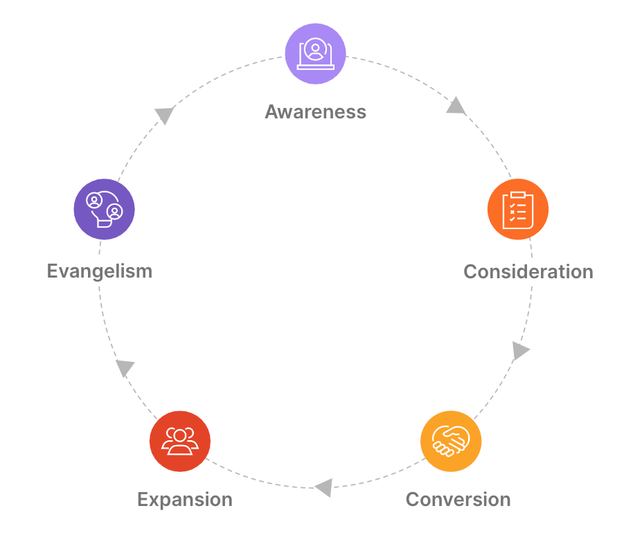
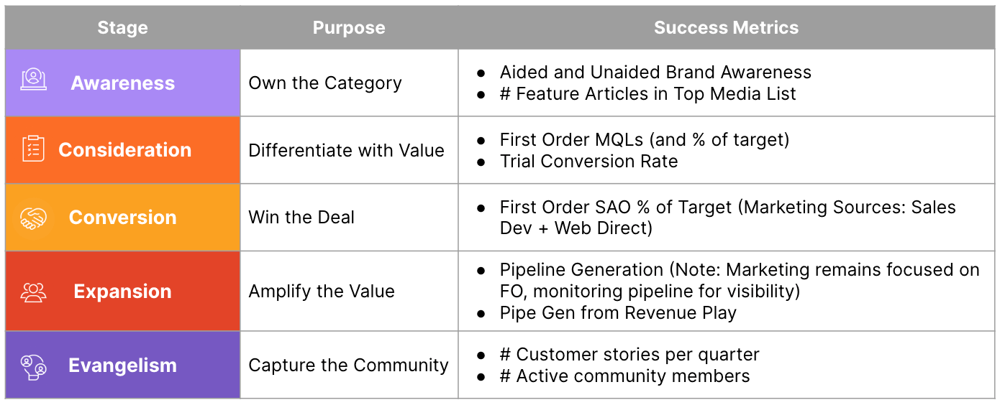

<i class="fas fa-bullhorn fa-fw color-orange font-awesome"></i> Welcome to the GitLab Marketing Handbook
{.h2}

The GitLab Marketing team operates as one team and is organized by the following departments: [Integrated Marketing](/handbook/marketing/#integrated-marketing), [Brand and Product Marketing](/handbook/marketing/#brand-and-product-marketing), [Marketing Operations and Analytics](/handbook/marketing/#marketing-strategy-and-platforms), [Sales Development](/handbook/marketing/#sales-development), [Growth](/handbook/marketing/growth/), [Corporate Communications](/handbook/marketing/#corporate-communications), and [Developer Relations & Community](/handbook/marketing/#developer-relations--community). This page documents our shared team philosophy and processes, while the individual department handbooks contain more detailed information.

## Marketing Purpose

GitLab is the leading DevSecOps Platform that empowers organizations to deliver quality software faster and more efficiently while strengthening security and compliance. The marketing team’s purpose is to amplify the value of the GitLab platform, authentically and transparently, by putting customers and the community at the center of everything we do.

## Marketing Alignment

As the GitLab Marketing team puts customers at the center of everything we do, the marketing strategy aligns with the customer journey. The journey’s purpose is to provide a clear and cohesive experience to a prospect/customer from the minute they become **Aware** of GitLab, to **Considering** the platform and **Converting** into a happy customer, and then of course **Expanding** over time and becoming an **Evangelist**.

Each stage has a purpose which is the guiding indicator for the marketing team to measure our success. Everything the team plans and executes in the short and long term will revolve around the customer journey, and we will also measure our success along each step to hold ourselves accountable.

## Marketing Strategy

Our FY24 Marketing Strategy and Plan can be found in [the internal handbook](https://internal.gitlab.com/handbook/marketing/fy24-strategy/).

## Marketing OKRs

Each quarter, the Marketing team creates OKRs (Objectives and Key Results) that cascade from the [CEO's OKRs](/handbook/company/okrs/#most-recent-okrs).

Each department within the Marketing team manages their own cascading OKRs.

## <i class="fas fa-users fa-fw color-orange font-awesome"></i> How we work

Value-driven Marketing Team
{.h3}

How we work as one team aligns with the [GitLab Values](/handbook/values/).

**Results** - The team measures success together along the customer journey. Each quarter, we align CMO OKRs based on company goals set in the CEO OKRs. This helps us stay aligned with company-level goals while also understanding if what we are doing quarter over quarter is moving the needle on our marquee metrics along the customer journey. Being data-driven as a team is essential for team success.

**Iteration** - Like the rest of the company, we aspire to be agile and experimental where possible.  In every area possible, we roll out campaigns, brand updates, messaging, etc. in small iterations, measure the success, and take next steps accordingly.

**Transparency** - We strive to be as transparent as possible in all areas of marketing. We welcome thoughts and feedback from each other, other GitLab team members, and the community at all times.

**Collaboration** - A major key to success is operating as one team. Leveraging the different backgrounds, cultures and, skill sets of an entire company and community, the marketing team operates in a way where everyone can contribute. Collaboration is key to taking Marketing to the next level.

**Diversity, Inclusion and Belonging (DIB)** - With GitLab team members being located across the world, we strive to always keep DIB at the core of everything we do. Like the rest of GitLab, we follow asynchronous meeting principles, welcome diverse perspectives, and as marketers, foster an environment where quirkiness is welcomed.

**Efficiency** - We keep efficiency at the forefront of everything we do. Whether it is bringing in marketing technology to automate menial tasks and foster collaboration, finding ways to save cost, or simply doing the right things to be respectful of others’ time, efficiency drives faster results for marketing.

## Team Meeting Cadence

Monthly Marketing All Hands (All Marketing team members)
{.h3}

**Goal**: Align all Marketing team members on activities in progress to achieve our goals, and update the team on cross-functional items.

The meeting is 50 minutes and runs as follows:
1. Always begin by welcoming our newest GitLab Marketing Team Members
1. Celebrate well-deserved promotions
1. CMO Top of Mind (5 items per month)
1. ~20 minutes of CMO Leadership sharing updates
1. ~20 of either marketing team member updates (to be added during the call for items announcement prior) or special guest from another GitLab org
1. The remaining time for Q&A and most importantly…recognition!

All team members are encouraged to bring forward discussion topics that they want to share with the team or to have covered during the call.

Quarterly CMO Q&A (one session for each department)
{.h3}

**Goal**: Provide the team a smaller forum to ask any questions they may have, offer feedback, and brainstorm ideas directly with the CMO

Weekly CMO Leadership Direct Reports Team Meetings (Each manager with their direct team)
{.h3}

**Goal**: Foster an environment to empower managers overseeing different functions to collaborate and share ideas and feedback.

Weekly Direct Reports Meetings (Each manager with their direct reports)
{.h3}

**Goal**: For managers to work with direct reports on removing roadblocks, brainstorming, coaching, and providing/receiving feedback.

## <i class="fas fa-paper-plane fa-fw color-orange font-awesome"></i> Contacting Marketing

### Getting Help by Common Topics

| Topic | Where to reach out | Sub-Team |
| ------ | ------ | ------ |
| Blog posts, webcasts, the newsletter or other marketing content | `#content`  | [Content](/handbook/marketing/brand-and-product-marketing/content/) |
| Swag | `#swag` | Brand strategy |
| Design requests, logo usage questions | `#marketing-design` | Brand |
| External PR (public relations) agency, discuss GitLab media mentions, and evaluate speaking/podcasting/commentary opportunities | `#external-comms` | Corporate Comms |
| Anything regarding the marketing website and website development | `#digital-experience-team` | Digital experience |
| Questions about tools in the [marketing tech stack](/handbook/marketing/marketing-operations/), evaluating new marketing tools, marketing system process improvement | `#mktgops` | Marketing Operations |
| Salesforce | `#sfdc-users` | Sales Operations (not marketing) |

A complete list of marketing slack channels can be found [here](/handbook/marketing/#marketing-slack-channels).

### General Questions and Feedback

- [**GitLab Marketing public issue tracker**](https://gitlab.com/gitlab-com/marketing); please use confidential issues for topics that should only be visible to team members at GitLab
- [**Slack channel**](https://gitlab.slack.com/archives/marketing); please use the `#marketing` Slack channel for questions that don't seem appropriate to use the issue tracker

### CMO Requests

Please follow the [CMO handbook](/handbook/marketing/cmo/) for review request workflows, and communication guidelines.

### Social Requests

All teams are responsible for requesting social posts themselves. If you are not the DRI on a specific category or campaign and want to request a social post, please reach out to the teams’ point person identified below as a first step. Team Members in these roles reserve the right to say no to your request. If they say yes, coordinate with them to [create a new social request issue](/handbook/marketing/integrated-marketing/digital-strategy/social-marketing/) so that the social team can process the request and schedule the post(s). The point person on the team or a member of the marketing or social teams may adjust copy to ensure consistency in brand voice.

- Events: Jr. Content Editor
- Release & technical posts/product updates: Technical writer
- User questions/comments on Twitter: [Social Marketing](/handbook/marketing/integrated-marketing/digital-strategy/social-marketing/) or [Developer Relations](/handbook/marketing/developer-relations/) team
- Leadgen campaigns: Content team
- UX Design: UX Lead
- Press/media coverage: Post in `#external-comms` for assistance
- Social media, RTs of mentions, CEO Statements/posts: Post in `#social_media_action` for assistance

### Company Spokesperson

Speaking on behalf of GitLab at a conference, to media or on a podcast as a GitLab team member is a significant responsibility. Please see the [Corporate Communications Handbook Page](/handbook/marketing/corporate-communications/) for guidelines and trainings.

### Blog post editing

- Product release posts: Product team
- Technical community posts/tutorials: Dev Evangelism team and Blog editorial team
- CEO statements/updates: CMO
- All other blog posts: Blog editorial team

Guidelines for how to pitch and submit a blog, including templates and formatting, can be found in the [Blog Handbook](/handbook/marketing/blog/).

### Newsletter

**Marketing Newsletter**

Marketing and the Editorial team send out a monthly developer newsletter, called "DevSecOps Download", to our [newsletter subscribers](/handbook/marketing/marketing-operations/email-management/#types-of-email). The newsletter always includes information about the latest release post, links to our latest blogs, plus additional content for DevSecOps teams. The goal for this newsletter is thought leadership and awareness.

To add a content suggestion, please create an issue with "DevSecOps Download Content: [subject]" in the title (no template necessary) and tag @sgittlen (Sandra Gittlen, Blog Managing Editor). Anyone in the company can add suggestions, but the Blog Managing Editor will determine the final content.

**Other Newsletter**

To request a newsletter to be sent to an audience outside the [newsletter subscribers](/handbook/marketing/marketing-operations/email-management/#types-of-email), please create an issue in the [Campaigns project](https://gitlab.com/gitlab-com/marketing/demand-generation/campaigns/-/issues), using the `request_email_newsletter` issue template.

Newsletter requests should be submitted no less than 5 business days before the intended send date to ensure there is enough time for Content and Marketing Programs Manager's (MPM) review and set up workflow.

### Sponsorship

We are happy to sponsor events and meet-ups where a marketing benefit exists, subject to approval by Field Marketing Managers. These sponsorships may be in cash or in kind, depending on individual circumstances.

Organizational or project sponsorships may also be considered where a marketing benefit exists. Typically, these sponsorships will be in kind - e.g., developer time commitments, or [subsidized / free GitLab licenses](https://about.gitlab.com/blog/2018/06/05/gitlab-ultimate-and-gold-free-for-education-and-open-source/).

Cash sponsorship of projects or organizations may be considered only in exceptional cases - for example, if a project or organization that GitLab depends on is struggling to survive financially.

### Marketing Slack Channels

We use Slack internally as a communication tool. The Marketing channels are as follows:

- `#marketing`: General marketing channel. Don't know where to ask a question? Start here.
- `#all-marketing`: Read-Only channel for marketing team members, with the ability to post comments. CMO staff has the ability to post. Should a team member want to make a post, please reach out to our Marketing EBA with your written statement and as much as possible, provide an issue or MR with more details.
- `#brand`: Connect with Brand Strategy, Brand Marketing, and Brand Design here.
- `#cfp`: All call for speakers will be posted here.
- `#cmo`: [CMO review requests](/handbook/marketing/cmo) and content shares.
- `cmo-staff`: (Private) CMO's private staff discussion room
- `#content`: Questions about blog posts, webcasts, the newsletter or other marketing content? This is the place to ask.
- `#developer-relations`: A channel for the [developer relations](/handbook/marketing/developer-relations/) team to collaborate.
- `#dev-evangelism-and-technical-marketing`: Discuss the latest tech in DevSecOps and Cloud-Native with the [Developer Evangelism](/handbook/marketing/developer-relations/developer-evangelism/) and [Technical Marketing](/handbook/marketing/developer-relations/technical-marketing/) teams. You can request speakers and ask for technical content collaboration and guidance.
- `#digital-experience-team`: Channel for connecting with the website development and design teams
- `#digital-marketing`: Channel for all advertising, website analytic and general digital programs.
- `#digital_production`: Channel for communicating with the video production team
- `#external-comms`: To collaborate with our external PR (public relations) agency, discuss GitLab media mentions, and evaluate speaking/podcasting/commentary opportunities.
- `#fieldmarketing`: Discuss, ask questions, stay up-to-date on events that are being organized by Field Marketing
- `#fyi-only-all-marketing`: This is an FYI only channel for CMO Staff to post important marketing only announcements
- `#inbound-mktg`: Growth Marketing channel, including global content, awareness campaigns, brand and digital design.
- `#marketing-design`: Discuss, feedback, and share ideas on Marketing Design here.
- `#marketing-campaigns`: Discuss, ask questions, stay up-to-date on campaigns and events that are being organized by the Marketing Program Managers
- `#mktgops`: Marketing Ops communication channel for questions and project updates
- `#mktg-budget-holders`: (Private) Discussion among all Marketing team members with budget responsibility
- `#product-marketing`: Discuss, feedback related to product news, features and vision
- `#remote`: Discuss and share impressions on the `#allremote` campaign, playbook and strategy.
- `#sdr_amer`: Americas team (North, Latin and South) all segnents
- `#sdr_amer_commercial`: Americas team (North, Latin and South) Commercial segment only
- `#sdr_apac`: Asia Pacific SDR channel - all segments
- `#sdr_emea`: Europe, Middle East and Africa all segments
- `#sdr_emea_commercial`: Europe, Middle East and Africa Commercial segment only
- `#sdr_global`: Worldwide SDR team channel
- `#sdr_global_commercial`: Worldwide SDR Commercial team channel
- `#sdr_amer_east`: Enterprise SDRs for Americas East (formerly NORAM - US East)
- `#sdr_amer_central`: Enterprise SDRs for Americas Central (formerly NORAM - US Central)
- `#sdr_amer_west`: Enterprise SDRs for Americas West (formerly NORAM - US West)
- `#sdr-conversations`: place for SDR team brainstorm & sharing of ideas
- `#sfdc-users`: Having issues with SFDC? Ask here first.
- `#social_media_action`: Use this channel to communicate and coordinate with the Social Media team. You can ask for amplification help and share cool tweets, posts, etc.
- `#swag`: Request or question regarding swag.
- `#website`: Discuss topics related to website redesign project

### Marketing email alias list

- Analysts@ company domain: external email address for contacting Analyst Relations at GitLab. Replies are forwarded to Analyst Relations manager and VP Product and Product Marketing
- Community@ company domain: external email address for sending confirmation emails related to GitLab products. Replies are forwarded to Zen Desk support
- Content@ company domain: external email address associated with management of our SlideShare account. Replies are forwarded to Content Marketing team and Marketing OPS Manager
- Events@ company domain: external email address for sending live, VIP & in-person training related emails. Replies go to Field Marketing Managers and Marketing OPS Manager
- Fieldmarketing@ company domain: external email address for requests to the worldwide Field Marketing team
- Giveaways@ company domain: external email address for receiving content & social media related promotional giveaways. Replies go to Content Marketing Team and Marketing OPS Manager
- Leads@ company domain: external email address for internal Lead alerts. Replies go to Marketing OPS Manager
- News@ company domain: external email address used to send newsletter. Replies go to Marketing OPS Manager and Manager, Content Marketing
- MPM@ company domain: external email address used to send direct generic requests to the Marketing Program Managers
- MarketingOPS@ company domain: external email address used to direct generic operational requests to Marketing OPS Manager
- MarketingSFDC@ company domain: external email address associated with management of Salesforce. Replies forward to Manager, Digital Marketing Programs; Field Marketing Manager; Product Marketing Manager; and Manager, Content Marketing
- SecurityAlerts@ company domain: external email address used to send security alerts. Replies go to Marketing OPS Manager
- Sponsorships@ company domain: external email address used to manage sponsor requests from community. Replies forward to Developer Relations Team
- Support@ company domain: external email address for sending Breaking Change and/or support related customer communications. Replies go to Zen Desk support
- Surveys@ company domain: external email address for sending the Developer Survey and/or related surveys. Replies go to Content Team and Product Marketing Manager
- Webcasts@ company domain: external email address for sending webcast related emails. Replies go to Marketing OPS Manager and Marketing Program Managers
- on24questions@ company domain: external email address used for collecting privately asked questions in On24 webinars

## <i class="fas fa-users fa-fw color-orange font-awesome"></i> Get to Know the Marketing Team

### Marketing Team READMEs

Get to know the people who work in GitLab's marketing team by visiting our [READMEs](/handbook/marketing/readmes/).

### Learn about the Marketing Departments

Marketing Functional Conversations are modeled after Group conversations. While Group Conversations offer high-level insights, Marketing Functional Conversations are meant to drill deeper into the various functions within the Marketing Department. The goal of Marketing Functional Conversations is to create increased awareness and mutual understanding of the functions within Marketing. Awareness and understanding is an essential building block for effective collaboration.

Recordings of the Marketing Functional Conversations can be found on the [GitLab Unfilitered YouTube Channel](https://www.youtube.com/playlist?list=PL05JrBw4t0Kq5aqfL8RmkCMlbk7lWy4Yi)

### Brand and Product Marketing

Product and Brand Marketing represents the GitLab story at the brand, solution, product, and technical levels. We accelerate GitLab’s path to market by developing market insights, leadership positioning, messaging, and narratives that elevate our brand, show value in our solution, and fuel demand for our platform. We activate brand ambassadors and customer advocates to show momentum and trust in the market. The team includes Solutions & Product Marketing, Brand Marketing, Design, and Content.

<a href="/handbook/marketing/brand-and-product-marketing/" class="btn btn-primary">Handbook</a>

Handbook Links
{.h4}

- [Brand]
  - [Merchandise Handling (Swag)]
- [Product and Solution Marketing]
  - [Core Product Marketing]
  - [Competitive Intelligence]
  - [Analyst Relations]
  - [Customer Advocacy]
- [Design]
- [Content]

### Integrated Marketing

The Integrated Marketing team is focused on creating awareness, generating demand and collaborating with the broader ecosystem globally, through a co-ordinated and unified approach.  We connect the dots and bring content and messaging to life by leveraging various channels as our levers to communicate across segments, regions and personas.

The team includes [Field Marketing], [Channel](/handbook/marketing/channel-marketing/), [Corporate Events], [Account Based Marketing], [Campaigns], [Lifecycle Marketing], [Digital Strategy], [Social Marketing] and [Digital Experience].

<a href="/handbook/marketing/integrated-marketing/" class="btn btn-primary">Handbook</a>

Handbook Links
{.h4}

- [Field Marketing]
- [Channel Marketing]
- [Corporate Events]
- [Account Based Marketing]
- [Campaigns]
- [Lifecycle Marketing]
- [Digital Strategy]
- [Social Marketing]
- [Digital Experience]
  - [Marketing Website]

### Sales Development

The [Sales Development](/handbook/marketing/sales-development/) organization is focused on serving the needs of prospective customers during the beginning of their buying process.

The Sales Development department is composed of 2 groups: the SDR team who handles all the inbound interest and the BDR team who specializes in outreach of prospective customers.

When prospective customers have questions about GitLab, the SDRs assist them or connect them to a technical team member as needed. During the initial exploration, if the prospective customer is interested in continuing their exploration of GitLab, SDRs will connect them to an Account Executive (AE) or Strategic Account Executive (SAE).

BDRs contact people who work at large organizations to uncover or create early-stage sales opportunities for GitLab SAEs. The BDR team will plan with their paired Sales counterpart to approach interesting accounts and develop a plan for prospecting including contact discovery, understanding enterprise-wide initiatives that GitLab could assist with, and ensuring accurate data quality of accounts and contact in salesforce.com.

<a href="/handbook/marketing/sales-development/" class="btn btn-primary">Handbook</a>

### Marketing Operations and Analytics

[Marketing Operations and Analytics](/handbook/marketing/marketing-strategy-and-platforms/) includes Marketing Operations, Marketing Analytics, and Globalization and Localization. The team focuses on enabling efficient operations and actionable analytics insights, working across all Marketing teams. The team also owns the MarTech stack used by Marketing.

<a href="/handbook/marketing/marketing-strategy-and-platforms/" class="btn btn-primary">Handbook</a>

Handbook Links
{.h4}

- [Marketing Operations]
- [Marketing Strategy & Analytics]
- [Globalization & Localization]

### Growth

The GitLab Growth department is dedicated to making it easier for teams to find value and increased efficiency within the GitLab platform. We work across stages within the product experience to make the product as easy as possible to adopt and use.

<a href="/handbook/marketing/growth/" class="btn btn-primary">Handbook</a>

### Developer Relations & Community

Developer Relations & Community includes community advocacy, code contributor program and evangelist program functions. The team is focused on answering the following questions:

- What are scalable developer education tools?
- How do we turn in person feedback at events into actionable product requests?
- What are the best and most engaging talks we can give to help educate developers?
- How do we support the community?
- How do we make the documentation even better?
- How do we make it even more fun and easy to get started?
- What is engaging developer content for blog, video, social media?
- How do we build our global meetup plan + make it easy to love GitLab?
- What is the developer GitLab experience?
- How do we use social media to support the community?
- How do field marketing and developer relations work together to support the community?
- How do we enable and retain contributors through enablement & support?

<a href="/handbook/marketing/integrated-marketing/" class="btn btn-purple">Handbook</a>

Handbook Links
{.h4}

- [Code Contributor Program]
- [Contributor Success]
- [Evangelist Program]
- [Education Program]
- [Open Source Program]
- [Developer Evangelism]
- [Technical Marketing]

### Corporate Communications

The mission of GitLab’s Corporate Communications team is to amplify GitLab's product, people and partnerships in the media, via social media channels and through award wins. This team is responsible for global public relations (PR), social media, and executive communications (speaking).

<a href="/handbook/marketing/corporate-communications/" class="btn btn-primary">Handbook</a>

Handbook Links
{.h4}

- [Speaking Resources]
- [Incident Communications Plan]

## <i class="fas fa-calendar-check fa-fw color-orange font-awesome"></i> Marketing Calendar

<!-- DO NOT CHANGE ANCHOR -->

FY24 All-Marketing SSoT Calendar
{.h3}

<!-- DO NOT CHANGE ANCHOR -->

The marketing team utilizes a [single all-marketing calendar](https://docs.google.com/spreadsheets/d/1fyrC4O1e13QTRNmYR3H5rMZIoIJcPk93vltOCx0ubjk/edit#gid=571560493) where everyone can contribute, and we can answer key questions (using pre-set filter views) related to upcoming marketing plans.

Please do not filter the entire doc. Instead, you may use pre-set filter views (click down arrow selector next to the filter icon on the bookmark bar) to see activities grouped by GTM Motion, segment, region, team, language, and more.

Below are some pre-set filter examples:
- [Primary GTM - Automated Software Delivery](https://docs.google.com/spreadsheets/d/1fyrC4O1e13QTRNmYR3H5rMZIoIJcPk93vltOCx0ubjk/edit#gid=571560493&fvid=719487391)
- [Primary GTM - Security & Compliance](https://docs.google.com/spreadsheets/d/1fyrC4O1e13QTRNmYR3H5rMZIoIJcPk93vltOCx0ubjk/edit#gid=571560493&fvid=1234877160)
- [Region - AMER](https://docs.google.com/spreadsheets/d/1fyrC4O1e13QTRNmYR3H5rMZIoIJcPk93vltOCx0ubjk/edit#gid=571560493&fvid=1972984682)
- [Region - EMEA](https://docs.google.com/spreadsheets/d/1fyrC4O1e13QTRNmYR3H5rMZIoIJcPk93vltOCx0ubjk/edit#gid=571560493&fvid=1909928129)
- [Region - APAC](https://docs.google.com/spreadsheets/d/1fyrC4O1e13QTRNmYR3H5rMZIoIJcPk93vltOCx0ubjk/edit#gid=571560493&fvid=1885172265)
- [Segment - Enterprise](https://docs.google.com/spreadsheets/d/1fyrC4O1e13QTRNmYR3H5rMZIoIJcPk93vltOCx0ubjk/edit#gid=571560493&fvid=1095061873)
- [Segment - MidMarket](https://docs.google.com/spreadsheets/d/1fyrC4O1e13QTRNmYR3H5rMZIoIJcPk93vltOCx0ubjk/edit#gid=571560493&fvid=1477092448)
- [Segment - SMB](https://docs.google.com/spreadsheets/d/1fyrC4O1e13QTRNmYR3H5rMZIoIJcPk93vltOCx0ubjk/edit#gid=571560493&fvid=2052862089)
- [Language - German](https://docs.google.com/spreadsheets/d/1fyrC4O1e13QTRNmYR3H5rMZIoIJcPk93vltOCx0ubjk/edit#gid=571560493&fvid=2039449224)
- [Language - Japanese](https://docs.google.com/spreadsheets/d/1fyrC4O1e13QTRNmYR3H5rMZIoIJcPk93vltOCx0ubjk/edit#gid=571560493&fvid=690481258)
- [Language - French](https://docs.google.com/spreadsheets/d/1fyrC4O1e13QTRNmYR3H5rMZIoIJcPk93vltOCx0ubjk/edit#gid=571560493&fvid=1557867798)

*If there are other views you would find helpful, please feel free to duplicate an existing filter view, and include some sort of categorization (i.e. team, segment, etc.). You can do this by going to a similar filter view, and clicking on the top right gear icon, then selecting `Duplicate`.*

For more information about adding events to All-Marketing SSoT Calendar, please [click here](/handbook/marketing/marketing-team-processes/#marketing-calendar-inputs).

## Marketing Team Processes

This front page of the Marketing Handbook is intended to serve as the external face of the marketing team. We've created a dedicated [Team Processes page](/handbook/marketing/marketing-team-processes/) that is intended to house our internal processes, workflows, and guidances relevant internally to the marketing team.

<a href="/handbook/marketing/marketing-team-processes/" class="btn btn-primary">Visit the Page</a>

<!-- IDENTIFIERS -->

<!-- HANDBOOKS -->
[Account Based Marketing]: /handbook/marketing/account-based-marketing/
[Analyst Relations]: /handbook/marketing/brand-and-product-marketing/product-and-solution-marketing/analyst-relations/
[Brand]: /handbook/marketing/brand-and-product-marketing/brand/
[Campaigns]: /handbook/marketing/campaigns/
[Channel Marketing]: /handbook/marketing/channel-marketing/
[Competitive Intelligence]: /handbook/marketing/brand-and-product-marketing/product-and-solution-marketing/competitive-intelligence/
[Content]: /handbook/marketing/brand-and-product-marketing/content/
[Contributor Success]: /handbook/marketing/developer-relations/contributor-success/
[Core Product Marketing]: /handbook/marketing/brand-and-product-marketing/product-and-solution-marketing/core-product-marketing/
[Corporate Events]: /handbook/marketing/integrated-marketing/corporate-events/
[Customer Advocacy]: /handbook/marketing/brand-and-product-marketing/product-and-solution-marketing/customer-advocacy/
[Design]: /handbook/marketing/brand-and-product-marketing/design/
[Developer Evangelism]: /handbook/marketing/developer-relations/developer-evangelism/
[Digital Experience]: /handbook/marketing/digital-experience/
[Digital Strategy]: /handbook/marketing/integrated-marketing/digital-strategy/
[Education Program]: /handbook/marketing/developer-relations/community-programs/education-program/
[Evangelist Program]: /handbook/marketing/developer-relations/evangelist-program/
[Field Marketing]: /handbook/marketing/field-marketing/
[Globalization & Localization]: /handbook/marketing/localization/
[Incident Communications Plan]: /handbook/marketing/corporate-communications/incident-communications-plan/
[Lifecycle Marketing]: /handbook/marketing/lifecycle-marketing/
[Marketing Operations]: /handbook/marketing/marketing-operations/
[Marketing Strategy & Analytics]: /handbook/marketing/strategy-performance/
[Marketing Website]: /handbook/marketing/digital-experience/website/
[Merchandise Handling (Swag)]: /handbook/marketing/brand-and-product-marketing/brand/merchandise-handling/
[Open Source Program]: /handbook/marketing/developer-relations/community-programs/opensource-program/
[Product and Solution Marketing]: /handbook/marketing/brand-and-product-marketing/product-and-solution-marketing/
[Social Marketing]: /handbook/marketing/integrated-marketing/digital-strategy/social-marketing/
[Speaking Resources]: /handbook/marketing/corporate-communications/speaking-resources/
[Technical Marketing]: /handbook/marketing/developer-relations/technical-marketing/
