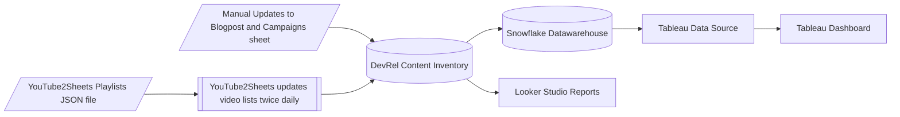

---

title: "Developer Relations - Content Effectiveness"
description: "How the Developer Relations team measures effecstiveness of content it creates."
---


## Quicklinks

- [Marketing Campaigns Dashboard](https://10az.online.tableau.com/#/site/gitlab/views/DraftTDCampaigns-L2RInteractions/CampaignDrillDown?%3Aiid=1) on Tableau
- [Looker Reports](https://lookerstudio.google.com/reporting/25dedcd0-7f67-4a37-8ab6-ad03cd431f92/page/p_k19k34iwad)
- [Content Asset Inventory](https://docs.google.com/spreadsheets/d/1WzdX8o9wzuswIPMAYVUURswm2AtwFcVE6XhmHy1lhr8/edit#gid=0)
- [Youtube2Sheets](https://gitlab.com/gitlab-com/marketing/developer-relations/dev-evangelism/code/youtube2sheets) Script
- [CommunityApps](https://campaign-manager.gitlab.com/) (Campaign Manager)

## Content Effectiveness

The Developer Relations team create content on varying topics and in different formats, these includes videos, blog posts, conference talks, demos, etc. This handbook pages details how we measure the effectiveness of the content, the tools we use and how they work together. First, we will review the different components.

### Content Asset Inventory

A common bottle neck to tracking the effectiveness of content is having a source where the content are listed and indexed with relevant meta data. While individual content types like Blog posts can be sourced from the medium on which they are published, it is often difficult to filter automatically for a specific team or group. The workaround is to have a spreadsheet where all the content are aggregated for further use, this is the role the Content Asset Inventory [spreadsheet](https://docs.google.com/spreadsheets/d/1WzdX8o9wzuswIPMAYVUURswm2AtwFcVE6XhmHy1lhr8/edit#gid=0) plays. Our Looker Studio and Tableau dashboards use the Asset inventory as a data source. The sheets in the spreadsheet are:

- `youtube_views_gitlab`: Videos published on GitLab owned YouTube channels.
- `devrel_blog_posts_views`: Blog posts published on GitLab's blog bty members of the Developer Relations team.
- `devrel_influenced_campaigns`: Campaigns influenced by members of the Developer Relations team
- `External Videos`: Videos created by or in collaboration with a member of the Developer Relations team and published on a non-GitLab owned YouTube channel or a platform other than YouTube.

### YouTube2Sheets

[YoutTube2Sheets](https://gitlab.com/gitlab-com/marketing/developer-relations/dev-evangelism/code/youtube2sheets) is a ruby script that runs twice daily at noon and midnight UTC. It takes a list of YouTube playlists provided in a [JSON Config file](https://gitlab.com/-/ide/project/gitlab-com/marketing/corporate_marketing/developer-evangelism/code/youtube2sheets/tree/master/-/data_config.json/), connects to the YouTube API, fetches all the videos in the playlists along with their meta data and stores them in the Google sheet specified for each playlist.

The idea behind this script is to create an semi-automated way to keep track of videos published on YouTube. For this to work, the videos need to be organized in playlists and the playlists should be added to the [JSON Config file](https://gitlab.com/-/ide/project/gitlab-com/marketing/corporate_marketing/developer-evangelism/code/youtube2sheets/tree/master/-/data_config.json/) file. The format of the file is as follows:

```json
[
    {
        "playlist_id":"PL05xxxxx", //The ID of the YouTube playlist to fetch videos from.
        "spreadsheet_id":"1WLuayxxxx", //The ID of the Google Spreadsheet the meta data of videos will be stored.
        "sheet_name":"Sheet1", //The name of the the Sheet in the Google Spreadsheet where the video data should be stored.
        "task":"Community Relations - DE", // An name for the list, useful in cases where the spreadsheet is used for multiple playlists.
        "description":"Developer Evangelism Team"
    }
]
```

The video meta data are stored in the spreadsheets in the following format:

|      |   A   |   B   |   C   |   D   |   E   |   F   |   G   |   H   |
|------|-------|-------|-------|-------|-------|-------|-------|-------|
| 1 | Video ID | Task/Team Name  | Channel Title  | Playlist Title |  Video URL  | Video Title  | Publication Date | GitLab Publication Quarter |
| 2 | _OSDh_L5M_E |	Community Relations - DE | GitLab Unfiltered |	Developer Evangelism Team | https://www.youtube.com/watch?v=_OSDh_L5M_E	 |  5. #everyonecancontribute cafe: HashiCorp Waypoint | 2020-05-27T22:43:09.000Z | FY21Q2 |

The spreadsheet data in the spreadsheet can be used as is for any further automation or process. In the case of the Developer Relations team, the data is fed into the `youtube_views_gitlab` sheet of the Content Asset Inventory [spreadsheet](https://docs.google.com/spreadsheets/d/1WzdX8o9wzuswIPMAYVUURswm2AtwFcVE6XhmHy1lhr8/edit#gid=0).

### CommunityApps - Campaign Manager

The [CommunityApps Campaign Manager](https://campaign-manager.gitlab.com/) enables the team manage the use of UTM campaigns inline with the [Marketing UTM strategy](https://handbook.gitlab.com/handbook/marketing/utm-strategy/). You can learn more about the [application here](https://handbook.gitlab.com/handbook/marketing/developer-relations/community-apps/campaign-manager/). The key role of CommunityApps in the Content Effectiveness workflow is to ensure the right UTM campaign codes are used, and inturn their usage will be picked up by the data automation that powers the [Marketing Campaigns Dashboard](https://10az.online.tableau.com/#/site/gitlab/views/DraftTDCampaigns-L2RInteractions/CampaignDrillDown?%3Aiid=1) on Tableau.

### Looker Reports


The [Looker Studio reports](https://lookerstudio.google.com/reporting/25dedcd0-7f67-4a37-8ab6-ad03cd431f92/page/p_k19k34iwad) was created as a quick first iteration before they are migrated to Tableau. The data sources used to build the reports are:

- Google Analytics 4 API
- YouTube API
- `youtube_views_gitlab` sheet in the Content Inventory
- `devrel_blog_posts_views` sheet

Using the 4 data sources, 3 blends were created, the `DevRel Filtered Youtube Data Source`, `DevRel Filtered Youtube (Official Channel) Data Source` and `DevRel Filtered Blog`. A [Blend in Looker Studio](https://support.google.com/looker-studio/topic/9061419?hl=en&ref_topic=10388842&sjid=10095352649474076992-EU) lets you combine multiple data sources in the same visualization. 

`DevRel Filtered Youtube Data Source` and `DevRel Filtered Youtube (Official Channel) Data Source` blends the data from the `youtube_views_gitlab` sheet and the YouTube API using the `External Video ID` from the API and the `video_id` column from then sheet, in an Inner join. The `DevRel Filtered Youtube (Official Channel)` Data Source is authenticated using Abubakar's Google account to the official channel and `DevRel Filtered Youtube Data Source` to the Unfiltered channel using the same account.  The `DevRel Filtered Blog` blends data from the `devrel_blog_posts_views` and Google Analytics (GA4) API.

Here is an example of a blend:


### Developer Relations Influenced Campaigns

The Developer Relations team contribute to several campaigns across GitLab. To measure the impact of this contributions, we keep track of DevRel influenced campaigns in the `devrel_influenced_campaigns` sheet of the [Content Asset Inventory](https://docs.google.com/spreadsheets/d/1WzdX8o9wzuswIPMAYVUURswm2AtwFcVE6XhmHy1lhr8/edit#gid=1201530981). These sheet serves as a data source for the Developer Relations filter to show campaigns influenced by the team on the [Marketing Campaigns Dashboard](https://10az.online.tableau.com/#/site/gitlab/views/DraftTDCampaigns-L2RInteractions/CampaignDrillDown?%3Aiid=1).

##  Maintenance guide

This section details how the different components of the Content Effectiveness wokflow link togther and how to maintain them.

### Data Reporting Flow



### Maintenance

#### Campaigns

- Use the Campaign Manager to generate shortlinks or full campaign links and use in your campaigns
- If the campaign belongs to a different team, Confirm the UTM or Salseforce Campaign name and update the `devrel_influenced_campaigns` sheet in the Content Inventory accordingly.
- It is recommended to use campaign links as much as you can on non-GitLab mediums.

#### Blog posts

Once a Blog Post has been published on the GitLab Blog, add the URL along with other details to the `devrel_blog_posts_views` sheet. This is an important step in getting the content piece to appear in the the relevant dashboards.

#### Videos

For YouTube Videos on Official and Unfiltered Channels, ensure the videos are organized in a playlist and add the play list to the YouTube to Sheets `data_config.json file`. Ensure the DevRel Content Inventory spreadsheet ID is used, you can find it from other playlists in the file. Once this is done, the videos from the playlist will be added to the `youtube_views_gitlab` sheet once the [scheduled pipelines](https://gitlab.com/gitlab-com/marketing/developer-relations/dev-evangelism/code/youtube2sheets/-/pipeline_schedules) of the YouTube2Sheets project runs.

For videos on non-GitLab Channels or other p0latforms, add the details about the video to the `External Videos` sheet.