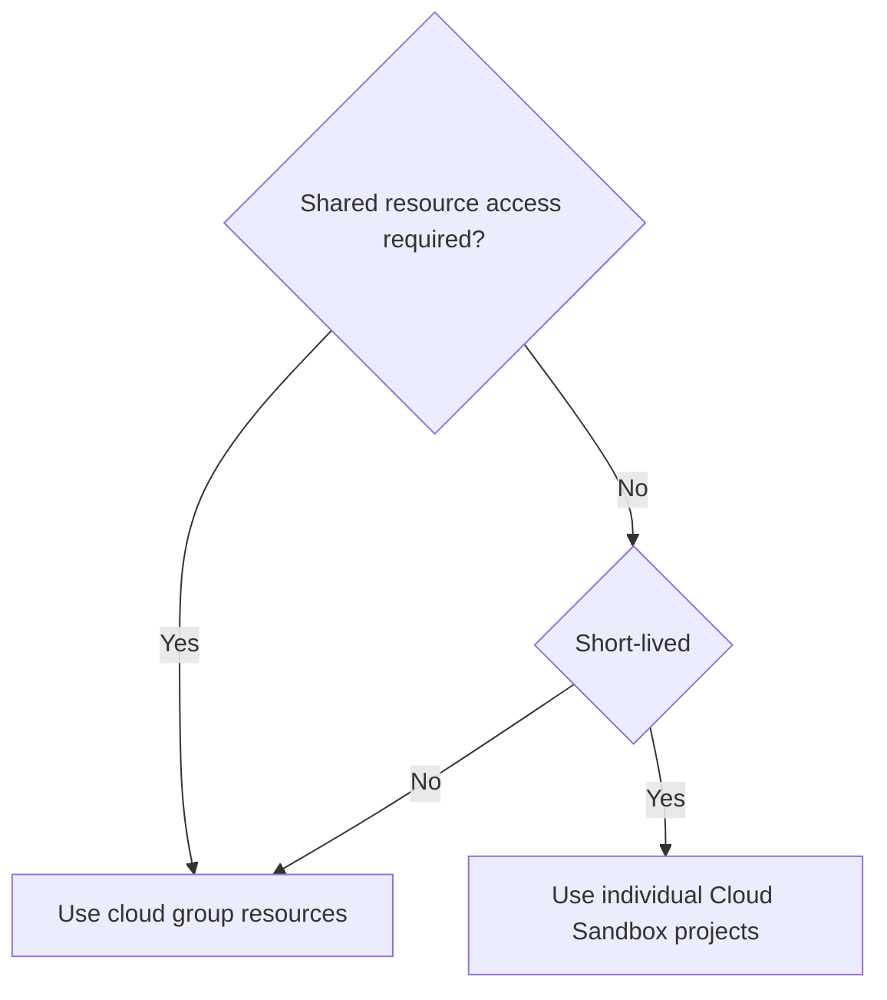

---

title: "Projects"
aliases:
- /handbook/marketing/developer-relations/developer-evangelism/projects/index.html
---


## Introduction

We maintain our projects in the public [gitlab-da group](https://gitlab.com/gitlab-da). This group has access to an Ultimate subscription.

The group organizes use cases, workshops, tutorials, maintained [open source projects](/handbook/marketing/developer-relations/developer-advocacy/oss-contributions/), demo playgrounds, thought leadership research, and more learning resources.

## Organisation Structure

All projects are organized in sub-groups on the top level. No projects are allowed on the top-level namespace `gitlab.com/gitlab-da`.

| Group        | DRI | Description  |
|--------------|-----|--------------|
| [playground](https://gitlab.com/gitlab-da/playground) | all | Test projects, simple demo cases, code snippets, etc. without support |
| [use-cases](https://gitlab.com/gitlab-da/use-cases) | all | Use cases for specific topics for product demos, talks, thought leadership, research |
| [use-cases/ai](https://gitlab.com/gitlab-da/use-cases/ai) | all | [GitLab Duo workflows, coffee chats, learning AI, use cases](https://about.gitlab.com/gitlab-duo/) |
| [https://gitlab.com/gitlab-da/use-cases/ai/ai-research](https://gitlab.com/gitlab-da/use-cases/ai/ai-research) | @dnsmichi | AI research with local LLMs (Ollama), RAG, AI agents, etc. |
| [use-cases/ai/ai-workflows](https://gitlab.com/gitlab-da/use-cases/ai/ai-workflows) | @dnsmichi | [GitLab Duo](https://about.gitlab.com/gitlab-duo/) prompts and challenges with exercise source code, linked from the [documentation](https://docs.gitlab.com/ee/user/gitlab_duo_examples.html) |
| [use-cases/ai/gitlab-duo-coffee-chat](https://gitlab.com/gitlab-da/use-cases/ai/gitlab-duo-coffee-chat) | @dnsmichi | [GitLab Duo coffee chats](#gitlab-duo-coffee-chat) |
| [use-cases/ai/learn-with-ai](https://gitlab.com/gitlab-da/use-cases/ai/learn-with-ai) | @dnsmichi @sugaroverflow | Learning a programming language with GitLab Duo (AI), [blog series](https://about.gitlab.com/blog/categories/ai-ml/) |
| [use-cases/ai/learn-test-ai](https://gitlab.com/gitlab-da/use-cases/ai/test-ai) | all | Test playground for AI and GitLab Duo |
| [use-cases/cicd-components-catalog](https://gitlab.com/gitlab-da/use-cases/cicd-components-catalog) |  @iganbaruch | GitLab CI/CD Components Catalog use cases |
| [use-cases/code-experiments](https://gitlab.com/gitlab-da/use-cases/code-experiments) |  @warias @csaavedra1  | Code experiments with automation and quality assessments |
| [use-cases/coverage-reports](https://gitlab.com/gitlab-da/use-cases/coverage-reports) | all | Code coverage reports examples |
| [use-cases/devsecops-platform](https://gitlab.com/gitlab-da/use-cases/devsecops-platform) | @warias | End-to-end DevSecOps platform demo environment |
| [use-cases/efficiency](https://gitlab.com/gitlab-da/use-cases/efficiency) | @dnsmichi | Efficiency use cases (CI/CD, container images, workflows, CLI, etc.) |
| [use-cases/gitlab-api](https://gitlab.com/gitlab-da/use-cases/gitlab-api) | @dnsmichi | GitLab API use cases with libraries and scripts |
| [use-cases/observability](https://gitlab.com/gitlab-da/use-cases/observability) | @dnsmichi | Observability uses cases and research (OpenTelemetry, eBPF, etc.) |
| [use-cases/remote-development](https://gitlab.com/gitlab-da/use-cases/remote-development) | @dnsmichi @iganbaruch | Remote development environments and Web IDE use cases |
| [use-cases/scientific-research](https://gitlab.com/gitlab-da/use-cases/scientific-research) | @abuango | Scientific research projects and integrations |
| [workshops](https://gitlab.com/gitlab-da/workshops) | all | Workshop groups and projects provided by the team |
| [projects](https://gitlab.com/gitlab-da/projects) | @abuango | Production projects maintained by the team. For blog projects and demos, use the specific `use-cases` groups. |
| [tutorials](https://gitlab.com/gitlab-da/tutorials) | all |
| [tutorials/security-and-governance](https://gitlab.com/gitlab-da/tutorials/security-and-governance) | @fjdiaz | This group contains different projects as well as documentation around GitLab's security and governance tools. |
| [unmaintained](https://gitlab.com/gitlab-da/unmaintained) | - | Projects, tutorials, use cases that are not maintained anymore but kept public for transparency |

### Access

Access is limited to [team members in the `gitlab-da` group](https://gitlab.com/groups/gitlab-da/-/group_members). Adding/removing members [requires an issue](https://gitlab.com/gitlab-com/marketing/developer-relations/developer-advocacy/developer-advocacy-meta/-/issues) to document the change.

Allowed exceptions are workshop sub-groups that invite external users into their workshop projects temporarily. All temporarily added users [**must** use a membership expiration date of 7 days](https://docs.gitlab.com/ee/user/project/members/#add-users-to-a-project).

### Add a new project or group

1. Define the scope of your project, and add it into one of the top-level groups.
1. When unsure, create the project in the [playground](https://gitlab.com/gitlab-da/playground) group first, and transfer it to its production location later in the project settings.

**Do not create new top-level groups without first proposing the change in an issue/MR.**

#### README

Always add a `README.md` file that explains the purpose of the project/group (copy the text into `Settings > General > Description`), and links all resources (issues, direction pages, blog posts, etc.). GitLab supports [Group READMEs](https://docs.gitlab.com/ee/user/group/manage#add-group-readme) next to project READMEs.

Optional but recommended: Add a project/group avatar image that illustrates the topic. Use an official GitLab brand image, or download [a free asset from Unsplash](/handbook/legal/ip-public-materials-guidelines/#visual-content-including-videos-gifs-photographs-illustrations-graphics-and-artwork). Add the credits to the `README.md` file.

Tip: You can [resize images](/handbook/tools-and-tips/#resizing-images) using the following CLI command:

```
find . -type f -exec sh -c 'convert {} -resize 150 {}' \;
```

#### Group: Use Cases

1. Blog posts or thought leadership research usually describe a use case or specific topic. Review the existing [use-cases](https://gitlab.com/gitlab-da/use-cases), add a new project or sub-group.
1. If your use case is new, create a new subgroup, add a description, and update the handbook organization structure. Add yourself as DRI to the table.

#### Group: Tutorials and Workshops

1. [Tutorials](https://gitlab.com/gitlab-da/tutorials) provide helpful content to learn specific topics and have a DRI assigned to maintain the projects. Tutorials are referenced in blog posts, webinars, etc.
1. [Workshops](https://gitlab.com/gitlab-da/workshops) provide self-contained learning resources in the form of exercises, solutions, etc. in a single repository.

When unsure where to start, create a new tutorial sub group first, and later decide to migrate the content to a workshop for example.

#### Group: Projects

The [projects](https://gitlab.com/gitlab-da/projects) group contains all projects that are used in production. They require extended documentation in the team handbook, since the team depends on the functionality for workflows and efficiency. We also maintain microsites that are served with GitLab Pages and custom domains.

### Remove a project/group

Our demo projects are referenced in blog posts and other public content. Moving these projects/groups into the [unmaintained](https://gitlab.com/gitlab-da/unmaintained) is recommended to signal their deprecation to users instead of archiving/deleting the projects.

## Project Resources

Some projects require access to Kubernetes clusters, self-managed CI/CD Runners, cloud VMs, domains, etc. The team has access to Google Cloud or AWS cloud resources that allow hosting these types of external infrastructure dependencies for GitLab.com SaaS demos.

### Workflow

1. Document the project setup in its README file (or a in a docs/ structure in the Git repository).
1. Shutdown resources when not needed (i.e. Kubernetes clusters).
1. Always add [security scanning](https://docs.gitlab.com/ee/user/application_security/) as default, unless it competes with the demo cases.

For demos that require debugging the deployments, prefer shared resources, for example in Google Cloud.

1. Document access in the 1Password vault if not available via SSO login.
1. A GitLab app requires oauth setup from an account. Use a group shared account (e.g. DE Bot) for production apps (Code challenge, etc.)

Shared cloud resources examples:

1. All team members can manage resources in Google Cloud in the [community-group project](https://console.cloud.google.com/kubernetes/list/overview?hl=en&project=group-community-a29572) and `Editor` role. Create an [access request](/handbook/business-technology/end-user-services/onboarding-access-requests/access-requests/) to add/remote team members.
1. Google Cloud/AWS also allows you to [register domains that are not trademarked](/handbook/it/guides/domains-dns/#non-trademark-domain-names) (no `gitlab` in the name!) and use the domains for demo setups.

For individual short-lived tutorials or demo setups for a blog post, prefer the [Cloud Sandbox Realm](/handbook/infrastructure-standards/realms/sandbox/#how-to-get-started). This provides automated shutdown, generated domains for easier access, etc.



### Remote Development Workspaces

The [remote-development sub group](https://gitlab.com/gitlab-da/use-cases/remote-development) has an agent for Kubernetes installed, which is documented in the [agent-kubernetes-gke](https://gitlab.com/gitlab-da/use-cases/remote-development/agent-kubernetes-gke) project. This includes troubleshooting when the agent becomes unresponsive, and workspaces are not created.

Assigned resources:

1. The Kubernetes cluster [`de-remote-development-1`](https://console.cloud.google.com/kubernetes/list/overview?project=group-community-a29572) is running in GKE. Current resources: 3 nodes. Total 6 vCPU, 12 GB memory.
1. The domain `remote-dev.dev` has been purchased through the Google DNS service and points to the Kubernetes cluster's public IP.
1. The TLS certificates have been generated manually with Let's Encrypt and need to be renewed quarterly (2023-08-15), following the [documentation steps](https://gitlab.com/gitlab-da/use-cases/remote-development/agent-kubernetes-gke).

## Product Adoption Initiatives

### GitLab Duo Adoption

[FY25 Developer Relations epic](https://gitlab.com/groups/gitlab-com/marketing/developer-relations/-/epics/475) (internal).

#### GitLab Duo Coffee Chat

Live learning session with AI-powered workflows throughout the DevSecOps lifecycle, with the help of GitLab Duo. We discuss, explore, research, learn, debug, create product feedback and feature ideas, and discover new features and workflows.

Goal: The coffee chats helps our customers learn how to use GitLab Duo and adopt best practices – by example, making mistakes, trying different routes, and achieving better results and DevSecOps efficiency.

- [GitLab group with projects](https://gitlab.com/gitlab-da/use-cases/ai/gitlab-duo-coffee-chat)
- [YouTube playlist](https://go.gitlab.com/xReaA1)
- [GitLab Duo](https://go.gitlab.com/Z1vBGD)
- [Talk: Efficient DevSecOps Workflows with a little help from AI](https://go.gitlab.com/T864XF) - [content epic](https://gitlab.com/groups/gitlab-com/marketing/developer-relations/-/epics/402)
- [Organization issue](https://gitlab.com/gitlab-com/marketing/developer-relations/developer-advocacy/developer-advocacy-meta/-/issues/375)

Maintainer: [Michael Friedrich, @dnsmichi](https://about.gitlab.com/handbook/company/team/#dnsmichi)

### CI/CD Adoption

[FY25 Developer Relations epic](https://gitlab.com/groups/gitlab-com/marketing/developer-relations/-/epics/466) (internal) 

#### CI/CD Components Catalog

Collaborate with product and engineering to help seed the CI/CD component catalog through CI/CD template migration for [GitLab-maintained components](https://gitlab.com/components). Help maintain and review contributions from community competition and hackathons. Repurpose the learnings into content and story-telling ([content epic](https://gitlab.com/groups/gitlab-com/marketing/developer-relations/-/epics/399)).

This initiative is part of the [CI Adoption WG](https://handbook.gitlab.com/handbook/company/working-groups/customer-use-case-adoption/) and contributions by Developer Relations ([epic](https://gitlab.com/groups/gitlab-com/marketing/developer-relations/-/epics/317)).

Goal: Help customers with CI/CD components for DevSecOps Efficiency. Learn best practices and share them in blog posts, tutorials, workshops.

Maintainers: [Michael Friedrich, @dnsmichi](https://about.gitlab.com/company/team/#dnsmichi), [Itzik Gan Baruch, @iganbaruch](https://about.gitlab.com/company/team/#iganbaruch)

## Learning Collections

### Our Work Environments

* [Michael's dotfiles](https://gitlab.com/dnsmichi/dotfiles) covered in [this blog post](https://about.gitlab.com/blog/2020/04/17/dotfiles-document-and-automate-your-macbook-setup/)

### log4j-resources

The [log4j-resources](https://gitlab.com/gitlab-da/projects/log4j-resources) project provides a collection of resources to learn about, detect and mitigate the impact of the log4j vulnerability, more formally known as [CVE-2021-44228](https://cve.mitre.org/cgi-bin/cvename.cgi?name=CVE-2021-44228).

Maintainers: [Developer Advocacy team](/handbook/marketing/developer-relations/developer-advocacy/)

## Workshops

### DevOps and GitLab

#### DevOps with GitLab CI Course - Build Pipelines and Deploy to AWS

Published: 2022.

[GitLab Hero](https://about.gitlab.com/community/heroes/members/) [Valentin Despa](https://twitter.com/vdespa) created the 5h course in collaboration Michael Friedrich, who helped with the [course outline review](https://gitlab.com/everyonecancontribute/workshops/gitlab-ci-freecodecamp/-/merge_requests/1).

[](https://www.youtube.com/watch?v=PGyhBwLyK2U "DevOps with GitLab CI Course - Build Pipelines and Deploy to AWS")

#### Efficient DevSecOps Pipelines in a Cloud Native World

Published: 2021.

The [slides](https://docs.google.com/presentation/d/12ifd_w7G492FHRaS9CXAXOGky20pEQuV-Qox8V4Rq8s/edit) provide a 10+ hours workshop created by Michael Friedrich for the Open Source Automation Days 2021. The exercises in the slides refer to [a workshop project](https://gitlab.com/gitlab-da/workshops/ci-cd-pipeline-efficiency-workshop) which also includes the solutions.

The following topics will be practiced:

- Introduction: CI/CD meets Dev, Sec and Ops
- CI/CD: Terminology and first steps
- Analyse & Identify
  - Learn using the [GitLab CI Pipeline Exporter](https://github.com/mvisonneau/gitlab-ci-pipelines-exporter/tree/main/examples/quickstart) to monitor the exercise project throughout the workshop.
- Efficiency actions
  - Config Efficiency: CI/CD Variables in variables, job templates (YAML anchors, extends), includes (local, remote), rules and conditions (if, dynamic variables, conditional includes), `!reference` tags (script, rules), maintain own CI/CD templates (include templates, override config values), parent-child pipelines, multi project pipelines, better error messages to fix failures fast
  - Resource Use Efficiency: Identification, max pipeline duration analysis, fail fast with stages grouping, fail fast with async needs, analyse blocking stages pipeline (solution with needs), matrix builds for parallel execution (pratice: combine matrix and `extends`, combine matrix and `!reference`), `extends` merge strategies (with and without `!reference`)
  - CI/CD Infrastructure Efficiency: Optimization ideas, custom build images, optimize builds with C++ as example, GitLab Runner resource analysis (sharing, tags, external dependencies, Kubernetes), local runner exercise, resource groups, storage usage analysis, caching (Python dependency exercise, including `when:always` on failed jobs)
  - Auto-scaling: Overview, AWS auto-scaling with GitLab Runner with Terraform, insights into [Spot Runners on AWS Graviton](https://about.gitlab.com/blog/2021/08/17/100-runners-in-less-than-10mins-and-less-than-10-clicks/)
- Group discussion
  - Deployment Strategies: IaC, GitOps, Terraform, Kubernetes, registries
  - Security: Secrets in CI/CD variables, Hashicorp Vault, secrets scanning, vulnerability scanning
  - Observability: CI/CD Runner monitoring, SLOs, quality gates, CI/CD Tracing
  - More efficiency ideas: Auto DevOps, Fast vs Resources, Conclusion and tips

<figure class="video_container">
<iframe src="https://docs.google.com/presentation/d/e/2PACX-1vQCF72s_IIogKurtLhEZ3Pe3SrkcRL1KYIhScYwhwPlFDJTGYLK_sZGnG4gAfy0jiiQnITuxSGPDB48/embed?start=false&loop=false&delayms=3000" frameborder="0" width="960" height="569" allowfullscreen="true" mozallowfullscreen="true" webkitallowfullscreen="true"></iframe>
</figure>


### Template: Basics and CI/CD with the Go Tanuki

The [slides](https://docs.google.com/presentation/d/1bj8FqU5I-Og-Yf9rDbp0qRjV4AXQo8K-rfOXkSUClW4/edit?usp=sharing) provide the step-by-step instructions as exercises for the [GitLab CI/CD Go Tanuki workshop](https://gitlab.com/gitlab-da/workshops/gitlab-cicd-go-tanuki-workshop):

- First Steps with GitLab
- CI/CD: Getting Started
- CI/CD: Go Project and Tests
- Security with GitLab
- Deliver and Deploy
- What's next
- Exercises for async practice
- Efficiency practice

#### Recent Recordings

Published: 2021.

[](https://www.youtube.com/watch?v=id9klDUrGN8 "TalentQL Pipeline workshop in October 2021")
[](https://www.youtube.com/watch?v=kTNfi5z6Uvk "1. Swiss Meetup 2021 in January")

Recordings of past workshops and other videos from the Developer Advocacy team can be found on our [team playlist](https://www.youtube.com/playlist?list=PL05JrBw4t0Kq-bYO9jCJaN45BBpzWSLAQ) on GitLab Unfiltered.

### Past Meetup Workshops

Meetup workshops are available in the [workshops group](https://gitlab.com/gitlab-da/workshops) in the GitLab Developer Advocacy group. Note that the content, exercises and source code evolved over time :)

#### Basics and CI/CD

- [TalentQL Pipeline workshop in October 2021](https://gitlab.com/gitlab-da/workshops/go-tanuki-cicd-workshop-talentql-pipeline-program)
- [1. Swiss Meetup 2021 January](https://gitlab.com/gitlab-da/workshops/swiss-meetup-2021-jan)
- [Morehouse College CI CD Lecture](https://gitlab.com/gitlab-da/workshops/morehouse-college-lecture-cicd)
- [CI Community Day 2020](https://gitlab.com/gitlab-da/workshops/ci-community-day-2020)
- [KDE Akademy Workshop 2020](https://gitlab.com/gitlab-da/workshops/kde-akademy-workshop-2020)
- [LA / SoCal / Orange County Meetup 2020](https://gitlab.com/gitlab-da/workshops/meetup-2020-cw41)
- [Collision from Home GitLab CI workshop](https://gitlab.com/gitlab-da/workshops/collision-from-home-2020)
- [Linuxing London Meetup - GitLab Introduction](https://gitlab.com/gitlab-da/workshops/meetup-2020-cw17)
- [First virtual GitLab meetup - intro to CI](https://gitlab.com/gitlab-da/workshops/meetup-2020-cw13)

German language:

- [German CI/CD Workshop 2021](https://gitlab.com/gitlab-da/workshops/german-cicd-workshop-2021-jan)

#### Monitoring and Security

- [Identify, analyze, action! Deep monitoring with CI](https://gitlab.com/gitlab-da/workshops/ci-monitoring-webcast-2020)
- [GitLab CI Security Webcast](https://gitlab.com/gitlab-da/workshops/ci-security-webcast-2020)


### Thought Leadership: Observability

#### Kubernetes Observability workshop for Kube Simplify

Published: 2022.

Michael Friedrich provides a 3.5 hours live workshop on Kubernetes Observability for the [Kube Simplify workshop series](https://kubesimplify.github.io/live-workshops/) as a free learning resource. After an introduction, the workshop starts with an overview of monitoring, metrics with Prometheus, and how to build and use dashboards in Kubernetes. Alerts, incidents and SLOs are practiced by example, building the bridge into more Observability data with tracing, logs and more event types. Chaos engineering is practiced with Chaos Mesh to trigger alerts when DNS errors force an app to leak memory. This allows users to practice the [KubeCon EU 2022 demo](https://youtu.be/BkREMg8adaI) themselves. Scaling, long term storage, security workflows as well as new innovative ideas with OpenTelemetry and eBPF are discussed too. The workshop includes exercises and solutions ready for production environments afterwards.

Resources:

- [Slides with exercises](https://docs.google.com/presentation/d/1uuYIPwQjckNiPPJQcN8tauZ8KSIdHASbyoAxJ0fc6uQ/edit?usp=sharing)
- [Project with solutions](https://gitlab.com/everyonecancontribute/workshops/kube-simplify/k8s-o11y-2022)

Recording:

[](https://www.youtube.com/watch?v=sMEEVbZ4NFM)


## OSS Projects

The Developer Advocate team maintains [OSS projects](/handbook/marketing/developer-relations/developer-advocacy/oss-contributions/) as part of community activities.

### CodeChallenge.dev

Maintainer: [Abubakar Siddiq Ango](/handbook/company/team/#abuango)

`CodeChallenge.dev` is an app that you can use to create challenges that are tied to actions in GitLab.  For example, you can create a challenge that teaches folks how to make merge requests, add issues, or use other GitLab features.  Currently in the beta release, the Code Challenge software was first used at KubeCon EU 2022.

Homepage: [CodeChallenge.dev](https://codechallenge.dev)

Documentation: [docs.codechallenge.dev](https://docs.codechallenge.dev)

Project: [codechallenge](https://gitlab.com/gitlab-da/projects/codechallenge)

<figure class="video_container">
    <iframe src="https://www.youtube.com/embed/BNEQMNtrlSM" frameborder="0" allowfullscreen="true"> </iframe>
</figure>


### Advocate Dashboards

Maintainer: [Abubakar Siddiq Ango](/handbook/company/team/#abuango)

The dashboard is the SSoT to collect all metrics for the Developer Advocate. This includes Twitter, CFPs, YouTube/Google Analytics, etc. Next to the dashboard component, the data component ensures to collect all data from different APIs and sources, and [gets deployed to GitLab Pages](https://gitlab-da.gitlab.io/dashboards/).

Project: [Dashboards](https://gitlab.com/gitlab-da/projects/dashboards)

### Developer Relations Bot

Maintainer: [Abubakar Siddiq Ango](/handbook/company/team/#abuango)

This bot aims to automate the team tasks such as:

* Create [release evangelism](/handbook/marketing/developer-relations/developer-advocacy/social-media/#release-evangelism) issues for team members.
* Triage issues following the [Developer Advocacy workflows](/handbook/marketing/developer-relations/developer-advocacy/workflow/).
* Generate an issue letter (created, closed, open CFPs) on every Monday.

Project: [DevRel Bot](https://gitlab.com/gitlab-da/projects/devrel-bot)

### Developer Advocate Dashboard

Maintainer: [Abubakar Siddiq Ango](/handbook/company/team/#abuango)

This [custom dashboard](https://gitlab-com.gitlab.io/marketing/developer-relations/developer-advocacy/code/de-dashboard/) is built using [GitLab Pages](https://about.gitlab.com/stages-devops-lifecycle/pages/) and presents an overview of Developer Advocate issues. The requests are synced in a specified interval.

Project: [DE Dashboard](https://gitlab.com/gitlab-com/marketing/developer-relations/developer-advocacy/code/de-dashboard)

### YouTube2Sheets

Maintainer: [Abubakar Siddiq Ango](/handbook/company/team/#abuango)

This project is used internally at GitLab to retrieve the list of videos from specified playlists on YouTube onto a specified Google Sheet. Pipeline is scheduled to run at midnight and noon UTC.

Project: [YouTube2Sheets](https://gitlab.com/gitlab-com/marketing/developer-relations/developer-advocacy/code/youtube2sheets)


### Events Project

Maintainer: [Abubakar Siddiq Ango](/handbook/company/team/#abuango)

The Developer Advocate Team at GitLab tracks events happening across the industry for attendance, speaking engagements, or just to keep them on the radar. This is also a major need across the industry. The Events project aims to provide an open and collaborative place where members of the wider GitLab community can add and track events happening in the industry.

Project: [DE Events Project](https://gitlab.com/gitlab-da/projects/events)


## EveryoneCanContribute cafe

Maintainer: [Michael Friedrich](/handbook/company/team/#dnsmichi)

[everyonecancontribute.com](https://everyonecancontribute.com) serves as the main website for a community formed around tech coffee chats called `#EveryoneCanContribute cafe` (active) and `#EveryoneCanContribute Kaeffchen` (retired).

The coffee chats are organized as [meetup.com group events](https://www.meetup.com/everyonecancontribute-cafe/) and are open for topic or theme suggestions from everyone.

* Try out newly announced projects together.
* Do pair programming/debugging sessions.
* Start discussions and share ideas on the latest technology.

The sessions are hosted by Michael Friedrich. Developer Advocate team members are assigned as alternative hosts in Zoom. The meetups are hosted in Zoom with a waiting room as default, the Zoom URL is hidden in the meetup group event. team members can access the URL in the [Developer Advocate team calendar](/handbook/marketing/developer-relations/developer-advocacy/). For joining the group, users need a profile picture and provide their name for joining an event. This is to protect against Zoom bombing and otherwise harmful intentions.

Next to Zoom, everyone can hangout with text or audio in [Discord](https://everyonecancontribute.com/page/handbook/#discord).

The website's [About page](https://everyonecancontribute.com//page/about/) covers more details including the exact date and time.

Insights:

* The website is built using [GitLab Pages](https://about.gitlab.com/stages-devops-lifecycle/pages/).
* Organization happens in the GitLab group [everyonecancontribute](https://gitlab.com/groups/everyonecancontribute/-/issues). This group has applied for an Ultimate license for OSS projects.
* [#everyonecancontribute cafe (English)](https://www.youtube.com/playlist?list=PL05JrBw4t0Kp1Gni9SyudMmXmBJIp7rIc) YouTube playlist.
* [#everyonecancontribute Kaeffchen (German)](https://www.youtube.com/playlist?list=PL05JrBw4t0Ko8J8V5V794CXZUZ-DLxccI)YouTube playlist.

[everyonecancontribute.dev](https://everyonecancontribute.dev) hosts a demo page with funny animations featuring the Tanuki, Clippy, and more. It is deployed in a container environment and provides a Prometheus node exporter for monitoring demos and talks. Michael created the website for the job application presentation panel at GitLab.

### Metrics and Insights

In order to track the sessions, [create a monthly issue report](https://gitlab.com/gitlab-com/marketing/corporate_marketing/corporate-marketing/-/issues/new?issuable_template=everyonecancontribute-cafe-insights) with linking the blog post, recording, social shares etc.

### everyonecancontribute cafe groups

- [Kubernetes](https://gitlab.com/everyonecancontribute/kubernetes) with hands-on workshop series.
- [Keptn, GitLab, Prometheus](https://gitlab.com/everyonecancontribute/keptn) to collaborate on a deeper integration.
- [5minprod.app](https://gitlab.com/everyonecancontribute/5-min-prod-app) to drive the [5 minute production app](https://gitlab.com/gitlab-org/5-minute-production-app/deploy-template) with community resources.


