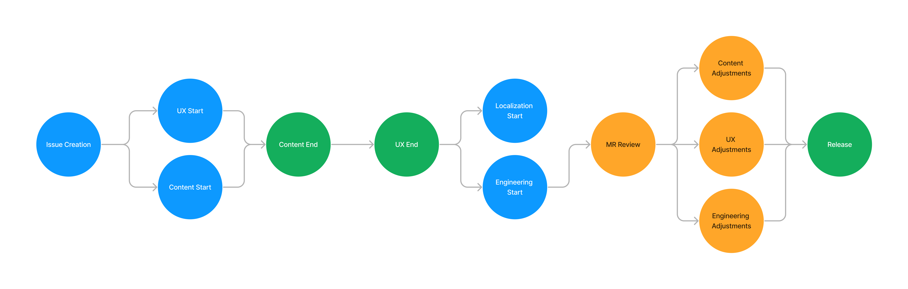

## Purpose

Now that the Digital Experience team and the [Localization team](/handbook/marketing/localization/) have collaborated for many quarters, we want to outline our learnings to work more efficiently together.

## Existing Labels

* `dex-L10N`: issues that involve both teams
* `L10N-attention`: how to raise awareness to localization team to efforts that require their insight

[List of all labels in the Digital Experience group](https://gitlab.com/groups/gitlab-com/marketing/digital-experience/-/labels?subscribed=&sort=relevance&search=l10n)

### Summary

Right now, an issue is created leading to UX and content to start working. Ideally, when the content is completed, UX can begin their work. After the UX is completed, this allows engineering and localization to begin their work. When engineers kick off a merge request, this allows content, UX, and engineering to make adjustments to the page. Note that we need the source language to be completed before translations can begin.

### Challenges

All of this has been synthesized by the [following issue comment](https://gitlab.com/gitlab-com/marketing/digital-experience/buyer-experience/-/issues/3855#note_1980717872) as well as from [Phase 1 of localizing content](https://gitlab.com/gitlab-com/localization/localization-team/-/issues/169#recycle-improvements-what-can-be-improved), which fall into two buckets:

1. Technology: The engineering review process, and integration with other tools
1. People: Project management, including flow and organization

### What is Argo? How do I request access to Argo?

Argo is a translation service used by the localization team to manage files and assets that are to be translated. This epic was created to track onboarding into [Argo](https://gitlab.com/gitlab-com/localization/localization-team/-/issues/156). Here are issues that talk about [assets](https://gitlab.com/gitlab-com/localization/localization-team/-/issues/173) and [requests](https://gitlab.com/gitlab-com/localization/localization-team/-/issues/174) in the UI. You can request content that lives in YAML, or that [exists in Contentful](https://gitlab.com/gitlab-com/localization/localization-team/-/issues/172)

### When should pages become translated? Is it possible to release pages in multiple languages?

We are not in a mature enough spot to release in multiple languages. In our current state, we struggle between the increased lead time for translators, more complex QA processes across languages, and alignment between different teams.

As a rule, we are firing off translation requests _after_ the page is live in English. This is to avoid back and forth between content and localization. This means that we cannot start translating a page until after the English page is released.

### Contentful

#### What are source entries in Contentful?

This content comes from this [issue](https://gitlab.com/gitlab-com/localization/localization-team/-/issues/68), where we define source entries as a relationship between the authored content and the localized version. This is so that updates to the authored content can be correctly changed on the corresponding cloned entry. Whenever an entry in a different language is created, we must link it back to its English equivalent. This is important for the continuous translation process. _This applies to entries created by engineering_.

Every Content Type needs to have a single Entry Reference field so updates to the source content are correctly put onto the corresponding translation Entry when translated. The reference field should only accept the same Content type as its source field, and it should be hidden from the edit view, to prevent users from accidentally changing it.

#### What is the difference between field-level and entry-level localization?

Field-level localization allows content in different locales to exist within the same entry, with each locale being a field of the entry. Entry-level localization is when every different localized content piece is used as unique net-new entries with each locale. One way to think about this is that field-level localization creates more fields, but fewer entries. Entry-level localization creates more entries, but fewer fields.

Per this [comment](https://gitlab.com/gitlab-com/marketing/digital-experience/buyer-experience/-/issues/3683#note_1901051450), we typically use both field and entry-level localization. It is up to the localization team in collaboration with Digital Experience to see which approach makes the most sense. Right now, prioritize using field level over entry-level, as entry-level is a lot more complex both for the Argo integration and engineering.

#### Best practices for content editors adding localized content

Many of our webpages were built using a variety of standards, so some webpages will require a code change the first time they are localized. For this reason, if it's the first time a page is being translated, it's best if a DEx engineer reviews the page first. After any necessary code changes have been made and merged, content editors can edit translated content in Contentful. An exception to this rule is the Homepage and Pricing page - please make your edits then tag a DEx engineer to review and publish. In general, we avoid making changes on Fridays so as to avoid any potential bugs appearing on the weekend - if it's anything other than a small content change or typo, try to avoid publishing changes on Fridays. 

Known issues: Since many content editors don't have access to Admin features in Contentful, they will not be able to bulk publish. This means that everytime the publish button is clicked, a new pipeline will begin. DEx engineers can help with bulk publishing to avoid this issue. If a change was published more than 30 minutes ago and it's still not visible on the website, please reach out to the digital-experience-team slack channel, so we can investigate if there was a failure.

### Engineering

#### How Engineering kicks off a translation request

Engineers can kick off the translation process by [creating a new issue using the localization template](https://gitlab.com/gitlab-com/localization/issue-tracker/-/issues/new?issuable_template=localization-request) in the [Localization Issue Tracker project](https://gitlab.com/gitlab-com/localization/issue-tracker). This eventually leads to an item being created in Argo.

The source language's content must be completed for this to go through. Given that it takes them between 5-7 days to translate, communicate that with your stakeholders before committing to work. As a general rule, content should be completed before the start of an iteration to give ample time for translations and LQA.

**Note**: we may need to kick off a translation request ourselves in Argo, but this part of the process is a work in progress.

#### Best practices when building marketing pages to support internationalization

* If pages are built in Contentful, **avoid custom JSON**. This is important.
  * Custom JSON creates delays in the translation process, which slows down the velocity of our progress
* Make sure to link source entries from different locales to their English version. This is crucial for the continuous translation process. If you create new entries in new locale, please link them to the source entry.
* Encourage UX and L10n to talk to each other.
  * When net new pages are created, we should use the `i10n-attention` [label](https://gitlab.com/groups/gitlab-com/-/labels?subscribed=&sort=relevance&search=l10n-attention)
  * [Overflowing text](https://gitlab.com/gitlab-com/localization/localization-team/-/issues/171) due to the length of different character averages among locales

#### How do we deal with Marketo Forms?

Right now, each Marketo form ID is unique per every locale. We are looking into a potential solution so that one form holds each locale's content. This is being scoped out in [this issue](https://gitlab.com/gitlab-com/marketing/digital-experience/buyer-experience/-/issues/3873).

### Global Gateway

The global gateway is crucial for creating a positive first impression by presenting content in users' native languages, fostering trust and ensuring seamless navigation. It enhances user experience by directing them to localized marketing sites and correctly localized product sign-up paths. 

Our FY25 goal for the marketing site Global Gateway is to create a more personalized and effective marketing experience for users worldwide, ultimately driving better engagement and business outcomes. We will measure engagement and business outcomes with Google Analytics and Tableau. 

#### Language Selector

The language selector is a feature implemented in the Navigation repository that allows users to choose their preferred language for viewing GitLab. Here' is the [language.service.ts](https://gitlab.com/gitlab-com/marketing/digital-experience/navigation/-/blob/main/src/services/language.service.ts?ref_type=heads)

To display the available languages for a page, the Language Selector makes HTTP requests to check if the current page exists in each of the site's available languages. It sends one request per language, and if the request returns a 404, that language will not be displayed in the Language Selector.

After a user selects a language, the app stores the selection in the user's browser for use by the application's localization logic. We store it in `localStorage` [here](https://gitlab.com/gitlab-com/marketing/digital-experience/navigation/-/blob/main/src/components/Common/language-selector.vue?ref_type=heads#L97).

The language selector is the only place that can update the saved language in the user's browser.

#### Links Localization

Our application includes a [Vue Mixin](https://gitlab.com/gitlab-com/marketing/digital-experience/buyer-experience/-/blob/main/mixins/localized-href.mixin.ts?ref_type=headss) used across all pages. This Mixin scans each page for links that might be localized.

The Mixin checks the user's browser for their preferred language. If it finds a localized version of a link that exists, the localized version of the preferred language link will be statically generated.

#### Hreflang

We use the Hreflang HTML attribute to specify the language and regional targeting of our localized pages. It signals to search engines the language or regional variation of your content.

We use a [Vue Mixin](https://gitlab.com/gitlab-com/marketing/digital-experience/buyer-experience/-/blob/main/mixins/localized-href.mixin.ts?ref_type=heads) to generate our hreflang.

#### Common confusing case scenario

A common scenario that might be mistaken for a bug is when a user navigates to a localized page without using the language selector. For example, if the stored language is French (fr) and the user visits a Japanese page, the links inside that Japanese page will still redirect to the French version due to the user's preferred language setting.
