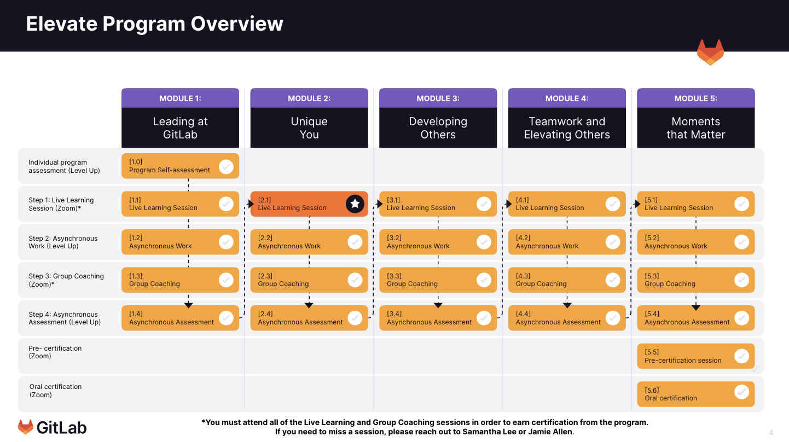

---

title: Elevate
aliases: 
- /handbook/people-group/learning-and-development/elevate/elevate
---

Managers at GitLab enable our mission that [everyone can contribute](). We need to equip our people leaders with the skills to lead globally dispersed, all-remote teams to support our business growth at scale.

The handbook provides guidance on GitLab [leadership competencies](/handbook/competencies/#manager-and-leadership-competencies) and principles. Bringing these practices to life requires training and practice. **Elevate**, GitLab's leadership development program, provides opportunity for people leaders to learn to lead at GitLab.

At this time, Elevate is only available for current People Leaders, People Business Partners, and members of the Team Member Relations team.



### Goal

In FY24, 85% of people leaders will complete Elevate and earn the GitLab Elevate certification.

## What team members are saying about Elevate

1. `Much more confidence handling things when they go wrong. I react completely differently to situations now. Also I see myself as a manager whereas I didn’t before and felt like I was making it up as I went.`
1. `I'm much more comfortable to give feedback using the frameworks we learned during the program. Also feel much more confident about my DNA as a manager by listening to others managers.`
1. `I now have an actionable set of tools available which helps me navigate any kind of conversation.`
1. `The different frameworks that were introduced are immensely helpful. I have been relying on them in numerous situations and find it to be really impactful.`

## What is Elevate

Elevate is a highly interactive, all-remote program where managers will learn with, and from, each other. The goal is to provide a common, well understood leadership framework which demonstrates GitLab [values](), [leadership competencies](/handbook/competencies/#manager-and-leadership-competencies), and [mission]().

In Elevate, participants will:

1. Learn what it means to lead at GitLab
1. Practice the [Manager & Leadership competencies](/handbook/competencies/#manager-and-leadership-competencies)
1. Build cross-functional relationships with coaching cohort members
1. Demonstrate leadership competency by completing the Elevate Leadership Certification

## What concepts are taught in Elevate

Elevate is organized into 5 learning modules. Read more about the skills covered in each module below:

We've put together a Level Up course available to all GitLab Team Members, to share the self-paced training content for each Elevate module. You can check it out here: [Elevate Learning Materials](https://levelup.gitlab.com/access/saml/login/internal-team-members?returnTo=https://levelup.gitlab.com/learn/learning-path/elevate-learning-materials)

## Time Commitment

Elevate runs for a total of 6 months and is organized into 5 learning modules. In each module, participants spend a total of 3-4 hours in the following learning activities:

| Steps | Title | Description | Time Spent |
| ------- | ----- | ---------- | ----- |
| Step 1 | Live Learning Session | 1x monthly synchronous learning session on the relevant module topic | 50 minutes |
| Step 2 | Asynchronous Learning | Videos, reading, journaling, self-reflections, and quizzes to reinforce concepts completed in Level Up | 45 minutes |
| Step 3 | Group Coaching | Cross-functional group coaching sessions with 10-12 other GitLab people leaders to practice module concepts | 80 minutes |
| Step 4 | Assess your Learning | Take a quiz in Level Up to demonstrate your understanding of new concepts. | 5 minutes |

Watch this video for a walk through of each step:



### Pre-Certification Coaching

After you complete Module 5, team members will attend a pre-certification coaching session to prepare for certification.

The intention of this session is to allow space to practice and ask questions about what certification will look and feel like.

To prepare for your pre-certification coaching session, review instructions outlined [here](https://docs.google.com/document/d/1fLywGTJHZppgZBoV6QbucXTc8UNxjUB_VbDiU9MPn3A/edit).

Starting with Round 3, pre-certification coaching sessions are required. For Round 2, they are optional.

### Certification

The Elevate Certification process is your time to shine!

Following Module 5, you'll be assesed on your mastery of the leadership competencies taught in Elevate. Certification will occur in a live, collaborative, 50 minute session with a small group of other Elevate participants, likely in your cohort.

The certification for Elevate is not meant to be scary! It's a time to demonstrate everything you've learned and celebrate your new skills and self awareness as you continue to grow as a leader at GitLab.

**Elevate Participant Action Items:**

1. Sign up for a 50 minute certification session that works for your schedule. The sign up issue for your cohort will be shared in Slack.
1. Review the 4 scenarios that you might be asked about in the session [here](https://docs.google.com/document/d/1vugl8dAeEIX3UxMCIusgG3_HDH6QEABenIf72y83ujg/edit).
1. Make a copy of the [Elevate Tools and Frameworks resource](https://docs.google.com/document/d/1o-JbkF7uB0pQmf1NJcuZkmak3s-eXaMxo_BL1bIlCPU/edit) for your own note take and certification prep.
1. Understand how your performance will be assessed by reviewing the grading rubric [here](https://docs.google.com/document/d/1jzbJ-7aa9Qwn6fv111pKLJ6llYg7z_tPCx-O3mWQi2c/edit)
1. Practice and ask questions in you cohort Slack channel

**What to expect in the certification session:**

1. A collaborative, 50 minute session with others Elevate participants, likely in your cohort
1. Opportunity to demonstrate your understanding of Elevate leadership competencies
1. Time to give feedback and discuss iterations for others in your small group

Following the certification, a member of the L&D team will follow up with your results, and either share your Elevate certification or discuss next steps. If for some reason you don't pass the certification, you'll meet 1:1 with a Elevate coach to practice your skills.

## Making up missed sessions

Attendance to all Elevate live sessions is required to earn the certification. We understand that making time for all live sessions can be difficult. We have options for making up sessions you've missed:

**Option 1: Attend Another Session**

There are **5 Live Learning** and **10 Group Coaching** options for each module. If you cannot attend your scheduled sessions, Option 1 is to attend another scheduled session. Additional Group Coaching makeups will be scheduled after each module to accommodate anyone who has missed a session.

Note: You will be initially be invited to 4 Live Learning & 1 Group Coaching session - invites will be shared to the other makeup sessions based on your availability.

**Option 2: Async Makeup**

If none of the 5 Live Learning sessions will work, you may use Option 2: Async Makeup. Note that this can only be used a total of **one time** per participant.

Async makeups will be shared with participants directly via Level Up. The include watching recordings from the Live Learning and responding to text-based discussion threads in Level Up.

## Supporting your team in Elevate

Engaging managers of people leaders in Elevate helps us to:

1. Engage managers and their direct reports in conversations about growth and development
1. Demonstrate leadership buy-in for manager development
1. Ensure participants have a line of communication with their manager to ask questions, raise concerns, and organize workload to participate in Elevate

People Leaders with direct reports who are in a current Elevate cohort could be asked to support in the following ways:

1. Notify team members of nomination and participation in Elevate during a 1:1 meeting and/or via Slack. Communications and timeline will be provided by the Learning and Development team.
1. Discuss the impact and benefits of Elevate during your 1:1. Answer questions that arise using this handbook page and direct further questions to the Learning and Development team.
1. If/when prompted by the Learning and Development team, follow up with reminders to team members who have missed live sessions or are not responsive to program communications.
1. Help team members manage their current workload and cohort timing.

## Measuring Success

Before each Elevate cohort begins, a short survey will be sent to participant's direct reports via Culture Amp. The questions are meant to understand the perception of direct reports, specifically related to how their managers are already demonstrating concepts covered in Elevate.

The same survey will be sent to participant's direct reports immediately after the program ends, then again after 6 and 12 months.

## Frequently Asked Questions

### What does success in Elevate look like?

To earn the final Elevate certification, participants must:

1. Attend or makeup all live sessions, as outlined below
1. Complete all self-paced work in Level Up
1. Pass the Elevate Certification

### Is my participation in Elevate required?

Yes, this is a required training for all people leaders at GitLab.

### Where do I communicate my questions, concerns, and feedback as I go through the program?

When the program begins, you'll be added to a Slack group that includes all members of your cohort. The naming convention used is `#elevate-cohort-x`. You can also reach out directly to your manager or the Learning and Development team.

### I missed, or cannot attend, a live learning or group coaching. What do I do?

It's a requirement to make up missed sessions within each month to ensure that you're learning each new skill and moving through the program in the appropriate order. Please make every effort to attend live sessions as scheduled. We have [2 makeup options outlined below](#making-up-missed-sessions). If a conflict arises for your assigned group coaching session, you can attend with another cohort. If none of the live session times work for you, you can complete the Async Makeup. **Please reach out proactively to a member of the Learning and Development Team if you cannot attend a session.**

We're committed to working with you to find a solution that let's you successfully complete Elevate. If you must miss one live session for personal reasons, you need approval from your manager. Additional missed sessions will result in an incomplete Elevate status.

### What if I have already completed the manager challenge?

The [Manager Challenge]() is a past iteration of leadership development at GitLab. We appreciate the time that past manager challenge participations have dedicated to their growth and development. Elevate is the next iteration in our GitLab manager journey, and is still required of manager challenge participants.

### When I complete this program will I earn a certificate?

Yes! Upon successful completion of the program, including attendance to all required live sessions, asynchronous learning, and assessments, participants will be awarded the GitLab Elevate certification.

### How often will this program run?

We currently plan for a new group of ~30 people leaders to start this program every 2-3 months.

### Is there opportunity to participate in the program if I am an aspiring manager?

Due to our priority to certify people leaders, participation by aspiring managers is not currently an option. We've put together a Level Up course available to all GitLab Team Members, to share the self-paced training content for each Elevate module. You can check it out here: [Elevate Learning Materials](https://levelup.gitlab.com/access/saml/login/internal-team-members?returnTo=https://levelup.gitlab.com/learn/learning-path/elevate-learning-materials)

### What if I get promoted while I'm part of Elevate?

If you're promoted from Manager to Senior Manager, you'll continue Elevate without inturruption. If you're promoted to a Director role or above, please plan to discuss directly with your manager and the Elevate team. Decisions will be made on a case by case basis.

## Delivering Elevate

This section includes key resources for the Learning and Development team who delivers Elevate.

### Language

Refer to the table below to align on language used to talk about Elevate.

| Term | Definition |
| ----- | ---------- |
| Round | Collection of cohorts starting Elevate at the same time - used for internal reference only |
| Cohort | Groups of 10-12 participants organized by timezone who meet together for Group Coaching - used with participants |
| Manager+ Path | Elevate content for Managers and Senior Managers |
| Director+ Path | Elevate content for Directors, Senior Directors, and VPs
| Pilot | First group of ~45 managers involved in Elevate |
| Round 1 | Manager+ Path running from April-August 2023 - 100 participants |
| Round 2 | Manager+ Path running from June-January 2024 - 60 participants |
| Round 3 | Manager+ Path running from October-March 2024 - 30 participants |

### Resources

1. [Use the #new-elevate-cohort issue template](https://gitlab.com/gitlab-com/people-group/learning-development/general/-/tree/master/.gitlab/issue_templates) whenever you start a new round of Elevate

### Disengaged Participants

If a participant misses a live session or falls behind on self paced work, the L&D team should use the following outreach process. Messages can be found [in this Google sheet](https://docs.google.com/spreadsheets/d/1xPAVF9hlZE_oZohmQ_WhE6Q36TJoSuJkidPraUNbZ3c/edit#gid=0).

| Timeline | L&D Action |
| ----- | ----- |
| Participant is incomplete on live session or self pace work | Message 1: Direct message via Slack to coordinate makeup or check on progress |
| No response 24 hours after Message 1 | Message 2: Direct message via Slack to participant & PBP |
| No response 24 hours after Message 2 | Message 3: Direct message via Slack to participant, PBP, & Talent Aquisition VP |
| Disengaged or request program exit | Message 4: L&D team sends message to PBP of participant to discuss enrollment of future Elevate cohort |

