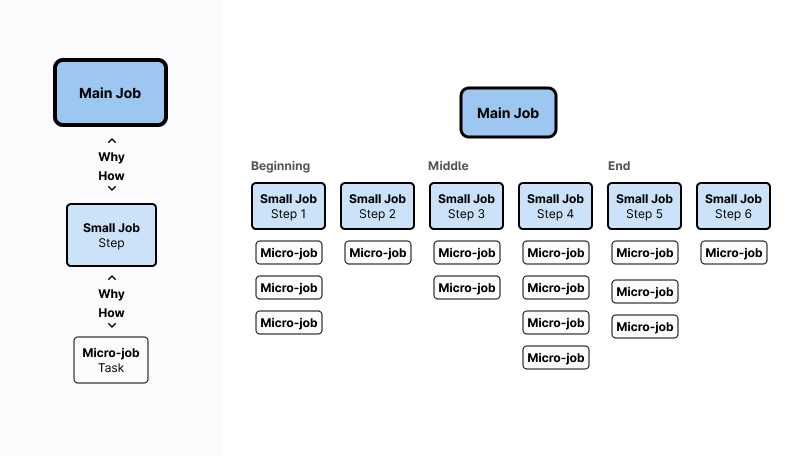

---

title: Jobs to be Done (JTBD) Overview
description: >-
  JTBD is a framework for viewing products and solutions in terms of jobs
  customers want to achieve. It's about understanding the goals that people want
  to accomplish.
---

##

A Job to be Done (JTBD) is a framework, or lens, for viewing products and solutions in terms of the jobs customers are trying to achieve. It's about understanding the goals that people want to accomplish. It lets us step back from our business and understand the objectives of the people we serve. It opens the door to innovation.

At GitLab, we have our own flavor of JTBD and use it throughout the design process, but most notably to:

- Define scope
- Validate direction
- Evaluate existing experiences
- Assess category maturity

JTBD come directly from research and customer conversations with those people who do the tasks/jobs we need to design for. [Problem validation](/handbook/product/ux/ux-research/problem-validation-and-methods/#what-is-problem-validation) is one of the most effective ways to confidently inform the writing of a JTBD.

To learn more about our JTBD philosophy, see the [JTBD deep dive](/handbook/product/ux/jobs-to-be-done/deep-dive/) and [How to use JTBD](https://about.gitlab.com/handbook/product/ux/jobs-to-be-done/using-jtbd/)

You can also watch the following video for a brief overview of why JTBD are so valuable in the product development process:
<figure class="video_container"><iframe src="https://www.youtube.com/embed/H6j1Xd4yufI"></iframe></figure>

### GitLab's Jobs to be Done

All GitLab Jobs to be Done can be found in the [jobs-to-be-done.yml file](https://gitlab.com/gitlab-com/www-gitlab-com/-/blob/master/data/jobs_to_be_done.yml).

## JTBD terminology

First, let's set the terminology we use for JTBD.

- **Job performer**: The person who does the job. Usually, we talk about these people in terms of personas. They are [buyers](/handbook/product/personas/#buyer-personas), [developers](/handbook/product/personas/#sasha-software-developer), [sysadmins](/handbook/product/personas/#sidney-systems-administrator), and so on.
- **Job**: Something a customer wants to accomplish. For example, the main job of a GitLab customer could be stated as, "build and deploy software." The job always follows the pattern (verb + object + clarifier) and is also refered to as the *job statement*.
- **Circumstance**: Describes the circumstances a person is in when they need a job done.
- **Need**: A job performer's desired outcome or end state. The need statement follows the pattern (direction + measure + object + clarifier), for example, *minimize the time it takes to review an MR*.
- **Job story**: A succinct statement that brings together the circumstance, goal, and outcome of a job.
- **Main job**: The primary job the preformer want to accomplish.
- **Small job**: A smaller, more practical job that corresponds roughly to steps or stages in a main job.
- **Micro-job**: A task related to a little job.

## How to write a JTBD

When we refer to JTBD in our work at GitLab, we are referring to the **job story**. A job story provides the context of what is happening while someone is trying to accomplish a goal. In contrast, a job is *only* the thing they want to accomplish. A job story includes: the job, the circumstance, and the need.

We write our job stories using the standard format:

**"When [Circumstance], I want to [job], so I can [need/outcome]."**

Example: When I am on triage rotation, I want to address the business-critical risks in my organizations assets, so I can minimize the likelihood of a security incident.

Job stories are modular, allowing us to innovate and solve problems in different ways. A practical application of this flexibility is to craft the job story at a lower altitude making it more applicable to the problem area we are addressing. Keep in mind that the circumstance and need will not change from the main job story; however, by including more detail in the form of the job stage or step [small job(s)] and narrowing our job (I want to) down to the micro-job level, we achieve a job story that can guide our work more tactically.

**"When [Circumstance + job stage/step], I want to [micro-job], so I can [need]**

Example: When I am on triage rotation and prioritizing business-critical risks, I want to review the most recent risks detected in my assets, so I can minimize the likelihood of a security incident.

JTBD are difficult to get right. Before you begin, you have to have a clear understanding of what someone is wanting to accomplish, and that understanding should be validated with past research and customer conversations.

It is crucial to ensuring that the job stories are grounded in experience and not theory. We must have a high level of confidence in our user's jobs, circumstances, and needs before we can put them into use.

## Determining the scope of a JTBD

Job stories can be written at different levels or altitudes. For the majority of our work, we write job stories for stage groups as we craft experiences for features or sets of related features. If you're writing a job story for your stage group, consider this guiding principle to determine the appropriate altitude: If the job is applicable to more than 3 user types, it's likely the altitude is set too high for a small job (consider whether it is a main job, instead).

### Main Jobs

To help determine longer-term product direction, JTBD can be written for an entire stage or across multiple stages.

A main job is often expressed as a utilitarian goal. It’s an act that will be performed and should have a clear end state&mdash;the “done” part of JTBD. It shouldn’t include adjectives like quick, easy, or inexpensive (because those are considered to be needs) or the metrics by which job performers compare solutions (this is handled separately). The main job is also different from your marketing message or value proposition statement, which tends to be persuasive to evoke an emotion.

Don’t define a main job too narrowly. A small job will limit your field of vision, but also will constrain your efforts. When in doubt, go broader, and define a main job that is larger rather than smaller. Ask “why?” to move higher in altitude during interviews, and “how?” to lower the altitude of the main job.

Example: Address business-critical risk in my organization's assets.

### Small jobs

Small jobs are more practical and correspond to the main job's stages or steps. Small jobs answer the question, "How does the job get done?" in the context of the main job and approximate the process a user moves through to accomplish their goal. Each job step is a small job.

Examples: *Prioritize* business-critical vulnerabilities in my assets; *Determine* the impact of a business-critial risk in my application; *Escalate* a business-critical risk for remediation.

### Micro-jobs

Tasks a user may undergo to accomplish their small job. At this level, we define the sub-processes or actions a user will take to complete a step (small job) of their main job.

Examples of tasks related to the small job, *Prioritize business-critical vulnerabilities in my assets*; Review the most recent risks detected in my assets; Refine the list of risks by relevancy; Refine the list of risks by impact.

### JTBD Hierarchy

Using our examples, we can produce a JTBD hierarchy, confirming we operate at the right altitude.

- **Main job**: Maintain an acceptable level of risk in my organizations assets.
- **Small job**: Prioritize business-critical vulnerabilities in my assets.
- **Micro jobs**: Review the most recent risks detected in my assets; Refine the list of risks by relevancy; Refine the list of risks by impact.

*JTBD hierarchy diagram*

### Using JTBD at GitLab

There are many methods a stage group may use to find or define strategic opportunities with JTBD. You can see more detailed uses of JTBD on our [How to use Jobs to Be Done](https://about.gitlab.com/handbook/product/ux/jobs-to-be-done/using-jtbd/) handbook page. If you plan on using one of these methods, remember to use [interviews to validate your jobs](https://about.gitlab.com/handbook/product/ux/jobs-to-be-done/deep-dive/#how-do-i-discover-jtbd-relevant-to-my-group) before spending too much time learning about inaccurate jobs.

## Quick methods to increase confidence

- Reference previous research and industry standards.
- Conduct [generative problem validation research](/handbook/product/ux/ux-research/problem-validation-and-methods/#when-to-use-problem-validation) using broad questions. For example, ask questions like, "tell me what you do as a software engineer."
- Run abbreviated 30-minute job interviews with a minimum of 5 participants (direct questions). For example, ask questions based on the JTBD such as, "tell me about the last time you made an architectural decision. What went well? What didn't go so well?" Document your interview using the [JTBD Interview Note template](https://docs.google.com/spreadsheets/d/e/2PACX-1vSX5b57MKfLFl59TfiN61rWNkm2Qctb8cVy40JUGsF6FyEcy3jhPBUxY-4D3exXxqXPwwBkcSOb0HT8/pub?output=xlsx).

## Job stories and user stories

Read "[What is and isn't a JTBD](/handbook/product/ux/jobs-to-be-done/deep-dive/#what-is-a-jtbd)".

[Job stories differ from user stories](https://jtbd.info/replacing-the-user-story-with-the-job-story-af7cdee10c27) because they are persona, product, and solution agnostic. This allows us to think more deeply about the user's context, motivations, and needs rather than just a *title, task, and goal*.

*Example:*

- **Job**: Address business-critical risks in my organization's assets.
- **Job story**: When I am on triage rotation, I want to address business-critical risks in my organization's assets, so I can minimize the likelihood of a security incident.
- **User story**: As a Security Analyst, I want to address vulnerabilities in my applications, So that I can ensure there are no unattended risks.

Job stories offer a higher-level view of the main objective. However, when written at a lower altitude, they can serve the same function as user stories, guiding your solutions while keeping the main job, circumstances, and need in mind.

If you want a detailed breakdown of each segement of the JTBD, learn more about the [structure of a JTBD](/handbook/product/ux/jobs-to-be-done/deep-dive/#how-do-i-structure-a-jtbd).

### Job stories and user personas

[User personas](https://about.gitlab.com/handbook/product/personas/#user-personas) are people who use GitLab. Each persona represents a person with a particular job title or role in an organization. A job performer in our JTBD framework is any user doing a specific task. In practice, the person who is the job performer could change and is not strictly tied to a job title.

For example, anyone who creates a merge request is considered a Code Author (job performer) in the JTBD Framework. This is a different perspective of a user persona that attempts to fit any person in an organization with the title Software Developer into the [Sasha](https://about.gitlab.com/handbook/product/personas/#sasha-software-developer) user persona.
