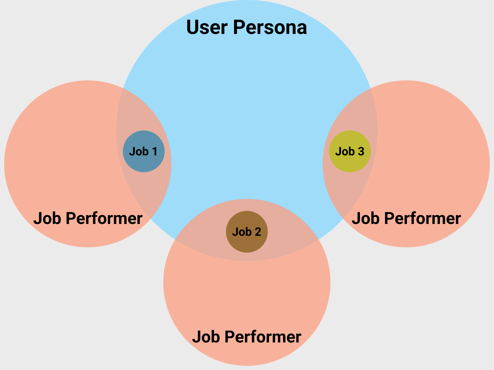

---

title: "Jobs to be Done (JTBD) Deep Dive"
description: "There are more than a few frameworks for Jobs to be Done. The aim of this documentation is to adapt those frameworks to create a shared understanding that fits our needs."
---

##

There are more than a few different frameworks for Jobs to be Done (JTBD) out there. The aim of this documentation is to adapt those frameworks and create a shared understanding of a JTBD process that fits our needs here at GitLab.

Our goal is to make products that people want, as well as make people want our products. Using JTBD can help us do that.

## What is a JTBD?

- **A lens for viewing your products and solutions in terms of the jobs customers are trying to achieve.** Instead of looking at the demographic factors of usage, JTBD focuses on what people seek to achieve in a certain circumstance ([see Clayton Christensen's Milkshake video](https://www.youtube.com/watch?v=sfGtw2C95Ms)).
- **A way to understand the goals that people want to accomplish.** Achieving those goals amounts to progress in their lives. Jobs are also the needs, motivators, and drivers of behavior: they predict why people behave the way they do. This moves beyond mere correlation and strives to find causality.
- **A chance to step back from your business and understand the objectives of the people you serve.** To innovate, don’t ask customers about their preferences, but instead understand their underlying needs and motivations.
- **A framework for improving collaboration and communication across disciplines and stage groups.** Since JTBD isn't particular to any expertise (for example, product, UX, marketing), it can be used by all of these disciplines to focus team members on the core problem that the business aims to solve for its customers. For example, rather than marketing having personas, UX having user stories, and so on, the company can use JTBD to establish common, high-level definitions that everyone can use.

## What isn't a JTBD?

- **They are not about your product, service, or brand.** People “hire” products to get a job done. Instead of focusing on your own solution, you must first understand what people want and why that’s important to them.
- **They are not about specific products or particular solutions.** Instead, they focus on the process that people go through to solve a problem.
- **They are not a replacement for the user persona framework.** The two contrasting viewpoints share similarities without being incompatible. They can be used together to gain a more holistic view of the product and its users. For example, you may want to consider the job statement and process while drafting the workflow of a new feature, but you may want to check specific content on a page suitable for a particular user persona.  

## When should I use a JTBD?

Use JTBD throughout the design process, but most notably to:
- Define scope
- Validate direction
- Evaluate existing experiences
- Assess category maturity

## How do I structure a JTBD?

A core strength of JTBD is its structure, which clearly separates out various aspects of achieving objectives. The who, what, how, why, and when/where are analyzed individually, giving both precision and flexibility to JTBD methods.

### *Who* is the focus of a JTBD?

When writing a JTBD, focus on the **job performer**. In other words, write it from the perspective of an end user who is trying to do the job. Conversely, do not write a JTBD from the perspective of what GitLab (or the business stakeholder) wants to achieve.

Other functions within the job ecosystem to consider include the following:
   - **Approver:** Someone who authorizes the acquisition of a solution
   - **Reviewer:** Someone who examines a solution for appropriateness
   - **Technician:** The person who integrates a solution and gets it working
   - **Manager:** Someone who oversees a job performer while performing the job
   - **Audience:** People who consume the output of performing the job
   - **Assistant:** A person who aids and supports the job performer in getting the job done

Note that these different roles don’t refer to job titles. Instead, they represent different functional actors within the context of getting a job done.

### *What* does the job performer want to accomplish (independent of your solution)?

The aim of the job performer is not to interact with your company but to get something done. Because they don’t mention solutions or technology, jobs should be as timeless and unchanging as possible. Strive to frame jobs in a way that makes them stable, even as technology changes.

#### Is a Job Performer the same as a User Persona?

No, a user persona represents a person in an organization with a particular job title. That persona may have 3-4 main jobs, which can be expressed using the JTBD framework.  Similarly, the role of job performer can be taken by more than one user persona.

While using the JTBD framework, a user's job title or personal details are not as crucial as their capability to successfully carry out the job process. As a result, the two frameworks do have some overlap but are not designed to fit together perfectly. The following visual Venn diagram may be helpful in understanding this overlap.

### *How* will the job get done? (objective of the JTBD)

The process follows job performers as they move through different goal stages in order to accomplish their goal.

  - Understanding the process of the job performer’s intent is key to JTBD.
  - You can illustrate the job in a chronological map using a sequence of stages, such as Beginning, Middle, and End.
  - Each stage can contain multiple user stories. Be careful not to get into the tasks/physical activities just yet.
  - Because the job has to be “done,” be sure to formulate the job in a way that has an end state.
  - Once you have the sequence, specify the tasks needed to complete each user story.

### *Why* does the performer act in a certain way? What are their requirements or intended outcomes during the job process?

Why do the job performers act the way they do while getting a job done? Their actions might be tied to achieving specific outcomes, such as producing a specific report. Their actions might also be tied to requirements or processes to which they must adhere.

In JTBD, a need is seen in relation to getting the job done. Needs aren’t demands from a solution, but an individual’s requirements for getting a job done. Needs aren’t aspirations, either, which are above the job in terms of abstraction.

Example: If a main job is defined as *file taxes*, their need may be to *minimize the time it takes to gather documents or maximize the likelihood of getting a return*.

Example: Expressions like “have financial peace of mind” or “provide for my family” are motivations beyond getting the job. These are important aspects to consider later, but not needs related to reaching the objective of filing taxes.

### *When and where* does the job get done?

The circumstance (or contextual factors) that frame job execution include when and where the job gets done; for example, aspects around time, manner, and place. A job without context is not complete and cannot provide strategic direction. There is a dependency between formulating a job and knowing the circumstances.

JTBD uses circumstances to make them relevant to an organization. The conditions around the job give it meaning and relevance and therefore must be considered. Adding contextual detail to the situation also helps greatly when designing a solution.

Example: *Get breakfast* is a very broad job that could apply to many situations. But for a fast food restaurant, *get breakfast on the go*, is a more precise job to focus on.

Example: A solution for the job *get breakfast on the go* could include everything from going to a restaurant or diner to eating a packed lunch at a desk. But when considering specific circumstances like *when late for work, while commuting* and *when cost is a factor*, a morning milkshake might be a better solution for the job.

### *How do I discover* JTBD relevant to my group?

Jobs to be Done are discovered by interviewing real-world users. At GitLab, it is advised to use the assistance of a UX Researcher throughout the process.

1. Determine the project's scope with the relevant stakeholders. Understanding who you want to talk to you and what jobs you want to understand is just as important as determining what jobs are not in scope for this project.
2. Create a problem validation issue similar to this [example issue](https://gitlab.com/gitlab-org/ux-research/-/issues/2223) in the UX Research project, and fill out the description.
3. You may create an assumptive JTBD map with internal stakeholders [similar to this template](https://drive.google.com/file/d/154noxIz5_ziAk9KHASHqb8faYCTw9ZyQ/view?usp=sharing). You can also validate your findings through desk research. This map can prepare you for the participant's workflow and the language they might use to describe their job. This is activity is optional.
4. When you're ready to interview external participants, adjust this [screener template](https://docs.google.com/document/d/1paH7wpXvCIOIDIy_GiDkbXWy3gfF4a8WXGYzLDMONkc/copy) as needed. Remember to recruit GitLab users and non-users, as the JTBD framework is product-agnostic.
5. Afterwards, you can modify this [JTBD Script template](https://docs.google.com/document/d/1wnvsJtWrLntliOxyYudrSnqatmxPZBvAYobXusW2np8/copy) to help you conduct the interviews. Remember to keep the scope and output of the interviews in mind while modifying the script. Keep in mind the job process and statement should be something that does not need a user interface and might even be applicable in the distant future.
6. Finally, summarize the data using a Figjam board similar to this [previously used JTBD canvas](https://www.figma.com/file/chlrPbqJWNELUR2dFapUcL/JTBD-%26-JTBD-Research-%3E-Secure-and-Govern-Job-Canvas-and-Heirarchy_2023-08-23_11-14-17?type=whiteboard&node-id=0-1&t=VaQ5WIqs1zyElt3e-0). If possible, have a note-taker fill out each participant's canvas as the interviews take place. Then, present it to the participant as a way to verify the information.

### *How can I use* JTBD?

JTBD can be used to obtain valuable insights through numerous methods, from screeners to heuristic evaluations. You can see more detailed uses of JTBD on our [How to use Jobs to Be Done](/handbook/product/ux/jobs-to-be-done/using-jtbd/) handbook page. If you plan on using one of these methods, remember to use interviews to validate your jobs before spending too much time learning about inaccurate jobs.

## JTBD examples and tips

JTBDs are difficult to get right can take some time to refine. Below is an example of a job statement and its versions throughout the refinement process. The feedback provided for each version can offer some helpful tips to keep in mind when you're writing them.

Version 1: When new features are added to a product, I want to know if and how those changes impact performance so that I can ensure my product works as expected for users.

- "When new features are added to a product" - Make sure to describe the circumstances the job performer is in when they need to get the job done. New features being added is not an isolated act.
- "I want to know if and how those changes impact performance" - This job can be a bit more specific (instead of using "if and how"). It will be easier to validate when you focus on one aspect of the need/outcome for the job performer.
- "so that I can ensure my product works as expected for users" -  How can you make the outcome for the job performer more specific? Why is it important that the product works as expected? What is the desired end state and/or feeling that a job performer has for doing this job? Make sure to describe the circumstances that the job performer is in when they need to get the job done.

Version 2: When I or my teammate is making a code change to our product, I want to know if the change introduces a latency for my end users so that I can ensure users are satisfied with the performance of the product and continue to use it

- "When I or my teammate is making a code change to our product" - We don't need to specify the "who" this is for since it seems to apply to any code changes to the product.
- "so that I can ensure users are satisfied with the performance of the product and continue to use it" - Handling a latency doesn't measure satisfaction, but it deals directly with usability.

Final version: When a code change is made, I want to know if the change introduces a latency for my end users so that I can meet the quality standards of performance response time to maintain usability for our end users.

- ✅ Describe specific circumstances that the job performer is in when they need to get the job done.
- ✅ Focus on one specific goal or aspect that the job performer needs to complete when writing out the job statement so that it makes it easier to validate in the future.
- ✅ Focus the outcome of the job statement around the desired end state or feeling for the job performer as well as the reason why completing the job is so important. Ensure the outcome is something that is measurable and can be used to validate the job statement.
