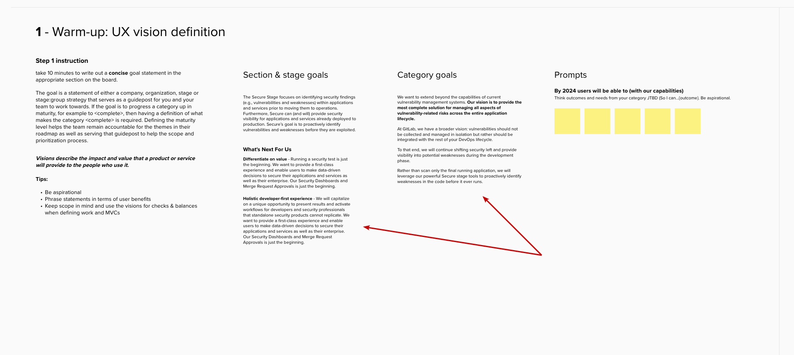

## Overview

This document will serve as a helpful guide for navigating a team through the UX Theme workshop. Much like a user interview guide, the items detailed below are not concrete rules or step-by-step instructions; they are guidelines that allow for minor deviations in the process, which will happen as every team is different.

## Preparing the workshop

1. Create an issue in the GitLab Design Project using the UX Theme Workshop Template.
1. Fill out the information in the issue template and assign it to yourself and the participants.
1. Send a two-hour meeting invite to the participants (UX Theme workshop for <stage:group>
    1. Add meeting invite details
    1. Link to issue in the meeting invite
    1. Copy the agenda into the meeting invite
    1. Link to the homework section of the issue in the meeting invite.
    1. Change the due date to reflect the dates from the workshop issue.

Below is a template comment you can use for the meeting invite.

```
Hello! You are invited to participate in creating a UX Theme workshop for <Stage:group> 🎉!

**Session info**

👉  Everyone: please review the information in (this issue), which will be our guide throughout the process.

**Homework (Due <date> by EOD)**

👉  <PM Name & Designer Name>: As the Product & Design DRIs, we need your help gathering a few links prior to the session. Please review the (Homework section) for more details.

__________________________________

Workshop itinerary
Introduction (5 min)
Goal statement definition (15 min)
Theme clustering (45 min)
--- Break --- (5 min)
Theme refinement (45 min)
Playback & wrap-up (5 min)

Note: The session may not take the entire time, though it is recommended to come prepared in the event it goes the entire 2 hours.
```

Once the Product Manager and Designer have supplied the required information move on to the next step. Note: You may have to remind the participants to supply the information if they have yet to do so in a timely manner. **The workshop cannot be conducted unless this information is provided.**

### Preparing the activities

The activities will take place entirely in FigJam. Only `Step 1 - Warm-up: UX vision definition` and `Step 2 - Cluster inputs into theme bundles` require setup before the workshop.

1. Use [this FigJam template](https://www.figma.com/file/uu5scvnjO2iaGeaiGLYc5T/Template-UX-Theme-workshop-stagegroup_2023-08-23_11-13-15?type=whiteboard&t=0OCWWn7IaFbfH2we-1) and place it into the team's or stage's room.
1. Change <stage:group> to the stage group the workshop is for.

#### Section 1 setup

Follow the links provided by the PM.

>💡 Tip: Not every direction page is consistent. You’ll likely find a mishmash of some or all of these sections within a Stage Group or Category page. You may even see inconsistencies across categories within the same Stage Group. Do the best you can in gathering the most relevant goals for each.

1. Go to the Stage Group's Direction Page
1. Read the Overview Mission, Vision, Letter from the Editor, and Strategic Direction sections. Pull outlines that will be relevant to help align the other workshoppers in crafting a UX vision and ultimately create the group's UX Themes for the year.
1. Copy and Paste the lines and edit them into coherent sentences and paragraphs in the Section & Stage Goals text block.

Move on to Category Goals:

1. Go to the Stage Group's Category page(s)
1. Read the Overview Mission, Vision, Letter from the editor, and Strategic Direction sections* and pull out lines that you think will be relevant to help align the other workshoppers in the task of crafting a UX vision and ultimately creating this UX Roadmap
1. Copy and Paste the lines and edit them into coherent sentences and paragraphs in the Category goals text block

*When complete, the FigJam should look like this:*



#### Section 2 setup

Follow the links provided by the PM for the relevant feature issues. **Only** copy issues with the UX label applied.

> 💡 Tip: Keep the sticky notes in their respective color grouping unordered. Do not arrange them by any pre-existing method (existing epic, product roadmap, group: category,  etc.) The goal is to break down our existing organizational method used in GitLab for this exercise.

> 💡 Tip: Ensure participants have enough space below the sticky notes to create theme bundles. At least ½ of the horizontal area should be blank.

1. Copy and paste each issue title into a sticky note on the FigJam board at the top of Section 2.
1. Change the color of the stickies to yellow following the key in FigJam.
1. Select all of the issues and arrange them into a grid.
1. Copy and paste SUS-Impacting issues and change their color to match the key in FigJam.
1. Copy and paste UX Debt issues and change their color to match the key in FigJam.
1. Arrange these stickies into a grid and place them adjacent to the feature stickies.

Next: Follow the links provided by the Design DRI for relevant insights and JTBD.

1. Copy and paste each actionable insight issue title into a sticky note. Change their color to match the key in FigJam.
1. Copy and paste each JTBD into a sticky note. Change their color to match the key in FigJam.
1. Arrange these stickies into a grid and place them adjacent to the feature, sus-impacting, and UX debt stickies.

*When complete, the FigJam should look like this:*


#### Make the FigJam board available to team members

This [handbook page](/handbook/product/ux/product-designer/#figma--figjam) has information on how to set the appropriate level of access for your FigJam boards.

## Facilitating the Workshop

### Introduction (5 minutes)

#### 1. Set the scene and expectations

Welcome everyone to the workshop; introduce yourself and anyone acting as a co-facilitator. Here you should mention the roles and responsibilities of everyone on the call. Restate the purpose of the workshop as well as reinforce that this is collaborative.

*“Hello <team>, I am <...> and I am joined by <...> and we are here to guide you through this workshop.*

*“The goal of today’s workshop is to leave with a stronger sense of a UX direction, goals, vision, and a prioritized list of themes. For your group”*

*“<participant>, <participant>, <participant>,  you will be collaborating on this together, while <facilitator>, <co-facilitator> are here to assist you if needed.  We encourage you to think and talk out loud as you go through the exercises.*

*“This is a safe space and saying ‘I don’t know` is encouraged. That’s why we are here, to define the known and identify the unknown.”*

#### 2. Review the itinerary

Share your screen and walk through the itinerary in the workshop issue. When complete, stop sharing your screen allowing the participants to focus back on their screens of the FigJam board.

#### 3. Wrap-up the introduction

*Before we get started, are there any questions?*

### Activity 1: Goal and Vision warm-up (10 minutes)

Ask everyone to open the FigJam file (share the link over the Zoom chat), and introduce the first exercise.

>💡 This exercise is part warm-up, to get everyone talking and part exercise for creating UX Themes.

>💡 Teams may struggle with this, but it is okay. All that is required is statements on sticky notes so they can complete the goal/vision statements after the workshop.

#### 1. Set the scene for the activity

*“Looking at the first exercise in the top left you will see the stage and category goal and direction information. This was copied from the direction pages and should be referenced for this exercise.”*

*“Next you will see a set of prompts to use to help define the vision and goal statement, talking amongst yourselves, try to add statements that you can use to help in your definitions.*

*“This is going to be our reference point for this year and act as our north star when scoping our work. Let’s take about 10 minutes to brainstorm. If you need more time then that is okay.”*

*“Does that make sense, any questions?” okay, I will start the timer now.”*

⏲️ **In FigJam Start the timer for 10 minutes**

#### 2. Observe and keep participants on track

- Ensure participants are talking
- Ensure statements are being added to the stickies

ℹ️ Watch as statements are added and ask probing questions, “Why is that important, tell me more about…” etc

#### 3. Wrap-up the activity

At the end of the time, ask if the participants need more time.

If yes, **add 5 more minutes but no more than that.**

Based on the number of stickies generated, you'll get a sense that more time is needed. Because this information is meant to guide the direction, it's okay if it's not 100% perfect.

ℹ️ What's essential is that there's enough information to allow the workshop to progress. It's perfectly okay to mention that the team can return to this async later if necessary.

🟢 Move on to the next activity

### Clustering theme inputs (45 minutes +)

ℹ️ **This is the most critical part of the workshop** as generating themes relies on this activity to be done carefully. If teams have mutually exclusive and collectively exhaustive theme bundles, you'll know this was successful.

#### 1. Set the scene for the activity

📖 Read the Step 2 instruction in FigJam out loud and ask if there are any questions.

*“I’ve transferred the inputs you linked me to in the workshop issue. Now working together, we are going to group these stickies thematically based on the user need they are addressing”*

⏲️ **In FigJam Start the timer for 45 minutes**

#### 2. Observe and keep participants on track

- Ensure participants are working together and not independently.
- Prompt participants when clusters are beginning to form:
  - Ask if any other inputs could fit into that cluster.
  - Ask if any JTBD or insights relate to the cluster.
  - Inquire about clusters that are formed and prompt participants to answer questions about the problem it is solving.

As clusters start to form, you or the co-facilitator should copy and paste the `Beneficiary, Job, Outcome` text block below so teams can begin filling out that information.

ℹ️ Watch out for large clusters. Also, ensure the participants are keeping the scope in mind. (Design work can be completed within (1-3) milestones, including solution validation).

ℹ️ Watch out for inputs within clusters that aren't solving the same problem.

ℹ️ If teams are struggling, propose using the job map template as a guide for the exercise.

#### 3. Wrap-up the activity

A team will rarely complete this activity within 45 minutes. Once the time is up, assess the team's progress and plan for a 5 minute break.

>💡 To reiterate, this is a vital step in the process, and you should not move on without defining clusters.

---

❗️ If you reached the end of time and the team has not finished:
- Take the planned break and return to this activity. After returning from the break, set the timer based on how much more time the team needs on this activity; however, **no more than 30 minutes**.

❗️ If you reached the end of the additional 30 minutes and the team has not finished:
- **DO NOT CONTINUE.** It is unlikely that they will finish all of the workshop exercises; this is okay. Your goal as the facilitator has now changed from completing the exercise to showing the team how to complete the remaining exercises independently.
  - Move on to Step 3.
  - Take a theme bundle and go through step #3 to give the team a better understanding of the process they will continue on their own.

---

🟢 Take the planned 5 minute break

### Break (5 minutes)

This can be an intense process, and participant engagement will fade as the session continues. Including a break is critical for participants to remain focused and engaged in the session.

🟢 Move on to the next activity or continue the prior activity if incomplete.

### Refining clusters into Themes (45 minutes)

#### 1. Set the scene for the activity

📖 Read the Step 3 instruction in FigJam out loud and ask if there are any questions.

⏲️ **In FigJam Start the timer for 45 minutes** or however much time remains, ensuring to reserve at least 5 minutes at the end for a recap and next step directions.

#### 2. Observe and keep participants on track

**Theme statement**: DO THIS LAST for every theme. You will need all the other info before constructing the theme statement.

ℹ️ To help with theme statements, Ask, "If I know nothing about this product area, would I be able to tell what this theme is addressing at a glance?"

**Business objective**: ensure teams don't get caught up in this aspect. This can be filled in after the Theme issue is created; however, it is still an essential part of the process.

**Confidence**: Use the chart in FigJam to have teams assess their confidence. Remember, we do not want to start design work on themes with low confidence.

#### 3. Wrap-up the activity

Have the team look over the themes once they are done.

Ask:
- Are these mutually exclusive?
- Are these collectively exhaustive as they relate to the goals & vision?
- Are these appropriately scooped?

### Conclude

Briefly summarize the activities in the workshop, and celebrate the team's progress. Something to the effect of:

*“Today we created goal and vision statements, bundled work into themes, refined themes and generated the inputs to prioritize them in your roadmap!"*

🏁 Ask if there are any questions about the next steps and end the meeting.

## Post workshop

### Following up

We advise following up with the team in the workshop issue a few days after the workshop has concluded. We want to ensure the activities and concepts are fresh so teams won't have to recall every instruction from the workshop; The more time passes, the harder it will be for a team to complete their themes.

