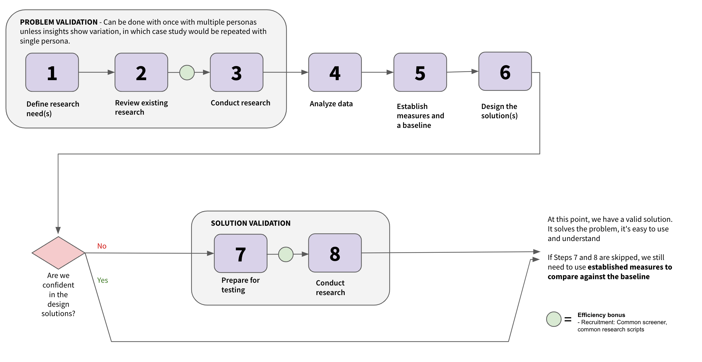

## On this page
{:.no_toc .hidden-md .hidden-lg}

- TOC
{:toc .hidden-md .hidden-lg}

## Overview

The Plan UX team supports [Product Planning](/handbook/product/categories/#product-planning-group), [Project Management](/handbook/product/categories/#project-management-group) and [Optimize](handbook/product/categories/#optimize-group). Product Planning and Project Management are focused on the work items architecture architecture effort. This page focuses mainly on the specifics of how we support this, since it requires alignment and cross-group collaboration.

## How We Work

Some UX specific processes we follow. All groups in Plan don't have to work exactly the same way, but standardizing opens up some efficiencies for us. When it's possible to standardize, we should.

### UX issue management, weights and capacity planning
As a pilot starting in June 2023, Product Planning, Project Management and Optimize will consistently create issues for UX work and pre-pend the title with [UX]. Here is an example - https://gitlab.com/groups/gitlab-org/-/epics/10224#note_1337213171+

- UX issues are the SSOT for design goals, design drafts, design conversation and critique, and the chosen design direction that will be implemented. 
- Product requirement discussions should continue to happen in the main Issue or Epic as much as possible.
- When the Product Designer wants to indicate that the design is ready for ~"workflow::planning breakdown", they should apply this label to their issue, notify the PM and EM, and close the issue.

#### When should a UX issue be used?
UX issues should be used for medium or large projects that will take more than one dev issue to implement (e.g., end-to-end flows, complicated logic, or multiple use cases / states that will be broken down by engineering into several implementation issues). If the work is small enough that implementation can happen in a single issue, then a separate [UX] issue is not needed, and the designer should assign themselves to the issue and use workflow labels to indicate that it's in the design phase.

#### Weighting UX issues
All issues worked on by a designer should have a UX weight before work is scheduled for a milestone. 

- Issue weights should follow the [UX Department's definitions](/handbook/product/ux/product-designer/#ux-issue-weights).
- If the issue is a dedicated [UX] issue, then the issue weight can be added to the `weight` field, but it should also be duplicated as a ~'design weight:" label. This is for UX Department planning purposes. For smaller issues where implementation and UX work happen in the same issue, UX weight should be added using the ~'design weight:" label (the `weight` field is used by engineering).
- Product Managers and Product Designers can use issue weights to ensure the milestone has the right amount of work, to discuss tradeoffs, or to initiate conversations about breaking work into smaller pieces for high-weight items.

## Work Items
When designing for objects that use the [work items architecture](https://docs.gitlab.com/ee/architecture/blueprints/work_items/) we will follow this process intending to ensure that we are providing value-rich experiences that meet users needs. The work items Architecture enables code efficiency and consistency, and the UX team supports the effort by identifying user needs and the places where those needs converge into similar workflows.

### About work items

The first objects built using the work items architecture support the [Parker](/handbook/product/personas/#parker-product-manager), [Delaney](/handbook/product/personas/#delaney-development-team-lead) and [Sasha](/handbook/product/personas/#sasha-software-developer) personas in tasks related to planning and tracking work. Additional objects will be added in the future, supporting a variety of user personas.

Read more about work items
- [Work items architecture](https://docs.gitlab.com/ee/architecture/blueprints/work_items/) 
- [Work items Pajamas documentation](https://design.gitlab.com/objects/work-item)
- [Work items terminology](https://docs.gitlab.com/ee/development/work_items.html#work-item-terminology)

#### Terminology
Work items refers to objects that use the work items architecture. You can find more terms defined related to the architecture here: [work items terminology](https://docs.gitlab.com/ee/development/work_items.html#work-item-terminology).

When we talk about the user experience, we avoid using the term 'work items' for user facing concepts, because it's not specific to the experience and introduces confusion. Instead, we will use descriptors specific to the part of the product we're talking about and that support a similar JTBD. Here are examples of how we are categorizing these:
- Team Planning Objects: Objects that belong to the Planning JTBD. Currently these are Epics, Issues and Tasks but could include others in the future.
- Strategy Objects: Objects that support strategic, organization wide objects. Currently these are Objectives and Key results.
- Development/Build Objects: Objects that support development tasks. These could be MRs, Test Cases, or Requirements
- Protecting Objects: These may include Incidents, Alerts, Vulnerabilities, Service Desk Tickets

This enables us to differentiate these by persona and workflow. While they may share a common architecture on the backend and similar layout on the frontend, in the UI they may:
- appear in different workflows and areas of the application
- have different data fields
- have different actions users can take on them

### Guiding principles
- The DRI for the user experience is the Product Designer assigned to the group that is using the work item architecture for their object(s).
- We work in a user-first mindset, rather then technology-first. To support this, we have created a [research plan](/handbook/product/ux/stage-group-ux-strategy/plan/plan.html#ux-research-for-work-items) for supporting work item initiatives.
- [Pajamas](https://design.gitlab.com/) is our design system and new patterns introduced via work item efforts need to solve a real problem that users have, be validated by user research, and follow the [Pajamas contribution process](https://design.gitlab.com/get-started/contributing).
- We follow [Pajamas principles](https://design.gitlab.com/get-started/principles) for the user experience. 
- MVCs provide value to users, are bug-free and a highly usable experience, as described in [Product Principles](/handbook/product/product-principles/#the-minimal-viable-change-mvc). 

#### How the architecture is intended to work
When designing with the work items architecuture, Product Designers should understand roughly how the architecture works and what implications exist for the user experience.
- A work item has a type (epic, incident), and this controls which widgets are available on the work item and what relationships the work item can have to other work items and non-work item objects. 
- The behavior of the work item in terms of performing its targeted JTBD(s) is powered by the collection of widgets enabled for a work item type.
- We want to avoid building logic or views specific to a type. When you need to support a workflow that isn't currently supported, you can introduce new behaviors through widgets (fields, apps, actions). A practical example: Epics can parent other Epics and Issues. Instead of interconnecting epics and issues this behavior is encapsulated in a 'hierarchy' widget, which could be utilized in other work item types that implement hierarchies; such as Objectives and Key Results.
- Similarly, the work item view should not be customized directly for a type. However, the Product Designer can propose a different user experience and the team implementing the work item will incorporate the necessary use cases into the work items architecture. 
- Work items can be organized and presented to users in any groupings from an IA/Nav standpoint so long as all views leverage the same SSoT grouping FE components (ex: list, board, roadmap, grid, ...). We should only ever need to build and maintain one version of each grouping view that can then be re-used across anywhere we want to display that set of work items. Groupings are determined iteratively based on user needs.

If the quad discovers that the desired user experience would require a greater contribution to the work item architecture than initially thought, they would discuss trade-offs as a team in order to decide whether to proceed or leave the object separate. 

## Design Process for Work Items
### Problem Validation
The quad that owns the code for the object (incident, epic, etc) decides if something should use the work item architecture based on trade-offs around code reuse and user experience. This should be a cross-functional decision, and the group Product Designer should advise their team regarding how well the user's ideal workflow could or could not be supported by the work items architecture. This will allow the team to evaluate how much existing frontend pieces of the architecture could be re-used, and what would need to be added or customized in order to support the desired experience.
    1. As part of the decision making process, Product Designers should do problem validation user research (or leverage existing) to understand the desired user experience, including user goals, tasks, content/data field needs, and whether or not this work item type has relationships and the nature of those relationships.
    1. During this phase, the Product Designer and Product Manager should ensure that success metrics are defined per our work item research process (link TBD)
    1. High level wireframes should be produced to ensure everyone has a shared understanding of what is wanted and to establish a medium term vision for the work.  
### Solution Validation
After the quad decides the work item architecture is suitable, the Product Designer will design the experience in detail. As part of the detailed design, Product Designers, in collaboration with the quad, will:
    1. Design how existing widgets will be utilized, and any new widgets needed or if existing widgets could be abstracted to fit a new use case. For example: The Timeline widget for incidents was designed in isolation specific to the incident use case. It could be reworked slightly to support more use cases, such as objective or key result check-ins.   
    2. Define how users will access this work item. Design how this work item will appear in existing views, such as lists, or any new views needed for this work item.
        - Ensure new components and patterns are contributed back to Pajamas.
    3. Solution validation should be conducted as needed to ensure the workflow and usability meets the user needs.
### Strategically Introduce Design Changes to Work Items
Change can be expensive, so we should consider the value of each design pattern and layout we're changing during migration, and why we're changing it. Our approach will be to weight the value of the improvement against risks of change, and select the most valuable experience improvements:
Consider the cost - With every change, there are these aspects:
- There's more for us to test
- More for users to re-learn
- More potential for inconsistency in the product
- More potential to introduce new bugs during development

Consider the value to users: 
- How much usability improvement is there?
- Are we solving a known issue?
- Would it be very inefficient to make the change post-migration? 
- Is it something we can iterate into?
- Do the benefits outweigh the downsides?

If the Product Designer decides the change is worth going forward with, then we need to follow these steps:
- Compare the change with the rest of the product (not just epics, issues and tasks, but also MRs and anywhere else it applies) and list the differences.
- If introducing an inconsistency we should collaborate with the team involved (probably Create or Foundations) to review the change and get support.
- We need to decide and document in an issue how we will be fixing the inconsistency and when that follow up will occur, and which team is responsible for doing it. 
If we decide not to make the improvement during the phase where we are migrating epics and issues to work items, we'll create follow-up issues for making these improvements later.

## UX research for work items
### Introduction

This section describes the research program to support Product Planning and Project Management groups. The reseach plan may be iterated on to support any team working on user experiences that support the Work Items initiative.

With such a large scope of work that touches upon several personas, the efforts associated with building out the experiences related to Product Planning and Project Management can be overwhelming. This research plan is meant to guide the team: starting with problem validation where research needs are defined, and ending in solution validation where usability testing is conducted to give us confidence in our designs.

The following research plan is designed to fit within the way the Plan teams operate, with flexibility and efficiencies called out. The research plan is based on our standard software development process, with some adjustments to accommodate for the scope of Product Planning and Project Management.

#### Not every change requires us to follow every step. For example:
- For a brand new feature where market need is well defined but user workflows aren’t well known: start with problem validation.
- If the user need is already well defined and understood by the team, start with design and solution validation.
- Most times when adding a new Work Item, or migrating something to a new Work Item, all steps should be followed.
- Because of the potentially large impact on customers, non-trivial changes to high use pages such as Issue/Epic/Task views, detail pages, and boards should always be validated by testing with external users.
- When making a change to existing functionality that uses Work Items, and that has been previously validated, the Product Designer and User Researcher can determine which steps or abbreviated steps are needed.

#### Goal
With whatever we’re building, we should be able to say:
- Why we’re building it
- How it fills an unmet user need
- How important it is for users
- Here are the identified risks
- How new concepts compare against existing experiences

### Problem validation

Naturally, when we start designing a solution, we start with: understanding our users, the relevant personas, the problems they face, their unmet needs, etc - all in the context of Plan.

The first three steps are to be completed across the relevant personas.  While it may be too arduous to conduct detailed research for each persona on a given topic, it’s recommended to include relevant personas in each step to look for differences and similarities.  If there are more differences than similarities, that’s a clue that it’s probably time to dig deeper into those particular personas to learn more. 

**Step 1: Define research needs:** This is perhaps the most important step; it’s where everyone in the quad gains a common understanding of the work to do and where research questions start. Start by working with stakeholders to:
- Understand the goals and scope of the upcoming work
- Align on the above
- Create research questions that are aimed at justifying the work

**Output: a set of problem validation research questions to field**

**Step 2: Review existing research:** It’s always good practice to first look to see if there are existing insights that address your research questions.  This can be done by looking within Dovetail or a more exhaustive internet search.  To help stay focused during this step, it’s recommended to first document the following:
- What we already know or are fully confident in
- What we’re fairly confident in
- What we still need to learn

To stay efficient during this step, it’s best to focus your attention on the research questions you are less confident in and research questions that contain a large knowledge gap. Note that it’s not uncommon for a search to yield results that aren’t applicable to your research questions. However, just knowing that is important - and can justify the next step.

**Step 3: Conduct research:** Now it’s time to start conducting problem validation research to address the knowledge gaps identified in earlier steps. Along the way, you’ll be:
- Identifying user challenges and unmet user needs
- Conducting mental modeling exercises
- Understanding what users value most when it comes to a product planning or project management related experience - along with the goals of the work

EFFICIENCY BONUS: At this point, there’s an opportunity to increase efficiency with participant recruitment by creating a common screener, where a mini-database of qualified participants is created to use throughout the course of the work.

**Step 4: Analyze the data:** After the research is conducted, it’s time to take a step back and analyze the data you collected. You should be able to learn:
- What should be prioritized, in terms of the work being done
- If there are additional research questions that surfaced during Step 3 that need to be answered
- Which user needs are most important to the user
- What trends exist across personas
- What follow-up research needs to be done

**Output: at the end of this step, we have a known user problem.  We understand what they need, why they need it, how important it is, etc.  These aspects are critical in understanding how those fit into the goal you’re working towards. If something doesn’t feel right or isn’t aligned, this is the time to discuss with stakeholders to reassess.** 

**Step 5: Establish measures and a baseline:**  By Step 4, we learned about areas of the experience that are important to our users.  Now is the time to establish measures on how our users feel about those experiences.  In doing so, we’re also creating a baseline of the experience as it is today.  The goal is to provide us with a measured indication to ultimately understand if our proposed designs are resulting in a better user experience than the baseline experience. This can be accomplished by:
- Deciding on a few metrics that apply directly to the experience and the goals
    - Ensure they can be used to accurately measure what’s important to the user
    - The measures should also be able to be reused and are applicable to future design iterations
- Conduct research: run participants through the current experience and apply the metrics
- Document the scores
- Save them to compare against when testing future iterations

**Output: a set of reusable measures and a benchmark.**

Note: This isn’t currently part of our standard research process. We would like to introduce a method to baseline the experience and measure changes over time to confirm whether the experience is improving. We feel this is important for Product Planning and Project Management, because there are so many opportunities to improve and we want to focus on impact to aid decision making. 

**Step 6: Design the solution(s):** Now that problem validation is complete and you have a baseline, it’s time to design the solution(s). It’s important to:
- Consider the personas when designing your solution(s)
- Ensure your designs address the identified problem(s)

**Output: Mockups or prototypes**

—-------
#### Confidence Check
ARE WE CONFIDENT? We can pause at this moment and ask ourselves if we’re confident in the design solution(s). Sometimes, a design solution is straightforward enough where we’re very confident to move ahead with it without solution validation. However, there are times when we’re unsure how the design solution will perform, thereby resulting in a low level of confidence. This is when we decide if we need to conduct solution validation research.

### Solution validation

**Step 7: Prepare for testing:** This is where we identify the research questions we need to answer for solution validation. During this step, the best 1-3 designs are selected for testing. Often, prototypes are built for this kind of testing.

**Output: assets to run participants through solution validation.**

**Step 8: Conduct research:**
It’s time to run participants through the design solutions using our standard solution validation research approach with the relevant personas.  However, there’s one exception: you’ll be using the measures you established in Step 5. Within this step, you’ll be:
- Using the metrics when testing your design(s)
- Comparing the scores against the baseline
- Identifying risks with the design(s)
- Iterate and repeat steps as new insights are discovered

**Output: a design that performs better than the baseline.**

EFFICIENCY BONUS: At this point, there’s an opportunity to increase efficiency with participant recruitment by creating a common screener, where a mini-database of qualified participants is created to use throughout the course of the work.

We may also be able to leverage some of our previous studies to more rapidly build tasks and scenarios for our participants to complete. For example, we could use the scenarios from the benchmarking study to evaluate experience of editing a task from a drawer.

—------

DONE! At this point, we have a valid solution. It solves the problem, it’s easy to use and understand, and it’s a better solution than what users currently have.

When the design is released, even if solution validation wasn’t done, it’s still important to measure against the baseline scores.  With extended use in real-life within their own environments, users may score differently than during the study.

