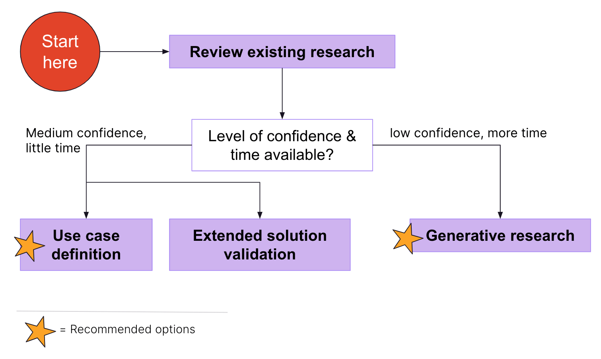

As more teams are taking part in rapid prototyping activities to innovate within the Artificial Intelligence (AI) space, it’s natural to pause and ask yourself: *What’s the problem this aims to solve?*

It’s common that exciting break-through technologies lead to product innovations. However, this can result in teams presenting a technical solution that is looking for a user problem - instead of the other way around.

We need to make sure to keep users’ needs (and unmet needs) in mind while innovating. If we don’t do this, the risk is that we end up building powerful AI solutions that may not address  identified user problems.

The guidelines on this page aim to provide direction on how to include the user’s perspective throughout the design and development of AI solutions.

## UX Researcher support

**If you have an assigned UX Researcher in your stage:** If you need UX Research support, connect with your [assigned stage UX Researcher](/handbook/product/ux/ux-research/how-uxr-team-operates/#how-ux-researchers-are-assigned) following the [research prioritization process](/handbook/product/ux/ux-research/research-prioritization/#how-to-handle-newly-identified-research-projects). Your AI-specific research topic will be prioritized against the other research projects already identified within their stage.

**If you DON’T have an assigned UX Researcher in your stage:** For those working in a stage group that doesn’t have a UX Researcher assigned, Nick Hertz is managing those research requests. The [research prioritization process](/handbook/product/ux/ux-research/research-prioritization/#how-to-handle-newly-identified-research-projects) still applies and you can add your topic to this [AI research-specific prioritization calculator](https://docs.google.com/spreadsheets/d/16iLvrY-saOJsSxFkjVYEu_Db_02caTsQLqzZ59SwFgs/edit#gid=1093756030) after you have opened a research issue.

## The guidelines

### Guideline 1: Problem validation - Identify and understand user needs

AI solutions themselves won’t reveal the user problem they are meant to solve. To identify and understand user needs (and to determine if the AI solution is addressing a real user problem), there are different approaches you can take:

**Review existing research**

- Understand what research knowledge already exists. Dovetail and the [UX Research Drive](https://drive.google.com/drive/u/0/folders/0AH_zdtW5aioNUk9PVA) are good places to start as well as asking your assigned stage researcher. Reviewing what research exists outside of GitLab is valuable, too.
- If **your review results in a medium or low level of confidence** regarding users’ needs, the following options help with collecting additional data.

**Use case definition (recommended option for medium level confidence)**

- Use existing research and your domain expertise to formulate assumptions on the user problem you believe is being addressed with the AI solution. Use the following format to phrase the problem statement, which is aligned to how we write [Jobs to be Done](/handbook/product/ux/jobs-to-be-done/) (JTBD):
   - “When [circumstance a person is in when they want to accomplish something], I want to [something the person wants to accomplish].”
   - Example: *When I am on triage rotation and prioritizing business-critical risks, I want to review the most recent risk detected in my assets.*
- Then, validate your problem statements through a quantitative [online survey](/handbook/product/ux/ux-research/surveys/) to understand:
   - The frequency of users encountering this problem
   - The importance of addressing the problem
- There are other parameters you can include in your survey, such as:
   - How users currently solve the problem
   - The difficulty of solving this problem today
- See this [template](https://docs.google.com/document/d/1-81BH7JPj_SU5L1YvfX2HpYuIdKnUuTpRHuRlKb5w3M/copy) for example questions. More example studies coming soon.

**Extended solution validation**

- Use [solution validation-type studies](/handbook/product/ux/ux-research/solution-validation-and-methods/) to learn more about the users’ needs *before* they engage with the prototype or feature. To do so, add a few questions about their job tasks, workflows, tools, expectations, pain points etc. before participants start their tasks with the prototype (see this [example](https://docs.google.com/document/d/1FXvp1690AGCxJTUeuewit3e8JDljP4sLCf9R7K3wYtk/edit#heading=h.f246e42afjt9)). [Moderated sessions](/handbook/product/ux/ux-research/usability-testing/#different-types-of-usability-testing) are more suitable than [unmoderated ones](/handbook/product/ux/ux-research/unmoderated-testing/#pros-and-cons) and are recommended.

**Generative research (recommended option for low confidence)**

- If you don’t have a high level of confidence or understanding of the problem statement or user needs, you will want to take the time to conduct generative research to learn more about a user group and their needs. While this approach takes more time, it provides deep insights into users’ needs, goals, and pain points that can be used to ideate on new solutions.
- It’s recommended to do this if you have the time. The output will provide a solid justification as to why the AI feature is important for users.

### Guideline 2: Pre-Solution validation - Collect user feedback on your idea before building anything

Did you know that you can validate your future AI powered feature in parallel to the engineering team building it by using [Wizard of Oz prototyping](https://medium.com/@lizschemanski/wizard-of-oz-experiments-eed2c0a12081)? Validating before the AI solution is available is a great way to capture users' expectations and requirements early on. They can inform engineering efforts in training the AI.

Here are a few things to keep in mind when preparing the prototype:

- If your solution includes personalization, you should collect relevant user data for a more realistic experience in the prototype before the session takes place. Make sure users are informed about how their data is being used.
- Include “wrong” recommendations, too, as AI technology is probabilistic and won’t be accurate all the time (see [Guideline 4](#guideline-4-learn-about-the-cost-of-errors-that-ai-will-make)). For example, let’s say you are evaluating a chatbot and participants want to ask questions about UX Research methods. Besides relevant responses to that topic, include some that are not connected to UX Research. You could vary how many “wrong” responses are given to understand what is still acceptable versus where users get frustrated and stop using it.

It may be tempting, but don’t ask users if they would use this AI feature. People are poor predictors of future behavior, so their answers won’t be accurate or useful for you. To get closer to understanding if people may use a solution, it’s best to understand:

1. their problem or need, and
1. how helpful the solution is with addressing those. In other words, does it provide value?

### Guideline 3: Solution validation and more - Collect more than just usability feedback during solution validation of your AI powered prototype

Once an AI powered solution is available for validation, make sure to not only collect feedback on its usability, but also:

- **Baseline data** - on how users currently solve this problem. This allows us to assess the impact the AI solution may have and how helpful it is.
- **On trust** - If people trust the information provided by AI. If they don’t trust it, they won’t use it. Here are some example questions to consider:
   - *How much do you trust the [feature name, e.g. code suggestions] provided?*
   - *Do you trust [feature name, e.g. code suggestions] with [task, e.g. providing correct code]? Why/Why not?*
- **On giving feedback** - If they feel comfortable giving system feedback, e.g. when a code suggestion is not helpful. The AI improves based on user feedback, so it’s important they can do it. You can do this by including a task that focuses on giving feedback on a “wrong” recommendation and measure if they were successful doing it and how they felt about it.
- **On attitudes towards third-party AI services** - If your AI solution is powered by a third party (e.g. OpenAI), it’s important to understand if users are aware of the use of a third-party and their attitude towards it. This provides insights into users’ mental model (see [Guideline 5](#guideline-5-plan-ahead-for-longitudinal-research)) and impact on GitLab as a brand.

We are piloting a [set of AI metrics](#ai-user-experience-metrics-pilot) and recommend including them in your solution validation.

To get robust feedback during solution validation, it’s recommended to collect at least three data points. As AI output varies, it’s not sufficient to rely on the first output only. You can do this by having three similar tasks to see how participants react to the AI’s responses in these three different scenarios.

**Tip:** Avoid asking the tempting “Would you use this?” question.

If you are maturing your AI feature towards [Generally Available](https://docs.gitlab.com/ee/policy/experiment-beta-support.html#generally-available-ga), take a look at the [UX maturity requirements](/handbook/product/ai/ux-maturity/) for further guidance on metrics and success criteria.

### Guideline 4: Learn about the cost of errors that AI will make

AI will make mistakes due to their probabilistic nature. It’s important to understand how AI mistakes may affect users. Will certain mistakes result in turning users away from using it? Or using GitLab? Here's what you can do:

- Plan for research activities to assess what mistakes are ok to do versus those that cause harm and need to be avoided at all cost.
- There may also be opportunities to include questions related to AI mistakes when conducting solution validation, e.g. When evaluating early prototypes (see [Guidelines 2](#guideline-2-pre-solution-validation---collect-user-feedback-on-your-idea-before-building-anything) and [3](#guideline-3-solution-validation-and-more---collect-more-than-just-usability-feedback-during-solution-validation-of-your-ai-powered-prototype)).
- Set up your prototype in a way that it includes “wrong” recommendations to capture how people react to AI mistakes.

### Guideline 5: Plan ahead for longitudinal research

AI evolves as users engage with it over time. As a result, users’ mental models about how it works as they engage with it over time may change (it’s a continuous loop). To ensure we’re continuing to offer AI solutions of value, it’s  important to understand how mental models change over time and evaluate the performance of AI solutions as use cases and users increase.

We are piloting a [set of AI metrics](#ai-user-experience-metrics-pilot) that allow you to evaluate and track user's experience with AI powered features over time.

## AI User Experience Metrics (Pilot)

We developed, and are currently piloting, a set of metrics to evaluate AI powered features in terms of how well they are meeting user needs. These metrics can be used during Solution Validation and to track a user's experience with an AI powered feature over time.

The metrics focus on the following 8 constructs that we observed in a literature review and are captured in [11 survey questions](https://gitlab.fra1.qualtrics.com/jfe/form/SV_e3yxudPETRbZzfM).

- **Accuracy:** How accurate do users find our AI? How much effort is needed to get a meaningful response?
- **Trustability/Fallibility:** Do users trust GitLab's AI?
- **Value:** Are we helping users to be faster and more productive? Are we helping users to learn new things? Do users perceive a benefit from using the AI powered feature?
- **Control:** Do users feel like they have control over how AI recommendations or actions are employed?
- **Error handling:** Are we enabling users to deal with the errors that AI produces?
- **Guardrails:** Have we built-in enough mindful friction into user iteractions with AI such that they are able to think critically about what AI is doing for them?
- **Learnability:** Are users able to quickly understand the AI powered feature?
- **AI limits:** Do users feel like they understand what the AI powered feature can and can't do?

A survey with these metrics is available for you to send to your participants who are working with AI features. If you want to use this survey, ask Anne Lasch for access to the Qualtrics project.

### References

- [People + AI playbook by Google](https://pair.withgoogle.com/guidebook)
- [User research for machine learning systems - a case study](https://dl.acm.org/doi/10.1145/3290607.3299061)
- [Testing AI concepts in user research](https://uxdesign.cc/testing-ai-concepts-in-user-research-b742a9a92e55)
- [Human centered machine learning](https://medium.com/google-design/human-centered-machine-learning-a770d10562cd)
