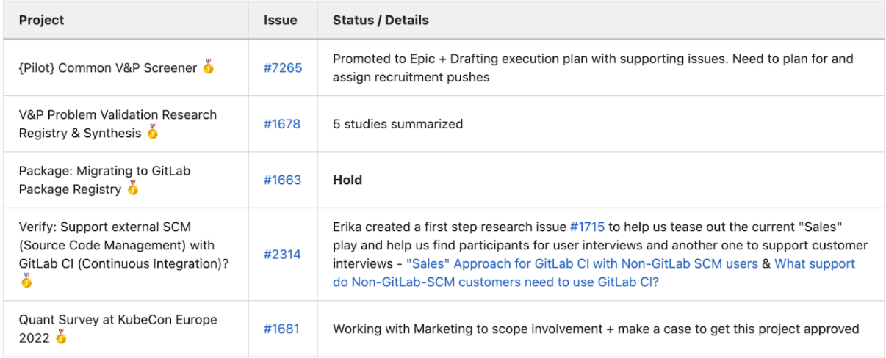

Working from a prioritized list of research projects is necessary for UX Researchers at GitLab. This page walks through a process for UX Researchers to adopt within their own stages and stage groups to prioritize their research projects.

## Why it’s important to prioritize research projects

Researchers have limited capacity, so it’s important to make sure they’re spending their time on the most impactful research projects that are best suited for them to address directly. A set of prioritized projects helps the UX Researcher to push back when lower-priority projects surface. Having a prioritized list also helps UX Researchers move quickly on alternate projects as things change throughout the quarter.

## Who is responsible for research project prioritization?

UX Researchers provide a point of view on prioritization. Ultimately, Group Product Managers or Directors of Product make the final decision on research project prioritization. The below process is designed to help facilitate research project prioritization in a standardized way.

## Challenges when prioritizing research projects

Trying to prioritize research projects across stages and stage groups can be difficult for PMs and UX Researchers, because UX Researchers at GitLab work on multiple stage groups and often across stages. This structure results in UX Researchers working with a number of stakeholders, each with their own priorities. Some other reasons include:

- There is a lack of a standard criteria for prioritization
- New research projects are identified after prioritization
- Priorities sometimes conflict across teams
- There is a high volume of research projects where a UX Researcher could help

The following process can help address these challenges.

## How to prioritize research

The steps outlined here offer guidance and recommendations (not requirements) that can be adjusted to fit team needs. This process is best suited to teams that have changing research priorities and availability to support UX Researchers as they take the lead on projects. This process takes 3 weeks to complete and should be started prior to the start of the quarter.

**Step 1: Create a quarterly research planning issue**

On a quarterly cycle, the UX Researcher will create a research planning issue that includes a list of prospective studies to be prioritized. UX Researchers should work together with Product Managers and Product Designers from the stage groups they support to generate a list of research questions and projects in the research issue. When possible, UX Researchers will propose projects that address research questions from across the team.

The issue with all known potential research issues should be ready for prioritization two weeks before the start of the quarter.

Throughout the quarter, the UX Researcher will use the research planning issue as a single source of truth and will communicate the status of prioritized research projects and link dedicated research project issues ([see example research planning issue](https://gitlab.com/gitlab-org/ux-research/-/issues/1716)).

Monthly, the UX Researcher will facilitate revisiting the research planning issue to refine and update the list to align with monthly development cycles and address any ad-hoc requests.

Optional: As research issues are created throughout the quarter, teams can use a label to show status and [support level](https://research-prioritization.about.gitlab-review.app/handbook/product/ux/ux-research/research-prioritization/index.html#about-the-researcher-support-level). This provides flexibility in how the teams want to view in-flight research throughout the quarter.

*Timeline guidance for Step 1:* This should be completed within one week

**Step 2: Use the Research Priority Calculator**

The UX Researcher and Product Manager will use the [Research Priority Calculator](https://docs.google.com/spreadsheets/d/1RoT5YJ1g7mA09gMicKHobW54iykdqmB-3dYhhUqKjJ4/copy) (search [Template] UX Research Prioritization Calculator in Google Drive to access) to determine the priorities of identified research projects each quarter. For a detailed legend on each criteria, see the second tab in the [Research Priority Calculator](https://docs.google.com/spreadsheets/d/1RoT5YJ1g7mA09gMicKHobW54iykdqmB-3dYhhUqKjJ4/copy) labeled "Criteria Legend."

1. UX Researcher: Make a copy of the calculator template and create line items for each research project identified in the quarterly planning issue and include any projects from the previous quarter that still require work.
1. UX Researcher or Product Managers: Fill in the values for each of the columns in the calculator to get a sense of the scores for the projects.
1. UX Researcher + Product Managers/Group Product Managers/Section Product Managers: Discuss the recommendations given by the calculator and adjust column selections, as needed (for example: if there is a new/interim Product Manager or Product Designer, Bronze projects may be listed as Silver projects to help them onboard and we prioritize the project slightly higher based on the Skill Development criteria). Consider the timeframe in which the research needs to be delivered. While this is not a criteria in the calculator, it should be considered in the final prioritization. It can be helpful to have this discussion with the Product Director instead of Group Product Managers if a UX Researcher covers stages with different Group Product Managers.
1. UX Researcher: Determine the appropriate cutoff for work that can or cannot be completed during the quarter. Communicate which projects **will not be prioritized** this quarter to the affected stakeholders within the research planning issue.
For more details on the calculator, see [about the research priority calculator](/handbook/product/ux/ux-research/research-prioritization/#about-the-research-priority-calculator).

*Timeline guidance for Step 2:* This should be completed within one week



**Step 3: Transfer the results to the quarterly research planning issue**

The last step is to bring the results from the calculator to the quarterly research planning issue, and then discuss them with the teams.

1. Transfer the list of projects from the research priority calculator into the research planning issue by creating a table summary that is ordered by priority and support level. See [example here](https://gitlab.com/gitlab-org/ux-research/-/issues/1716).

  

1. @ mention the team to provide awareness that the prioritization is complete and is open for discussion. Discuss decisions around the prioritized list of projects and the timelines.

1. Add the applicable [research prioritization label](/handbook/product/ux/ux-research/tracking-research-projects/) to each research issue to generate [this dashboard (internal only)](https://app.periscopedata.com/app/gitlab/1063612/UX-research-projects).

*Timeline guidance for Step 3:* This should be completed within one week

## About the Research Priority Calculator

The [Research Priority Calculator](https://docs.google.com/spreadsheets/d/1RoT5YJ1g7mA09gMicKHobW54iykdqmB-3dYhhUqKjJ4/copy) (search [Template] UX Research Prioritization Calculator in Google Drive to access) is a tool meant to provide recommendations on which research projects to prioritize and what level of support is needed from the UX Researcher. The calculator takes into account the following areas. Each criteria receives a score according to the table below and then is summed and divided by 30 (total possible score):

| Criteria  | Description| Score/Weight |
| ------ | ------ | ------ |
| Issue     | Link to research issue | N/A |
| Type     | The type of research the project falls into: foundational, problem validation, solution validation. | Foundational = 3   Problem Validation = 2   Solution Validation = 1 |
|  Ownership| Can this research be supported someone other than a UX Researcher? | Yes = 3   Somewhat = 2   No = 1|
| Design Support | Is this project being requested by a Product team with Product Design support? | Not applicable for this research (study created/led by UX Research) = 3   Requesting Product team has Product Designers = 2   Requesting Product team does not have Product Designers = 1 |
| Complexity | Does this project involve multiple studies or methodologies?   | Yes = 2  No = 1  I don’t know = 0|
| Skill Development | Will this support skill development for the team or refine a process if a UX Researcher is involved?   | Yes = 3  Somewhat = 2   No = 1|
| Confidence | What level of confidence or knowledge do you have in the proposed solution or area of focus?  | High = 3   Medium = 2  Low = 1|
| Impact   | What impact does this work aim to have? (UXR impact framework link TBA) | Changes in product strategy / planning = 3  Changes to product / design = 2   Knowledge gaps identified / filled = 1 |
| Users | How much of the user base will this project consider? Consider the entire user base. | All = 3  Most = 2  Some = 1 |
| Scope | Does this project align with company, section, stage, or stage group goals?  | Company = 4  Section = 3  Stage = 2  Stage Group = 1 |
| Alignment | Does this research connect to company yearlies or objectives and key results (OKRs)? Is this research future-looking or foundational? | Company Yearly = 3   Section / Stage / Stage Group OKR = 2   Foundational / Future Directions = 2   Milestone Planning = 1   None = 1   I don’t know = 0 |
| Section or Stage Group | What Section or Stage Group does this project fall under?  | N/A |
| Timeline | When should this research be completed by?   | N/A |

After a score is assigned for each area, the calculator will output a priority score percentage (the higher the percentage, the higher in priority the project is) and support level for each project.

## About the Researcher Support Level

An output of the Research Priority Calculator includes a Researcher Support Level. This is defined as the level of support the UX Researcher can commit to a given research project. Having a clear delineation of the roles that UX Researchers play in each research project helps everyone understand what is expected of them to execute research and support success.

**Note: When creating the quarterly research planning issue, the UX Researcher can adjust the Researcher Support Level (Gold, Silver, Bronze) from the calculation as needed based on the team or project needs.**

| Researcher Support Level| Priority Percentage |
| ------ | ------ |
| Gold 🥇| Greater than 80% |
| Silver 🥈 | Between 51% and 80% |
| Bronze 🥉 | 50% or less  |

| Researcher Support Level | Description|
| ------ | ------ |
| Gold 🥇  End to end | **DRI:** UX Researcher   **What these projects look like:** Large, strategic, rigorous projects that could benefit from a research specialist. Typically, foundational research, complex research questions, or high-priority problem validation.  **Who does what?** The UX Researcher drives project management, aspects of execution, and completion of most tasks, but has support from Product and Design. While the UX Researcher is the DRI, the team is highly encouraged to participate in research sessions, analysis, discussions of results, and so on.   **Estimated number of studies:**   - 0.5 - 2 active projects (depending on [UX Researcher's level](/job-families/product/ux-researcher/#levels))   **Examples:**   - Research impacting multiple studies   - Multi-method studies |
| Silver 🥈   Task Specific |**DRI:** Product/Design  **What these projects look like:** These primarily consist of problem validation projects.  **Who does what?** The UX Researcher takes on specified tasks within a study and advises on the rest. Product and Design drive project management aspects of execution and completing most tasks with support from the UX Researcher.    **Estimated number of studies:**   - 1 - 6 active projects (depending on [UX Researcher's level](/job-families/product/ux-researcher/#levels))   **Examples:**   - The UX Researcher and Product Manager or Product Designer collaborate on the research methodology, craft a script, or review an analysis.    - The UX Researcher provides dedicated support for specific tasks that take less than a few days to execute.|
| Bronze 🥉   Consult | **DRI:** Product/Design   **What these projects look like:** These primarily consist of solution and problem validation projects.  **Who does what?** The UX Researcher is  consulted on specific aspects of a study. Product/Design is drives project management aspects of execution and completing most tasks, with advice from a UX Researcher. The team tags the UX Researcher in the issue to provide context and a due date for when feedback is needed.   **Estimated number of studies:**   - No more than 10% of the UX Researcher's time should be dedicated to supporting these projects.  **Examples:**   - Reviewing an interview script   - Participant recruiting criteria   - Methodology choice  |

## How to handle newly identified research projects

It’s normal to identify brand new research projects in an ad-hoc manner after prioritization happens, and you can still fold those new requests into the existing prioritized list. Here’s how to do that:

1. UX Researcher: Add the new project in the current quarter’s Research Priority Calculator.
1. UX Researcher + Product: Run through the Research Priority Calculator as outlined above.
1. UX Researcher + Product: See where the priority and support level lands, and adjust the research planning issue accordingly.
1. UX Researcher: @ mention the team to provide awareness of the new project and request that they share concerns/support by a certain date. Discuss decisions around trade-offs or timelines to accommodate the new project.
1. Product: Make the final decision around final prioritization of the new project.

## Maintaining the research prioritization issue

Throughout the quarter, the UX Researcher will maintain their research planning issue. This issue will serve as a section’s SSOT for all UX research.

## Soliciting feedback on the process

Optional: Towards the end of quarter, the UX Researcher will open a Retro comment thread to get feedback on how the process went for the team. This is an opportunity to reflect on the planning process, discuss how research went throughout that cycle, and identify any improvements to make in the next cycle.

Some questions you might consider in the retro comment thread:

- What went well?
- What did not go so well?
- Do you feel the most important research projects were prioritized and executed?
