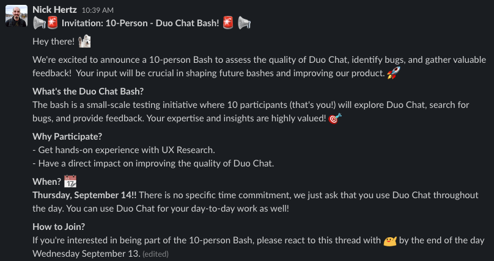
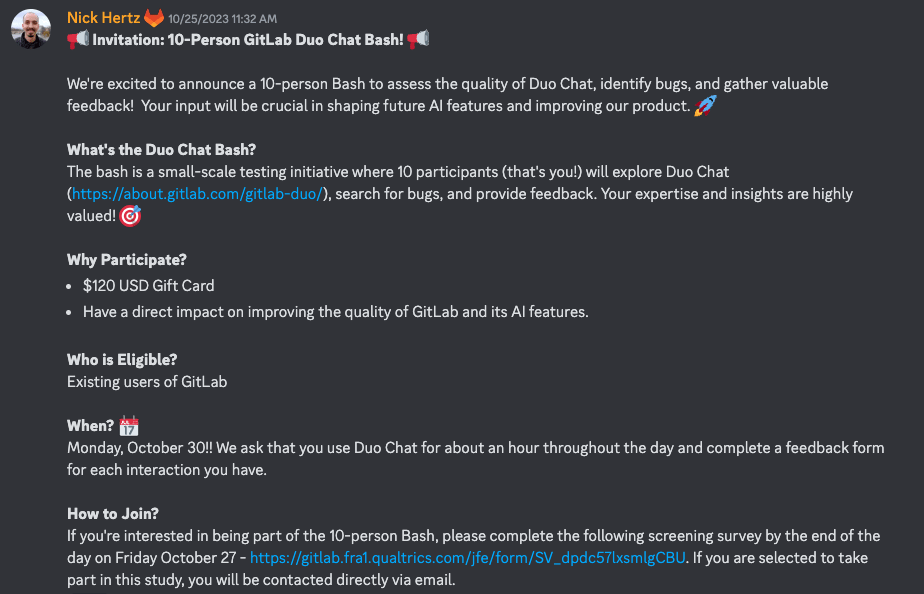
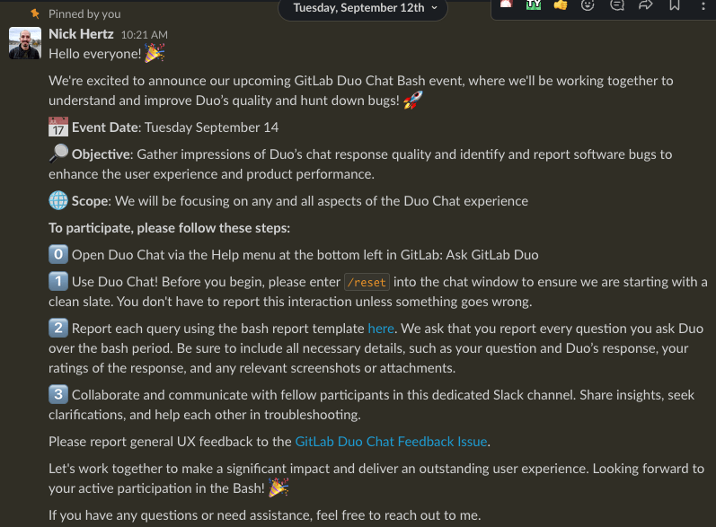
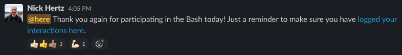
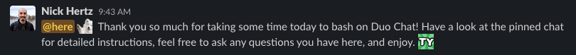

A Bash is a research method where a group of participants, whether diverse or targeted, thoroughly use a feature to efficiently uncover as many pain-points as possible.

The idea is that each participant will use the feature differently, resulting in a large amount of varied feedback in a short amount of time. Bashes usually take place over 24 hours, enabling asynchronous participation.

Benefits of a UX Bash:
- Quickly and efficiently identify and prioritize usability issues.
- Discover software bugs, glitches, and inconsistencies.
- Uncover areas for feature enhancements and improvements.
- Collect user feedback to enhance the product experience.
- Turn around results to the team in 48 hours.

### Appropriate situations for a UX Bash:

Bashes are useful when [foundational research](/handbook/product/ux/ux-research/foundational-research/) has already been conducted, but your team is trying to fine tune the experience before broader release, as quickly as possible. It is also well suited for when a feature is only available internally and it would be difficult to set up a test environment and recruit external users. Bashes offer a cost-effective and efficient supplement to more extensive [solution validation methodologies](/handbook/product/ux/ux-research/solution-validation-and-methods/).

### How to set up a UX Bash:

#### Step 1. Define Bash Goals

- Clearly define what you want to achieve through the Bash (e.g., identify as many different bugs as possible).
- You can set specific goals for identifying usability issues, bugs, or feature enhancements (e.g., is the response time of an interaction fast enough).

#### Step 2. Create a Bash Guideline Issue and Bash Slack Channel

- A [Bash Guideline Issue](https://gitlab.com/gitlab-org/ux-research/-/blob/master/.gitlab/issue_templates/UX%20Bash%20Template.md) is designed to be the participant’s single source of truth for the Bash. It should include the objectives of the Bash, instructions on how to access the feature they are testing, instructions on how to deliver their feedback, and known problems that come up throughout the Bash.
   - Example: https://gitlab.com/gitlab-org/ux-research/-/issues/2682
- Create a dedicated private Slack channel for your Bash (ex. #duo_chat_bash_oct24). This allows participants to collaborate and seek clarification during the Bash. It is best practice to include the Bash Guideline Issue and your data collection mechanism as Bookmarks in the Slack channel.

#### Step 3. Determine Data Collection Approach

- Since the goal of the Bash is to collect as much feedback as possible, you need a way to collect that information. Qualtrics is one type of survey tool that allows multiple entries for a Bash, but you have the flexibility to select any feedback mechanism that works best for you and your team (i.e. GitLab issues, Google Forms, etc.). Your feedback mechanism should collect the information you and your team are most interested in, but should be short and to the point. We want to collect as much information as possible without becoming burdensome to the participant.
- For example, in the Duo Chat Bash, the team was most interested in participants’ perceptions of accuracy. Here is an example of some of the questions presented in a Qualtrics survey ([Link to example survey](https://gitlab.fra1.qualtrics.com/jfe/form/SV_8p2Hp3HVgsiVEKW)):
   - What was the question you asked Duo Chat?
   - What was Duo’s response?
   - Ratings of overall quality
   - Ratings of the speed of the response

#### Step 4. Recruit:

- Determine who will participate in the Bash. Ensure that participants accurately represent the target users of the feature in order to provide actionable feedback. You can choose to target a diverse group or a specific audience based on the goals of your Bash.
- Bashes don’t have a maximum number of participants, but can expand based on your needs, ability to recruit from a population, and your ability to analyze the data efficiently. Previous Bashes have usually consisted of 5-10 users.

##### For Recruiting Internal Participants

- In the #ux_research_volunteers Slack channel, make an official announcement about the upcoming Bash.
   - 
- Share that announcement to other Slack channels for additional exposure. If you are targeting specific audiences, you can strategically select which channels to share with.
   - Examples of diverse channels: #random, #whats_happening_at_gitlab
   - Examples of targeted channels: #security, #docs, #product, #development
- Create a calendar event as a placeholder and add people who sign up to the event

##### For Recruiting External Participants

- [Join the GitLab Discord server](/handbook/marketing/developer-relations/workflows-tools/discord/), where the community and external users are active
- Reach out to Fatima Sarah Khalid (GitLab and Discord handle: sugaroverflow) to have your Discord profile noted as a GitLab employee.
- Create an [Incentives Request issue](/handbook/product/ux/ux-research-coordination/incentives/) to pay participants.
- Announce the Bash in the #announcements Discord channel with a link to a [screener survey](/handbook/product/ux/ux-research/write-effective-screener/)
   - 
- Select your participants.
   - You can also work with Fatima Sarah Khalid (GitLab and Discord handle: sugaroverflow) to have your post shared on the GitLab Community Forum to boost awareness.
- Send event reminders
   - Creating a calendar event for the Bash and emailing participants the day before the Bash is a best practice.

#### Step 5. Bash

- Remind participants about the Bash and its goals via the Bash Slack channel you created.
   - 
   - 
- Respond to questions as they come up during the Bash. Note: It is okay to not answer questions about technical limitations in order to get a closer approximation of natural behavior, but let the participant know that.
- Thank them for their participation at the end of the Bash.
   - 

#### Step 6. Reflect

- Analyze data. This will depend on the data you chose to collect, but this will usually involve categorizing qualitative feedback and summarizing quantitative ratings. ([Example Bash Analysis Document](https://docs.google.com/spreadsheets/d/1jwQklnXPzbEIodXishsQ1eEjuxcvSRxczx1JrVBZhBo/edit#gid=118393419))
- Share findings with your team. ([Example Issue Update](https://gitlab.com/gitlab-org/ux-research/-/issues/2513#note_1494533098))
- Gather feedback from participants in order to improve subsequent Bashes.
