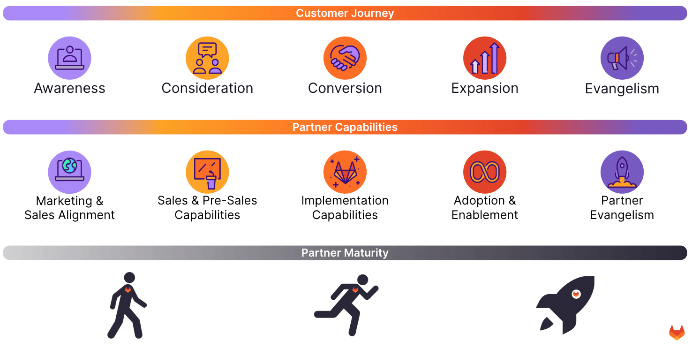

---

title: "Developing your GitLab Practice"
---

## **Developing your GitLab Practice**

### **Intro**

We’re only just getting going at capturing our mutual piece of the $40bn DevSecOps platform[^1] market and one of the keys to success is a focus on customer success. One of our programmatic goals is to make it as simple as possible for you to develop a GitLab practice that meets and supports customers and prospects at all phases of their customer journey.

To those ends, we’ve mapped out our Partner Capabilities Journey that aligns types of capabilities with the customer journey and we’ve layered on three levels of maturity (Walk, Run, & Fly) for each of those types of capabilities. Please check back periodically as we will continue to mature that journey as new best practices or enablement paths or tools are made available.

### **Partner Capabilities Journey**

#### **Walk**

| Walk                                      | Partner Guidance                                                                                                                                                                                                                                                                                                                                                                                                                                                                                |
| ----------------------------------------- | ----------------------------------------------------------------------------------------------------------------------------------------------------------------------------------------------------------------------------------------------------------------------------------------------------------------------------------------------------------------------------------------------------------------------------------------------------------------------------------------------- |
| Sales & Marketing Alignment               | [\- Partner profile live](https://partners.gitlab.com/prm/English/s/assets?id=464613)                                                                                                                                                                                                                                                                                                                                                                                                           |
| Sales & Pre-Sales Capabilities            | [\- Partner can register deals or referrals & drive renewals](https://partners.gitlab.com/prm/English/s/assets?id=414926) [\- Relevant team members have Partner Portal Access](https://partners.gitlab.com/prm/English/s/assets?id=414926) [\- Partner can qualify opportunities](https://partners.gitlab.com/prm/English/s/assets?id=458580&q=qualify) [\- Partner knows how to get licensing support & program support](https://partners.gitlab.com/prm/English/s/assets?id=414926) |
| Transaction & Implementation Capabilities | \- Partner knows about [GitLab Professional Services offerings](https://about.gitlab.com/services/catalog/) they can resell [\- Partner knows how to manage deals and deal registrations](https://partners.gitlab.com/prm/English/s/assets?id=435969)                                                                                                                                                                                                                                        |
| Adoption & Enablement                     | \- Partner knows about [GitLab Education Services offerings](https://about.gitlab.com/services/catalog/) they can resell                                                                                                                                                                                                                                                                                                                                                                    |
| Partner Evangelism                        | \- Partner has a sales motion promoting GitLab by meeting - [Open requirements met](https://about.gitlab.com/handbook/resellers/Channel-Program-Guide/)                                                                                                                                                                                                                                                                                                                                         |

#### **Run**

| Run                                       | Partner Guidance                                                                                                                                                                                                                                                                                                                                                                                                                                                                                                                                                                                                                                                                                                                                                                                                                                                                                |
| ----------------------------------------- | ----------------------------------------------------------------------------------------------------------------------------------------------------------------------------------------------------------------------------------------------------------------------------------------------------------------------------------------------------------------------------------------------------------------------------------------------------------------------------------------------------------------------------------------------------------------------------------------------------------------------------------------------------------------------------------------------------------------------------------------------------------------------------------------------------------------------------------------------------------------------------------------------- |
| Sales & Marketing Alignment               | [\- GitLab incorporated into partner brand presence (incl Free Trial)](https://partners.gitlab.com/prm/English/c/marketing) [\- Enhanced partner profile (locations & solutions)](https://partners.gitlab.com/prm/English/s/assets?id=464613) \- Solution briefs for presales, professional, and adoption services live (example: [GitLab Demo](https://partners.gitlab.com/prm/English/s/assets?id=460934)) \- Partner marketing to existing customers                                                                                                                                                                                                                                                                                                                                                                                                                                |
| Sales & Pre-Sales Capabilities            | [\- Select requirements](https://about.gitlab.com/handbook/resellers/Channel-Program-Guide/) met [\- Partner can architect GitLab solution](https://docs.gitlab.com/ee/administration/reference_architectures/) [\- Partner team can pitch GitLab platform value](https://partners.gitlab.com/prm/English/s/assets?collectionId=49426&id=361255) \- Partner team can align GitLab platform with their solutions \- Presales solutions [\- Demo](https://partners.gitlab.com/prm/English/s/assets?q=demo) [\-Partner led Value Discovery](https://partners.gitlab.com/prm/English/s/assets?collectionId=55659&id=463538)  For more resources see the [Basic Presales Knowledge](https://about.gitlab.com/handbook/resellers/partner-enablement/#basic-presales-knowledge) section of the [Partner Enablement](https://about.gitlab.com/handbook/resellers/partner-enablement/) page.                                                                                                                                                                                                                                                       |
| Transaction & Implementation Capabilities | Reselling path [\- At-scale transaction capability](https://partners.gitlab.com/prm/English/s/assets?id=414926) \- Partner knows how to leverage Cloud marketplaces for referrals Professional services path \- [Professional Services Partner](https://about.gitlab.com/handbook/resellers/Channel-Program-Guide/) designation \- [Partner knows how to leverage/buy partner advisory services from GitLab](https://partners.gitlab.com/prm/English/s/assets?id=414926) \- Solution briefs &/or packages for services: \- [Implementation](https://partners.gitlab.com/prm/English/s/assets?collectionId=49989) \- [Migration](https://partners.gitlab.com/prm/English/s/assets?collectionId=49986) Managed services path \-[Solution briefs &/or packaging for managed services](https://partners.gitlab.com/prm/English/s/assets?collectionId=49432&id=463554) |
| Adoption & Enablement                     | [\- Solutions &/or packaged adoption services](https://partners.gitlab.com/prm/English/s/assets?collectionId=55025) \- GitLab feature adoption \- Tool Consolidation services onto GitLab DevSecOps \- Onboarding new customer Apps onto GitLab platform [\- Partner renewal process is designed to drive adoption and identify growth](https://partners.gitlab.com/prm/English/c/workshops)                                                                                                                                                                                                                                                                                                                                                                                                                                                                                        |
| Partner Evangelism                        | \- GitLab is important for Partner sales and marketing success across teams/regions \- Market solutions around GitLab                                                                                                                                                                                                                                                                                                                                                                                                                                                                                                                                                                                                                                                                                                                                                                        |

#### **Fly**

| Fly                                       | Partner Guidance                                                                                                                                                                        |
| ----------------------------------------- | --------------------------------------------------------------------------------------------------------------------------------------------------------------------------------------- |
| Sales & Marketing Alignment               | \- Partner marketing extends to prospects \- Partner runs quarterly campaigns driving GitLab related solutions                                                                       |
| Sales & Pre-Sales Capabilities            | \- Proof of Value leveraging free trial \- Demo of key integrations \- Clouds (AWS, Google, Azure) \- Jira \- Extended catalog of GitLab use cases \- GitOps \- AI/ML   For more resources see the [Advanced Presales Technical Knowledge](https://about.gitlab.com/handbook/resellers/partner-enablement/#advanced-presales--technical-knowledge) section of the [Partner Enablement](https://about.gitlab.com/handbook/resellers/partner-enablement/) page.|
| Transaction & Implementation Capabilities | \- Solution briefs &/or packages for multi-faceted solutions (Cloud + GitLab + Jira + Terraform)                                                                                        |
| Adoption & Enablement                     | \- DevSecOps platform is core to all customer outcomes                                                                                                                                  |
| Partner Evangelism                        | \- GitLab is integral for Partner sales and marketing success \- GitLab is the default platform for DevSecOps offers                                                                  |

### **Training and Accreditation Program and Requirements**

GitLab has developed core training, accreditation and certification for sales, solution architects (pre-sales engineers), and post sales engineers and consultants. The GitLab Partner Enablement Program is designed to provide our partners with similar training as GitLab employees themselves. For details on available training resources visit the [Channel Training, Certifications and Enablement](https://about.gitlab.com/handbook/resellers/training/) page.
