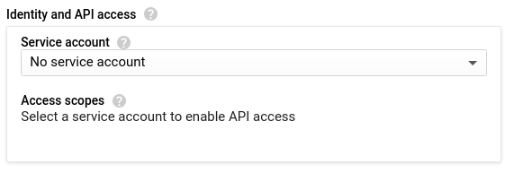
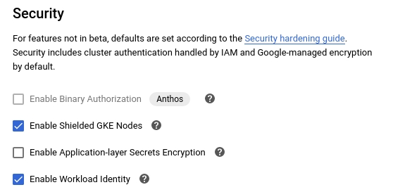

## Security Practices

### Security Process and Procedures for Team Members

#### Google Cloud Resources

Some Google Cloud resources, if deployed with default settings, may introduce risk to shared environments. For example, you may be deploying a temporary development instance that will never contain any sensitive data. But if that instance is not properly secured, it could potentially be compromised and used as a gateway to other, more sensitive resources inside the same project.

Below are some steps you can take to reduce these risks.

##### Google Compute Instances

###### Service Accounts

By default, Google will attach what is called the [Compute Engine default service account](https://cloud.google.com/compute/docs/access/service-accounts#default_service_account) to newly launched Compute Instances. This grants every process running on your new Compute Instance '[Project Editor](https://cloud.google.com/iam/docs/understanding-roles#basic)' rights, meaning that if someone gains access to your instance they gain access to everything else in the project as well.

This default account should not be used. Instead, you should choose one of the following two options:

- If your instance does not need authenticated access to Google Cloud APIs, you should choose not to bind any service account at all. This can be done by appending the `--no-service-account --no-scopes` flags if using the `gcloud` command, or by selecting the following option in the web interface:

- If your instance does need to authenticate to certain Google Cloud APIs, you should use a specific service account that has been granted only the [minimum IAM roles required](https://cloud.google.com/compute/docs/access/service-accounts#service_account_permissions) for your application to function. Access Scopes are not a replacement for properly configured IAM permissions and in general [should not be relied upon](https://cloud.google.com/compute/docs/access/service-accounts#accesscopesiam) as a security mechanism.

###### Firewall Rules

When permitting access to Compute Instances via [firewall rules](https://cloud.google.com/vpc/docs/firewalls), you should ensure you are exposing only the minimum ports to only the minimum instances required.

When creating a new firewall rule, you can choose to apply it to one of the following "Targets":

- `All instances in the network`: This is probably not the option you want. Selecting this option is a common mistake and may expose insecure services on instances other than your own.
- `Specified target tags`: This is probably the option you want. This allows you to limit the rule to instances that are marked with a specific [network tag](https://cloud.google.com/vpc/docs/add-remove-network-tags). You should create a descriptive tag name like "allow-https-from-all" so that it can be easily identified and used when needed.
- `Specified service account`: This is a less likely option, but perfectly viable if you have already done some design around custom service accounts. It is similar to a tag but will be assigned automatically to all instances using a specific service account.

When choosing "Ports and Protocols" to expose, you should never select "Allow All" and should never manually enter entire ranges such as `1-65535`. Instead, you should choose only the specific required TCP/UDP ports you need to expose.

##### Google Kubernetes Engine Clusters

GKE nodes are Compute Instances, and by default use the same Compute Engine default service account described above. Despite making it their default, Google specifically states *"You should create and use a minimally privileged service account to run your GKE cluster instead of using the Compute Engine default service account."*.

Whether deploying a GKE cluster manually or automatically via Terraform, you can [follow these instructions](https://cloud.google.com/kubernetes-engine/docs/how-to/hardening-your-cluster#use_least_privilege_sa) to create and attach a service account with the minimum permissions required for a GKE cluster node to function.

In addition, you should enable [Workload Identity](https://cloud.google.com/kubernetes-engine/docs/how-to/workload-identity#enable_on_cluster) and [Shielded Nodes](https://cloud.google.com/kubernetes-engine/docs/how-to/shielded-gke-nodes#enabling_in_a_new_cluster) on all new clusters. This can be done by appending the `--workload-pool=[PROJECT-ID].svc.id.goog --enable-shielded-nodes` flags if using the gcloud command, or by selecting the following options in the web interface (located under the "Security" menu):

##### Google Cloud Functions

###### Access Control

When creating a Cloud Function with a ["trigger type"](https://cloud.google.com/functions/docs/calling/http) of `HTTP`, Google provides two layers of access control. The first is an identity check, via the following two options under **Authentication**:

- Allow unauthenticated invocations: This will permit anyone on the Internet to invoke your function, supplying any type of input parameters they choose. This option should be avoided where possible.
- Require authentication: This will allow you to [manage authorized users](https://cloud.google.com/functions/docs/securing/managing-access-iam) via Google Cloud. This is the preferred option.

The second is network-based access control, via the following options under **Advanced Settings -> Connections -> Ingress Settings**. You should choose the least permissive option that will still allow your function to work:

- Allow all traffic: This will permit HTTP invocations from any IP address.
- Allow internal traffic only: This restricts invocations to a source in the same Google Cloud project or the same [VPC SC perimeter](https://cloud.google.com/functions/docs/securing/using-vpc-service-controls).
- Allow internal traffic and traffic from Cloud Load Balancing: This is the same as above with the added ability to send an invocation through Google's load balancers.

Some uses cases will prevent you from choosing the "best practice" when it comes to authenticating an inbound request. For example, you may wish to host a webhook target for an external service that doesn't support the use of Google Cloud credentials. For this use case, you can store a complex, machine-generated secrete as an environment variable inside your function and then ensure the requesting service includes that secret inside the request headers or JSON payload. More details and examples can be found [here](https://cloud.google.com/run/docs/triggering/webhooks#authorizing_requests).

###### Service Account

Similar to Compute Instances and GKE clusters, Cloud Functions also [bind to a service account](https://cloud.google.com/functions/docs/securing/function-identity) by default. And once again, [Google states](https://cloud.google.com/functions/docs/securing/function-identity#changing_default_permissions) that "*it's likely too permissive for what your function needs in production, and you'll want to configure it for least privilege access*".

For most simple functions, this shouldn't an issue. However, it is possible that a complex function could be abused to allow the person invoking the function to impersonate that service account. For this reason, you'll want to [configure a new service account](https://cloud.google.com/iam/docs/understanding-service-accounts#granting_minimum_permissions_to_service_accounts) with the bare minimum permissions required for your function to operate.

You can then choose to use this new service account via the option under **Advanced Settings -> Advanced -> Service account**.

##### GitLab Demo and Test Instances

Test and demo instances are publicly accessible on the internet, by default. There may be occasions where team members need to test specific GitLab versions or configurations affected by known security vulnerabilities. It is your responsibility to secure your test instances to prevent them from being compromised or used in ways that could compromise our cloud environment. If you need help securing your instance or have a question, feel free to ask in the #security channel in Slack.

###### IP Filtering

A highly effective way to secure your cloud instances is to apply the [concept of IP filtering](https://www.oreilly.com/library/view/linux-network-administrators/1565924002/ch09s03.html) for each test instance you create whether its a GitLab instance or otherwise. For the majority of cases, this means source IP filtering from one or more [CIDR block ranges](https://whatismyipaddress.com/cidr) ensuring that only certain IPs and integrations can interact with the GitLab instance, therefore reducing the attack surface of the GitLab organization as a whole.

If you don’t know your current IP address to use for source IP filtering, you can utilize services like [whatsmyipaddress.com](https://whatismyipaddress.com/) or [ipinfo.io](https://ipinfo.io/) to retrieve it. The steps to implement IP filtering will differ per cloud environment. Below you can find a detailed guide maintained by the support engineering team.

- [Support Engineering Step-by-Step Guide to Implementing IP Filtering](https://gitlab.com/gitlab-com/support/support-training/-/blob/master/content/ip%20filtering/ip_filtering_test_instances.md)

In addition, you can find official, platform-specific documentation of features involved in implementing IP filtering:

- [Google Cloud](https://cloud.google.com/vpc/docs/using-firewalls#creating_firewall_rules#console)
- [Amazon Web Services (AWS)](https://docs.aws.amazon.com/vpc/latest/userguide/VPC_SecurityGroups.html)
- [Azure](https://docs.microsoft.com/en-us/learn/modules/introduction-azure-web-application-firewall/)

IP filtering should be set up and used when hosting any version of GitLab affected by known and disclosed vulnerabilities.

You can view a list of vulnerabilities affecting a given version of GitLab [here](https://gitlab-com.gitlab.io/cs-tools/gitlab-cs-tools/what-is-new-since/?tab=cves). Versions of GitLab without the latest security patches and fixes applied should not be publicly accessible.

###### Classified Data

Do not host or store any [classified data](/handbook/security/data-classification-standard/#data-classification-levels) on test or demo instances.

For public-facing instances, only [Green data](/handbook/security/data-classification-standard/#green) is allowed.

[RED, ORANGE, and YELLOW classified data](/handbook/security/data-classification-standard/#data-classification-levels), along with customer data and personal data, should never be copied to or stored on test or demo instances.

###### Clean Up

Test instances should be ephemeral.

As soon as you've finished testing, or you've finished your demo, shut down or destroy the test environment.

If this test or demo environment will be live for a substantial amount of time (>24 hours), plan a decommission date and set a reminder for to ensure the instance is shut down or destroyed in a timely manner.

###### Upgrade regularly

For test or demo instances that will be live for an extended period of time, it's important to regularly update GitLab and other software on the machine to ensure the all latest security patches have been applied.

Establish a plan to update GitLab after every security release, and update system packages at least once a week.

Set a reminder for yourself to ensure you apply GitLab security updates in a timely manner.

Also, remember to [clean up](#clean-up) the instance as soon as your test or demo is has concluded.

###### Secure GitLab Application Settings

- Disable New User Registration
- Do not use instance-level shared Runners

###### Use HTTPS

To be in line with [GitLab’s encryption policy](/handbook/security/threat-management/vulnerability-management/encryption-policy.html), TLS should also be implemented on public-facing testing resources. For GitLab instances, you can use the [LetsEncrypt integration](https://docs.gitlab.com/omnibus/settings/ssl.html#primary-gitlab-instance). [Let’s Encrypt](https://letsencrypt.org/) is enabled by default if `external_url` is set with the HTTPS protocol and no other certificates are configured.

#### Personal Access Tokens

1. When creating a [Personal Access Token](https://docs.gitlab.com/ee/user/profile/personal_access_tokens.html), be sure to choose the appropriate [scopes](/handbook/security/security-operations/sirt/engaging-security-on-call.html) that only have the permissions that are absolutely necessary.
1. Oftentimes a [Project Access Token](https://docs.gitlab.com/ee/user/project/settings/project_access_tokens.html) might be sufficient instead of a Personal Access Token. Project Access Tokens have a much more limited scope and should be preferred over Personal Access Tokens whenever possible.
1. Always set an expiration for your tokens when creating them. Tokens should preferably expire in a matter of hours or a day.
1. Be mindful to keep these personal access tokens secret. Be particularly careful not to accidentally commit them in configuration files, paste them into issue or merge request comments, or otherwise expose them.
1. Please consider periodically reviewing your currently active Personal Access Tokens and revoking any that are no longer needed.
1. Personal Access Tokens will be highly discouraged within the GitLab production environment, and disallowed/disabled wherever possible. Existing tokens shall remain, but additional issuance will not be permissible/possible.
1. If you believe a personal access token has been leaked, revoke it immediately (if possible) and [contact the security team](/handbook/security/security-operations/sirt/engaging-security-on-call.html) using the `/security` Slack command.

## Security Department

The Security Department provides essential security operational services, is directly engaged in the development and release processes, and offers consultative and advisory services to better enable the business to function while minimising risk.

To reflect this, we have structured the Security Department around four key tenets, which drive the structure and the activities of our group. These are :

- Secure the Product  - [Security Engineering Sub-department]()
- Protect the Company - [Security Operations Sub-department]()
- Lead with Data      - [Threat Management Sub-department]()
- Assure the Customer - [Security Assurance Sub-department]()

### FY23 Direction

2021 was a productive and accomplished year for GitLab Security.  You can find the [many ways](https://about.gitlab.com/blog/2021/12/17/gitlab-security-twenty-twenty-one/) we made GitLab and our customers more secure in FY22.  In FY23 (Feb 2022 - Jan 2023) we will continue moving the security needle forward as we focus on increased involvement in product features, diversifying our certification roadmap, and increased visibility of our threat landscape.

The [Security Assurance sub-department]() continues to improve customer engagement and advance our SaaS security story.  Independent security validation (compliance reports and certifications) is a critical component to ensuring transparency and adequacy of our security practices. Current and prospective customers highly value independent attestations of security controls and rely on these to reaffirm security of the software and inherent protection of their data. FY22 saw expansion of GitLab’s SOC 2 report to include the Security and Confidentiality criteria along with achievement of GitLab very first ISO/IEC 27001 certification. In FY23 we will continue to grow GitLab’s certification portfolio through SOC and ISO expansion with an additional focus on compliance offerings geared towards heavily regulated markets like FIPS 140-2 and FedRAMP.   These audits will greatly expand our ability to reach new markets, attract new customers, increase contract values and make GitLab even more competitive in the enterprise space.  A heavy focus will be placed on tooling and automation in FY23 to enable our rapid growth.

The [Security Engineering sub-department's]() focus in FY23 will continue to be in the direction of a proactive security stature. Adoption of additional automation and key technology integrations will help further increase efficiency and effectiveness. After the shift left accomplished last year, our ability to detect and remediate risks pre-production has improved. Building on this capability, improving visibility and alerting on vulnerabilities detected as close to code development as possible will be a new focus. Continued maturity of our infrastructure security, log aggregation, alerting, and monitoring will build upon the increased infrastructure visibility and observability accomplished last year. All of this will contribute towards minimizing risk and exposure in a proactive manner.

For FY23 the [Security Operations sub-department]() will be committed to a focus on anti-abuse and incident response process maturity. Using established maturity frameworks, the program will focus on utilizing existing technologies with new expanded datasets supported by refined processes resulting in faster time to triage and short time to remediate.  Additional focus on gaining a deeper understanding of security incidents, abuse, and causes will drive additional preventative practices. Altogether, this will result in fewer security incidents, less abuse, a more secure, and more reliable service for all GitLab users.

Our newest sub-department, [Threat Management]():
FY23 began with the creation of a new sub-department known as Threat and Vulnerability Management. This department will contain our Red Team, Security Research Team, and a newly formed Vulnerability Management team. While the focus of the Red Team and Vulnerability Research teams will not change, the newly formed Vulnerability Management team will take an iterative approach to better understanding and managing vulnerabilities across all of GitLab.
Initially, Vulnerability Management will be very focused on implementing an initial process to better track and analyze cloud assets (GCP, AWS, Azure, DO)  for vulnerabilities.  Once this initial process is in place and being executed on we will begin expanding coverage to the GitLab product, specific business critical projects and other potential weaknesses. The overall goal of this team will be to create a holistic view of GitLab’s attack surface and ensure that the necessary attention is given to remediating issues.
FY23 will also see the introduction of several new security teams.  In addition to the vulnerability management team mentioned above, we are also adding a Log Management team.  This team will report into the Security Engineering sub-department and will be responsible for creating a more holistic approach to log management, incident response, and forensic investigation.

Lastly, we value the opinions and feedback of our team members and encourage them to submit ideas [handbook first](/handbook/company/culture/all-remote/handbook-first/) (directly to the handbook in the form of an MR).  We saw incredible gains in our culture amp survey results in FY22 and going forward we are committed to continuous improvement of our leadership team, team growth and development, and GitLab culture within the Security Department.

{}

This topic is part of our [Engineering FY23 Direction](https://about.gitlab.com/handbook/engineering/#fy23-direction).

-----

### <i class="fas fa-rocket" id="biz-tech-icons"></i> Security Vision and Mission

Our vision is to transparently lead the world to secure outcomes.

Our mission is to enable everyone to innovate and succeed on a safe, secure, and trusted DevSecOps platform. This will be achieved through 5 security operating principles:

1. Accelerate business success with a focus on:
   - Prioritize ‘boring’, iterative solutions that minimize risk
   - Find ways to say Yes
   - Understand goals before recommending solutions
   - Use GitLab first
1. Efficient operations with a focus on:
   - Technical controls over handbook rules
   - Leverage automation first (robots over humans)
   - Responsible decisions (Spending, Tooling, Staffing, etc) over low ROI (return on investment) decisions
   - Reusable or repeatable over singular solutions
1. Transparency with a focus on:
   - Responsible protection of MNPI (material non-public information)
   - Evangelize [dogfooding]() of GitLab publicly
   - Lead with metrics
   - Balance security with usefulness
1. Risk Reduction with a focus on:
   - Secure by default
   - Preventative controls over detective controls
   - Solving root causes over treating symptoms
   - Visibility through Coverage, Discoverability, Observability
1. Collaborative Culture with a focus on:
   - Working together on common solutions
   - Solve shared problems with shared solutions
   - Simplifying language for everyone to understand
   - Avoiding security jargon
   - Seek opportunities to help others succeed

To help achieve the vision of transparently leading the world to secure outcomes, the Security Department has nominated a [Security Culture Committee]().

### Departmental Structure

<table id="Sub-Departments">
  <tr>
    <th class="text-center">
        <i class="fas fa-bullseye i-bt"></i>
        <h5><a href="">Security Engineering</a></h5>
    </th>
    <th class="text-center">
        <i class="fas fa-shield-alt i-bt"></i>
        <h5><a href="">Security Operations</a></h5>
    </th>
    <th class="text-center">
        <i class="fas fa-bullseye i-bt"></i>
        <h5><a href="">Threat Management</a></h5>
    </th>
    <th class="text-center">
        <i class="fas fa-hands-helping i-bt"></i>
        <h5><a href="">Security Assurance</a></h5>
    </th>
  </tr>
  <tr>
      <td>
        <ul>
            <li><a href="">Application Security</a></li>
            <li><a href="">Infrastructure Security</a></li>
            <li><a href="">Security Logging</a></li>
            <li><a href="">Security Automation</a></li>
            <li>External Security Communications</li>
        </ul>
      </td>
      <td>
        <ul>
            <li><a href="">Security Incident Response Team (SIRT)</a></li>
            <li><a href="">Trust and Safety</a></li>
        </ul>
      </td>
      <td>
        <ul>
            <li><a href="">Red Team</a></li>
            <li><a href="">Security Research</a></li>
            <li><a href="">Security Threat & Vulnerability Management</a></li>
        </ul>
      </td>
      <td>
        <ul>
            <li><a href="">Field Security</a></li>
            <li><a href="">Security Compliance, Commercial</a></li>
            <li><a href="">Security Compliance, Dedicated Markets</a></li>
            <li><a href="">Security Governance</a></li>
            <li><a href="">Security Risk</a></li>
        </ul>
      </td>
  </tr>
</table>

#### Secure the Product - Security Engineering

The [Security Engineering]() teams below are primarily focused on Securing the Product. This reflects the Security Department’s current efforts to be involved in the Application development and Release cycle for Security Releases, Security Research, our HackerOne bug bounty program, Security Automation, External Security Communications, and Vulnerability Management.

The term “Product” is interpreted broadly and includes the GitLab application itself and all other integrations and code that is developed internally to support the GitLab application for the multi-tenant SaaS. Our responsibility is to ensure all aspects of GitLab that are exposed to customers or that host customer data are held to the highest security standards, and to be proactive and responsive to ensure world-class security in anything GitLab offers.

##### Application Security

[Application Security]() specialists work closely with development, product security PMs, and third-party groups (including paid bug bounty programs) to ensure pre and post deployment assessments are completed. Initiatives for this specialty also include:

- Perform vulnerability management and be a subject matter expert (SME) for mitigation approaches
- Support and evolve the bug bounty program
- Conduct risk evaluation of GitLab product features
- Conduct application security reviews, including code review and dynamic testing
- Participate in initiatives to holistically address multiple vulnerabilities found in a functional area
- Develop security training and socialize the material with internal development teams
- Develop automated security testing to validate that secure coding best practices are being used
- Facilitate preparation of both critical and regular security releases
- Guide, advise, and assist product development teams as SMEs in the area of application security

##### Infrastructure Security

The [Infrastructure Security team]() consists of cloud security specialists that serve as a stable counterpart to the [Infrastructure Department](https://about.gitlab.com/handbook/engineering/infrastructure) and their efforts. The team is focused on two key aspects of security:

- The security of GitLab.com's infrastructure
- The availability and scalability of Security's own infrastructure

##### Security Logging

The [Security Logging team]() is focused on guaranteeing that GitLab has the data coverage required to:

- Perform the threat analysis, alerting and threat detections necessary to protect the company and its customers
- Ensure compliance with internal policies, standards, and regulatory requirements.

##### Security Automation

[Security Automation]() specialists help us scale by creating tools that perform common tasks automatically. Examples include building automated security issue triage and management, proactive vulnerability scanning, and defining security metrics for executive review. Initiatives for this specialty also include:

- Assist other security specialty teams in their automation efforts
- Assess security tools and integrate tools as needed
- Define and own metrics and KPIs to determine the effectiveness of security programs
- Define, implement, and monitor security measures to protect GitLab.com and company assets
- Design, plan, and build new products or services to aid and improve security of the product and company

##### Security External Communications

The External Communications Team leads customer advocacy, engagement and communications in support of GitLab Security Team programs. Initiatives for this specialty include:

- Increase engagement with the hacker community, including our public bug bounty program.
- Build and manage a Security blogging program.
- Develop social media content and campaigns, in collaboration with GitLab social media manager.
- Manage security alert email notifications.
- Collaborate with corporate marketing, PR, Community Advocates, and Developer Evangelism teams to help identify opportunities for the Security Team to increase industry recognition and thought leadership position.

#### Protect the Company - Security Operations

[Security Operations Sub-department]() teams are primarily focused on protecting GitLab the business and GitLab.com. This encompasses protecting company property as well as to prevent, detect and respond to risks and events targeting the business and GitLab.com. This sub department includes the Security Incident Response Team (SIRT), Trust and Safety team and Red team.

These functions have the responsibility of shoring up and maintaining the security posture of GitLab.com to ensure enterprise-level security is in place to protect our new and existing customers.

##### Security Incident Response Team

The [SIRT team]() is here to manage security incidents across GitLab. These stem from events that originate from outside of our infrastructure, as well as those internal to GitLab. This is often a fast-paced and stressful environment where responding quickly and maintaining ones composure is critical.

More than just being the first to acknowledge issues as they arise, SIRT is responsible for leading, designing, and implementing the strategic initiatives to grow the Detection and Response practices at GitLab. These initiatives include:

- Work with the internal and external partners to ingest logging and alerting into our centralized monitoring solution
- Triage and analysis of alerting to determine validity, how to remediate and/or prevent incidents, then act accordingly
- Coordinate localized or company-wide response to security incidents
- Define and lead vulnerability management for GitLab Team Members and the production/pre-production environments as part of GitLab.com
- Incorporate current security trends, advisories, publications, and academic research into our security practices
- Deploy and maintain security monitoring and analysis solutions for GitLab the business and GitLab.com

SIRT can be contacted on slack via our handle `@sirt-members` or in a GitLab issue using `@gitlab-com/gl-security/security-operations/sirt`. If your request requires immediate attention please review the steps for [engaging the security on-call]({{ ref "engaging-the-security-on-call }}).

##### Trust and Safety

[Trust & Safety]() specialists investigate and mitigate the malicious use of our systems, which is defined under Section 3 of the [GitLab Website Terms of Use](https://about.gitlab.com/terms/#gitlab_com). This activity primarily originates from inside our infrastructure.

Initiatives for this specialty include:

- Detection and mitigation of abusive activity on GitLab.com.
- DMCA Notice and Counter-Notices processing.
- Escalating potential abuse vectors to stakeholders for mitigation.
- Research and prevention of trending abuse methodologies.

 For more information please see our [Resources Section]()

***Code of Conduct Violations*** are [handled](https://about.gitlab.com/handbook/marketing/developer-relations/workflows-tools/code-of-conduct-enforcement) by the [Developer Relations Team](https://about.gitlab.com/handbook/marketing/developer-relations/). For more information on reporting these violations please see the [GitLab Community Code of Conduct](https://about.gitlab.com/community/contribute/code-of-conduct/) page.

#### Lead with Data - The Threat Management Sub-department

[Threat Management Sub-department]() teams are cross-functional. They are responsible for collaborating across the Security department to identify, communicate, and remediate threats or vulnerabilities that may impact GitLab, our Team Members or our users and the community at large.

##### Red Team

GitLab's internal [Red Team]() emulates adversary activity to better GitLab’s enterprise and product security. This includes activities such as:

- Performing exercises with SecOps to collaboratively and rapidly iterate on improving GitLab's security posture. These exercises will be referred to as purple team exercises merging blue (secops) and red teams together.
- Performing exercises to reflect simulated adversarial attempts to compromise organizational mission/business functions and provide a comprehensive assessment of the security state of information systems and organizations.
- Simulating adversarial attempts to compromise organizational missions/business functions and the information systems that support those missions/functions may include technology-focused attacks (e.g., interactions with hardware, software, or firmware components and/or mission/business processes) and social engineering-based attacks (e.g., interactions via email, telephone, shoulder surfing, or personal conversations).

##### Security Research

[Security Research]()
team members focus on security problems that require a high level of expertise,
and development of novel solutions.  This includes in-depth security testing
against FOSS that is critical to GitLab, and development of new  security
capabilities. Initiatives for this specialty include:

- Vulnerability Research into tools and applications that are integrated with, or used at GitLab
- Development of proof-of-concept code to demonstrate impact of security findings
- Development and demonstration of novel defensive and offensive capabilities
- Following [GitLab's responsible disclosure policy](https://about.gitlab.com/security/disclosure/#external) for third party disclosure
- Sharing results widely through blog posts, conference talks, and participation in industry initiatives

Security research specialists are subject matter experts (SMEs) with highly specialized security knowledge in specific areas, including reverse engineering, incident response, malware analysis, network protocol analysis, cryptography, and so on. They are often called upon to take on security tasks for other security team members as well as other departments when highly specialized security knowledge is needed. Initiatives for SMEs may include:

- Security testing of electronics being used as swag by Marketing to be handed out at GitLab events
- Network analysis and/or reverse engineering of a closed source application used with a third party SaaS app integration (e.g. iOS/Android app)
- “Test” the guidelines outlined in a detailed step-by-step instructional document used in the configuration of an asset to ensure the asset is properly secured

Security research specialists are often used to promote GitLab thought leadership by engaging as all-around security experts, to let the public know that GitLab doesn’t just understand DevSecOps or application security, but has a deep knowledge of the security landscape. This can include the following:

- Submit security-related technical talks for presentations at security conferences as a GitLab team member
- Handle security-related questions by the Marketing/PR teams in response to questions from the press, or even direct press interviews

##### Security Threat & Vulnerability Management

[Security Threat & Vulnerability Management]() is responsible for the recurring process of identifying, classifying, prioritizing, mitigating, and remediating vulnerabilities. This process is designed to provide insight into our environments, leverage GitLab for vulnerability workflows, promote healthy patch management among other preventative best-practices, and remediate risk; all with the end goal to better secure our environments, our product, and the company as a whole.

#### Assure the Customer - The Security Assurance Sub-department

The [Security Assurance]() sub-department is comprised of the teams below. They target Customer Assurance projects among their responsibilities. This reflects the need for us to provide resources to our customers to assure them of the security and safety of GitLab as an application to use within their organisation and as a enterprise-level SaaS. This also involves providing appropriate support, services and resources to customers so that they trust GitLab as a Secure Company, as a Secure Product, and Secure SaaS

##### Field Security

The Field Security team serves as the public representation of GitLab's internal Security function. We are tasked with providing high levels of security assurance to internal and external customer through the completion of Customer Assurance Activities, maintenance of Customer Assurance Collateral, and evangelism of Security Best Practices.

Initiatives for this specialty include:

- Facilitating [Customer Assurance activities]() including [The Trust Site](https://about.gitlab.com/security/) and [The Customer Assurance Package]().
- Enabling the Sales organization through security training, collateral development, RFP maintenance and customer support
- Evangelizing Security Best Practices to customers and internal teams
- Managing customer security questions and escalating potential security issues to appropriate teams and drive to resolution

##### Security Compliance

Operating as a second line of defense, Security Compliance's core mission is to implement a best in class governance, risk and compliance program that encompasses SaaS, on-prem, and open source instances. Initiatives for this specialty include:

- Maintaining a certification [roadmap](https://gitlab.com/groups/gitlab-com/gl-security/compliance/-/roadmap) based on customer needs *e.g.*
    - FedRAMP
    - ISO 27001
    - [SOC 2]()
- Monitoring the adequacy and effectiveness of [GitLab security common controls]() and timely remediation of observations
- Facilitating external certification audits to include timely remediation of observations
    - Assisting Security leadership in developing processes and controls to manage risks and issues
- Proposing compliance features for the GitLab product in order to help our customers more easily achieve their compliance goals

For additional information about the Security Compliance program see the [Security Compliance team handbook page]() or refer to [GitLab's security controls]() for a detailed list of all compliance controls organized by control family.

##### Security Risk

We support GitLab's growth by effectively and appropriately identifying, tracking, and treating Security Operational and Third Party risks.

Initiatives for this specialty include:

- Maintaining a [Security Operational Risk Management program](), executing annual operational security risk assessments, and managing a consolidated security risk register.
- Maintaining a [Third Party Risk Management program]()

It’s important to note that the three tenets do not operate independently of each other, and every team within the Security Department provides an important function to perform in order to progress these tenets. For example, Application Security may be strongly focused on Securing the Product, but it still has a strong focus around customer assurance and protecting the company in performing its functions. Similarly, Security Operations functions may be engaged on issues related to Product vulnerabilities, and the resolution path for this deeply involves improving the security of product features, as well as scoping customer impact and assisting in messaging to customers.

#### Other groups and individuals

##### Security Program Management

Security Program Management is responsible for complete overview and driving security initiatives across Product, Engineering, and Business Enablement. This includes the tracking, monitoring, and influencing priority of significant security objectives, goals, and plans/roadmaps from all security sub-departments.  [Security Program Manager Job Family]()

###### Security Program areas of focus

- Drive Accountability & Visibility for Program Objectives & Goals
- Drive, Gather, & Examine Program Needs & Opportunities through Intra & Inter Organizational Collaboration
- Provide Insights & Suggestions Impacting Program Strategy & Roadmap
- Assist in Gathering & Prioritizing Program Risks, Requirements, & Alignment to Influence Remediation
- Drive & Define Acceptance Criteria, Value Proposition, Milestones to Visualize and Communicate Program Effectiveness
- Develop Repeatable, Scalable, Efficient, Effective, Processes & Procedures

##### Security Architecture

Security Architecture plans, designs, tests, implements, and maintains the security strategy and solutions across the entire GitLab ecosystem.

- [Security Architecture]()
- [Security Architecture Review process]()

-----

### <i id="biz-tech-icons" class="fas fa-users"></i> Contacting the Team

#### Reporting vulnerabilities and security issues

For information regarding GitLab's [HackerOne bug bounty program](), and creating and scheduling security issues, please see our [engaging with security]() page.

#### Reporting an Incident

If an urgent security incident has been identified or you suspect an incident may have occurred, please refer to [Engaging the Security Engineer On-Call]().  Examples include, but are not limited to:
 - Lost or stolen devices
 - Leaked credentials
 - Endpoint compromise or infection
 - Exposure of sensitive GitLab data

GitLab provides a `panic@gitlab.com` email address for team members to use in situations when Slack is inaccessible and immediate security response is required.

This email address is only accessible to GitLab team members and can be reached from their gitlab.com or personal email address as listed in Workday. Using this address provides an excellent way to limit the damage caused by a loss of one of these devices.

Additionally if a GitLab team member experiences a personal emergency the People Group also provides an [emergency contact email](https://about.gitlab.com/handbook/people-group/#in-case-of-emergency).

#### Sub-groups and projects

Many teams follow a convention of having a GitLab group `team-name-team` with a primary project used for issue tracking underneath `team-name` or similar.
- [@gitlab-com/gl-security](https://gitlab.com/gitlab-com/gl-security/) is used for @'mentioning the entire Security Department
- [@gitlab-com/gl-security/security-managers](https://gitlab.com/gitlab-com/gl-security/security-managers) is used for @'mentioning all managers in the Security Department
- [public (!) Security Department Meta](https://gitlab.com/gitlab-com/gl-security/security-department-meta/) is for Security Department initiatives, `~meta` and backend tasks, and catch all for anything not covered by other projects
- [Security Assurance (@gitlab-com/gl-security/security-assurance)](https://gitlab.com/gitlab-com/gl-security/security-assurance)
    - [@gitlab-com/gl-security/security-assurance/sec-compliance](https://gitlab.com/gitlab-com/gl-security/compliance)
    - [@gitlab-com/gl-security/security-assurance/field-security-team](https://gitlab.com/gitlab-com/gl-security/security-assurance/field-security-team)
    - [@gitlab-com/gl-security/security-assurance/security-risk-team](https://gitlab.com/gitlab-com/gl-security/security-assurance/security-risk-team)
    - [@gitlab-com/gl-security/security-assurance/governance](https://gitlab.com/gitlab-com/gl-security/security-assurance/governance)
- [Security Engineering (@gitlab-com/gl-security/engineering-and-research)](https://gitlab.com/gitlab-com/gl-security/engineering-and-research/engineering-and-research-meta)
    - [gitlab-com/gl-security/engineering-and-research-meta](https://gitlab.com/gitlab-com/gl-security/engineering-and-research-meta) For sub-department wide management and planning issues.
    - [gitlab-com/gl-security/engineering-and-research/automation-team/automation](https://gitlab.com/gitlab-com/gl-security/engineering-and-research/automation-team/automation)
    - [@gitlab-com/gl-security/appsec](https://gitlab.com/gitlab-com/gl-security/appsec) is the primary group for @'mentioning the Application Security team.
    - [@gitlab-com/gl-security/automation](https://gitlab.com/gitlab-com/gl-security/engineering-and-research/automation) is the primary group for @'mentioning the Security Automation team.
- [Security Operations (@gitlab-com/gl-security/security-operations)](https://gitlab.com/gitlab-com/gl-security/security-operations) Security Operations Sub-department
    - [@gitlab-com/gl-security/security-operations/sirt](https://gitlab.com/gitlab-com/gl-security/security-operations/sirt) is the primary group for @'mentioning the Security Incident Response Team (SIRT).
        - [SIRT (private)](https://gitlab.com/gitlab-com/gl-security/security-operations/sirt/operations) for SIRT issues.
    - [@gitlab-com/gl-security/security-operations/trust-and-safety](https://gitlab.com/gitlab-com/gl-security/security-operations/trust-and-safety) is the primary group for @'mentioning the Trust & Safety team.

#### Slack Channels

- [#security](https://gitlab.slack.com/archives/security); Used for general security questions and posting of external links for the great discussions. Company wide security relevant announcements are announced in #whats-happening-at-gitlab and may be copied here.
- [#security-department](https://gitlab.slack.com/archives/security-department) - Daily questions and discussions focused on work internal to the security department. Can be used for
reporting when unsure of where to go.
- [#abuse](https://gitlab.slack.com/archives/abuse) - Used for reporting suspected abusive activity/content (*GitLab Internal*) as well as general discussions regarding anti-abuse efforts. Use `@trust-and-safety` in the channel to alert the team to anything urgent.
- `#security-department-standup` - Private channel for daily standups.
- `#incident-management` and [other infrastructure department channels](https://about.gitlab.com/handbook/engineering/infrastructure/#common-links)
- `#security-alert-manual` - New reports for the security department from various intake sources, including ZenDesk and new HackerOne reports.
- `#hackerone-feed` - Feed of most activity from our HackerOne program.
- Other `#security-alert-*` and `#abuse*` - Multiple channels for different notifications
handled by the Security Department.
- Use the **@sirt-members** mention in any Slack channel to tag the members of the Security Incident Response Team (SIRT).
- Use the **@sec-assurance-team** mention in any Slack channel to tag the members of the Security Compliance and Risk & Field Security teams.
- Use the **@field-security** mention in any Slack channel to tag the members of the Field Security team.
- Use the **@appsec-team** mention in any Slack channel to tag the members of the Application Security team.
- Use the **@trust-and-safety** mention in any Slack channel to tag the members of the Trust & Safety team.

#### External Contact Information

External researchers or other interested parties should refer to our [Responsible Disclosure Policy](https://about.gitlab.com/security/disclosure/) for more information about reporting vulnerabilities. Customers can [contact Support](https://about.gitlab.com/support/) or [the Field Security team]().

#### Ransomware

Ransomware is a persistent threat to many organizations, including GitLab.  In the event of a ransomware attack involving GitLab assets, it's important to know the existing response procedures in place.  Given the variability of targets in such attacks, it's critical to adapt to existing circumstances and understand that disaster recovery processes are in place to avoid paying any ransom.  GitLab's red team has done [extensive research](https://gitlab.com/gitlab-com/gl-security/security-operations/gl-redteam/red-team-operations/-/issues/118) to determine the most likely targets to be affected.  As a result, the following guidelines are intended to help bootstrap an efficient response to protect the organization.

***Critical First Steps:***

- [Engage the SIRT](#-contacting-the-team) team as soon as a ransomware attack is detected
- The SIRT team will then follow the [incident response guide]() and [incident communication plan]() and reference the [relevant run book](https://gitlab.com/gitlab-com/gl-security/runbooks/-/blob/master/sirt/infrastructure/ransomware-attack.md).
- Responders should leverage GitLab's established [rapid engineering response](https://about.gitlab.com/handbook/engineering/workflow/#rapid-engineering-response) plan during the mitigation phase.
- The Business Continuity & Disaster Recovery Controls handbook page should be referenced for relevant information.

***Relevant Teams:***

Depending on the impacted resources, the following teams should be engaged and made aware of the issue created for the rapid engineering response.  Note that this is not a comprehensive list depending on impacted assets.

- [Database: Disaster Recovery Team](https://about.gitlab.com/handbook/engineering/infrastructure/database/disaster_recovery.html) - responsible for disaster recovery strategy for the PostgreSQL database.
- [Infrastructure Team](https://about.gitlab.com/handbook/engineering/infrastructure/#teams) - availability, reliability, performance, and scalability of GitLab SaaS software
- [Infrastructure Security Team](/handbook/security/security-engineering/infrastructure-security/) - infrastructure teams stable counterpart focused on cloud infrastructure security, best practices, and vulnerability management
- [Business Technology Engineering](/handbook/business-technology/engineering/) - endpoint and systems access management
- [Support Team](https://about.gitlab.com/support/) - responding to customer or employee inquiries regarding system outages
- [Legal & Corporate Affairs](https://about.gitlab.com/handbook/legal/)
- [Security Assurance]() - assuring the security of GitLab as an enterprise application
- [Marketing](https://about.gitlab.com/handbook/marketing/emergency-response/) - accurately represent GitLab and our products in our marketing, advertising, and sales materials.

***Communications:***

Once we've determined that we need to communicate externally about an incident, the SIMOC should kick off our [Security incident communications plan]() and [key stakeholders will be engaged]() for collaboration, review and approval on any external-facing communications.  *Note:* if customer data is exposed, external communications may be required by law.

-----

### Security Releases

GitLab releases patches for vulnerabilities in dedicated security releases. There are two types of security releases: a monthly, scheduled security release, and ad-hoc security releases for critical vulnerabilities. For more information, you can visit our [security FAQ](https://about.gitlab.com/security/faq/). You can see all of our regular and security release blog posts [here](https://about.gitlab.com/releases/categories/releases/). In addition, the issues detailing each vulnerability are made public on our [issue tracker](https://gitlab.com/gitlab-org/gitlab/issues?label_name%5B%5D=security&scope=all&state=opened) 30 days after the release in which they were patched.

#### Timing of the monthly security release

Our team targets release of the scheduled, monthly security release around the 28th, or 6-10 days after the [monthly feature release](https://about.gitlab.com/handbook/engineering/releases/) and communicates the release via [blog](https://about.gitlab.com/releases/categories/releases/) and email notification to subscribers of our [security notices](/handbook/company/contact/).

#### Receive notification of security releases

- To receive security release blog notifications delivered to your inbox, visit our [contact us](/handbook/company/contact/) page.
- To receive release notifications via RSS, subscribe to our [security release RSS feed](https://about.gitlab.com/security-releases.xml) or our [RSS feed for all releases](https://about.gitlab.com/all-releases.xml).

#### Security release related documentation

- Further definition, process and checklists for security releases are described
in the
[release/docs](https://gitlab.com/gitlab-org/release/docs/blob/master/general/security/process.md)
project.
- The policies for backporting changes follow [Security Releases](https://docs.gitlab.com/ee/policy/maintenance.html#security-releases)
for GitLab EE.
- For critical security releases, refer to [Critical Security Releases](https://gitlab.com/gitlab-org/release/docs/blob/master/general/security/process.md#critical-security-releases) in `release/docs`.

### <i class="fas fa-book" style="color:rgb(110,73,203)" aria-hidden="true"></i> Resources

#### Tools

- [Incident-Tools (private)](https://gitlab.com/gitlab-com/gl-security/incident-tools)
for working scripts and other code during or while remediating an incident.
If the tool is applicable outside of the `GitLab.com` environment, consider
if it's possible to release when the `~security` issue becomes
non-confidential. This group can also be used for private demonstration projects for
security issues.
- [security-tools (mostly private)](https://gitlab.com/gitlab-com/security-tools/) contains some
operational tools used by the security teams. Contents and/or configurations
require that most of these projects remain private.

#### Other Frequently Used GitLab.com Projects

Security crosses many teams in the company, so you will find `~security` labelled
issues across all GitLab projects, especially:

- [gitlab-foss](https://gitlab.com/gitlab-org/gitlab-foss/issues/)
- [gitlab](https://gitlab.com/gitlab-org/gitlab/issues/)
- [infrastructure](https://gitlab.com/gitlab-com/gl-infra/infrastructure/issues/)
- [production](https://gitlab.com/gitlab-com/gl-infra/production/issues/)

When opening issues, please follow the [Creating New Security Issues]({{ ref "engaging-with-security#creating-new-security-issues" }}) process for using labels and the confidential flag.

#### Other Resources for GitLab Team Members

- [Security Best Practices](), using 1Password and similar tools, are documented
  on their own [security best practices page]().
- [Secure Coding Training]().
- GitLab.com [data breach notification policy](https://about.gitlab.com/security/#data-breach-notification-policy).
- GitLab Internal Acceptable Use [Policy](/handbook/people-group/acceptable-use-policy/).
- For GitLab.com, we have developed a [Google Cloud Platform (GCP) Security Guidelines Policy](https://docs.google.com/document/d/1BBTWC5OpIqrva7DqH4nkjYUmNZ3UFbc6erqV89P_N-o/edit?usp=sharing) document, which outlines recommended best practices, and is enforced through
our security automation initiatives.
- GitLab Security Tanuki for use on security release blogs, social media and security related swag as appropriate:
    - [Web-RGB](https://gitlab.com/gitlab-com/marketing/corporate_marketing/corporate-marketing/tree/master/design/gitlab-brand-files/gitlab-logo-files/gitlab-security-logo/web-rgb)
    - [Print-CMYK](https://gitlab.com/gitlab-com/marketing/corporate_marketing/corporate-marketing/tree/master/design/gitlab-brand-files/gitlab-logo-files/gitlab-security-logo/print-cmyk)
    - and one [exclusively for stickers](https://gitlab.com/gitlab-com/marketing/corporate_marketing/corporate-marketing/blob/master/design/gitlab-brand-files/gitlab-logo-files/gitlab-security-logo/print-cmyk/pdf/sticker/gitlab-security-icon-diecut-sticker-3x2_78in.pdf).
- [Security READMEs](/handbook/security/readmes/)
- [Working in Security](/handbook/security/working-in-security.md)
- [Contributing to GitLab the product as a Security team member]()

#### AI in Security Learning Group

This group is setup to help interested Security team members get up to speed with AI technologies and how to secure them. For more information, see the [AI in Security Learning Group page]().

### Issue Triage

The Security team needs to be able to communicate the priorities of security related issues to the Product, Development, and Infrastructure teams. Here's how the team can set priorities internally for subsequent communication (inspired in part by how the [support team does this]()).

### Internal Application Security Reviews

For systems built (or significantly modified) by Departments that house customer and other sensitive data, the Security Team should perform applicable application security reviews to ensure the systems are hardened. Security reviews aim to help reduce vulnerabilities and to create a more secure product.

#### When to request a security review?

This short questionnaire below should help you in quickly deciding if you should engage the [application security team](https://gitlab.com/gitlab-com/gl-security/appsec):

If the change is doing one or more of the following:

1. Processing, storing, or transferring any kind of [RED or ORANGE data]()
1. If your changes have a goal which requires a **cryptographic function** such as: confidentiality, integrity, authentication, or non-repudiation, it *should* be reviewed by the [application security team](https://gitlab.com/gitlab-com/gl-security/appsec).
1. Deployment of a customer facing application into a new environment
1. Changes to an existing security control
1. Modification of any pipeline security checks or scans
1. A new authentication mechanism
1. Adding code that touches the authentication model, tokens or sessions
1. Dealing with user supplied data
1. Touching cryptography functions, see the [GitLab Cryptography Standard]() for more details
1. Touching the permission model
1. Implement new security controls (i.e. new library for a specific protection, HTTP header, ...)
1. Exposing a new API endpoint, or modifying an existing one
1. Introducing new database queries
1. Using regex to :
  - validate user supplied data
  - make decisions related to authorisation and authentication
1. A new feature that can manipulate or display sensitive data (i.e PII), see our [Data Classification Standard]() for more details
1. Persisting sensitive data such as tokens, crypto keys, credentials, PII in temp storages/files/DB, manipulating or displaying sensitive data (i.e PII), see our [Data Classification Standard]() for more details

You should engage `@gitlab-com/gl-security/appsec`.

#### How to request a security review?

There are two ways to request a security review depending on how significant the changes are. It is divided between individual merge requests and larger scale initiatives.

##### Individual merge requests or issues

Loop in the application security team by `/cc @gitlab-com/gl-security/appsec` in your merge request or issue.

These reviews are intended to be faster, more lightweight, and have a lower barrier of entry.

##### Larger scale initiatives

To get started, create an issue in the [internal application security reviews repository](https://gitlab.com/gitlab-com/gl-security/appsec/appsec-reviews/issues) using the [Appsec Review template](https://gitlab.com/gitlab-com/gl-security/appsec/appsec-reviews/-/issues/new?issueable_tempalte=AppSec%20Review). The complete process can be found at [here](/handbook/security/security-engineering/application-security/appsec-reviews.html).

Some use cases of this are for epics, milestones, reviewing for a common security weakness in the entire codebase, or larger features.

#### Is security approval required to progress?

No, code changes do *not* require security approval to progress. Non-blocking reviews enables the freedom for our code to [keep shipping]() fast, and it closer aligns with our values of [iteration and efficiency](). They operate more as guardrails instead of a gate.

#### What should I provide when requesting a security review?

To help speed up a review, it's recommended to provide any or all of the following:

- The background and context of the changes being made.
- Any documentation or diagrams which help provide a clear understanding its purpose and use cases.
- The type of data it's processing or storing.
- The security requirements for the data.
- Your security concerns and a worst case scenario that could happen.
- A test environment.

#### What does the security process look like?

The current process for larger scale internal application security reviews be found [here]()

#### My changes have been reviewed by security, so is my project now secure?

Security reviews are not proof or certification that the code changes are secure. They are best effort, and additional vulnerabilities may exist after a review.

It's important to note here that application security reviews are not a one-and-done, but can be ongoing as the application under review evolves.

#### Using third party libraries ?

If you are using third party libraries make sure that:

1. You use the latest stable and available version
1. Your team has the ability to support and upgrade this library as security patches are published
1. The maintainer has a security policy
