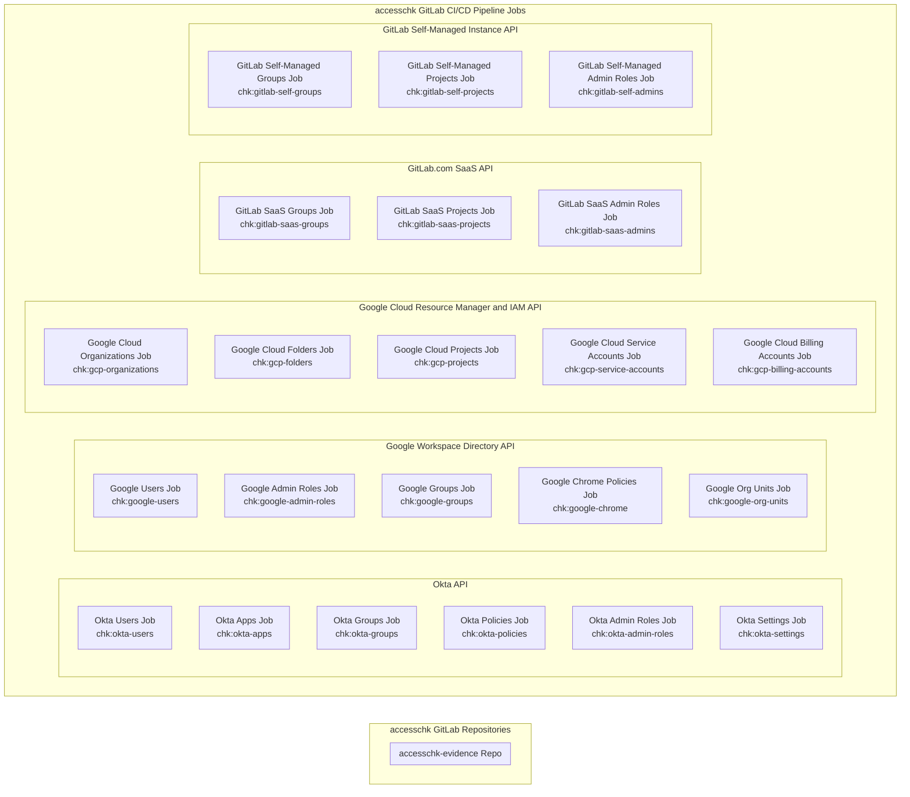

{}
You are viewing a preview of documentation for the future state of GitLab Identity v3 (mid 2024). See the <a href="https://handbook.gitlab.com/handbook/security/access-management-policy">Access Management Policy</a> for the GitLab Identity v2 current state with baseline entitlements and access requests. See the roadmap in the <a href="https://gitlab.com/groups/gitlab-com/gl-security/identity/eng/-/roadmap?state=all&sort=start_date_asc&layout=QUARTERS&timeframe_range_type=THREE_YEARS&group_path=gitlab-com/gl-security/identity/eng&progress=WEIGHT&show_progress=true&show_milestones=false&milestones_type=ALL&show_labels=true">epics gantt chart</a>.
{}

{}
You are viewing the `accesschk` engineering deep-dive architecture for audit and compliance evidence collection. We have `accessctl` engineering architecture documentation for <a href="/handbook/security/identity/platform">policy management and automated provisioning</a>. We also have a getting started guide for <a href="/handbook/security/identity/guide/audit">auditors</a>, <a href="/handbook/security/identity/guide/change-mgmt">change management</a>, and <a href="/handbook/security/identity/guide/app">tech stack application system owners</a>.
{}

{}
This page is a work-in-progress. Please check back later for up-to-date details.
{}

## CI/CD Pipeline Overview

