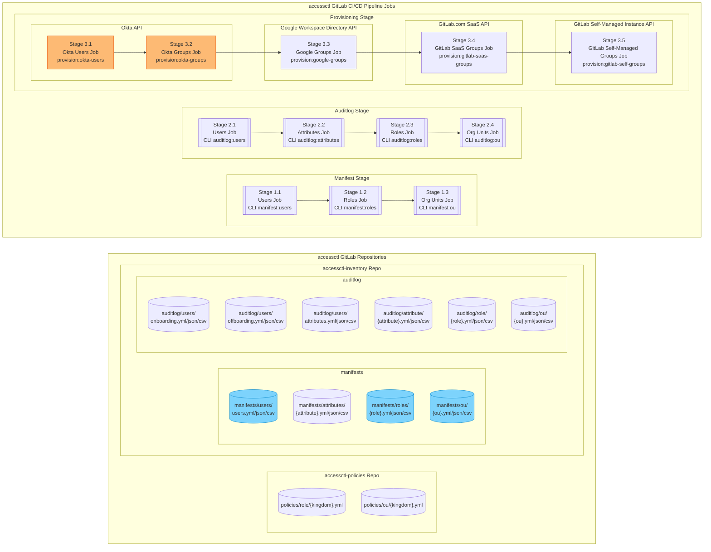
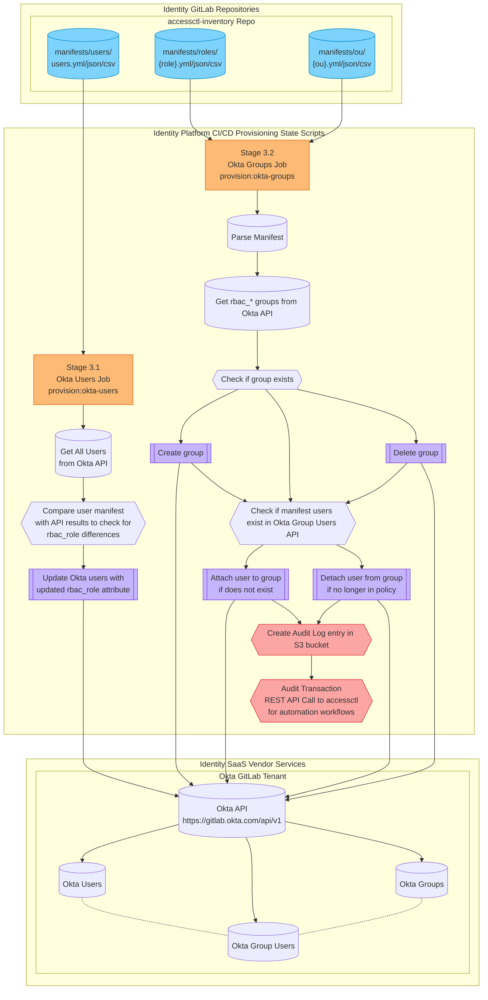

{}
You are viewing a preview of documentation for the future state of GitLab Identity v3 (mid 2024). See the <a href="https://handbook.gitlab.com/handbook/security/access-management-policy">Access Management Policy</a> for the GitLab Identity v2 current state with baseline entitlements and access requests. See the roadmap in the <a href="https://gitlab.com/groups/gitlab-com/gl-security/identity/eng/-/roadmap?state=all&sort=start_date_asc&layout=QUARTERS&timeframe_range_type=THREE_YEARS&group_path=gitlab-com/gl-security/identity/eng&progress=WEIGHT&show_progress=true&show_milestones=false&milestones_type=ALL&show_labels=true">epics gantt chart</a>.
{}

{}
This page is specific to the Okta groups and users configuration. You may also be interested in the <a href="/handbook/security/identity/gitops/okta">Okta GitOps Terraform architecture</a> for applications and settings configuration and <a href="/handbook/security/identity/approvals">merge request approvals</a> documentation.
{}

## Pipeline Overview

## CI/CD Job Workflows for Okta

