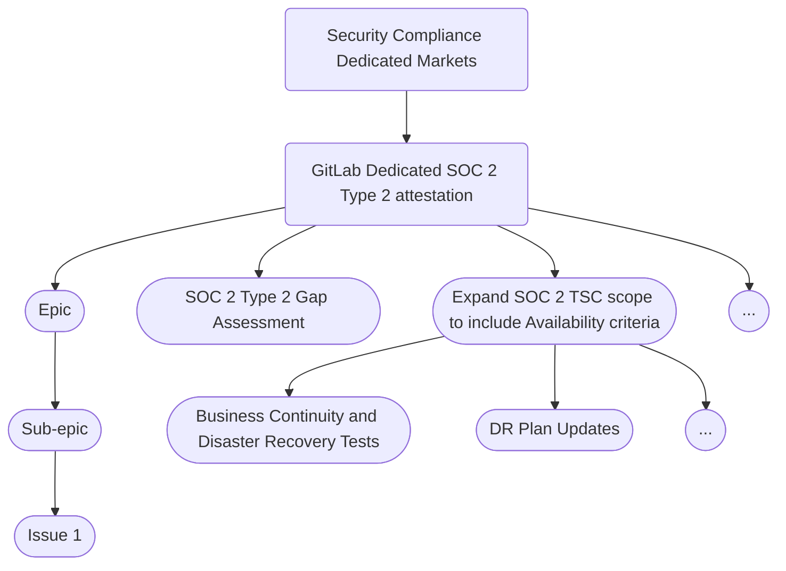

## <i class="fas fa-bullseye" style="color:rgb(110,73,203)" aria-hidden="true"></i> Security Compliance (Dedicated Markets) Mission

Our Mission is to advance customer trust with a focus on customers operating in highly regulated industries or who otherwise have unique security and compliance requirements. We will accomplish this mission by:

1. Enabling [GitLab Dedicated](https://docs.gitlab.com/ee/subscriptions/gitlab_dedicated/#gitlab-dedicated) to be the most trusted DevSecOps offering in the market, demonstrated by security certifications and attestations.
1. Achieving and maintaining industry-specific security certifications such as [FedRAMP]() and [FIPS 140-2 compliance](https://docs.gitlab.com/ee/development/fips_compliance.html#fips-compliance) for the U.S. Public Sector.
1. Applying compliance automation and compliance-as-code guardrails to minimize [toil](https://sre.google/sre-book/eliminating-toil/) and enable product, development, and infrastructure teams.
1. Use our own product ([dogfooding]()) to meet key security controls, improve our offering, and demonstrate to customers how they can do the same.

For more information on the direction of the GitLab Dedicated category, please see [this page](https://about.gitlab.com/direction/saas-platforms/dedicated/).

## <i class="far fa-lightbulb" style="color:rgb(110,73,203)" aria-hidden="true"></i> Core Competencies

As a member of the [Security Assurance]() sub-department, and extension of the commercial [Security Compliance team](), we share many of the same core competencies. The difference between our teams is in the product/system scope (GitLab Dedicated and any future offerings for highly regulated markets) and the security certifications we are pursuing.

1. [Security Certifications, Attestations, and Initiatives]()
   - External Audit Coordination
   - [Gap Assessments/Readiness Assessments]()
1. [Observation and Remediation Management]()
   - Identifying control weaknesses and gaps (observations)
   - Remediation recommendations
   - Tracking remediation plans to completion
1. [Continuous Monitoring of GitLab's Security Controls]() which are mapped to applicable regulatory requirements and security certifications/frameworks we have committed to.
   - [Policy-as-code]() for automated control testing
   - Automated evidence collection
   - [User Access Reviews]()
   - [Business Continuity Plan (BCP)](/handbook/business-technology/gitlab-business-continuity-plan/) and [Information System Continuity (ISCP)]() testing
1. Industry and Regulatory Monitoring and Insights
   - Monitoring drafts and changes to relevant laws, executive orders, directives, regulations, policies, standards, and guidelines.
   - Collaborating on responses to relevant RFIs, RFQs, RFPs, and requests for public comment.
   - Monitoring changes government contractual language that could impact public sector security and compliance posture.

Some of our work is [not public]() for now. Please see the [internal handbook](https://internal.gitlab.com/handbook/engineering/fedramp-compliance/) to find out more about what our team is working on, or reach out to us.

## <i class="fa-solid fa-magnifying-glass"></i> Vision and Focus Areas

Security Compliance is part of the [2nd line of defense](https://www.isaca.org/resources/isaca-journal/issues/2018/volume-4/roles-of-three-lines-of-defense-for-information-security-and-governance#:~:text=While%20the%20three%20lines%20of,explore%20ways%20to%20optimize%20outputs) and our goal is identify and treat risks early before they have more severe impacts later on (i.e. regulatory or reputational). We strive to partner with the 1st line of defense (Engineering, Product, and other parts of the organization) to shift compliance left where it is both more effective and less burdensome. To achieve that vision, we need to focus on the following areas and solicit feedback from other parts of the organization:

- Meet our stakeholders where they are
   - Learn the key projects, architectures, and technologies of the products we support
- Reduce [toil](https://sre.google/sre-book/eliminating-toil/) for control owners and ourselves
   - Automate controls as part of the 1st line of defense and look for efficiencies
- Modernize and scale
   - Identify and implement Governance, Risk, and Compliance (GRC) best practices and "cloud native compliance" solutions
- Measure success and impact on customer trust
   - Identify actionable key performance indicators (KPIs) and key risk indicators (KRIs) for leadership

## Where we work

The single source of truth for all of our work will soon be the [SecComp Dedicated Markets epic board](https://gitlab.com/groups/gitlab-com/-/epic_boards/1054594?label_name[]=Sub-Department%3A%3ASecComp%20Dedicated%20Markets) along with our [top-level epic](https://gitlab.com/groups/gitlab-com/gl-security/-/epics/248). While we work across GitLab.com and GitLab.org groups, we try to centralize the core work we commit to on our [roadmap](https://docs.google.com/presentation/d/1ufKzVomUmD2dw9J6upTG5bZ_r184HmtBccOt8NFlg7w/edit?usp=sharing). We also use an [issue board](https://gitlab.com/groups/gitlab-com/-/boards/5913253?label_name[]=Sub-Department%3A%3ASecComp%20Dedicated%20Markets) to track tasks at a more granular level when needed.

We primarily work out of projects in the [Security Assurance sub-group](https://gitlab.com/gitlab-com/gl-security/security-assurance) including our [team issue tracker](https://gitlab.com/gitlab-com/gl-security/security-assurance/team-security-dedicated-compliance/team-files), the [FedRAMP Certification project](https://gitlab.com/gitlab-com/gl-security/security-assurance/fedramp/fedramp-certification), the GitLab instance inside the FedRAMP Authorization Boundary (limited access, AWS GovCloud), and the [GitLab Dedicated issue tracker](https://gitlab.com/gitlab-com/gl-infra/gitlab-dedicated/team).

## How we work

Much of our work is not visible to the rest of GitLab due to regulatory mandates outside of our control. In order to bring as much transparency ans visibility into our work, it is critical that we continue to use the gitlab.com/gitlab-com/ group as much as possible, even if used to track tasks that are completed elsewhere. This is important to take extra steps to increase visibility into our work because it directly enables sales for new SaaS offerings, contributes to the security of self-managed GitLab, and makes it possible to enter new markets that were not previously possible.

### Scheduled meetings

We try to avoid meetings at all costs and prefer to work async. We have a weekly call with all of Security Compliance, which includes time for a breakout discussion specific for Dedicated Markets. In addition to that, we also have recurring calls necessary for our FedRAMP program which are necessary for contributing the working group, and logging meeting minutes (external audit artifacts) associated with the configuration control board and compliance sync.

We also have weekly 1:1s and skip levels in line with the GitLab philosophy.

### Agile Project Management

We use an [agile project management](https://about.gitlab.com/solutions/agile-delivery/) approach for our work, leveraging as many GitLab platform features as we can. We use epics, issues, and issue/epic boards to organize our work, as they complement each other. For some of the work, we also use roadmaps, milestones, burndown charts.

The single source of truth for *all* of our team's work across different functions is the top-level [Security Compliance (Dedicated Markets) team epic](https://gitlab.com/groups/gitlab-com/gl-security/-/epics/248). In the future, the epic will contain a section that tracks the status all ongoing work. The following subsections are borrowed from the [GitLab Dedicated Group](https://handbook.gitlab.com/handbook/engineering/infrastructure/team/gitlab-dedicated/#project-management).

#### Epic Hierarchy

We use sub-epics to break larger epics into smaller portions. The larger epics are based on our team's roadmap and key milestones.

1. Sub-epics group tasks required to deliver an item mentioned
1. Sub-epics represent an item from the roadmap and are delivered in a specific phase
1. Sub-epics can span multiple months, but their end date should match the 'anticipated completion date' of the roadmap phase they are added to.

The diagram below shows an example of traversing the complete hierachy:

#### Epic Owners

Each epic has a single DRI who is responsible for delivering the project. DRIs for each epic are listed at the top of the description of each epic per Epic Structure.

#### Epic Owner Responsibilities

The DRI needs to:

1. Work with others to move issues through the boards
1. Ensure epic meets criteria outlined in Epic Structure(next section)
1. Provide updates on DRI's epic in epic description according to process outlined in Status Update Process below.

#### Epic Structure

Each epic and child sub-epics must include the following:

**Description** (TBD make epic template)

1. **DRI** who is responsible for this epic.
1. **Background**, including a problem statement, to provide context for people looking to understand the epic.
1. **Exit criteria** for the specific goals of the epic.
1. **Status yyyy-mm-dd** should be the final heading in the description.
    1. This enables others who are interested in the epic to see the latest status without having to read through all comments or issues attached to the epic.
    1. This heading is used to auto-generate the status information on the top-level epic.

**Epic meta data**

1. **Start date** is set to the expected start date, and updated to be the actual start date when the project begins.
1. **Due date** is set to be the expected end date.
    1. The due date is set based on the Roadmap
    1. The date that a project actually ended is taken from the date that the epic was closed.

Labels are described in the [Labels section](#labels).

#### Epic Boards

Epic boards are used to track the overall status of epics tied to our [roadmap](https://docs.google.com/presentation/d/1ufKzVomUmD2dw9J6upTG5bZ_r184HmtBccOt8NFlg7w/edit?usp=sharing). We use the following epic board:

[SecComp Dedicated Markets epic board](https://gitlab.com/groups/gitlab-com/-/epic_boards/1054594?label_name[]=Sub-Department%3A%3ASecComp%20Dedicated%20Markets)

#### Roadmap

All epics and sub-epics are set with due dates according to the Roadmap (link).

Process to close phases:

1. After the end of each month Security Compliance management reviews the epic (expeted) due dates and works with [Epic DRIs](#epic-owners) to determine any roadmap changes if an epic extends beyond the epic's planned phase.
1. Management then determines roadmap adjustments so that planned work in future phases remains realistic after shifting open work.
1. Roadmap changes are shared in the next weekly sync.

#### Issue Board

Similar to the epic board, all issues tied to work on our roadmap should use the appropriate labels and be tracked on the [SecComp Dedicated Markets issue board](https://gitlab.com/groups/gitlab-com/-/boards/5913253?label_name[]=Sub-Department%3A%3ASecComp%20Dedicated%20Markets).

We encourage, but currently do not require, the use of issue weights, to log estimated hours, and health status. The exception is for recurring continuous monitoring tasks which do require both of these.

### Status Updates

The status for all work relating to GitLab Dedicated is maintained in the description of the top-level [Security Compliance (Dedicated Markets) team epic](https://gitlab.com/groups/gitlab-com/gl-security/-/epics/248) so that it is visible at a glance.

#### Status Update Process

DRIs should provide weekly updates for the DRI's epics according to following process:

1. **By 17:00 UTC / 12:00 PM ET on Fridays** DRIs of *active* epics (or the person covering if DRI OOO) provide an update in the [status section of the description](#epic-structure) of the epic regarding status of the epic including any relevant details of active sub-epics.
    - If the DRI for a sub-epic is different than the epic DRI, the epic DRI is responsible for getting updates from the sub-epic DRI.
    - Format for weekly update:
      - **Date of Update** (YYYY-MM-DD)
      - Brief update (~sentence or couple bullets) for each of these three bullets:
         - **Progress since last update** - Changes deployed to production, unblocked blockers, any other progress achieved.
         - **Risk and Confidence** - Any new blockers identified or existing blockers that persist? Any other challenges now or in the near future? How do these blockers and/or challenges affect our confidence of completing by scheduled due date per the roadmap?
         - **Mitigations** -  What is required to overcome challenges or blockers identified?  Should this be escalated to other team members, teams, executives, or domain experts?
      - **Update Workflow and Health label** - After each status update, the Workflow label and Health label should be updated. See [Epic labels criteria](/handbook/engineering/infrastructure/team/gitlab-dedicated/#workflow-labels)

1. **Top-Level Epic Status Update** [automation synthesizes updates from status section](#status-update-automation-coming-soon) from description of active epics to provide a status in the status section in the description of the top-level initiative Epic.

1. Status updates will be incorporated into other updates as needed for the Division, Department, Cross-Functional Initiatives and Working Groups, and OKRs.

#### Status Update Automation (coming soon)

Status updates are auto-generated and added to description ofthe [top-level Security Compliance (Dedicated Markets) team epic](https://gitlab.com/groups/gitlab-com/gl-security/-/epics/248) using a bot running in (project coming soon).

If no update has been provided in an epic or issue for over a week, the issue will automatically receive `seccomp workflow::stalled` label. MAnagement is responsible for reviewing the status of the issue and helping it move along.

#### Reporting

We provide reports on status of GitLab Dedicated to meet [Top Cross-Functional Initiative requirements](/handbook/company/top-cross-functional-initiatives/#cross-functional-initiative-dris).

### Backlog Refinement

Prior to the start of a new quarter, the team will spend time refining the Epic backlog. This process will be led by the EM + PM, who will go through the Epics targeted for the upcoming quarter (according to the roadmap and ensure each Epic contains the following information (pulling in different stakeholders to help fill in the details as necessary):

- MVC Scope
- Business Case / Rationale
- Link to high-level design
- Estimated level of complexity

While the above information is being added, the Epic will move from Triage to Ready status.

Having this set of refined epics will help us plan for the upcoming quarter and allow engineers to quickly get started on an Epic once it's ready to be picked up during the quarter.

### Labels

At GitLab, we like to label everything. It provides critical metadata on epics and issues because GitLab issues do not [support custom fields](https://gitlab.com/groups/gitlab-org/-/epics/235).

1. **All issues should have our sub-department label: `Sub-DepartmentSecComp Dedicated Markets`.**
1. Team labels: `team::fedramp compliance` or `team::dedicated compliance`.
1. Scoped `seccomp workflow::` labels.

Any new labels should be created at the gitlab-com group level so to that it can be used across sub-groups and projects.

#### Workflow labels

We leverage scoped workflow labels to track different stages of work. These are important because we rely on our issue board for team meetings, reporting up to leadership, metrics, and spreading visibility into our work. All epics and issues owned by our team, related to work on our roadmap, must have these labels.

| Open (no workflow label) | `seccomp workflow::triage` | `seccomp workflow::ready` | ~`seccomp workflow::in progress` | `seccomp workflow::blocked` | `seccomp workflow::complete` | `seccomp workflow::cancelled` |
|---------------------------|--------------------------|-------------------------|-------------------------------|---------------------------|----------------------------|-----------------------------|
| Backlog. Issues that are drafts, not ready for triage, or otherwise not necessary to report on the team's Issue Board. (Might Do) | Skip to `seccomp workflow::ready` if work is well defined. These issues need peer review or further refinement and prioritization so they can be included in the Ready bucket. (Should Do) | Prioritized backlog - these issues will be picked up as other issues are closed. (To Do) | Issues that are being actively worked by the team and should have a health status and an assignee. Stale issues with this label should be moved to blocked or cancelled. | Issues that are blocked and need a resolution plan or escalation. Move to `seccomp workflow::in progress` once unblocked. | Issue closed because work is completed as described. | Issue closed because the work was cancelled because it was no longer needed or relevant. |

### Milestones and burndown charts

Currently, we use monthly milestones and a burnup/burndown chart to track recurring FedRAMP continuous monitoring tasks. [Here is an example](https://gitlab.com/groups/gitlab-com/gl-security/security-assurance/-/milestones/4#tab-issues). The work itself is taking place within the FedRAMP Authorization Boundary, however this allows us to increas visibility into that work and include it in metrics. For more informatioin on these tasks, including how the issues are imported at the beginning of every month, please refer to [this document](https://gitlab.com/gitlab-com/gl-security/security-assurance/fedramp/fedramp-certification/-/blob/main/conmon_templates/Importing%20ConMon%20Issues.md?ref_type=heads).

## <i class="fa-solid fa-chart-mixed" style="color:rgb(110,73,203)" aria-hidden="true"></i> Metrics and Measures of Success

1. [Security Control Health](/handbook/security/performance-indicators/#security-control-health)
1. [Security Observations](/handbook/security/performance-indicators/#security-observations-tier-3-risks)
1. [FedRAMP Vulnerability Posture (limited access)](https://10az.online.tableau.com/#/site/gitlab/views/Draft-FedRAMPVulnerabilityPosture/FedRAMPVulnerabilityPostureDashboard?:iid=1)
1. [Vulnerability Deviation (Exception) Requests](https://gitlab.com/gitlab-com/gl-security/security-assurance/team-security-dedicated-compliance/poam-deviation-requests/insights/#/issues)

## <i class="fas fa-id-card" style="color:rgb(110,73,203)" aria-hidden="true"></i> Contact the Team

- Slack
   - Feel free to tag us with `@dedicated_compliance` or `@sec-compliance-team` to reach the entire Security Compliance team
   - The `#sec-assurance` slack channel is the best place for questions relating to our team (please add the above tag)
   - FedRAMP questions should be directed to the `# wg_fedramp` channel
- Tag us in GitLab
   - `@gitlab-com/gl-security/security-assurance/team-security-dedicated-compliance`
- Email
   - `security-compliance@gitlab.com`
- Here are our team's GitLab.com [subgroups and projects](https://gitlab.com/gitlab-com/gl-security/security-assurance/security-compliance-commercial-and-dedicated/team-security-dedicated-compliance)
- Interested in joining our team? Check out more [here](/job-families/security/security-assurance-job-family)!
