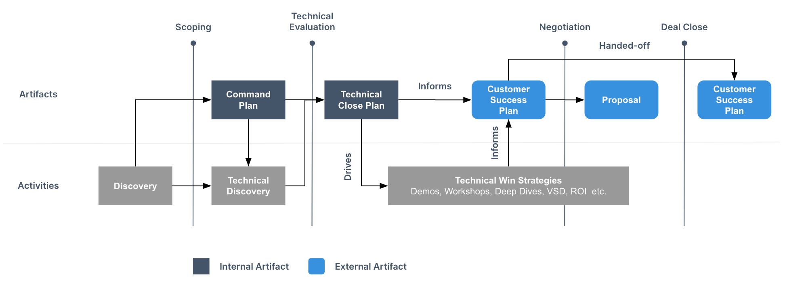
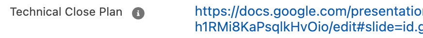

## Why Use a Technical Close Plan

### Primary Objectives

1. Elevate technical evaluation conversations to align to critical business outcomes
1. Accelerate technical win through clarity and alignment
1. Build habits of proactively prescribing how GitLab uniquely partners with customers

We can leverage a Technical Close Plan early in the sales process to help Solutions Architects and the sales team evaluate requirements for a technical win. After the command plan and technical discovery, we can build out the Technical Close Plan. This plan will drive our technical win strategies. It also can accelerate getting to a technical win because we align critical business outcomes to technical win conversations. This process can also aid in building habits of proactively prescribing how GitLab uniquely partners with customers.

### When to Create a Technical Close Plan

A Technical Close Plan is most useful as an opportunity is approaching a technical evaluation. The plan adds clarity to how to successfully complete the evaluation in a shorter period of time. Within the sales stages, that typically aligns to Stage-3 Technical Evaluation, but might also make sense in Stage-2 Scoping.

### Which Opportunities Should Have a Technical Close Plan?

1. All opportunities with an [SA Validated Tech Evaluation](/handbook/solutions-architects/processes/activity-capture/#sa-specific-opportunity-fields)
1. Opportunities over $300k net ARR
1. First Order opportunities for accounts with [LAM](/handbook/sales/field-operations/sales-systems/gtm-technical-documentation/#landed-addressable-market-lam) over $2M

SA Managers have discretion for additional opportunities to be included or excluded

### How Does This Differ From a Customer Success Plan?

A Technical Close Plan is primarily focused on opportunity rigor by capturing customer business outcomes and a plan to meet their needs, whereas a Customer Success Plan is primarily focused on successful customer adoption of GitLab after successfully evaluating GitLab against their needs.

As both are customer-centric, the Technical Close Plan can and should feed into a Customer Success Plan. See [Converting to a Customer Success Plan](#converting-to-a-customer-success-plan) for more information.

## How to Build a Technical Close Plan

### Resources

This [Google Drive Folder](https://drive.google.com/drive/folders/1nQaUD5l05eTN5Dttxuk5Lvr88oyyVDbT) contains the [Technical Close Plan](https://docs.google.com/presentation/d/1RFvOrf-aKXOzPBxLdlF5lkAnBLUTQlUNSFbWlVArA9o/edit?usp=sharing) starting template, an [instructional walkthrough](https://docs.google.com/presentation/d/1Kh48akXwaEJh2HO2TCZqQhfULs_UCx7E9DFsUbLOnzI/edit#slide=id.g253f367cf99_2_447), and [example Technical Close Plans](https://drive.google.com/drive/folders/1X5x7EbRB1v_crFG6RI-ie1D-B8pEgY36) as a reference.

### Technical Close Plan Structure

The specific structure of a Technical Close Plan is not as relevant as the content and conversation.

The primary focus areas should include:
- [Business Outcomes](#business-outcomes) that describe what is valuable to the customer, using their terminology
- [Key Stakeholders](#key-stakeholders) and how they align to the opportunity
- [Notional Architecture](#notional-architecture) for the current and proposed state
- [Known Risks](#known-risks--mitigations) that could impede progress, including any mitigation steps
- [Activity Plan](#activity-plan) to capture the intentional steps taken to drive a technical evaluation

Most Technical Close Plans should address all of the areas listed above. If the account team is struggling to articulate those areas, it's an indicator that the opportunity is not qualified.

#### Business Outcomes

As succintly as possible, describe the customer's critical business needs and outcomes. Focus on the customer rather than what GitLab provides. How does the customer plan to drive more revenue? What are their operational efficiency goals? What risks do they need to mitigate?

When trying to connect the dots between lower-level customer goals and their broader initiatives that likely align to GitLab’s [value drivers](/handbook/sales/command-of-the-message/#customer-value-drivers), consider an Outcome Mapping exercise.

#### Key Stakeholders

Either within the Business Outcomes section or in its own section, call out the key stakeholders whom have been involved or need to be. It’s important to map existing relationships and note aspects of the relationship or about the individual. Identify gaps to call out where to branch out and meet other members or functions within the organization. Examples of responsibilities could align to their role at the company or could include GitLab's perspective of a Champion, Influencer, Buyer, and Tech Champion.

#### Notional Architecture

In order to build a plan with steps to achieve goals, starting and ending points are needed. Current and proposed state notional architectures paint a picture of what today's reality is and what tomorrow could look like.

When capture either current or proposed state notional architectures, highlight information relevant to the opportunity. Customers often have known non-negotiables or phased goals which should be taken into account.

Both notional architectures should reflect the customer's environment and how the parts and pieces interact. The notional architecture should not include a boilerplate GitLab slide / picture.

##### Current State

A critical step in showing trust and empathy is knowing the current state of a customer. Capture the relevant information for their use case and their painpoints, which may include:
- The value stream of a typical team showing issues like long vulnerability time to remediation
- The typical application pipeline steps, or path to production, which includes inefficiencies or delays in releasing software
- The different SDLC/DevOps/DevSecOps tools, how and when they're used, and how they're integrated, which show how developers need to context switch or operators manage many tools and integrations
- A multi-modal approach to managing several GitLab instances for data privacy reasons which create confusion and operational overhead

Regardless of the focus for the current state notional architecture, the struggles or pitfalls should be obvious and relate back to the business outcomes.

##### Proposed / Future State

The proposed or future state notional architecture should be a deliberate contrast to the current state, and obviously highlight the outcomes the customer would realize if they adopted the recommendation. Some examples include:
- Changing their value stream to identify a vulnerability at the point of change
- A parallelized pipeline with a fail-fast mentality
- Consolidated tooling that simplifies operations, reduces cognitive load, and enables reporting
- A migration plan from several self-managed and SaaS instances to GitLab Dedicated so the customer can focus on delivering software rather than managing GitLab

#### Known Risks / Mitigations

A well thought-out plan can still result in a failed technical evaluation. Capture possible challenges or roadblocks that could derail the conversation as well as how the team is planning to mitigate the risks.

#### Activity Plan

What are the discovery and technical evaluation activities that have already happened and are needed to prove the technical evaluation?

These could include activities like demonstrations, value stream workshops, hands-on workshops, proofs of value, etc. The specific combination will depend on the customer dynamics.

The activity plan is how a Solutions Architect is intentional about what is needed to progress the customer through a technical evaluation rather than simply taking the customer's lead and reacting. As the evaluation progresses, reassess and adjust.

## Tracking

### Salesforce Opportunity

A Technical Close Plan should be tracked on the opportunity with which it is associated via the `Technical Close Plan` field. This should always represent the current state of the Technical Close Plan for the given opportunity. The plan itself can be store in an account folder to retain the account context over time.

If there are several opportunities relevant to the plan, each can point to the single Technical Close Plan.

## Regular Review

Since the Technical Close Plan is used to progress a technical evaluation, the scope and definition could be fluid. It's important to regularly review the plan during 1:1s, account plans, and opportunity consults.

## Converting to a Customer Success Plan

In many instances, the Technical Close Plan can be used as-is for a Customer Success Plan, where the only real difference is the timing.

In other cases, there may be additional adoption information to capture, like other known tools, migration plan, adoption plan, adoption risks, etc.

There also may be parts of the original Technical Close Plan that are no longer relevant to share with the customer, like internal relationship notes, sales or GitLab terminology, or mitigated risks.
