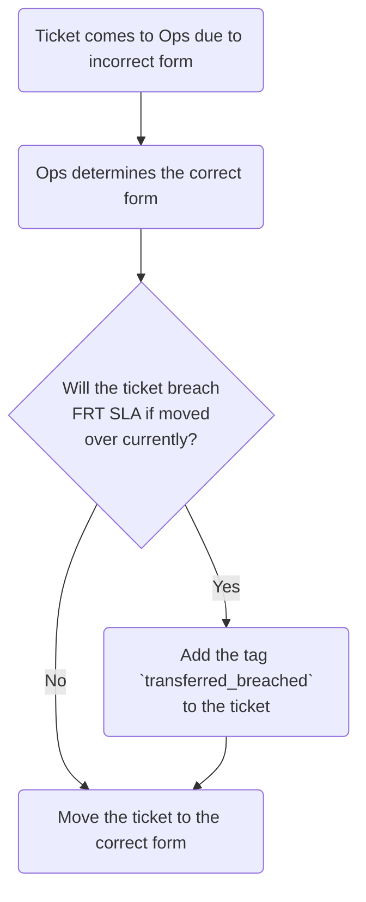

**Note** This is for Zendesk Global tickets only.

Support Operations has a public form that end-users can use to submit tickets.
These go directly to us. Currently, we have 6 problem types:

- [First time setup](#first-time-setup)
- [Manage my organization's contacts](#manage-my-organizations-contacts)
- [Shared organization requests](#shared-organization-requests)
- [Contact management project setup/questions](#setup-a-contact-management-project)
- [Support portal issues](#support-portal-issues)
- [Support portal questions](#support-portal-questions)
- [Other](#other)

## First time setup

This is for user's who have not been setup in the support portal previously.
Here they should detail what user's they'd like setup and any
important details we should note for working with their organization.

It will largely concern associating a user to an organization and setting up
their list of support contacts.

Please see
[User Association](/handbook/support/readiness/operations/docs/zendesk/user_association/)
for more details on associating users to organizations.

## Manage my organization's contacts

This is for user's wishing to setup their organization within the support portal
and are not using a contact management project.

Please see
[User Association](/handbook/support/readiness/operations/docs/zendesk/user_association/)
for more details on associating users to organizations.

For removing the association from a user:

1. Locate the user in question (either via the `Users` tab on the organization
   page or via search). From there:
   - If the user in question has a non-closed ticket, make a mental note of
     this. As there is a non-closed ticket, we should not remove them at this
     time. The requester will need to specify what they want done about this
     (close out the ticket, keep the user, etc.)
   - If the user in question was one mentioned in an organization note
     specifying users approved to request changes, make a mental note to
     adjust the organization note via the
     [organizations project](https://gitlab.com/gitlab-com/support/zendesk-global/organizations).
1. Remove the association to the organization on the user (done by setting the
   organization to `-`).
1. Add a note on the user with the following:
   > User was de-associated from the organization as per TICKET_LINK

   - Replace `TICKET_LINK` with the link to the request.

After handling the associations and de-associations, you need to reply to the
requester confirming the state of their request. To assist in this process, we
have some macros you can use:

- `Support::Support Ops::Users added to organization`
- `Support::Support Ops::Users removed from organization`
- `Support::Support Ops::User has non-closed tickets`
- `Support::Support Ops::Users need to perform password reset`

These can be used in combination of one another, as they are not full response
macros (but instead pieces of a full response).

## Maximum contacts limit issues

When a organization not using a contact management project exceeds 30 support
contacts (or a request to add more contacts would do so), we need to intervene
to address that issue. For these types of issues:

1. You should first use the macro
   `Support::Support Ops::Maximum contacts reached`. This will require you to
   attach a CSV of the current contact list for the organization. To get a CSV:
   1. Go to the
      [Advanced Search app](https://gitlab.zendesk.com/agent/apps/advanced-search),
      click the `Users` tab, enter the organization's ID in the `Organization`
      field, then click the blue `Search` button
   1. Click `Columns` and deselect all checkboxes except for `Name` and `Email`
   1. Click the blue `Download CSV` button and wait for the download to complete
      - We suggest renaming the file to something less vague for the customer,
        such as their organizations name or something involving the ticket ID.
1. You will then work with the user to help determine what users to remove (see
   [Manage my organization's contacts](#manage-my-organizations-contacts) for
   more info). This can vary in what exactly will be done, so use your best
   judgment or ask for assistance in the support operations slack channel.

Remember, once the maximum contacts limit issue is fixed, you might need to
review the ticket and go back to a previous issue that the ticket was raised
about.

## Shared organization requests

These are requests for shared organization setup/management. See the
[Shared Organization management](/handbook/support/readiness/operations/docs/zendesk/organizations/#shared-organization-management)
for more details.

## Setup a contact management project

These requests are a bit more complicated to do. Please see
[Contact Management Projects](/handbook/support/readiness/operations/docs/gitlab/contact_management_projects/)
for more information on doing these.

## Support portal issues

These are reports of issues within the support portal. While each issue can
present unique challenges, the common troubleshooting guide for the users would
be:

1. Ensure your browser is allowing third party cookies. These are often vital
   for the system to work. A general list to allow would be:
   - `[*.]zendesk.com`
   - `[*.]zdassets.com`
   - `[*.]gitlab.com`
1. Disable all plugins/extensions/addons on the browser.
1. Disable any themes on the browser.
1. Clear all cookies and cache on the browser.
1. Try logging in again to the Support Portal.
1. If you are still having issues, obtain the following:
   - the browser's version
   - the browser's type
   - your operating system (and distro)
   - any other identifying information
   - the complete contents of your Javascript console for your browser
1. Send all of that to support

At the point you get the ticket, the user may or may not have done all of that.
If they have not, point them to trying all that out first.

If they have, you will need to analyze the details of what is sent to determine
next steps.

## Support Portal Questions

This is specifically related to questions related with information related to
Support Portal related inquiries like how to change Name or Profile Picture etc.
This information is publicly available on https://about.gitlab.com/support/portal/

### Adding Secondary Email

Sometimes a customer will raise issue stating they want to add a secondary
email to their support portal account. Secondary emails are used to tie
submitted tickets to a specific account, although only the primary email address
will be used as the submitter (and thus receive notifications).

To add a secondary email to a support portal account, we need following
information:

- For GitLab.com Users:
  - The GitLab.com account associated to the requester's email address should
    have listed the secondary email as verified. You can check this via the User
    Lookup app. To add secondary email to GitLab.com account, they can follow this
    [documentation](https://docs.gitlab.com/ee/user/profile/#add-emails-to-your-user-profile)
- For Self Managed and GitLab Dedicated Users:
  - The ticket needs to be submitted from the email address they wish to have
    added to their existing profile
  - The customer will need to provide proof of support entitlement again via
    this secondary email address
  - The customer will need to CC the primary email address of the support portal
    account and have that email reply on the ticket confirming the request to
    add the secondary email address to their support portal account.
- For Partners:
  - Most Partners do not have paid subscription. If they have a paid
    subscription, follow the above as per their subscription selection i.e.
    GitLab.com or Self Managed.

## Other

This is a catchall field, meaning there is no specific workflow for requests
using this problem type.

## Incorrect initial form tickets

When a ticket is filed using the incorrect form, agents will use the
`General::Forms::Incorrect form used` macro. This will change the form to `Support Ops`,
tag the ticket, and leave an internal note. From there, we are expected
to review the ticket and determine the next steps.

As the ticket was initially created using an incorrect form, it is likely that it will not have a first response yet from the correct team. In such cases, we should set the `Ticket Stage` to `FRT` before correcting the form. 

**Notes**:

1. If you determine the ticket is from a free or community user, make sure to set the `GitLab Plan` to `Free`
before moving the ticket to another form.
1. When moving tickets to a new form, do your best to fill out the ticket
   metadata as much as possible for the team that will work the ticket.
