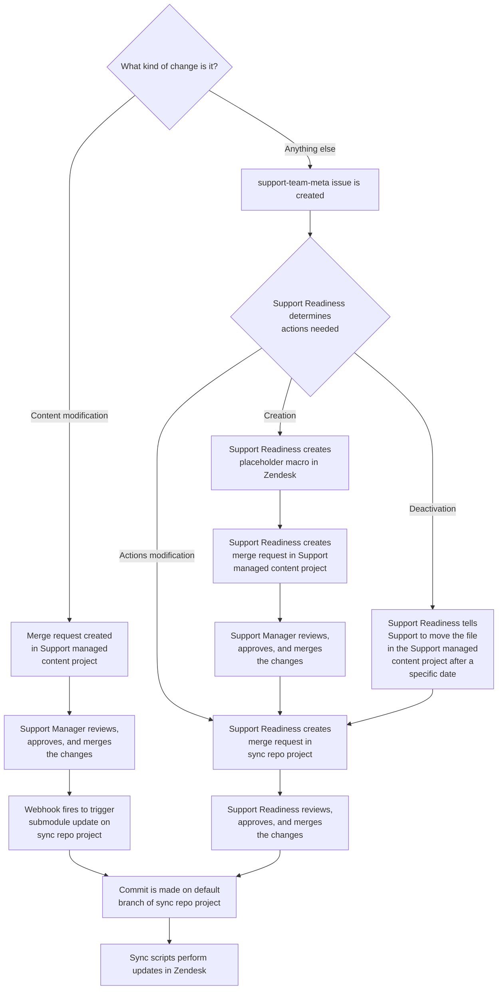

## What are macros

As per
[Zendesk](https://support.zendesk.com/hc/en-us/articles/115001236988-Creating-macros-for-tickets):

> A macro is a prepared response or action that an agent can manually apply
> when they are creating or updating tickets. Macros contain actions that can
> update ticket properties.
>
> Unlike triggers and automations, macros only contain actions, not conditions.
> Conditions aren't used because nothing is automatically evaluating tickets to
> determine if a macro should be applied. Agents evaluate tickets and apply
> macros manually as needed.

## How GitLab manages Zendesk macros

#### Zendesk Global

We currently utilize a [v2 sync repo](../../change_management/sync_repos#v2) for
managing macros in Zendesk Global.

The two projects that make this work are:

- [Support managed content project](https://gitlab.com/gitlab-com/support/zendesk-global/macros)
- [Sync repo project](https://gitlab.com/gitlab-support-readiness/zendesk-global/macros)

Deployments are done immediately when commits are made to the default branch.

The basic process for management of macros would be:

#### Zendesk US Government

We currently utilize a [v2 sync repo](../../change_management/sync_repos#v2) for
managing macros in Zendesk Global.

The two projects that make this work are:

- [Support managed content project](https://gitlab.com/gitlab-com/support/zendesk-us-government/macros)
- [Sync repo project](https://gitlab.com/gitlab-support-readiness/zendesk-us-government/macros)

Deployments are done immediately when commits are made to the default branch.

The basic process for management of macros would be:

## Performing actions in Zendesk

**NOTE**: This is for documentation and instruction purpose. An admin level
account is required and these should only be performed when actually warranted,
such as when creating a placeholder macro.

#### Creating a macro via Zendesk

To create a macro in Zendesk, you first need to go to the Admin Center
([Zendesk Global](https://gitlab.zendesk.com/admin/) /
[Zendesk US Federal](https://gitlab-federal-support.zendesk.com/admin/)). From
there, you need to go to the Macros page (Workspaces > Agent tools > Macros).

After doing so, you will then click the `Add macro` button on the top-right
side of the page. This will then load up the new macro page.

From here, you will:

1. enter a name for the macro.
1. select a description for the macro.
1. enter the actions for the macro to perform

After doing this, you will then click the blue `Create` button.

#### Editing a macro via Zendesk

To edit a macro in Zendesk, you first need to go to the Admin Center
([Zendesk Global](https://gitlab.zendesk.com/admin/) /
[Zendesk US Federal](https://gitlab-federal-support.zendesk.com/admin/)). From
there, you need to go to the Macros page (Workspaces > Agent tools > Macros).

You will then locate the macro to edit in the list and click on the name (if
your macro is currently inactive, you will need to click the `Inactive` tab,
located above the list of macro).

Doing so will bring up the macros editor page. From here, you can tweak the
various aspects of the macro. Once you have the edits in place, click the blue
`Save` button.

#### Deactivating a macro via Zendesk

To deactivate a macro in Zendesk, you first need to go to the Admin Center
([Zendesk Global](https://gitlab.zendesk.com/admin/) /
[Zendesk US Federal](https://gitlab-federal-support.zendesk.com/admin/)). From
there, you need to go to the Macros page (Workspaces > Agent tools > Macros).

There are actually two ways to deactivate a macro in the Zendesk UI. The
quicker way is to go to the macros page, locate the macro in question, hover
over it, and click the three vertical dots on the right-hand side. This will
bring up a sub-menu, which contains the option to `Deactivate`. Click that
option and the macro will be deactivated.

The alternative way to deactivate a macro in the Zendesk UI is from within the
macro editor page. On that page, click the three horizontal dots in the
top-right of the page and select `Deactivate` from the menu.

#### Positioning

While macros do have positions, we often do not worry about this. This is
because the menu used by agents is searchable and readily findable. We also have
a lot of macros, so trying to micro-manage the positions would not be efficient.

#### Macro standards

To ensure all macros we utilize are both consistent in nature and transparent
in their actions, we strive to meet some standards on all macros we work with.

#### Naming standards

Macros are a bit unique in Zendesk. They have categorization, but it is not
obvious in the UI. Instead, the categorization is determined based on the name
of the macro itself. Essentially, every group of words becomes a "folder" of
sorts in the macros dropdown selector. The separator currently used by Zendesk
is two colons (`::`).

This can get a bit confusing and hard to learn the ins and outs of, so when in
doubt, reach out to your fellow Support Ops team members.
