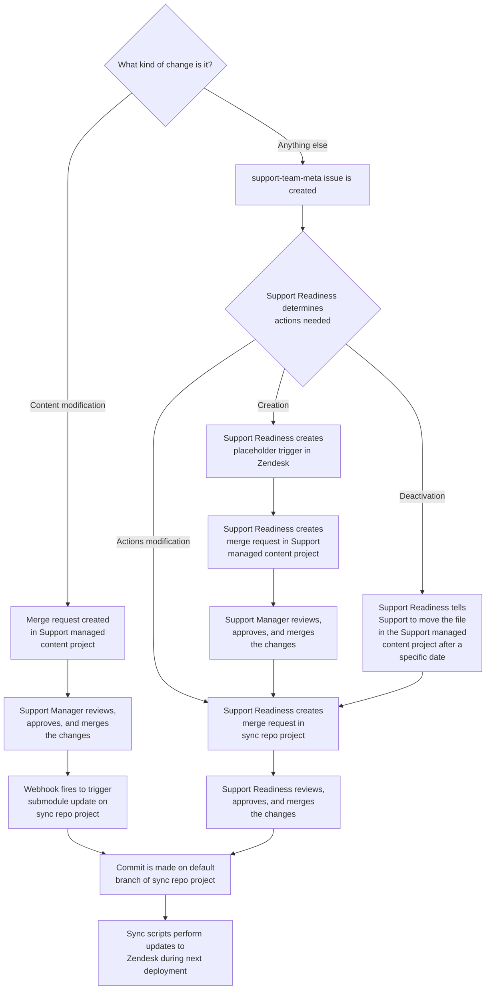

## What are Zendesk triggers?

As per
[Zendesk](https://support.zendesk.com/hc/en-us/articles/203662246-About-triggers-and-how-they-work):

> Triggers are business rules you define that run immediately after tickets are
> created or updated. For example, a trigger can be used to notify the customer
> when a ticket has been opened. Another can be created to then notify the
> customer when the ticket is solved.

## How GitLab manages Zendesk triggers

#### Zendesk Global

We currently utilize a [v2 sync repo](../../change_management/sync_repos#v2) for
managing triggers in Zendesk Global.

The two projects that make this work are:

- [Support managed content project](https://gitlab.com/gitlab-com/support/zendesk-global/triggers)
- [Sync repo project](https://gitlab.com/gitlab-support-readiness/zendesk-global/triggers)

Deployments are done on the 1st of each month at 0000 UTC.

The basic process for management of triggers would be:

#### Zendesk US Government

We currently utilize a [v2 sync repo](../../change_management/sync_repos#v2) for
managing triggers in Zendesk Global.

The two projects that make this work are:

- [Support managed content project](https://gitlab.com/gitlab-com/support/zendesk-us-government/triggers)
- [Sync repo project](https://gitlab.com/gitlab-support-readiness/zendesk-us-government/triggers)

Deployments are done on the 1st of each month at 0000 UTC.

The basic process for management of triggers would be:

## Performing actions in Zendesk

**NOTE**: This is for documentation and instruction purpose. An admin level
account is required and these should only be performed when actually warranted,
such as when creating a placeholder trigger.

#### Creating a trigger via Zendesk

To create a trigger in Zendesk, you first need to go to the Admin Center
([Zendesk Global](https://gitlab.zendesk.com/admin/) /
[Zendesk US Federal](https://gitlab-federal-support.zendesk.com/admin/)). From
there, you need to go to the Triggers page (Objects and rules > Business rules >
Triggers).

After doing so, you will then click the `Add trigger` button on the top-right
side of the page. This will then load up the new trigger page.

From here, you will:

1. enter a title for the trigger.
1. select a category for the trigger.
1. enter the conditions that **all** must be met to activate this trigger.
1. enter the conditions of which **any** of them can activate this trigger (in
   conjunction with the **all** conditions).
1. enter the actions for the trigger to perform

After doing this, you will then click the blue `Create trigger` button.

**Note**: By default, the trigger's position will be set to the bottom of the
select category. To adjust this, see [Positioning](#positioning).

#### Editing a trigger via Zendesk

Editing a Zendesk trigger is very similar to
[creating one](#creating-a-trigger-via-zendesk). You will follow the same
steps to get to the triggers page. Instead of clicking the `Add trigger`
button, you will instead locate the trigger to edit in the list and click on
the title (if your trigger is currently inactive, you will need to click the
dropdown under `Status` and select `Inactive`).

Doing so will bring up the trigger editor page. From here, you can tweak the
various aspects of the trigger. Once you have the edits in place, ensure the
dropdown at the bottom right says `Update` and click the blue `Submit` button.

#### Deactivating a trigger via Zendesk

There are actually two ways to deactivate a trigger in the Zendesk UI. The
quicker way is to go to the triggers page, locate the trigger in question, hover
over it, and click the three vertical dots on the right-hand side. This will
bring up a sub-menu, which contains the option to `Deactivate`. Click that
option and the trigger will be deactivated.

The alternative way to deactivate a trigger in the Zendesk UI is from within
the trigger editor page. At the bottom right, ensure the drop-down says
`Deactivate` and then click the blue `Submit` button.

**Note**: Deactivating a trigger does not change its position. This value is
retained in the backend. Re-enabling the trigger will have it take the same
position it was in while previously active.

#### Positioning

Many components of Zendesk using positioning to determine the overall run order.
With triggers being event-based events, it is often *very* important to consider
positioning. A good thought to have is "what order would I want these running in
if they all ran at once?"

By default, new triggers gain a position of `N+1`, where `N` is the highest
position value of all triggers in that category currently in Zendesk (both
active and inactive). This is desired and we should *rarely* need to change
this.

To edit positions in the Zendesk UI, go to the triggers page. From there,
click the three horizontal dots at the top-right of the page (on the same line
as the search bar). That will bring up a sub-menu with the option
`Edit order.` Clicking that will then allow you to drag and drop the list of
triggers into the order you desire. After making the changes, click the blue
`Save` button at the top right of the page.

**Note**: Both active and inactive triggers have an integer positional value.
While this does not matter in the UI, it will matter in the repo sync we
utilize.

#### Trigger standards

To ensure all triggers we utilize are both consistent in nature and transparent
in their actions, we strive to meet some standards on all triggers we work with.

#### Categories

As Zendesk triggers have built-in categorization, we utilize this to help
separate triggers into sensible groupings and keep positioning simpler to
determine.

If you are unsure where to place a trigger or believe a new category might be
needed, it is best to speak with the rest of the Support Ops team to discuss.

#### Naming standards

As Zendesk triggers support categorization, the naming standards for triggers
revolves around the name of the actual trigger being explicit in what it does.

#### Condition standards

Generally speaking, we aim to make trigger conditions as simple as possible.
When possible, you should use condition sets that are very specific and
succinct. As an example, if you wanted a trigger to only run when the form is
`Support Ops`, it is better to simply put a condition of "Form is Support Ops"
than adding exclusions for *every* other form. This can take time and practice
to learn, so when in doubt, pair with the rest of the Support Ops team!
