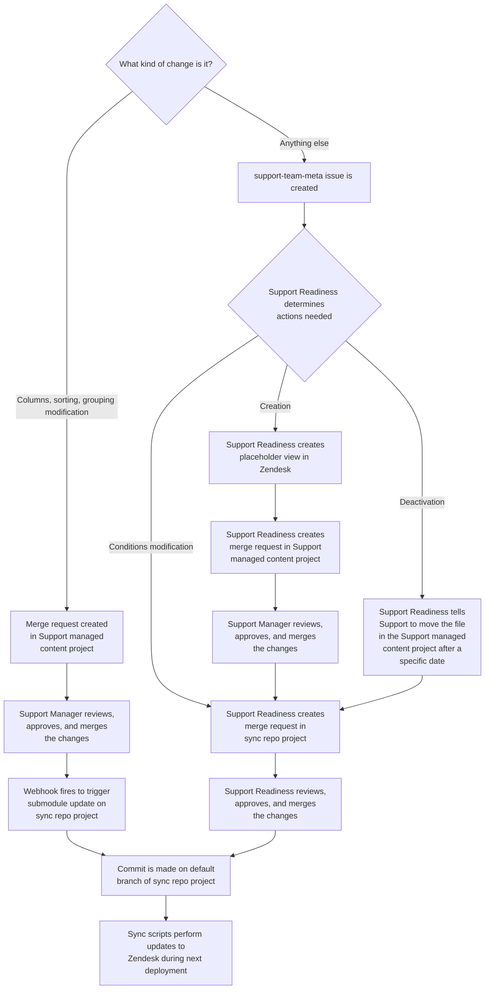

## What are Zendesk views?

As per
[Zendesk](https://support.zendesk.com/hc/en-us/articles/203690806-Creating-views-to-manage-ticket-workflow):

> Views are a way to organize your tickets by grouping them into lists based on
> certain criteria. For example, you can create a view for unsolved tickets
> that are assigned to you, a view for new tickets that need to be triaged, or a
> view for pending tickets that are awaiting response. Using views can help you
> determine what tickets need attention from you or your team and plan
> accordingly.

Currently, Zendesk has 3 view types:

- Default: Pre-defined views created by Zendesk
- Shared: Views created by the Zendesk Administrator(s) (ie. Support Ops)
- Personal: Views created by you and usable only by you

Currently, Zendesk views have some limitations:

- Only 12 visible views (Default and Shared) will be displayed.
- Views cannot use criteria that is not "defined", meaning it must be selectable
  data (text fields will not work, as an example).
- You can only display up to 8 personal views and Support Ops cannot manage/view
  them.
- Views will not include
  [archived tickets](https://support.zendesk.com/hc/en-us/articles/203657756-About-ticket-archiving)
  (i.e. Closed tickets after 120 days.)

## How GitLab manages Zendesk automations

#### Zendesk Global

We currently utilize a [v2 sync repo](../../change_management/sync_repos#v2) for
managing automations in Zendesk Global.

The two projects that make this work are:

- [Support managed content project](https://gitlab.com/gitlab-com/support/zendesk-global/views)
- [Sync repo project](https://gitlab.com/gitlab-support-readiness/zendesk-global/views)

Deployments are done on the 1st of each month at 0000 UTC.

The basic process for management of triggers would be:

#### Zendesk US Government

We currently utilize a [v1 sync repo](../../change_management/sync_repos#v1) for
manages macros in Zendesk Global.

The project that makes this work is
[here](https://gitlab.com/gitlab-com/support/support-ops/zendesk-us-federal/views)

## Performing actions in Zendesk

**NOTE**: This is for documentation and instruction purpose. An admin level
account is required and these should only be performed when actually warranted,
such as when creating a placeholder trigger.

The criteria for most views is centered around the form the ticket is using. But
there are some scenarios where the tags on a ticket can cause it to show in
multiple areas.

As such, it is best to reach out to Support Operations for guidance.

#### Creating a view via Zendesk

To create a view in Zendesk, you first need to go to the Admin Center
([Zendesk Global](https://gitlab.zendesk.com/admin/) /
[Zendesk US Federal](https://gitlab-federal-support.zendesk.com/admin/)). From
there, you need to go to the Views page (Workspaces > Agent tools > Views).

After doing so, you will then click the `Add view` button on the top-right side
of the page. This will then load up the new view page.

From here, you will:

1. the name of the view
1. a description of the view (normally a request link)
1. who has access to the view
   - `Any agent` means it is globally shared
   - `Agents in a specific group` means it is shared only to those in specific
     groups
   - `Only you` means you are making a personal view
1. the conditions of the view
   - It is recommend to use the `Preview` feature to be sure the tickets it pulls
     are the ones you intended for it to pull.
1. which columns to show in the view (and in what order from left to right)
1. what grouping to use (and which order for the grouping)
   - **Note**: grouping order is based on the group item's Zendesk ID
1. what sorting to use (and which order for the sorting)
1. **Note**: sorting order is based on the group item's Zendesk ID

With all of that entered, click the blue `Save` button at the bottom-right of
the page to create the view.

#### Editing a view via Zendesk

To edit a view, you will first go to the Admin Center
([Zendesk Global](https://gitlab.zendesk.com/admin/) /
[Zendesk US Federal](https://gitlab-federal-support.zendesk.com/admin/)). rom
there, you need to go to the Views page (Workspaces > Agent tools > Views).

Once on the view list page, locate the view in the list (if looking to edit a
personal view, you will need to change the filter on the right side below the
`Add view` button to `Personal views`) and click on the title. This will bring
up the view editor page (which is essentially the same as the view creation
page).

Once you are done making your edits, click the blue `Save` button at the
bottom-right of the page to save the changes.

#### Deactivating a view via Zendesk

There are actually two ways to deactivate a view in the Zendesk UI. The
quicker way is to go to the views page, locate the view in question, hover
over it, and click the three vertical dots on the right-hand side. This will
bring up a sub-menu, which contains the option to `Deactivate`. Click that
option and the view will be deactivated.

The alternative way to deactivate a view in the Zendesk UI is from within
the view editor page. At the bottom right, ensure the dropdown says
`Deactivate` and then click the blue `Submit` button.

**Note**: Deactivating a view does not change its position. This value is
retained in the backend. Re-enabling the view will have it take the same
position it was in while previously active.

#### Positioning

Many components of Zendesk using positioning to determine the overall run order.
With views being how agents locate tickets, it is often *very* important to
consider positioning.

By default, new views gain a position of `N+1`, where `N` is the highest
position value of all views currently in Zendesk (both active and inactive).
This is desired and we should *rarely* need to change this.

To edit positions in the Zendesk UI, go to the views page. From there,
click the three horizontal dots at the top-right of the page (on the same line
as the search bar). That will bring up a sub-menu with the option
`Reorder page`. Clicking that will then allow you to drag and drop the list of
views into the order you desire. After making the changes, click the blue `Save`
button at the top right of the page.

**Note**: Both active and inactive views have an integer positional value. While
this does not matter in the UI, it will matter in the repo sync we utilize.

Because only 12 non-personal views can be shown to any one agent, positioning is
very important for views. You can make hundreds of them, but they won't all show
(and if no one can see the view, it isn't very useful). As such, you need
consider the following when creating/editing views:

- what views are the most important for agents.
- which views absolutely need to show based on the agent workflows.
- what kind of groups can agents be in, and how that might conflict with the
  views that show

#### View standards

To ensure all views we utilize are both consistent in nature and transparent in
their actions, we strive to meet some standards on all views we work with.

#### Naming standards

The name used for the view should be simple, clear, and concise. You want the
name to convey what the view is used for.

#### Condition standards

Generally speaking, we aim to make view conditions as simple as possible. When
possible, you should use condition sets that are very specific and succinct. As
an example, if you wanted a view to only run when the form is `Support Ops`, it
is better to simply put a condition of "Form is Support Ops" than adding
exclusions for *every* other form. This can take time and practice to learn, so
when in doubt, pair with the rest of the Support Ops team!
