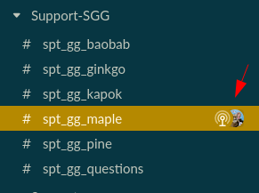

---

title: Home Page for Support's Maple Group
description: Home Page for Support's Maple Group
---

<!-- Search for all occurrences of NAME and replace them with the group's name.
     Search for all occurrences of URL HERE and replace them with the appropriate url -->

Introductory text, logos, or whatever the group wants here

## Maple resources

- Our Slack Channel: [spt_gg_maple](https://gitlab.slack.com/archives/C03C9EHQ97V)
- Our Team: [Maple Members](https://gitlab-com.gitlab.io/support/team/sgg.html?search=maple)

## Maple workflows and processes

### How to handle FRTs

- Please refer to [providing a first response to a ticket](/handbook/support/workflows/working-on-tickets/#providing-a-first-response-to-a-ticket).
- If you are sending a first response without taking assignment, [check our guidelines](/handbook/support/workflows/working-on-tickets/#helping-with-a-first-response-without-taking-assignment), and try to help find an assignee for it.
  - Consider keeping yourself CCed on ticket, at least till an assignee is found.
  - If nobody volunteered or has the knowledge to take it, extend the audience to the wider support team by cross-posting your request on either #support_self-managed, or #support_gilab-com.
  - Consider tagging specific team members referring to the [Skills by person](https://gitlab-com.gitlab.io/support/team/skills-by-person.html) page, to increase your chances of finding the best DRI for the case.
  - As a last resort, ask the manager on-call to help find an assignee.

### How to handle NRTs

We aim for not having any unassigned tickets and at least no > 5 days NRT breaches

- If FRT queue is in a good shape, we can start picking up NRTs.
- Add a task to your daily routine to look through the queue and prioritize the tickets that have no assignee or whose assignees are OOO.
  - For unassigned tickets, check with the SE who sent the first/previous reply if they intended to not take assignment. If they are available, see
  if they can carry on with it, and offer to pair with them if they are stuck or overloaded. Else feel free to take assignment.
  - For tickets assigned to SEs on short PTO, consider keeping yourself CCed when sending a reply.
  - For tickets assigned to SEs on long PTO, assign it to yourself and CC the original assignee.
  - If you are taking assignment, let the customer know you are taking over and confirm your understanding of the ticket to ensure you are on the same page.
  - If you cannot take assignment, consider flagging the ticket on our slack channel.
- Next try to help with the near breaching NRTs first.
- Offer pairing with SEs with the longest breached tickets or leave some tips in internal comments.
- Remember to reach out to the team for help with tricky ones.

### Communication in Slack

- Preferably, start the day by letting the team know how your day looks like.
- Be mindful of taking time to react whenever the support bot is triggered or someone asks for help.
  - If you're unavailable to help, consider also indicating why. In some cases, it might make sense to shuffle activities around in the name of **📈 Results** and **⏱️ Efficiency**.
- Whenever you consider it relevant, let the team know if you are at capacity, or would be away from the queue for longer periods.

### Using the Maple Zoom Room

If you use the Maple Zoom Room, please [start a huddle](https://slack.com/help/articles/4402059015315-Use-huddles-in-Slack) in Slack
at the same time (don't forget to mute your microphone in Slack).

This serves as a visual indicator in Slack so other team members know that an active call is in progress in the Maple Zoom Room without
anyone sending a mass ping out, and it also encourages others to join the call.

Once the call has ended in the Maple Zoom Room, don't forget to end the Slack huddle.

### Maple Hour

The **Maple Hour** is a call where Maple team members can meet to discuss assigned tickets, work through
the FRT/NRT queues or to have a social call. These are very similar to a crush call in nature.

These calls can be scheduled or requested as required - but everyone is welcome, regardless of global group
or region.

Scheduled Pairings:

- APAC Maple Hour every Friday at 04:00 UTC
- AMER Maple Hour every Thursday at 19:30 UTC
- EMEA Maple Hour every Wednesday at 09:00 UTC

We also added some experimental pairings:

- APAC/EMEA Maple Hour every 2 weeks on Tuesdays 07:00 UTC
- EMEA/AMER Maple Hour every 2 weeks on Mondays 14:00 UTC
- Maple NRTea Party (EMEA) on Thursdays 12:00 UTC

### Sync Calls

The purpose is to facilitate conversations on topics like continuous development of collaboration, psychological safety, group processes, responsibilities and group results/SLAs.

Scheduled Sync Calls:

- APAC: Every third Thursday of the month at 02:00 UTC
- EMEA: Every first Wednesday of the month at at 11:00 UTC
