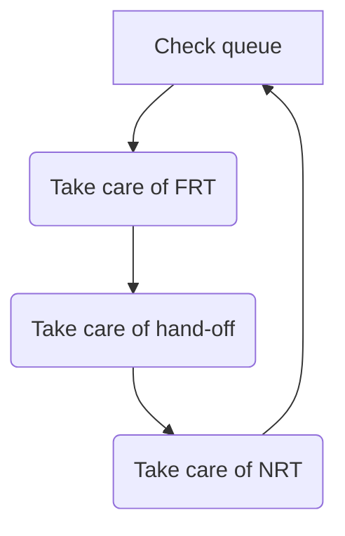

## Introduction

This page helps guide Support Engineers (SEs) to
[find](#zendesk-views),
[select](#selecting-new-tickets), and
[work](#first-response-and-ongoing-communication) support tickets.
For information about working on tickets successfully in the Support Global
Groups environment, please read the
[SE Responsibilities and Priorities](/handbook/support/support-global-groups/#se-responsibilities-and-priorities)
topic on the main Support Global Groups page.

## Zendesk views

The default views in Zendesk for Support Engineers (SEs).

| Name | Purpose |
|------|---------|
| [My Assigned Tickets](https://gitlab.zendesk.com/agent/filters/360062369834) | Tickets assigned to you that are not `Solved` or `Closed`. |
| SGG: [group name] | An alphabetical list of group views. Each view shows all tickets in an SGG that are not `Pending`, `Solved`, or `Closed`, sorted by ticket weight. |
| Assigned Support Engineer Tickets | Tickets from organizations that have an Assigned Support Engineer (ASE). |
| L&R | Licensing & Renewals tickets |
| All FRT and Emergencies | `New` tickets in the FRT stage. To be used in periods of reduced capacity, or as needed. |
| Global FRT's | Visible only to APAC, this functions similarly to the All FRT and Emergencies view and is frequently used by APAC to flex across SGGs to ensure adequate coverage |

## Selecting new tickets

Support Engineers working in SGGs should make decisions about what to work on based on the SGG description of [prioritizing work](/handbook/support/support-global-groups/#prioritizing-work).
You should then employ the following workflows for:

 Choosing Tickets:
   - Focus on handling tickets from the top down in your First Response Time (FRT) stage view, as they are sorted by `Ticket Weight` to highlight the highest-priority issues first. This approach ensures that you address the most critical tickets promptly. Additionally, keep an eye on tickets that are nearing their SLA deadlines to prevent any breaches. Please note, while the Ticket Weight field itself isn’t visible in the view, it is used to order the tickets, ensuring that those with the highest priority appear at the top.
   - Next, work collaboratively to address unassigned NRT tickets, ensuring respect for the customer preferred regional preference.
   - You should folllow the tickets workflow, as shown in the flowchart below.

 Assigning Tickets:
   - Assign tickets to yourself using the "Take It" button and update status to 'Open/Pending'.
   - Ensure every response is linked to an assigned ticket.
   - Please Note that the SLA clock continues to run until you’ve sent a public response to the user.

## Managing ticket load

   - Regularly review your open, pending, and on-hold tickets in your [My Assigned Tickets](https://gitlab.zendesk.com/agent/filters/360062369834) view to maintain a balance workload, as well as align with [other respsonisbilites](https://handbook.gitlab.com/handbook/support/support-global-groups/#se-responsibilities-and-priorities) to ensure customer satisfaction.
   - Aim for a manageable number of tickets, adjusting based on daily demands and personal capacity.
   - Aim to adhere to the support ticket SLA's:
      - Urgent FRT 4h, NRT 4h
      - High FRT 4h, NRT 4h
      - Normal FRT84h, NRT 24h
      - Low FRT 8h, NRT 24h
   - During periods of reduced operational capacity, such as holidays or company events, the Support team will prioritize handling all incoming tickets through the special ‘All FRT and Emergencies’ and ‘All NRT’ views, with each engineer expected to take ownership of any unassigned tickets they address.

## First response and ongoing communication

When starting work on a ticket, prioritize these steps to effectively address the customer's needs and streamline the resolution process:
   - **Confirm Understanding:** Begin by confirming in the first reponse your understanding of the customer's situation, needs, and the problem or question they need resolved. If unsure, request clarification or propose a brief meeting to discuss details.
   - **Review Past Interactions:** Check the customer’s recent tickets for related issues or useful background information. Confirm any relevant environmental details with the customer and review any organizational notes in Zendesk that might dictate specific actions or communication methods.
   - **Adjust Priorities:** If the ticket’s priority doesn’t align with our [Definitions of Support Impact](https://about.gitlab.com/support/definitions/#definitions-of-support-impact), discuss and adjust the priority with the customer using the General::Changed priority macro.
   - **Prepare for Emergencies:** If the ticket could escalate to an emergency, alert the on-call engineer.
   - **Manage Time Effectively:** If an extensive response is required or the SLA is near breaching, send an initial brief response. Outline the actions you will take and when the customer can expect an update. Adjust timelines as necessary based on customer feedback.
   - **Use Tools:** Set the ticket to Open and use ‘Due Date’ and ‘Reminder’ apps to keep track.

By following these steps, you ensure a structured approach to ticket handling that can save time and enhance customer satisfaction.

## Handling tickets from different regions

   - Where possible respect the customers specified  preferred region for ticket handling. Exceptions should be made only when a ticket is close to breaching FRT SLA,  has been escalated/STAR'ed requiring immediate attention regardless of region or if the customer has specifically requested it to be handled outside of region.

#### Preparing a ticket for handover

   - Utilize the Zendesk [Zendesk macro named `Handover Ticket Summary`](https://gitlab.com/gitlab-com/support/zendesk-global/macros/-/blob/master/active/General/Handover%20Ticket%20Summary.md?ref_type=heads) to ensure all necessary information is included and the ticket is unassigned.
   - Set the Zendesk Form Field `Handover Status` to `Need Handover`.
   - CC yourself on the ticket and save the ticket to the `Open State`

#### Using the cross region handover form

The Slack Handover Form is designated for tickets with high weight values, streamlining the process for urgent transfers and allowing Support Engineers to manage lower-priority tickets autonomously. To ensure a smooth handover, follow these steps:

   - **Select the Appropriate Form:** Choose a handover form from the Handovers folder in your SGG channel, based on the ticket's target region (e.g., Handover to EMEA).
   - **Complete the Form:** Fill in all required fields and submit the form.
   - **Communication:** Upon submission, a notification will be sent to your group’s Slack channel, alerting the regional group handle.
   - **Reminder:** You’ll receive a private Slack reminder to use the mandatory Handover Ticket Summary macro.
   - **Tracking:** All handover requests are logged in the #spt_handover-log channel for tracking purposes.

#### Working tickets handed over from another region

   - Update the `Handover Status` text field to reflect the receiving region, e.g., if you are in the EMEA region, set it to `Handed over to EMEA` to ensure accurate metric tracking.
   - Review the `Handover Ticket Summary` and the Next Response Time (NRT) SLA.
   - If ready to proceed:
      - Introduce yourself to the customer, confirm the handover, and provide the next technical response.
   - If additional research is needed:
      - Introduce yourself, inform the customer that further research is required, and set expectations for the next steps.

## Contacting a Customer Success Manager (CSM) or Account Manager (AM)

Engage a CSM or AM for reasons such as discussing architecture, professional services, or support collaboration. If escalation is required, follow the designated workflow. If no CSM is available, contact the AM, identified in Zendesk as `Account Owner`. To involve a CSM or AM, use the following methods:

   - Zendesk: Add the CSM/AM as a CC on the ticket, inform the customer, and add an internal note for context.
   - Slack: Notify the CSM/AM by:
      - Mentioning them in an existing ticket discussion.
      - Starting a new thread in the customer’s channel (#a_customerName-internal).
      - Posting a message in a relevant support channel (#support_leadership, #support_gitlab-com, or #support-self_managed).

### Helping with a ticket that has an Assigned Support Engineer

Some customers have an Assigned Support Engineer (ASE) that will own their tickets. This will be apparent from the org note in the ticket. For such customers, see [the ASE workflow](assigned-support-engineer/working-on-ase-tickets.html).

## FAQ

### 1. How many new tickets should I pick up each week?

Each week, every Support Engineer should aim at least to meet, and preferably to exceed, [the
appropriate baseline](/handbook/support/support-engineer-responsibilities/#ticket-baseline) from the following list for the number of first responses:

- **Self-managed: 6 tickets**
- **SaaS: 7 tickets**
- **SaaS Accounts: 8 tickets**
- **L&R: 24 tickets**

The aim is to ensure equitable ticket distribution among team members. These numbers are based on ticket volume, number of SEs, and average PTO (15%). We
will continue to monitor ticket volume and number of SEs to make sure the above guidelines are accurate.

#### What if I can't meet baseline?

There will be times when you may be leading an escalation, working through challenging tickets or focus on non-ticket work and you cannot take on new ticket assignment. This is okay! The key is to make sure you have coordinated with your SGG and Manager so they are aware of the risks to our team.

### 2. What can I do when I'm stuck and I really need help?

   Follow the [how to get help workflow](/handbook/support/workflows/how-to-get-help/) for guidance on this. Reach out to a manager for guidance if you are still stuck.

### 3. I'm going to be absent, what do I do with my assigned tickets?

   Please see the [Support Team Member Time Off page](/handbook/support/support-time-off/) for a full description of this situation.

### 4. The customer is absent and wants to keep the ticket open until they're back

   The best course of action in this case is to acknowledge the customer's wish with a public response and then set the ticket to **On-Hold** *and* change it to type **Task** with a reminder for yourself to check in with the customer x days after their planned return. This way, the ticket will permanently stay **On-Hold** for the duration of the customer's absence. See [Behavior of `On-Hold` tickets](/handbook/support/workflows/zendesk-ticket-basics/#behavior-of-on-hold-tickets) for details.

### 5. May I reassign a ticket to someone else?

   There are some situations in which it is appropriate to reassign a ticket:

   1. If you'll be absent, follow the guidance given on the [Support Team Member Time Off page](/handbook/support/support-time-off/).
   1. If you've determined that specific expertise outside your own is required to resolve the ticket, pair with an expert so that you can get the ticket
      resolved and learn in the process. If that person determines that they need to take the lead due to the advanced or complex nature of the problem, then:

      1. Send a message to the customer informing them that you’ve asked another support engineer with relevant expertise to take the ticket, that you’ve reviewed the ticket with that engineer, and that you'll stay involved in order to help in any way you can
      1. Sssign the ticket to the expert

   1. If you've become overloaded with tickets, you may look to find one or more other SEs to take some of your tickets. Start with your Support Global Group, and then look to the larger team if necessary. Be sure you discuss each ticket before reassigning it to gain agreement and so that the other support engineers don't have to start from scratch. Then add an internal note stating the reassignment agreement **and** add a public meessage informing the user that you’ve asked another support engineer to take the ticket due to your time constraints.

### 6. A customer has confirmed a ticket can be closed but the ticket has no assignee - what should I do?

   This should only happen on rare occasions since in the SGG system all tickets should be assigned from the time the first response is made. When it does
   happen, please:

   1. Inform the customer that you are changing the ticket status to solved
   1. Assign the ticket to the engineer who provided the solution, or if you can't make that determination, assign it to an engineer who has significantly contributed to the ticket throughout its life cycle

### 7. How many issues or incidents should I handle in a single support ticket?

   As detailed in [Support General Policies](https://about.gitlab.com/support/general-policies/#we-handle-each-incident-within-a-single-support-ticket) it is GitLab's policy to handle each unique issue or incident within a single support ticket.

### 8. How can I open a new ticket on behalf of a customer?

   As detailed in the [Support General Policies](https://about.gitlab.com/support/general-policies/#we-handle-each-incident-within-a-single-support-ticket) it is GitLab policy to handle each individual incident, problem or issue within a single support ticket. If a situation arises where you need to open a new ticket on behalf of a customer then please use the following steps:

1. Go to the [Submit a Request](https://support.gitlab.com/hc/en-us/requests/new) Ticket Portal.
1. Enter the customer's details (Self-Managed or SaaS, email address, subject, problem description etc.).
    - Use the customer's existing Zendesk Ticket to obtain the necessary customer information to complete the form.
1. Once the form is submitted the form will not provide the corresponding ticket id. You can however obtain the new ticket id by performing a search on the customers details such as email address.

Please note: The above approach is required in order to ensure that the ticket is routed correctly and is assigned an SLA.
