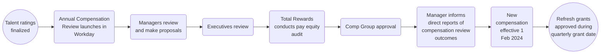

## Introduction

On this page, we explain how we carry out the Annual Compensation Review (ACR) cycle. 

If you have any feedback or questions about Annual Compensation Review, please contact [HelpLab](/handbook/business-technology/enterprise-applications/guides/helplab-guide). 

## Annual Compensation Review

The purpose of the Annual Compensation Review is to provide managers with the opportunity to reflect on team members' accomplishments, measure achievements against goals, and reward for demonstrated performance and growth potential.

Compensation decisions are based on:

1. Individual factors such as talent assessments outlining performance and growth potential in the role.
1. Internal assessment of our roles and compensation within teams and departments
1. Assessing external market changes in the [compensation calculator]() inputs
1. Other factors includes company performance and available budget, local pay practices and regulations, and eligibility as outlined below

### Process overview

### Eligibility

Eligible team members for Annual Compensation Review have a hire date on or before:

- January 31st to be eligible to participate in the merit review program
- December 5th to be eligible to participate in the equity refresh program

Team members on leave will be eligible to receive an annual compensation and/or promotion increase during the GitLab-paid portion of their leave. If a team member is not receiving pay from GitLab, then they'll be eligible to receive the increase when they return to work.

Team members hired after the cutoff date will be reviewed to ensure their salary does not fall below the minimum of the compensation range. Team members may be below the compensation range due to updates to the range for the upcoming year that would include changes to benchmark, location factor, and/or exchange rate, if applicable. If this does occur, the team member will be adjusted to the minimum of the range during the Annual Compensation Review cycle.

Eligibility for review does not guarantee an increase will be awarded. 

### Annual Compensation Review Timeline

Annual Compensation Review will take place in March and April with all merit increases, if applicable, taking effect on May 1. More information on the timeline and process will be added closer to the launch of the program. 
