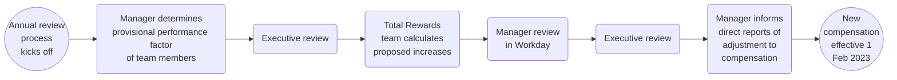

## Introduction

On this page, we explain how we carry out the Annual Compensation Review (ACR) cycle. For more information on the process and input review for the Compensation Review Process, please see the following [handbook page]().

If you have any feedback or questions about the compensation review cycle, please contact [People Connect](/handbook/people-group/#how-to-reach-the-right-member-of-the-people-group).

## Annual Compensation Review

### **All information related to the FY25 Annual Compensation Review cycle will be updated to the handbook by no later than the end of December 2023**

Increases for Compensation Review Cycles are based on:
1. Assessing market changes in the [compensation calculator]() inputs
1. Talent Assessments outlining performance in the role.

If there is an increase in Location Factor and/or Benchmark, team members affected will have the new location factors applied to their compensation range, but would not receive an automatic percent increase to their base salary. For example, if the location factor in a region increases by 10% the team member will not receive an automatic 10% adjustment.  The team member will be brought into range after any changes to benchmark, location factor, and exchange rate take place and then their performance increase will be layered on top of this market adjustment.

#### Process overview

### Eligibility

Eligible team members for Annual Compensation Review have a hire date on or before:

- October 31st for a cash compensation increase.
- September 5th for an equity refresh. Team members are eligible for a refresh grant if they have been at the company for six months ahead of the grant date cutoff. The grant date is slated to be around mid-March and the cutoff is March 5th.

Team members hired after October 31st will be reviewed to ensure their cash compensation does not fall below the minimum of the updated compensation range. Team members may be below the compensation range due to updates to the range for the upcoming year that would include changes to benchmark, location factor, and/or exchange rate, if applicable. If this does occur, the team member will be adjusted to the minimum of the range during the Annual Compensation Review cycle.

Team members on leave will be eligible to receive an annual compensation and/or promotion increase during the GitLab-paid portion of their leave. If a team member is not receiving pay from GitLab, then they'll be eligible to receive the increase when they return to work.